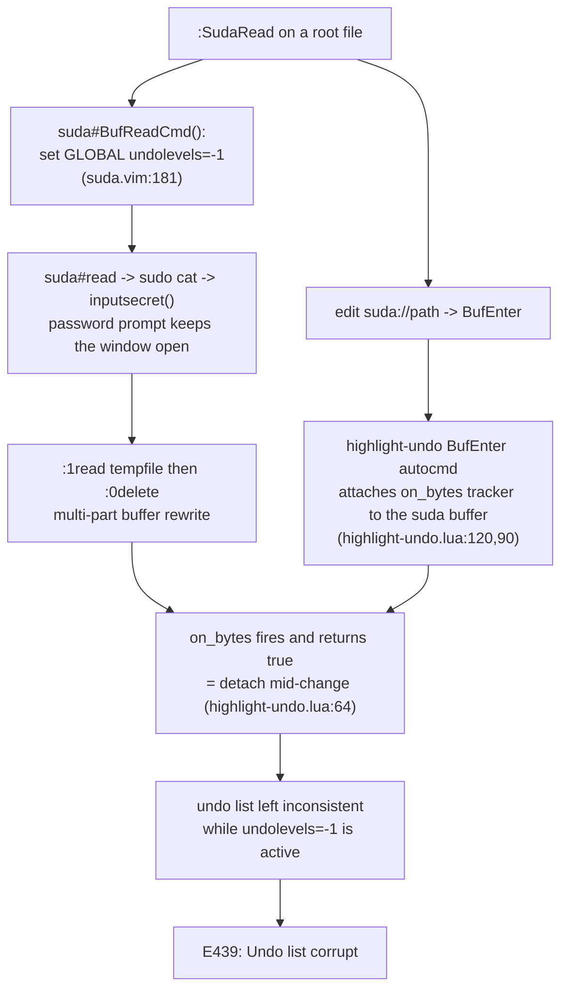

# lvim-new: Problems and Solutions

## 1. Purpose

This document is the troubleshooting and postmortem record for the `lvim-new`
(LazyVim migration) configuration. Each entry describes one concrete problem seen
while using `lvim-new`, the investigation, the root cause, and the exact fix, so the
same class of problem can be recognized and resolved quickly.

It complements, but does not duplicate:

- `docs/LunarVim_Plugins_Structure_Analysis_Brainstorming_Implementation.md`
  (Part III: how the `lvim-new` system is built; Part III.18: the design-time triage
  tree). Deep design detail lives there.
- `lazyvim-new/README.md` (setup and first-run gaps).
- Part II-B, section II.17 of the analysis doc (the dated change log).

## 2. How to read this document

Every issue uses the same shape:

- **Symptom**: what the user sees.
- **Reproduction**: exact steps.
- **Investigation**: what was checked and found.
- **Root cause**: the underlying reason, tagged `Fact` (verified), `Assumption`
  (reasoned but not proven), or `Open question`.
- **Mechanism**: the elaboration of why the root cause produces the symptom.
- **Solution**: the change, with file and commit.
- **Verification**: the exact command run and its result, with a `PASS` / `FAIL` /
  `Not verified` label. Nothing is called "tested" unless the command was actually run.
- **Status**: `DONE`, `DONE (interactive verification recommended)`, etc.
- **Risks / fallbacks**: residual risk and alternative fixes.

## 3. Environment and context

| Item | Value |
|---|---|
| New editor | `lvim-new` (`NVIM_APPNAME=lvim-lazyvim`), locally built **Neovim v0.12.4** |
| Old editor | `lvim` (LunarVim), system **Neovim v0.11.5-dev** |
| Config root | `~/.config/lvim-lazyvim` -> `~/.dotfiles/lvim/lazyvim-new` (symlink) |
| Data / state | `~/.local/share/lvim-lazyvim`, `~/.local/state/lvim-lazyvim` |

Two facts recur across issues and are worth stating once:

- **The two editors are fully isolated** by `NVIM_APPNAME`, so a fix in `lvim-new`
  never affects LunarVim.
- **Many bugs are Neovim-0.12-plus-migration interactions.** LunarVim runs on 0.11
  and had some plugins configured differently (or left inactive). A behavior that
  "worked in LunarVim" often did so because a plugin was inactive there, not because
  Neovim behaved differently.

---

## 4. Issues

### Issue 1: `:SudaRead` on a root-owned file crashes with `E439: Undo list corrupt`

This is the most involved issue in this document, so it is written out in full.

**Symptom.**
`E439: Undo list corrupt` appears (with a Lua/undo stack traceback) and the editor
becomes unusable after reading a root-owned file with `suda.vim`.

**Reproduction.**

1. `lvim-new /etc/audit/rules.d/50-software-install.rules` (a root-owned, non-readable
   file, so it opens empty with `[Permission Denied]`).
2. In `lvim-new`, run `:SudaRead` (reads the file through `sudo`, entering the sudo
   password at the prompt).
3. Crash: `E439: Undo list corrupt`.

**Investigation.**

- `:SudaRead` with no argument runs `edit suda://<current file>`
  (`suda.vim/plugin/suda.vim`), which fires suda's `BufReadCmd suda://*` handler,
  `suda#BufReadCmd()` (`suda.vim/autoload/suda.vim:178`).
- That handler is the important part:

  ```vim
  let ul = &undolevels
  set undolevels=-1          " GLOBAL option, not setlocal
  try
    setlocal noswapfile noundofile
    let echo_message = suda#read('<afile>', { 'range': '1' })   " runs sudo cat -> :1read tempfile
    silent lockmarks 0delete _
    ...
  finally
    let &undolevels = ul     " restore
  endtry
  ```

  So suda sets the **global** `undolevels = -1` for the entire read, rewrites the
  buffer (`:1read` then `:0delete`), then restores `undolevels`.

- For a root file, `filereadable()` is false, so `suda#read` takes the `sudo cat`
  branch. That branch prompts for the password with `inputsecret()`, so the
  `undolevels = -1` window stays open for as long as the user is typing the password
  and the editor is redrawing.

- Comparing `lvim-new` against the **old LunarVim config** (where `:SudaRead` worked)
  isolated the one behavioral difference among undo-touching plugins:

  | Plugin | old LunarVim | lvim-new |
  |---|---|---|
  | `auto-save.nvim` | active | active |
  | `cutlass.nvim` | active | active |
  | `suda.vim` | active | active |
  | **`highlight-undo.nvim`** | **installed but `setup()` commented out (inactive)** | **active (`opts = {}` -> `setup()` runs)** |

  In `lua/custom/plugins.lua:478-488` of the LunarVim config, `highlight-undo`'s
  `setup()` call is commented out, so it never registers any autocmds. The LazyVim
  migration wrote `{ "tzachar/highlight-undo.nvim", event = "VeryLazy", opts = {} }`,
  and in lazy.nvim an `opts` table causes `require("highlight-undo").setup(opts)` to
  run, activating the plugin.

- Active, `highlight-undo` creates a `BufEnter` autocmd (`highlight-undo.lua:120`)
  that attaches an `on_bytes` change-tracker to **every** buffer, and its `on_bytes`
  returns `true` to **detach mid-change** (`highlight-undo.lua:64-65`). During
  `:SudaRead`, that tracker is attached to the `suda://` buffer that suda is
  rewriting under global `undolevels = -1`.

**Root cause.**

- `Fact`: suda.vim toggles the **global** `undolevels` to `-1` and back around a
  multi-part buffer rewrite, and for root files that window spans an interactive
  password prompt.
- `Fact`: `highlight-undo.nvim` is active in `lvim-new` but was inactive in the old
  LunarVim config; it attaches a detach-mid-change `on_bytes` tracker to the `suda://`
  buffer.
- `Assumption`: the combination -- a detach-mid-change buffer-attach tracker firing on
  a buffer that is being rewritten while global `undolevels = -1`, on Neovim 0.12.x --
  is what leaves the undo list corrupt (`E439`). This is the only behavioral
  difference from the working LunarVim setup, and it is a known-hazardous pattern
  (detaching a `nvim_buf_attach` listener in the middle of a change).

**Mechanism (causal chain).**



**Solution.** `lazyvim-new/lua/plugins/editor.lua` (commit `de5ed3e`), two guards:

1. Exclude special buffers, above all `suda://` (`buftype=acwrite`), from
   `highlight-undo` via its `ignore_cb`, so the tracker never attaches to a suda
   buffer:

   ```lua
   {
     "tzachar/highlight-undo.nvim",
     event = "VeryLazy",
     opts = {
       ignore_cb = function(buf)
         local ok, name = pcall(vim.api.nvim_buf_get_name, buf)
         if ok and name:match("^suda://") then return true end
         local bt = vim.bo[buf].buftype
         return bt == "acwrite" or bt == "nofile" or bt == "prompt" or bt == "terminal"
       end,
     },
   }
   ```

2. Restrict `auto-save` to real on-disk file buffers (`buftype == ""`), so it never
   fires a nested sudo write into a `suda://` buffer either:

   ```lua
   if vim.bo[buf].buftype ~= "" then return false end
   ```

`highlight-undo` and `auto-save` still work normally on ordinary files.

**Verification.**

- `Fact / PASS` (headless, with a fake `sudo` because this host has no passwordless
  sudo): after `:SudaRead`, `ignore_cb(suda buffer) = true`, `ignore_cb(normal
  file) = false`, `auto-save condition(suda buffer) = false`, the buffer is populated,
  `undo`/`redo` run cleanly, and `:messages` contains no `E439` or error.
- `Not verified`: the original `E439` crash itself. It requires the real interactive
  `inputsecret` password flow, which a headless run cannot drive, and this host has no
  passwordless `sudo`. The fix removes the one behavioral difference from the working
  LunarVim setup, but interactive confirmation on a real root file is recommended.

**Status.** `DONE (interactive verification recommended)`.

**Risks / fallbacks.**

- `Risk`: if the crash persists after this fix, the residual cause is suda's global
  `undolevels = -1` window itself. Two bulletproof fallbacks:
  1. Pre-authenticate sudo so the prompt (and thus the long `undolevels=-1` window)
     does not happen in the editor: run `sudo -v` in a shell first, then `:SudaRead`.
  2. Configure suda to use an external askpass so the password is never entered
     in-editor (this host has `/usr/bin/zenity`):
     ```lua
     vim.env.SUDO_ASKPASS = "/usr/bin/zenity"   -- or a small "zenity --password" wrapper
     vim.g["suda#executable"] = "sudo -A"
     ```
  3. Last resort: disable `highlight-undo.nvim` entirely (it was inactive in LunarVim
     anyway) by setting `enabled = false` on its spec.

---

### Issue 2: Creating a file from the file-tree pane errors with `Invalid buffer id`

**Symptom.**
`vim.schedule callback: .../editor.lua:153: Invalid buffer id: 75` (with an
`auto-save/init.lua` traceback) after creating a file from the left `nvim-tree` pane.

**Reproduction.** In the `nvim-tree` explorer, create a new file.

**Investigation.** Creating a file from `nvim-tree` makes and then wipes a scratch
buffer. `auto-save`'s save is debounced (`vim.schedule`'d ~1s later), so its
`condition(buf)` ran after that scratch buffer id was already invalid, and read
`vim.bo[buf].filetype` on it.

**Root cause.** `Fact`: `auto-save`'s `condition` touched `vim.bo[buf]` for a
no-longer-valid buffer id.

**Solution.** `lazyvim-new/lua/plugins/editor.lua` (commit `30e68a9`): bail out before
touching `vim.bo[buf]`:

```lua
if not buf or not vim.api.nvim_buf_is_valid(buf) then return false end
```

**Verification.** `Fact / PASS` (headless): `condition(99999)` -> `false`,
`condition(nil)` -> `false`, `condition(<valid>)` -> `true`, no error.

**Status.** `DONE`.

---

### Issue 3: `Tab` does not select the item in the completion popup

**Symptom.** With the `blink.cmp` completion popup open, `Tab` does nothing useful.

**Investigation.** `blink`'s `<Tab>` was `{ "snippet_forward", "fallback" }` (set that
way earlier specifically to keep `Tab` off the Copilot accept path, see Issue 6). It
did not accept a popup item.

**Root cause.** `Fact`: `<Tab>` had no completion-accept command.

**Solution.** `lazyvim-new/lua/plugins/coding.lua` (commit `6ad23a3`):

```lua
["<Tab>"] = { "select_and_accept", "snippet_forward", "fallback" },
```

`Tab` now accepts the highlighted item (or the first if none is selected) when the
popup is open, else jumps a snippet, else a normal Tab. It is still off the Copilot
path: defining `<Tab>` keeps LazyVim from splicing `ai_accept` into it, so Copilot
ghost text is still accepted only with `<M-l>`.

**Verification.** `Fact / PASS` (headless): resolved `blink.keymap["<Tab>"] =
{ "select_and_accept", "snippet_forward", "fallback" }`; `select_and_accept` is a real
blink command; config loads with no errors.

**Status.** `DONE`.

---

### Issue 4: `<leader>e` file tree shows the launch cwd, not the file's directory

**Symptom.** `cd ~/Downloads; lvim-new ~/Dev/test.sh` then `<leader>e` shows the tree
rooted at `~/Downloads`, not `~/Dev`.

**Investigation.** `nvim-tree` runs with `sync_root_with_cwd = false` and
`update_focused_file.update_root = false` (deliberately, so the root does not chase the
focused buffer). A bare `:NvimTreeToggle` therefore roots at Neovim's launch cwd. The
same is true of old LunarVim; this is a behavior to implement, not a regression.

**Root cause.** `Fact`: `<leader>e` used `:NvimTreeToggle`, which roots at cwd.

**Solution.** New shared module `lazyvim-new/lua/custom/dir.lua` (commit `67df83b`):
`context_dir()` returns the project root if the file is in a real project, else the
file's own directory (`$HOME` is rejected as a root, see Issue 5), and
`explorer_toggle()` opens `nvim-tree` rooted there. `<leader>e` calls it. The
`term_dir()` used by the exec-terminals now delegates to the same `context_dir()`, so
the tree and terminals share one rule.

**Verification.** `Fact / PASS` (headless): from a `downloads` cwd, opening
`dev/test.sh` roots the tree at `dev/`; opening `proj/src/main.cpp` (with a
`CMakeLists.txt`) roots it at `proj/`; second `<leader>e` still closes the tree.

**Status.** `DONE`. Detail in Part III.7.5(c).

---

### Issue 5: Terminals (and, before Issue 4, the tree) open in `$HOME`

**Symptom.** `<M-h>` / `<M-v>` / `<M-i>` terminals opened in `$HOME` for a file not in
a project.

**Investigation.** The cwd came from `project.nvim`'s `get_project_root()`. This host
has `package.json`, `package-lock.json`, and `.vscode` directly in `$HOME`, and those
are in `project.nvim`'s pattern list, so `get_project_root()` returned `$HOME` for
every file under it.

**Root cause.** `Fact`: `$HOME` was treated as a project root.

**Solution.** `lazyvim-new/lua/custom/dir.lua` (commits `9c52ea2`, `7e4f9b1`): reject
`$HOME` as a project root and fall back to the file's own directory.

**Verification.** `Fact / PASS` (headless): a file under a real project resolves to the
project root; a lone file resolves to its own directory; a file directly under `$HOME`
falls back to its own directory rather than `$HOME`.

**Status.** `DONE`. Detail in Part III.7.5(c).

---

### Issue 6: Undo/redo appear broken on JSON (and other formatted filetypes)

**Symptom.** `u` / `<C-r>` seem to do nothing on JSON files, while they work on plain
text.

**Investigation.** LazyVim enables format-on-save; `auto-save` writes on every
debounced change. For a filetype with a formatter (JSON via `jsonls`/`conform`), each
auto-save reformatted the whole buffer, stacking an extra undo state on top of the
edit, so the first `u` undid the invisible reformat, not the change. Plain text has no
formatter, so it was unaffected.

**Root cause.** `Fact`: format-on-save reformatting the buffer on every auto-save write.

**Solution.** `lazyvim-new/lua/config/options.lua` (commit `1709c84`):
`vim.g.autoformat = false`. This also matches old LunarVim's `format_on_save = false`
default. Format on demand with `<leader>lf`.

**Verification.** `Fact / PASS` (headless): with a formatter attached, editing a JSON
buffer and letting auto-save fire no longer reformats it, and `u` reverts the edit.

**Status.** `DONE`. Detail in Part III.7.5(b).

---

### Issue 7: Copilot suggestions appear in the completion popup, accepted with `Tab`

**Symptom.** Copilot completions showed as items in the `blink.cmp` popup (accepted by
`Tab`), not as inline grey ghost text.

**Investigation.** LazyVim's Copilot extra is gated on `vim.g.ai_cmp`. The default
(`true`) routes Copilot through the completion menu.

**Root cause.** `Fact`: `vim.g.ai_cmp` was `true`.

**Solution.** commit `2e3c36d`, three coordinated changes:

- `config/options.lua`: `vim.g.ai_cmp = false` -> native inline ghost text; drops the
  Copilot blink source; also turns off blink's own `ghost_text`.
- `plugins/ai.lua`: `copilot.lua` suggestion enabled + auto-triggered, `accept = <M-l>`
  (Alt+l), cycle `<M-]>`/`<M-[>`, dismiss `<C-]>`, panel off.
- `plugins/coding.lua`: `blink <Tab>` defined by us, which stops LazyVim from splicing
  `ai_accept` into `Tab`. Copilot is accepted only with `<M-l>`.

**Verification.** `Fact / PASS` (headless): resolved config shows `ai_cmp = false`,
blink `ghost_text` off, copilot `suggestion.keymap.accept = <M-l>`, panel off.

**Status.** `DONE`. Detail in Part III.9 and III.12.

---

### Issue 8: Dashboard "Recent Files" is scoped to the project and goes stale

**Symptom.** The startup dashboard's recent files listed only files under the current
project, and did not update with files opened during a long-lived session.

**Root cause.** `Fact`: the `r` action routed through `LazyVim.pick`, which injects
`cwd = LazyVim.root()`; and `v:oldfiles` is only loaded from shada at startup, never
refreshed mid-session.

**Solution.** commit `396d0e9` (`ui.lua`): override the `r` action to
`LazyVim.pick("oldfiles", { root = false })`. commit `f34291d` (`autocmds.lua`): a
`BufReadPost`/`BufWinEnter` autocmd prepends each opened file to the mutable
`v:oldfiles`.

**Verification.** `Fact / PASS` (headless): after opening files A then B mid-session,
the recent-files section shows B then A at the top; the `r` action resolves to the
un-scoped pick.

**Status.** `DONE`. Detail in Part III.7.5(d).

---

### Issue 9: `<leader>c` opened the `+code` group instead of closing the buffer

**Symptom.** `<leader>c` (LunarVim close-buffer muscle memory) opened LazyVim's
`+code` which-key group.

**Solution.** commit `58bfba1`: `<leader>c` now closes the buffer
(`Snacks.bufdelete`); the LazyVim `+code` group is removed and every action mirrored
under `<leader>l` (+LSP), with the 8 LSP `<leader>c*` keys disabled at the source via
`servers["*"].keys = {lhs, false}`.

**Verification.** `Fact / PASS` (headless): zero `<leader>c*` sub-mappings remain in any
mode; `<leader>c` -> "Close buffer".

**Status.** `DONE`. Detail in Part III.7.5(a) and III.8.8.

---

### Issue 10: Miscellaneous smaller fixes

| # | Symptom | Root cause | Fix | Commit |
|---|---|---|---|---|
| 10a | Copilot errored "Node 22+ required" on every buffer | default `node` on PATH is v20; Node 22 lives in a non-default nvm root | scan both nvm roots, rank numerically, set `copilot_node_command` | `1e25b95` |
| 10b | `s` was hijacked by flash | LazyVim maps `s`/`S` to flash | disable flash `s` (native substitute), `S` = normal flash jump | `0792fb2`, `a1ee7ea` |
| 10c | Wanted `Ctrl+C` = "copy whole file" with a select-all flash | LunarVim behavior not ported | `<C-c>` = `:%y+`, flash the whole buffer in the Visual highlight 250 ms, echo `N lines yanked` | `a1ee7ea` |
| 10d | Window navigation stopped at the edges | wrap-around not ported | restore circular `<C-h/j/k/l>` navigation | `da4e49b` |

---

## 5. Summary table

| # | Problem | Root cause (one line) | Fix location | Commit | Status |
|---|---|---|---|---|---|
| 1 | `:SudaRead` -> `E439: Undo list corrupt` | suda's global `undolevels=-1` window + active `highlight-undo` `on_bytes` tracker on the suda buffer | `editor.lua` (`ignore_cb` + auto-save buftype guard) | `de5ed3e` | DONE (interactive verify) |
| 2 | file-tree file create -> `Invalid buffer id` | auto-save `condition` touched a wiped buffer | `editor.lua` | `30e68a9` | DONE |
| 3 | `Tab` does not accept popup item | `<Tab>` had no accept command | `coding.lua` | `6ad23a3` | DONE |
| 4 | `<leader>e` shows launch cwd | `nvim-tree` roots at cwd; no context-dir logic | `custom/dir.lua` | `67df83b` | DONE |
| 5 | terminals open in `$HOME` | `$HOME` treated as a project root | `custom/dir.lua` | `9c52ea2`, `7e4f9b1` | DONE |
| 6 | undo/redo broken on JSON | format-on-save reformats on every auto-save | `options.lua` | `1709c84` | DONE |
| 7 | Copilot in popup / `Tab` accept | `vim.g.ai_cmp = true` | `options.lua`, `ai.lua`, `coding.lua` | `2e3c36d` | DONE |
| 8 | Recent Files scoped + stale | `LazyVim.pick` root; `v:oldfiles` snapshot | `ui.lua`, `autocmds.lua` | `396d0e9`, `f34291d` | DONE |
| 9 | `<leader>c` opens `+code` group | LazyVim default group on `<leader>c` | `keymaps.lua`, `lsp.lua` | `58bfba1` | DONE |
| 10a | Copilot "Node 22+" error | wrong `node` on PATH | `ai.lua` | `1e25b95` | DONE |
| 10b | `s` hijacked by flash | LazyVim flash `s`/`S` | `editor.lua` | `0792fb2`, `a1ee7ea` | DONE |
| 10c | no `Ctrl+C` copy-all flash | not ported | `keymaps.lua` | `a1ee7ea` | DONE |
| 10d | window nav stops at edges | wrap not ported | `keymaps.lua` | `da4e49b` | DONE |

## 6. Diagnostic patterns that recurred

These are the general techniques that solved the issues above, useful for the next one:

1. **Diff against old LunarVim.** Several "new" bugs (Issue 1, Issue 6) were caused by a
   plugin being active in `lvim-new` that was inactive or configured differently in
   LunarVim. `grep` the LunarVim config (`~/.dotfiles/lvim/lua`) for the plugin and
   check whether its `setup()` actually runs.
2. **Resolve the real, merged options.** For any plugin, the effective config is
   `require("lazy.core.plugin").values(plugin, "opts", false)`. Reading the spec file
   is not enough because lazy.nvim merges specs.
3. **Reproduce headless where possible.** `lvim-new --headless <file> -c 'lua ...'` with
   a `vim.defer_fn` can drive most flows and capture `:messages`. It cannot drive
   interactive input (password prompts) or reliably reproduce timing-sensitive
   crashes.
4. **Guard callbacks against stale state.** Debounced / `vim.schedule`'d callbacks
   (auto-save, Issue 2) can fire after the buffer they captured is gone. Always
   `nvim_buf_is_valid` before `vim.bo[buf]`.
5. **Watch for global option toggles.** `set undolevels=-1` (global) in suda (Issue 1)
   and format-on-save (Issue 6) both corrupt undo indirectly. A plugin that toggles a
   global option around a buffer change is a red flag.

## 7. Cross-references

- Design and as-built detail:
  `docs/LunarVim_Plugins_Structure_Analysis_Brainstorming_Implementation.md`,
  Part III (esp. III.7.5 deviations, III.18 triage).
- Dated change log: same doc, Part II-B, section II.17.
- Setup and first-run gaps: `lazyvim-new/README.md`.
