# LunarVim Plugins Structure Analysis And Brainstorming

> A comprehensive architecture study of this LunarVim configuration and its plugin
> ecosystem (Part I), followed by a design-level brainstorm and deep-dive plan for
> upgrading Neovim to the latest version (Part II).

---

## About This Document

- **Subject system:** the LunarVim distribution installed at
  `~/.local/share/lunarvim/lvim` plus this user configuration repository
  (`~/.dotfiles/lvim`, symlinked to `~/.config/lvim`).
- **Environment snapshot at time of writing:**
  - Neovim: `v0.11.5-dev` (target: keep on 0.11.x today, upgrade later).
  - LunarVim: `master` @ `aa51c20f` — release `1.4.0` (June 2025), currently in
    low-maintenance / frozen state.
  - Plugins: 43 snapshot-pinned LunarVim core plugins (from LunarVim's own default
    snapshot) plus 84 unique user top-level plugins and ~20 dependency-only plugins;
    the effective `lazy-lock.json` holds **132** locked entries (core and user sets
    overlap where a user re-declaration merges into a single lock entry).
- **Audience:** the maintainer of this configuration (an experienced developer),
  for planning and reference.

### Reading Conventions

- **ASCII tables** in this document deliberately avoid Unicode box-drawing
  characters (no `-|`-style glyphs such as the ones that break column alignment);
  they use only plain `|`, `-`, `+` and spaces so alignment survives any viewer.
- **Diagrams** are written in **Mermaid** (flowchart, sequence, class, state,
  mindmap). Every Mermaid block:
  - quotes all node text,
  - uses `<br/>` for line breaks and `#59;` for literal semicolons,
  - uses `%%` comments on their own lines,
  - uses **descriptive component names** (e.g. `"LSP Manager (lvim.lsp.manager)"`),
    never bare `A`/`B` letters.
- Every Mermaid diagram in this document was **validated with the Mermaid CLI
  (`mmdc` v11.12.0)** for syntax correctness before inclusion.
- File references use `path:line` form so they are clickable / greppable.

### Table of Contents

- **Part I — LunarVim & Plugin Ecosystem: Structure, Design, Dependencies**
  - I.1 Executive Summary & System Context
  - I.2 Layered Architecture Overview
  - I.3 Startup & Bootstrap Sequence
  - I.4 Module Map & Directory Structure
  - I.5 The `lvim` Global Configuration Model
  - I.6 Plugin Management Layer (lazy.nvim wrapping + snapshot pinning)
  - I.7 LSP Subsystem Deep Dive
  - I.8 Plugin Ecosystem Catalog
  - I.9 Inter-Plugin Dependency Graph
  - I.10 Neovim Version Dependency Analysis
- **Part II — Upgrading Neovim to the Latest Version**
  - II.1 Goals, Constraints, and Success Criteria
  - II.2 What Actually Breaks on Upgrade (Root-Cause Analysis)
  - II.3 Candidate Approaches (Brainstorm) + comparison matrix + decision tree
  - II.4 Recommended Approach Deep Dive — LazyVim Migration
  - II.5 Step-by-Step Implementation Guide (no timeline)
  - II.6 Risks, Mitigations, and Rollback
  - II.7 Validation Checklist
- **Part II-B — Implementation Record (as built)**
  - II.8 What Was Built (+ new config layout)
  - II.9 The Parallel Switcher (setup_lvim.sh)
  - II.10 Startup & the Deterministic Keymap Fix
  - II.11 Keymap Parity Approach
  - II.12 Design Decisions & Deviations
  - II.13 Functionality Coverage
  - II.14 Testing & Verification Results
- **Appendices** A (API remediation), B (Neovim version reference), C (sources)

---

# Part I — LunarVim & Plugin Ecosystem: Structure, Design, Dependencies

## I.1 Executive Summary & System Context

**LunarVim** is an opinionated Neovim *distribution*: a full configuration framework
that boots Neovim, installs and pins a curated set of plugins, exposes a single
global Lua table (`lvim`) as its configuration surface, and ships its own LSP
management layer on top of `nvim-lspconfig` + `mason`. It is not a plugin — it
replaces your `init.lua` and owns the entire runtime.

This particular installation has three important properties that shape everything
in this document:

1. **The distribution core is frozen.** LunarVim `master` last moved in June 2025
   (release 1.4.0). All 43 of its core plugins are hard-pinned to mid/late-2024
   commit hashes through `snapshots/default.json`
   (`~/.local/share/lunarvim/lvim/lua/lvim/plugins.lua:362`). It targets the
   *pre-0.11* Neovim world and hard-requires only Neovim **0.10+**
   (`~/.local/share/lunarvim/lvim/lua/lvim/bootstrap.lua:3`).

2. **The user overlay is bleeding-edge.** On top of the frozen core, this repo adds
   84 unique top-level plugins, many tracking `main`/`latest`, several of which now
   demand newer Neovim APIs. This is the source of the recurring "requires nvim
   0.12" friction (e.g. `ccls.nvim`, `venv-selector.nvim`).

3. **The two layers are held together by version pins.** The maintainer's standing
   strategy is to *stay on Neovim 0.11.x and pin/downgrade individual plugins*
   rather than upgrade Neovim (recent commits `2c0b7ab`, `97dba25`). Part II
   revisits exactly this trade-off.

The following **system context** diagram shows the major participants and how
control and data flow between them at a high level.

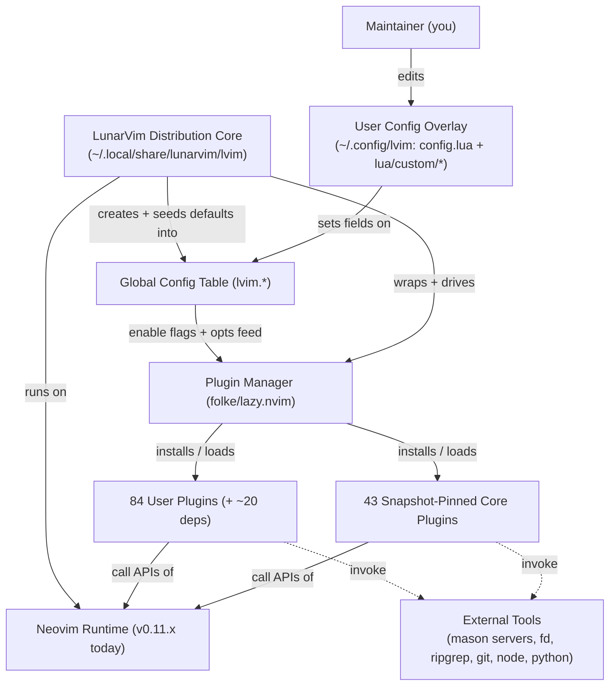

**Explanation.** You edit only the *User Config Overlay*; both the overlay and the
frozen *Distribution Core* write into the single `lvim.*` table, which in turn
drives `lazy.nvim`. `lazy.nvim` installs and lazy-loads two disjoint plugin sets
(pinned core vs. user), and every plugin ultimately calls into the Neovim runtime.
The recurring upgrade pain lives on the two solid edges into *Neovim Runtime*: the
frozen core assumes old APIs, while newer user plugins assume new ones — and both
must satisfy the *same* Neovim binary.

## I.2 Layered Architecture Overview

LunarVim is best understood as four stacked layers. Higher layers depend on lower
layers; configuration flows *down* (you set `lvim.*`, which configures plugins,
which call Neovim), while events flow *up* (Neovim fires events that lazy-load
plugins, which update the UI).

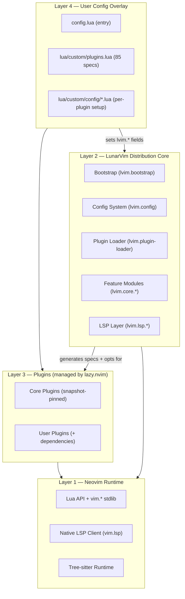

**Explanation.** Layer 2 (the LunarVim core) is the "kernel" of the distro: it
constructs the `lvim` table, wraps `lazy.nvim`, and configures the built-in feature
set and LSP. Layer 4 (your overlay) is intentionally thin — it mutates `lvim.*` and
adds `lazy` specs. Crucially, **Layer 2 and Layer 3 both bind directly to Layer 1**;
that dual binding is why a Neovim upgrade can break the frozen core *and* why old
pinned plugins can lag behind new user plugins on the same runtime.

Layer responsibilities in tabular form:

```
Layer  | Name                    | Owns / Responsibility                                   | Neovim-version exposure
-------+-------------------------+---------------------------------------------------------+-------------------------
L1     | Neovim Runtime          | Lua API, vim.* stdlib, native LSP client, tree-sitter   | Defines the API contract
L2     | LunarVim Core           | Bootstrap, lvim table, plugin-loader, core+LSP modules  | HIGH (assumes 0.10-era API)
L3     | Plugins (via lazy.nvim) | Actual features; install/version/lazy-load lifecycle    | MIXED (pinned old vs new)
L4     | User Config Overlay     | config.lua + custom plugin specs + per-plugin setup     | LOW (declarative; delegates)
```

## I.3 Startup & Bootstrap Sequence

When you launch `lvim`, control passes through a precise, ordered chain. The entry
point is `~/.local/share/lunarvim/lvim/init.lua` (26 lines), which orchestrates the
whole boot. The sequence below traces it end to end.

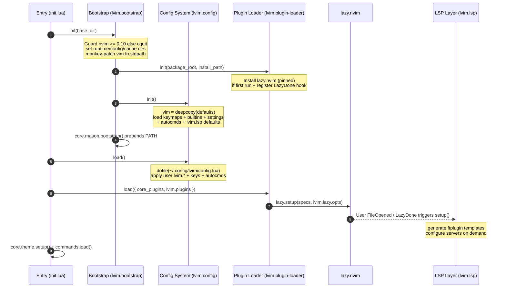

**Explanation.** Two phases matter most. First, `bootstrap:init()`
(`.../lvim/lua/lvim/bootstrap.lua:59`) establishes the environment *and* builds the
`lvim` table via `config:init()` **before** any user code runs. Second,
`config:load()` (`.../lvim/lua/lvim/config/init.lua:48`) `dofile`s your
`~/.config/lvim/config.lua`, so your overrides land on top of fully-populated
defaults. Plugins are handed to `lazy.setup` last, and the **LSP layer is deferred**
— it is wired to the `User FileOpened` autocmd / `LazyDone` event rather than run at
startup, which is why LSP configuration errors (like the venv-selector/ccls issues)
surface a beat after the dashboard appears.

**Summary of the participants in the startup sequence:**

```
Participant (alias)          | Module / file              | Role in startup
-----------------------------+----------------------------+----------------------------------------------
Entry (init.lua)             | lvim/init.lua              | Repo-root entry; orchestrates the boot chain
Bootstrap (lvim.bootstrap)   | lvim/bootstrap.lua         | Env dirs, nvim>=0.10 guard, stdpath patch, seed lvim
Config System (lvim.config)  | lvim/config/init.lua       | init() builds lvim table; load() dofiles user config
Plugin Loader                | lvim/plugin-loader.lua     | Installs lazy.nvim; hands specs to lazy.setup
lazy.nvim                    | folke/lazy.nvim            | Installs + lazy-loads plugins; fires load events
LSP Layer (lvim.lsp)         | lvim/lsp/init.lua          | Deferred LSP setup on User FileOpened / LazyDone
```

Step-by-step, with source anchors:

```
Step | Call site (init.lua)              | Effect
-----+-----------------------------------+--------------------------------------------------
1    | require("lvim.bootstrap"):init()  | env dirs, stdpath patch, lazy install, lvim table
2    | require("lvim.config"):load()     | dofile user config.lua; apply overrides
3    | require "lvim.plugins"            | build the 43-spec core plugin list (+ snapshot pin)
4    | plugin-loader.load{core, user}    | lazy.setup(specs, lvim.lazy.opts)
5    | core.theme.setup()                | apply colorscheme
6    | core.log + commands.load()        | logger ready; register :Lvim* commands
```

## I.4 Module Map & Directory Structure

The distribution core lives entirely under
`~/.local/share/lunarvim/lvim/lua/lvim/`. The tree below shows the functional
grouping (abridged to the significant modules).

```
lua/lvim/
  bootstrap.lua            env setup, nvim>=0.10 guard, stdpath patch, lazy install
  plugins.lua              43 core plugin specs + snapshot commit pinning
  plugin-loader.lua        thin wrapper over lazy.nvim (init/load/reload/sync)
  keymappings.lua          default key bindings
  icons.lua                icon set (lvim.icons)
  config/
    init.lua               lvim table lifecycle: init(), load(), reload()
    defaults.lua           static lvim.* defaults (leader, colorscheme, lazy.opts)
    settings.lua           ~40 vim.opt options + vim.diagnostic.config
    _deprecated.lua        back-compat metatables + spec key migration
  core/
    builtins/init.lua      fan-out that .config()s all 19 builtin feature modules
    telescope.lua          fuzzy finder defaults + pickers
    treesitter.lua         parser install/highlight/indent
    cmp.lua                nvim-cmp completion engine
    dap.lua                nvim-dap debugging + UI
    lualine/               statusline (init, components, styles, ...)
    bufferline.lua         buffer/tab line + buf_kill
    nvimtree.lua / lir.lua file explorers
    which-key.lua          leader menu
    gitsigns.lua           git gutter
    alpha.lua              start dashboard
    terminal.lua           toggleterm integration
    mason.lua              tool installer config + PATH bootstrap
    autocmds.lua           default autocmds + format-on-save/reload helpers
    commands.lua           :Lvim* user commands
    log.lua                structlog logger singleton (Log)
    info.lua               :LvimInfo popup
    theme.lua              colorscheme application
    project.lua breadcrumbs.lua illuminate.lua indentlines.lua comment.lua autopairs.lua
  lsp/
    init.lua               setup(): handlers, borders, null-ls, templates
    manager.lua            per-server setup via lspconfig framework API + mason
    utils.lua              client queries, doc-highlight, codelens, format filter
    config.lua             lvim.lsp.* defaults (mappings, installer, null_ls)
    templates.lua          generates ftplugin/<ft>.lua stubs -> manager.setup
    null-ls/               none-ls sources (formatters, linters, code_actions)
    providers/             per-server overrides (lua_ls, jsonls, yamlls, ...)
  interface/               popup.lua and shared UI helpers
  utils/
    modules.lua            require_clean/require_safe/reload primitives
    hooks.lua              pre/post update + reload lifecycle hooks
    git.lua                git ops via plenary.job
    table.lua              find_first / contains
  utils.lua                fs helpers on vim.loop + join_paths + settings dump
```

The responsibility summary for the most load-bearing modules (aggregated from the
core study):

```
Module                       | Responsibility (one line)
-----------------------------+-----------------------------------------------------------
lvim.bootstrap               | Set up dirs/rtp, guard nvim version, install lazy, seed lvim
lvim.config.init             | Create/populate/load/reload the global lvim table
lvim.config.defaults         | Static default values incl. lvim.lazy.opts
lvim.config.settings         | Editor options (vim.opt) + diagnostics config
lvim.plugin-loader           | Wrap lazy.nvim: init/load/reload/sync core plugins
lvim.plugins                 | Declare + snapshot-pin the 43 core plugins
lvim.core.builtins.init      | Call .config() on all 19 builtin feature modules
lvim.core.<feature>          | Configure one built-in plugin + seed its lvim.builtin.* key
lvim.lsp.init                | Global LSP setup: handlers, borders, null-ls, templates
lvim.lsp.manager             | Resolve + launch each server (lspconfig framework + mason)
lvim.lsp.utils               | LSP client queries, doc highlight, codelens, format filter
lvim.utils.modules           | Clean require + in-place module reload primitives
lvim.core.log                | structlog-based logger singleton used across the core
```

## I.5 The `lvim` Global Configuration Model

The single most important design decision in LunarVim is that **all configuration
is one global Lua table named `lvim`**. It is created by
`config:init()` as `lvim = vim.deepcopy(require "lvim.config.defaults")`
(`.../lvim/lua/lvim/config/init.lua:16`), then progressively enriched by the
builtins, settings, autocmds, and LSP defaults. Your `config.lua` simply mutates
fields on this table. The class-style diagram below captures its structure and the
sub-tables that matter.

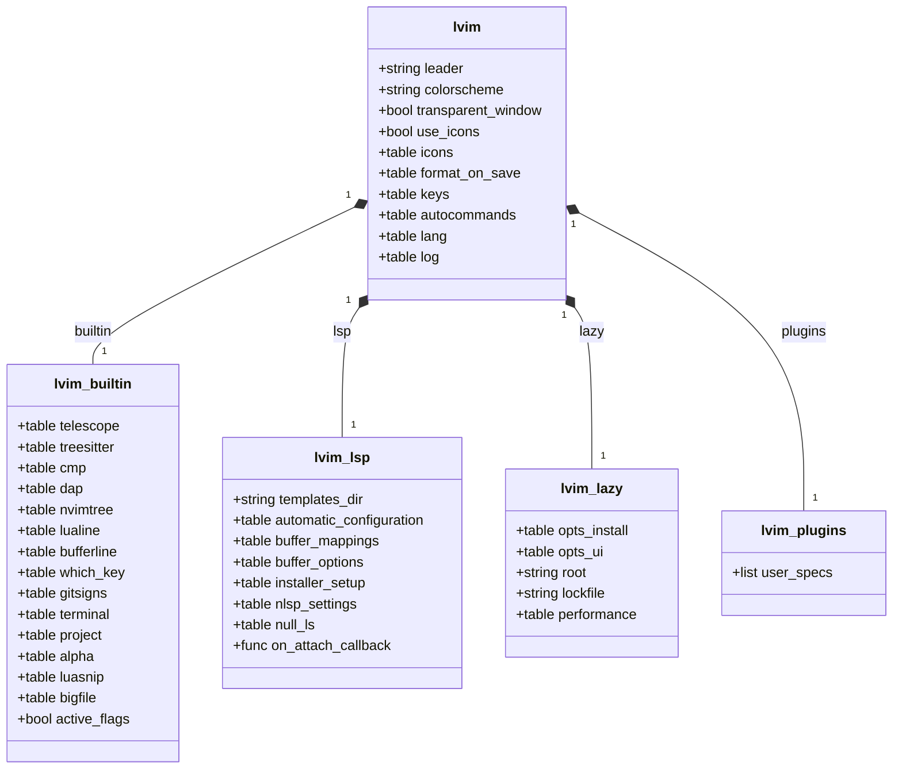

**Summary of the classes (config sub-tables) in the diagram above:**

```
Sub-table (class)   | Field path      | Purpose                                          | Seeded by
--------------------+-----------------+--------------------------------------------------+-----------------------------
lvim                | lvim            | Root config surface (leader, colorscheme, keys)  | config/defaults.lua
lvim_builtin        | lvim.builtin    | Per-feature config + .active enable flags        | core/builtins/init.lua (19 mods)
lvim_lsp            | lvim.lsp        | LSP mappings, installer, null-ls, callbacks      | lsp/config.lua (deepcopy)
lvim_lazy           | lvim.lazy.opts  | lazy.nvim options (root, lockfile, ui, perf)     | config/defaults.lua
lvim_plugins        | lvim.plugins    | User extra plugin specs (empty by default)       | user config.lua
```

**Explanation.** The `enabled = lvim.builtin.<x>.active` guards in the core plugin
list (Section I.6) are read directly from `lvim_builtin`, so toggling a feature is a
one-line assignment in `config.lua`. `lvim_lsp` is the surface you use for LSP
behavior (keymaps on attach, servers to skip, formatting). `lvim_lazy.opts` is
passed verbatim to `lazy.setup`. This "one big table" model is powerful for quick
tweaks but is also the **tightest coupling point to the distro** — it is a bespoke
API with no equivalent outside LunarVim, which matters greatly for Part II's
migration analysis.

## I.6 Plugin Management Layer (lazy.nvim wrapping + snapshot pinning)

LunarVim does **not** reimplement plugin management; it wraps `folke/lazy.nvim`.
The wrapper (`.../lvim/lua/lvim/plugin-loader.lua`) installs lazy (pinned to a
snapshot commit), fixes up `runtimepath`, then calls
`lazy.setup({ core_plugins, lvim.plugins }, lvim.lazy.opts)`. The distinguishing
behavior is **snapshot pinning of core plugins**: unless `LVIM_DEV_MODE` is set,
every core spec's `commit` is overwritten from `snapshots/default.json`
(`.../lvim/lua/lvim/plugins.lua:378`).

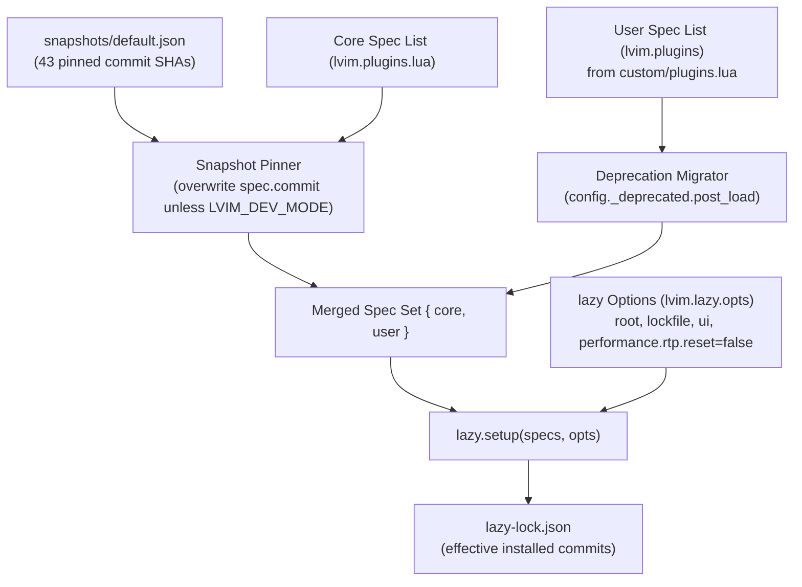

**Explanation.** Two independent pinning mechanisms coexist, and their interaction
is a real gotcha:

1. **Core plugins** are pinned *in code* by the snapshot (authoritative for the
   distro's own 43 plugins).
2. **User plugins** are pinned by `lazy-lock.json` plus any per-spec
   `commit`/`version`/`branch` you write.

When these disagree, the spec wins on the next `:Lazy sync` but the lockfile can go
stale in between. This is exactly the **`ccls.nvim` discrepancy** discovered in the
catalog: `custom/plugins.lua` pins `commit = de925cad...` (the last pre-0.12 commit)
while `lazy-lock.json` still records `85aed539...`. Until `:Lazy sync`/`restore`
runs, lazy may keep the newer, 0.12-requiring commit checked out, defeating the pin.
`performance.rtp.reset = false` also tells lazy *not* to manage the runtimepath —
LunarVim does that itself in the loader.

## I.7 LSP Subsystem Deep Dive

The LSP subsystem is the architectural heart of LunarVim — and the component most
tightly bound to specific plugin versions. Rather than call `vim.lsp.config()` /
`vim.lsp.enable()` (the native framework introduced in Neovim 0.11), LunarVim uses
the classic **`nvim-lspconfig` framework API** (`require("lspconfig")[server].setup`)
combined with **mason-lspconfig v1 internals**. Servers are configured lazily via
generated `ftplugin` stubs.

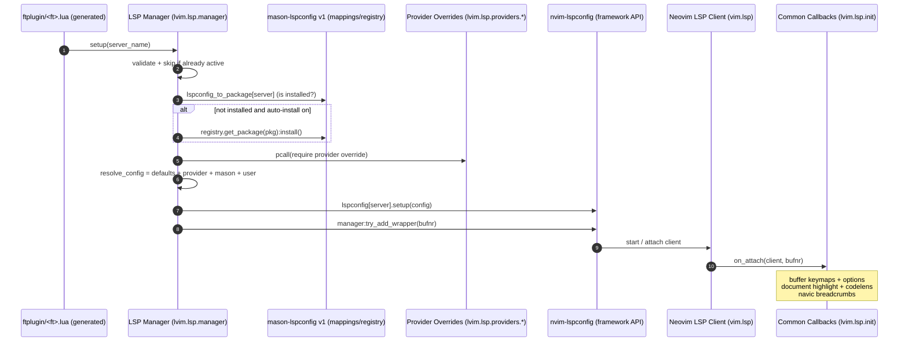

**Summary of the participants in the LSP-setup collaboration** (1:1 with the seven
lifelines in the diagram above):

```
Participant (alias)               | Module / file                 | Role in the collaboration
----------------------------------+-------------------------------+-----------------------------------------
ftplugin/<ft>.lua (FT)            | site/after/ftplugin/<ft>.lua  | Generated stub; calls manager.setup(server) on file open
LSP Manager (Mgr)                 | lvim/lsp/manager.lua          | Resolve config + launch server via lspconfig framework
mason-lspconfig v1 (MasonLsp)     | mason-lspconfig (mappings/reg)| Map server->package; drive auto-install via registry
Provider Overrides (Providers)    | lvim/lsp/providers/*.lua      | Per-server config (lua_ls, jsonls, yamlls, tailwind, vue)
nvim-lspconfig framework (LspCfg) | neovim/nvim-lspconfig         | lspconfig[server].setup + try_add_wrapper (framework API)
Neovim LSP Client (Client)        | vim.lsp (core)                | Start/attach the language server client
Common Callbacks (OnAttach)       | lvim/lsp/init.lua             | on_attach: keymaps, options, highlight, codelens, navic
```

Supporting collaborators not drawn as separate lifelines: `lvim/lsp/utils.lua`
(client queries, format filter), `lvim/lsp/config.lua` (`lvim.lsp.*` defaults),
`lvim/lsp/templates.lua` (generates the ftplugin stubs), `lvim/lsp/null-ls/*.lua`
(none-ls sources), and `lvim/core/mason.lua` (installer + PATH bootstrap).

**Explanation.** The **config resolution order** for any server is a layered
`vim.tbl_deep_extend("force", ...)` merge, later layers overriding earlier ones:

```
Priority (low -> high) | Source                                   | Set where
-----------------------+------------------------------------------+-------------------------------
1 (base)               | on_attach/on_init/on_exit/capabilities   | lvim.lsp.init.get_common_opts
2                      | provider override (if present)           | lvim/lsp/providers/<server>.lua
3                      | mason-resolved config                    | mason-lspconfig server config
4 (highest)            | user_config passed to manager.setup      | ftplugin stub / user code
```

This design is elegant but **couples LunarVim to APIs that newer versions removed**:
`lspconfig[server].setup(...)` and `manager:try_add_wrapper` (framework API),
`lspconfig.server_configurations.*` (moved/removed), and mason-lspconfig v1's
`mappings.server` / `mappings.filetype` / `get_available_servers` (rewritten in
mason-lspconfig 2.x). These are enumerated with line numbers in Section I.10 and are
the primary reason the whole core is snapshot-pinned to 2024-era plugins.

## I.8 Plugin Ecosystem Catalog

Verifiable figures from this repo: **85** top-level plugin declarations in
`custom/plugins.lua` (**84 unique** — `powerman/vim-plugin-AnsiEsc` is declared
twice) plus **~20** dependency-only plugins, and **132** total entries in
`lazy-lock.json`. Separately, LunarVim contributes **43** snapshot-pinned core
plugins from its *own* default snapshot (`snapshots/default.json`, not this repo's
files); the core and user sets overlap where a user re-declaration (e.g.
`nvim-treesitter`, `nvim-lspconfig`) merges into a single lock entry, so the three
figures are not additive. The user plugins group into the functional categories
below (some plugins legitimately span two categories and are cross-listed).

```
Category                          | Count | Representative members
----------------------------------+-------+--------------------------------------------------
Core / Library                    |   7   | plenary, nui, sqlite.lua, web-devicons, guihua, middleclass
LSP & Completion / Formatting     |  12   | lspsaga, ccls.nvim, none-ls, glance, outline, neodev, formatter, nvim-cmp, LuaSnip
Treesitter / Syntax               |   6   | nvim-treesitter, playground, ts-context, cpp-tools, rainbow-delimiters, vim-matchup
Fuzzy-finding / Telescope + ext   |  10   | telescope + file-browser/ui-select/smart-history/live-grep-args/symbols/frecency/undo, mini.pick, fzf-lua
File-explorer / Project / Session |   2   | lf.nvim, possession.nvim
Git                               |   3   | lazygit, vim-fugitive, diffview
UI / Aesthetics / Colorscheme     |  13   | catppuccin, colorizer, dressing, nvim-notify, smear-cursor, marks, vessel, windows.nvim
Editing / Motions / Text-objects  |  17   | nvim-surround, flash, expand-region, move, cutlass, yanky, visual-multi, easy-align, undotree
Debugging / DAP + adapters        |   5   | nvim-dap, dap-python, dap-virtual-text, dap-vscode-js, vscode-js-debug
Testing                           |   2   | neotest, neotest-python
Language-specific                 |  24   | venv-selector, uv, typescript-tools, go.nvim, rustaceanvim, nvim-jdtls, flutter-tools, quarto, otter
AI / Assistants                   |   3   | avante.nvim, copilot.lua, img-clip
Terminal / Tools                  |   7   | tmux.nvim, toggleterm, grug-far, translate, bufferize, AnsiEsc
```

The mindmap below gives a visual overview of the ecosystem's shape.

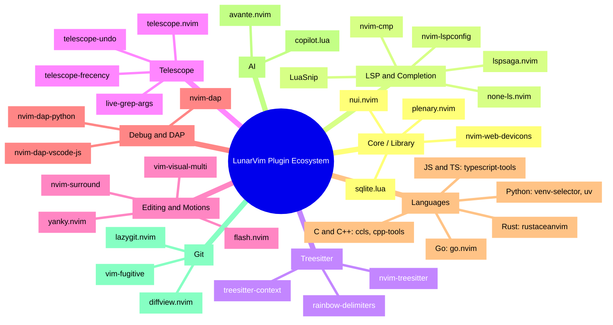

**Explanation.** Two structural notes fall out of the catalog. First, a large share
of plugins are *hosts or dependents* of a handful of shared libraries (Section I.9),
so the true dependency surface is smaller than 132 independent items. Second, the
config is **language-heavy** (24 language-specific plugins across Python, JS/TS, Go,
Rust, C/C++, Java, Dart, Quarto, Markdown, PlantUML), which means the LSP/DAP
subsystems are the highest-value and highest-risk areas for any upgrade.

Two catalog anomalies worth fixing regardless of the upgrade decision:

- **Duplicate declaration:** `powerman/vim-plugin-AnsiEsc` is declared twice
  (`custom/plugins.lua:494` as `lazy=false` and `:1269` as `lazy=true, cmd=AnsiEsc`).
  lazy.nvim merges them, but the intent is ambiguous; keep one.
- **Stale lock vs. pin:** `ccls.nvim` spec pins `de925cad...` but `lazy-lock.json`
  records `85aed539...` — run `:Lazy sync` so the 0.11-safe commit is actually used.

## I.9 Inter-Plugin Dependency Graph

Most of the ecosystem hangs off a small number of shared libraries and host
plugins. The graph below shows the principal "host to dependents" relationships
(edges point from a library/host to the plugins that require it).

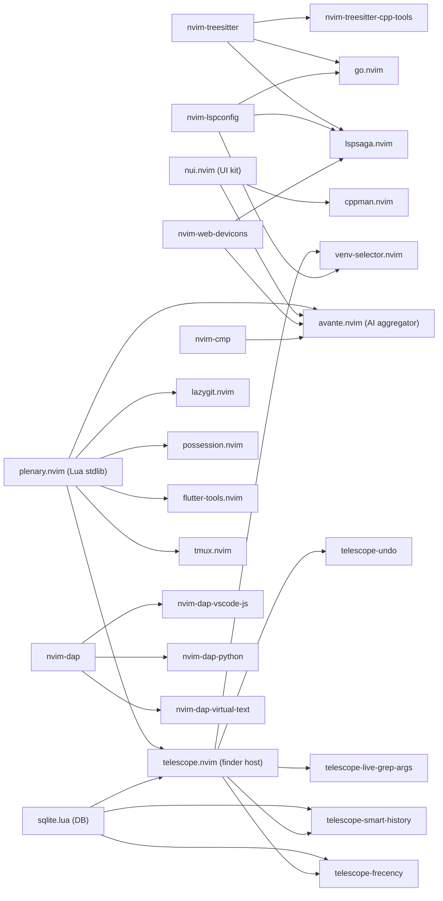

**Explanation.** `plenary.nvim` and `telescope.nvim` are the two heaviest hubs — a
breaking change in either ripples widely. `nvim-lspconfig`, `nvim-treesitter`, and
`nvim-dap` are the three "framework" hosts whose *version* dictates whether the
language plugins work. Finally, **`avante.nvim` is an aggregator**: it pulls in
`plenary`, `nui`, `nvim-cmp`, `telescope`/`mini.pick`/`fzf-lua`, `copilot`,
`img-clip`, and `render-markdown`. That single plugin therefore carries an outsized
share of the config's total dependency weight and is worth special attention on any
upgrade.

## I.10 Neovim Version Dependency Analysis

This section quantifies the "version tension" introduced in I.1: the frozen core
assumes pre-0.11 APIs, while several user plugins assume 0.11+/0.12 APIs — on the
*same* Neovim binary.

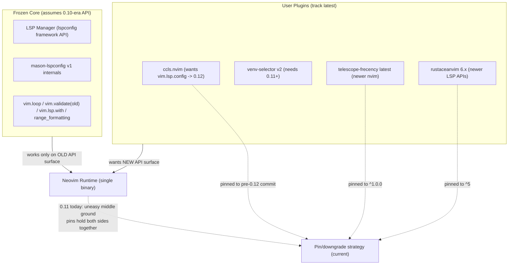

**Explanation.** Neovim 0.11 is the *widest overlap* where both sides mostly work,
which is precisely why the current strategy targets it. The pins (dashed edges into
"Pin/downgrade strategy") are the glue. Upgrading Neovim narrows the overlap: it
pushes the runtime toward the "new API surface" that user plugins want, but away
from the "old API surface" the frozen core depends on.

### Table A — LunarVim core: version-sensitive Neovim API usage

Removed/hard-breaking first, then deprecations (warn now, removal later). All paths
are under `~/.local/share/lunarvim/lvim/`.

```
#  | API / pattern                                            | Location (file:line)                       | Status / removal      | Replacement
---+----------------------------------------------------------+--------------------------------------------+-----------------------+-------------------------------
1  | vim.lsp.buf.range_formatting(...)                        | lua/lvim/lsp/providers/jsonls.lua:11       | REMOVED in 0.11       | vim.lsp.buf.format({range=...})
2  | lspconfig[server].setup / manager:try_add_wrapper        | lua/lvim/lsp/manager.lua:85,55             | framework API dropped | vim.lsp.config()/enable()
3  | require("lspconfig.server_configurations."..name)        | lua/lvim/lsp/manager.lua:77; utils.lua:46  | moved/removed         | vim.lsp.config / runtime lsp/
4  | mason-lspconfig v1 mappings/get_available_servers/settings| lua/lvim/lsp/manager.lua:9,14,101; utils.lua:63,71; plugins.lua:16 | rewritten in 2.x | mason-lspconfig 2.x API
5  | lspconfig.util.default_config / add_hook_before          | lua/lvim/lsp/providers/lua_ls.lua:42,31    | framework internals   | native config merge
6  | vim.validate { name = { x, "string" } } (old form)       | lua/lvim/lsp/manager.lua:94                | deprecated 0.11       | vim.validate("name", x, "string")
7  | vim.tbl_flatten                                          | lua/lvim/lsp/null-ls/linters.lua:17; core/telescope/custom-finders.lua:61 | deprecated | vim.iter(x):flatten():totable()
8  | vim.highlight.on_yank                                     | lua/lvim/core/autocmds.lua:14              | deprecated 0.11       | vim.hl.on_yank
9  | vim.lsp.with + vim.lsp.handlers[...]                      | lua/lvim/lsp/init.lua:116-122              | deprecated 0.11       | vim.lsp.buf.hover({border=...})
10 | client.supports_method "m" (dot-call)                    | lua/lvim/lsp/utils.lua:84,117,130,169      | soft-deprecated 0.11  | client:supports_method(m, opts)
11 | vim.loop (alias)                                          | bootstrap.lua:12; utils.lua:2; config/init.lua:63; manager.lua:6 (+more) | soft-deprecated | vim.uv
12 | vim.fn.sign_define for diagnostics                        | lua/lvim/lsp/init.lua:99; core/dap.lua:107 | superseded            | vim.diagnostic.config({signs={text=}})
```

Positive note (avoids over-flagging): the core already uses the *modern*
`vim.lsp.get_clients()` (`lsp/utils.lua:7,15`; `core/info.lua:129`),
`vim.api.nvim_get_hl`, and `vim.api.nvim_set_option_value` — so it is partway
migrated. Items 2-5 (the LSP framework coupling) are the genuinely hard blockers;
items 6-12 are warnings that still function on 0.11/0.12.

### Table B — User plugins: Neovim-version pins & sensitivities

```
Plugin                         | Pin / state                        | Reason (nvim version)                         | Source
-------------------------------+------------------------------------+-----------------------------------------------+---------------------------------
ccls.nvim                      | commit de925cad (pre-0.12)         | newer commit needs vim.lsp.config -> 0.12     | custom/plugins.lua:400-405
telescope-frecency.nvim        | version "^1.0.0"                   | newer releases require newer nvim             | custom/plugins.lua:808; commit 97dba25
visual-whitespace.nvim         | branch "compat-v10"                | explicit 0.10-compat branch                   | custom/plugins.lua:1318
rustaceanvim                   | version "^5"                       | 6.x moves to newer LSP APIs                    | custom/plugins.lua:1013
venv-selector.nvim             | latest (v2/regex), NOT downgraded  | v2 needs only 0.11+ (verified)                | custom/config/venv-selector.lua:16
clangd (via native)            | native 0.11 LSP for clangd         | 0.11 native LSP good enough                    | custom/plugins.lua:2; cpp.lua
custom/config/lsp/init.lua     | multi-version inlay-hint shims     | straddles 0.10/0.11 signatures                 | custom/config/lsp/init.lua:18-34
```

**Explanation.** The user plugins fall into three buckets: (a) deliberately pinned
*back* for 0.11 (`ccls`, `frecency`, `visual-whitespace`, `rustaceanvim`); (b)
deliberately kept *current* because they already support 0.11 (`venv-selector` v2);
and (c) version-defensive shim code that already branches on the running Neovim
version (`custom/config/lsp/init.lua`). This mix is important for Part II: it means a
Neovim upgrade is *not* uniformly blocked — some plugins are ready, some are pinned
back and would need to move *forward*, and the frozen distro core is the single
largest fixed obstacle.

---

# Part II — Upgrading Neovim to the Latest Version

## II.1 Goals, Constraints, and Success Criteria

**Goal.** Move from Neovim `0.11.x` to the latest Neovim (stable is **0.12.3** as of
2026-07; nightly is `0.13-dev`) while keeping this configuration's features and,
ideally, ending the recurring "pin a plugin back so it works on 0.11" treadmill.

**Hard constraints.**
- No loss of the language tooling in use (Python, JS/TS, Go, Rust, C/C++, Java,
  Dart, Quarto/Markdown, PlantUML) — LSP, DAP, tests, formatting.
- A **safe, reversible** path: the working editor must not be bricked mid-migration.
- Keep the large, already-curated set of 84 user plugins wherever possible.

**Success criteria.**
1. `nvim --version` reports the target (0.12.x) and everything below is green in
   `:checkhealth`.
2. LSP attaches for every language above via the **native `vim.lsp.config`/`enable`**
   path (no reliance on the *deprecated* lspconfig framework API, nor on the
   *removed* mason-lspconfig v1 / `server_configurations` internals the LunarVim
   manager depends on).
3. Tree-sitter highlighting works on the **rewritten `nvim-treesitter` `main`**
   branch (required by 0.12+).
4. The previously back-pinned plugins (`ccls.nvim`, `telescope-frecency`,
   `visual-whitespace`, `rustaceanvim`) can move **forward** to current releases.
5. The base distribution is **actively maintained**, so future Neovim releases are
   somebody else's maintenance burden, not yours.

**The two facts that dominate the design (from the research):**

- **The forcing function for *reaching* 0.12 is `nvim-treesitter`.** Its maintained
  `main` branch is a full rewrite that **requires Neovim ≥ 0.12**; the old `master`
  branch is frozen and kept only for 0.11 compatibility. (That same treesitter split
  also broke LunarVim's *own* snapshot-pinned parser on newer 0.11.x patch releases —
  LunarVim issue #4656.) Any move to 0.12 *must* adopt the treesitter rewrite. Note
  this is **distinct** from the plugin breakage already seen on *this* machine, which
  came from plugins migrating to the 0.12-only `vim.lsp.config` API (`ccls.nvim`) plus
  a `venv-selector` config-schema change (commit `2c0b7ab`) — i.e. the LSP-API shift,
  not treesitter.
- **LunarVim is dormant; LazyVim is active and already runs on your 0.11.x today.**
  LazyVim requires only Neovim **≥ 0.11.2**, so it is not itself a reason to upgrade —
  it is a stable base you can adopt *before* touching the Neovim version, then ride
  forward to 0.12/0.13 as the ecosystem does.

## II.2 What Actually Breaks on Upgrade (Root-Cause Analysis)

A configuration already clean on 0.11 weathers **most** of the well-known
deprecations, because they landed at 0.10/0.11 and are *still not removed* at
0.12.3/HEAD. The genuine breakage on 0.11 -> 0.12 is concentrated in a few places.

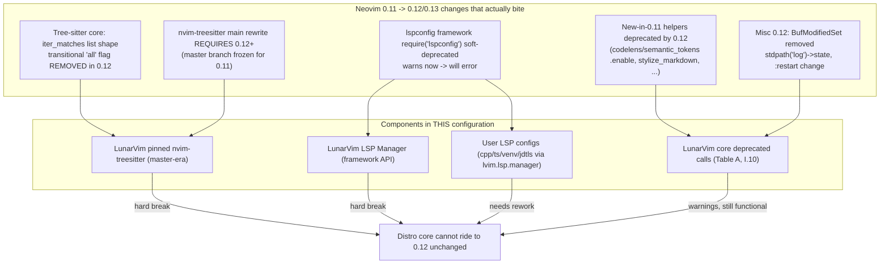

**Explanation.** Two edges are *hard breaks* on 0.12: the frozen tree-sitter and the
lspconfig-framework-based LSP manager. Everything else (Table A in I.10) is warnings
that still run. The conclusion is decisive: **the LunarVim distribution core cannot
ride to Neovim 0.12 unchanged** — its two load-bearing subsystems (treesitter pin +
LSP manager) are exactly the two hard breaks. This is the central fact that drives
the approach comparison.

Concrete change-to-impact mapping:

```
Neovim change (0.11 -> 0.12/0.13)             | Severity on this setup | Where it lands
----------------------------------------------+------------------------+-------------------------------
nvim-treesitter main requires 0.12+           | HARD (must adopt)      | replaces frozen master pin
Query:iter_matches list shape ('all' removed) | HARD (via plugins)     | any TS query consumer
require('lspconfig') framework deprecated      | HARD (design)          | lvim.lsp.manager + user LSP
codelens/semantic_tokens .enable, etc.        | LOW (warns)            | core deprecated calls
BufModifiedSet removed / stdpath('log') moved | LOW                    | rare/none here
vim.validate/tbl_flatten/highlight/loop       | LOW (warns, not removed)| Table A items 6-12
make_position_params position_encoding        | already handled at 0.11| user shim code exists
```

## II.3 Candidate Approaches (Brainstorm)

Five distinct strategies were considered. Each is stated with its mechanism and
honest pros/cons; the comparison matrix and decision tree follow.

### Approach A — Patch / fork LunarVim core in place

*Mechanism:* fork `lunarvim/lunarvim`, rewrite `lua/lvim/lsp/manager.lua` +
`templates.lua` + the mason-lspconfig lookups to the native `vim.lsp.config`/`enable`
model, unpin and bump `nvim-treesitter` to `main`, fix Table-A deprecations, and
maintain that fork yourself.

- **Pros:** keeps the familiar `lvim.*` API and all muscle memory; smallest change to
  `config.lua`; no plugin re-homing.
- **Cons:** you inherit maintenance of a **dormant distro's** most complex subsystem
  (the LSP manager is the hardest part of the codebase); upstream is dead so you never
  get fixes back; the snapshot-pinning machinery fights you; every future Neovim
  release repeats the work. High effort, high ongoing burden, low future-proofing.

### Approach B — Migrate to LazyVim + re-home plugins (RECOMMENDED)

*Mechanism:* adopt LazyVim as the base (`{ "LazyVim/LazyVim", import = "lazyvim.plugins" }`),
move the 84 user plugins into `lua/plugins/*.lua` (they are already lazy specs),
translate `lvim.*` settings into LazyVim's `lua/config/*.lua` + `opts` model, enable
LazyVim **lang Extras** for each language, and let LazyVim's native-LSP + treesitter
rewrite handle the 0.12 hard breaks.

- **Pros:** LazyVim is **actively maintained** and already tracks 0.12/0.13, so the two
  hard breaks are solved upstream; it is a **thin, idiomatic lazy.nvim layer** with no
  bespoke bootstrap/loader/LSP-manager to fight; your user plugins port almost
  verbatim; runs on your **current 0.11.x** so you can migrate *before* upgrading
  Neovim (de-risking); the back-pinned plugins can move forward.
- **Cons:** one-time translation of the `lvim.*` config surface and keymaps; different
  defaults to relearn (neo-tree vs nvim-tree, blink.cmp vs nvim-cmp, snacks dashboard
  vs alpha); some LunarVim conveniences must be re-created as small specs.

### Approach C — Bespoke `lazy.nvim` config from scratch (no distro)

*Mechanism:* start from an empty `init.lua`, add `lazy.nvim`, and hand-build options,
keymaps, LSP (`vim.lsp.config`/`enable`), treesitter, completion, and every feature.

- **Pros:** maximum control and understanding; zero distro coupling ever again;
  smallest possible dependency surface.
- **Cons:** you re-implement everything LazyVim gives free (LSP wiring, formatting,
  which-key groups, statusline, dashboard, Extras); highest up-front effort; you become
  the maintainer of your own mini-distro.

### Approach D — Hybrid: keep LunarVim shell, replace only the LSP subsystem

*Mechanism:* stay on LunarVim but disable its LSP manager and drive LSP yourself with
native `vim.lsp.config`/`enable`; also unpin treesitter to `main`.

- **Pros:** less disruptive than a full migration; keeps `lvim.*` for non-LSP config.
- **Cons:** you are surgically operating on a dormant distro that will keep fighting you
  (snapshot pins, the ftplugin-template generator, mason-lspconfig v1 assumptions);
  ends up nearly as much work as Approach A with a messier result; still no upstream
  future. A transitional half-measure, not a destination.

### Approach E — Status quo (pin Neovim at 0.11.x)

*Mechanism:* do not upgrade; keep pinning individual plugins back to 0.11-compatible
versions (the current strategy).

- **Pros:** zero migration effort today; everything works now.
- **Cons:** the pin treadmill grows as more plugins require 0.12+; you drift onto
  unmaintained plugin versions; you never get 0.12/0.13 features; and without
  compensating pins, plugins break as they auto-update on newer 0.11 patches (as
  already happened with `ccls.nvim`), so keeping the setup working demands an
  ever-growing set of back-pins. This is a slowly-worsening dead end.

### Comparison matrix

Scores are qualitative (Low / Med / High). "Future-proof" and "Maintained upstream"
are the criteria that most separate the options.

```
Criterion              | A: Patch LunarVim | B: LazyVim (rec.) | C: Bespoke | D: Hybrid | E: Status quo
-----------------------+-------------------+-------------------+------------+-----------+--------------
Up-front effort        | High              | Medium-High       | Very High  | High      | None
Ongoing maintenance    | Very High         | Low               | High       | High      | Rising
Risk of breakage       | High              | Low-Med           | Medium     | High      | Rising
Feature parity kept    | High              | High              | Medium     | High      | High (frozen)
Maintained upstream    | No                | Yes (active)      | N/A (you)  | No        | No
Future-proof (0.13+)   | Low               | High              | Medium     | Low       | Very Low
Keeps lvim.* muscle    | Yes               | No                | No         | Partial   | Yes
Reversibility          | Medium            | High (parallel)   | High       | Medium    | N/A
Overall                | Weak              | Strong            | Niche      | Weak      | Dead end
```

### Decision tree

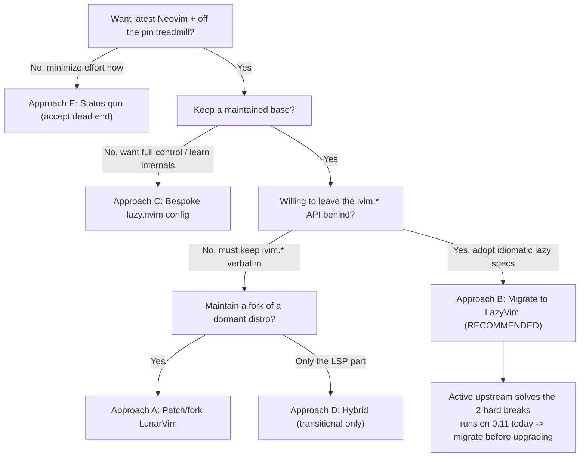

**Explanation.** The tree turns on two questions: (1) do you want a *maintained* base,
and (2) are you willing to trade the bespoke `lvim.*` table for idiomatic lazy specs?
For someone who already writes plain lazy specs in `custom/plugins.lua` and is tired
of pinning plugins back, both answers point to **Approach B**.

## II.4 Recommended Approach — Deep Dive: LazyVim Migration

### II.4.1 Why B wins for this specific configuration

- **The large majority of your user specs port with little change.**
  `custom/plugins.lua` is *already* a `lazy.nvim` spec list, so most of the 84 user
  plugins move into `lua/plugins/` largely by copy-paste; only the ones configured
  *through* LunarVim builtins or the `lvim.lsp.manager` need real rework (the Replace
  and Reconfigure buckets in II.4.5).
- **The two hard 0.12 breaks are handled upstream.** LazyVim ships the
  `nvim-treesitter` rewrite and native `vim.lsp.config`/`enable` wiring; you inherit
  those fixes instead of authoring them (Approach A) or re-authoring them (C).
- **You can migrate on 0.11 first, upgrade second.** Because LazyVim needs only
  0.11.2, you build and validate the new config on the machine as-is (in parallel with
  LunarVim), then flip Neovim to 0.12.3 as a separate, independently-reversible step.
- **It ends the pin treadmill.** On the LazyVim + 0.12 base, `ccls.nvim`,
  `telescope-frecency`, `visual-whitespace`, and `rustaceanvim` all move to current
  releases; `nvim-treesitter` moves to `main`.

### II.4.2 Target architecture

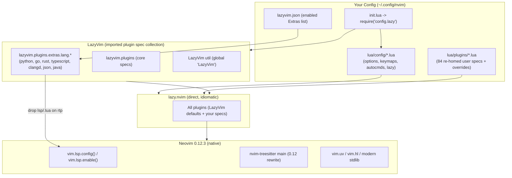

**Explanation.** Compared with the four-layer LunarVim diagram in I.2, the bespoke
"Distribution Core" layer (bootstrap + loader + LSP manager) **disappears**. LazyVim
sits as an *imported spec set* beside your own specs on plain `lazy.nvim`, and both
bind to a *modern* Neovim that provides native LSP config and the treesitter rewrite.
There is no wrapper to break on the next Neovim release.

### II.4.3 Migration mapping: LunarVim component -> LazyVim / native equivalent

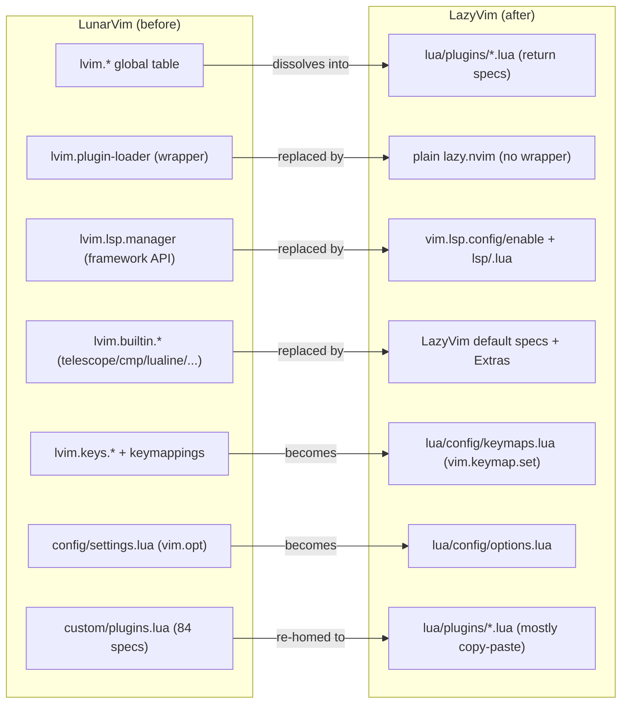

**Explanation.** The mapping is mostly *one-way simplification*: bespoke subsystems
collapse into either LazyVim defaults or a handful of `opts`/`keys` overrides. The
only genuinely new authoring is the LSP re-wiring (middle edge), and even that is
smaller than it looks because LazyVim's lang Extras already ship each server's
`lsp/<server>.lua`; you only override specifics.

### II.4.4 Config translation cheat-sheet (`lvim.*` -> LazyVim)

```
LunarVim (config.lua)                              | LazyVim equivalent (where)
---------------------------------------------------+-----------------------------------------------------
lvim.leader = "space"                              | vim.g.mapleader = " " in lua/config/options.lua (space is default)
lvim.colorscheme = "catppuccin-mocha"              | { "LazyVim/LazyVim", opts = { colorscheme = "catppuccin-mocha" } }
vim.opt.* (settings.lua ~40 options)               | lua/config/options.lua (loaded before lazy)
lvim.keys.normal_mode["<C-s>"] = ":w"              | vim.keymap.set("n","<C-s>",...) in lua/config/keymaps.lua
lvim.autocommands = {...}                          | lua/config/autocmds.lua
lvim.format_on_save = { enabled = true }           | conform.nvim (LazyVim default); toggle with <leader>uf / opts
lvim.builtin.telescope.defaults = {...}            | { "nvim-telescope/telescope.nvim", opts = {...} } (editor.telescope)
lvim.builtin.treesitter.ensure_installed = {...}   | { "nvim-treesitter/nvim-treesitter", opts = function(_,o) ... end }
lvim.builtin.dap.active = true                     | enable dap.core Extra (or import extras.dap.core)
lvim.builtin.lualine / bufferline / which_key      | LazyVim configures these; override via opts
lvim.lsp.on_attach_callback = fn                   | LazyVim.lsp.on_attach(function(client,buf) ... end) in a plugin spec
lvim.lsp.installer.setup.ensure_installed = {...}  | mason opts / lang Extras (auto-install servers)
lvim.lsp.automatic_configuration.skipped_servers   | set opts.servers.<name> or handle via the lang Extra
require("lvim.lsp.manager").setup("clangd", {...})  | vim.lsp.config("clangd", {...}) + vim.lsp.enable("clangd")
```

**Explanation.** Most rows collapse to either a one-line option in `lua/config/*.lua`
or a small `opts` override in `lua/plugins/*.lua`. The last two rows are the LSP
re-wire and are the substantive part of the work.

### II.4.5 Plugin disposition (keep / replace / reconfigure / drop)

The 84 user plugins fall into four buckets. Representative members are shown; the
principle for each bucket generalizes to the rest.

```
Disposition                          | Applies to (representative)                          | Action
-------------------------------------+------------------------------------------------------+---------------------------------
KEEP AS-IS (already plain specs)     | nvim-surround, flash, yanky, cutlass, move, undotree,| copy spec into lua/plugins/;
                                     | lazygit, fugitive, diffview, grug-far, marks, vessel,| no change needed
                                     | avante, copilot, go.nvim, quarto, otter, tmux.nvim   |
REPLACE with LazyVim default/Extra   | LunarVim builtins: telescope, treesitter, cmp,       | drop LunarVim builtin; adopt
                                     | lualine, bufferline, which-key, gitsigns, mason,     | LazyVim's (override via opts);
                                     | alpha(dashboard), nvim-tree(->neo-tree or keep)      | enable coding.nvim-cmp if you
                                     |                                                      | prefer nvim-cmp over blink.cmp
RECONFIGURE for native LSP           | cpp (ccls+clangd), typescript-tools, venv-selector,  | move off lvim.lsp.manager to
                                     | nvim-jdtls, rustaceanvim, flutter-tools              | vim.lsp.config/enable or lang Extra
UNPIN (now that 0.12 is the target)  | ccls.nvim, telescope-frecency, visual-whitespace,    | remove the four user back-pins;
                                     | rustaceanvim (four user back-pins)                   | track latest releases
(inherited, not a user pin)          | nvim-treesitter (frozen via LunarVim snapshot only)  | adopt LazyVim's main-branch spec
DROP / DEDUPE                        | duplicate vim-plugin-AnsiEsc, LunarVim colorschemes  | remove one AnsiEsc; drop onedarker/
                                     | (onedarker, lunar, tokyonight if unused)             | lunar unless used
```

**Explanation.** The heavy lifting is the *Replace* and *Reconfigure* buckets. For
*Replace*, prefer LazyVim's defaults where they match your habits (telescope is a
LazyVim editor option, so your telescope-heavy workflow stays); enable the
`coding.nvim-cmp` Extra if you want to keep `nvim-cmp` instead of LazyVim's newer
default `blink.cmp`. For *Reconfigure*, each language you use has a LazyVim
**lang Extra** (`lang.python`, `lang.go`, `lang.rust`, `lang.typescript`,
`lang.clangd`, `lang.json`, `lang.java`) that wires the server + treesitter +
formatter; you enable those and then override only the specifics that differ from
your current setup.

### II.4.6 LSP subsystem migration (the substantive rework)

This is the one place with real design work. The table contrasts the mechanics.

```
Concern                | LunarVim (today)                        | LazyVim + native (target)
-----------------------+-----------------------------------------+-------------------------------------------
Server config define   | lspconfig[server].setup(cfg) (framework)| vim.lsp.config(server, cfg)
Server activation      | manager:try_add_wrapper via ftplugin    | vim.lsp.enable(server) (filetype auto)
Server config source   | mason-lspconfig v1 mappings             | lsp/<server>.lua on runtimepath (Extras)
Auto-install servers   | lvim.lsp manager + mason-lspconfig v1   | mason + mason-lspconfig 2.x (LazyVim opts)
on_attach / keymaps    | lvim.lsp.common_on_attach               | LazyVim.lsp.on_attach(fn) + lsp/keymaps
Capabilities           | cmp_nvim_lsp.default_capabilities       | LazyVim assembles (blink/cmp) capabilities
Formatting             | null-ls/none-ls via lvim.lsp            | conform.nvim (LazyVim default)
Linting                | none-ls sources                         | nvim-lint (LazyVim default)
clangd / ccls (C/C++)  | lvim.lsp.manager("clangd") + ccls.nvim  | lang.clangd Extra + ccls via vim.lsp.config
```

For a concrete server override under LazyVim, you add a spec such as:

```
-- lua/plugins/lsp.lua  (illustrative, not to be pasted verbatim)
return {
  { "neovim/nvim-lspconfig", opts = { servers = { clangd = { --[[ your init_options ]] } } } },
}
```

and for a server LazyVim does not template, you use the native API directly in a
config function (`vim.lsp.config("ccls", {...})` + `vim.lsp.enable("ccls")`), which is
exactly the modern path the newer `ccls.nvim` already switched to.

### II.4.7 New configuration directory structure

```
~/.config/nvim/                 (new; parallel to ~/.config/lvim during migration)
  init.lua                      -> require("config.lazy")
  lua/
    config/
      lazy.lua                  bootstrap: lazy.setup{ import lazyvim.plugins; import plugins }
      options.lua               your vim.opt.* (ported from settings.lua) + leader
      keymaps.lua               your keymaps (ported from keymappings.lua / lvim.keys)
      autocmds.lua              your autocmds (ported from lvim.autocommands)
    plugins/
      user.lua                  the KEEP-AS-IS user specs (surround, flash, yanky, ...)
      lsp.lua                   server overrides (clangd/ccls/ts/jdtls/venv/rust)
      langs.lua                 { import = "lazyvim.plugins.extras.lang.python" }, go, rust, ...
      ui.lua                    colorscheme + dashboard/statusline/explorer overrides
      dap.lua                   dap adapters (python, js, cpp) as specs
      ai.lua                    avante + copilot specs
  lazyvim.json                  enabled Extras (managed by :LazyExtras)
  lazy-lock.json                lockfile (fresh)
```

### II.4.8 Neovim version management + safe parallel cutover

Because both distros key off `NVIM_APPNAME`, the new config can live **beside** the
existing LunarVim install and be tested without risk. The recommended tools:

- **`bob`** (`bob-nvim`) to install and switch Neovim versions (`bob install 0.12.3`,
  `bob use 0.12.3`), keeping the ability to `bob use 0.11.5` instantly for rollback.
  Ensure the build is **LuaJIT** (LazyVim requires it).
- **`NVIM_APPNAME`** to run the new config as a separate app:
  `NVIM_APPNAME=nvim-lazy nvim` reads `~/.config/nvim-lazy/` and stores data under
  `~/.local/share/nvim-lazy/` — fully isolated from `lvim`.

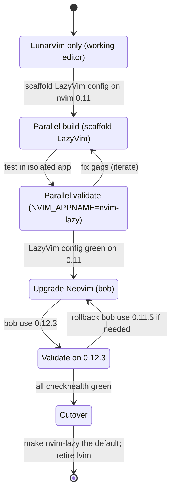

**Explanation.** The state machine encodes the core safety property: **LunarVim stays
fully functional until the very last state**. You build and validate LazyVim on your
current 0.11 (no Neovim change yet), *then* upgrade Neovim as an independent step with
an instant `bob` rollback, and only cut over once `:checkhealth` is green. At no point
is there a window where you have no working editor.

## II.5 Step-by-Step Implementation Guide (no timeline)

Phased, each phase independently reversible. Do not delete anything LunarVim until
the final phase.

**Phase 0 — Inventory and freeze a baseline.**
1. Commit the current `~/.dotfiles/lvim` (already clean) as the rollback point.
2. Run `:Lazy sync` in LunarVim so `lazy-lock.json` matches the pinned specs (this
   also resolves the stale `ccls.nvim` lock noted in I.6/I.8).
3. From this document's catalog, mark each user plugin's bucket (keep / replace /
   reconfigure / unpin / drop).

**Phase 1 — Scaffold LazyVim in parallel (still on Neovim 0.11).**
4. Clone the LazyVim starter into `~/.config/nvim-lazy` (a *new* app dir; do not
   touch `~/.config/lvim`).
5. Launch with `NVIM_APPNAME=nvim-lazy nvim`; let LazyVim install; confirm the base
   boots green with `:checkhealth` and `:LazyHealth`.

**Phase 2 — Port settings, keymaps, autocmds.**
6. Translate `config/settings.lua` options into `lua/config/options.lua`.
7. Translate your keymaps (`keymappings.lua` + `lvim.keys.*`) into
   `lua/config/keymaps.lua` using `vim.keymap.set`; disable any conflicting LazyVim
   default with the `{ lhs, false }` idiom.
8. Translate `lvim.autocommands` into `lua/config/autocmds.lua`.

**Phase 3 — Re-home the "keep-as-is" plugins.**
9. Copy the KEEP-AS-IS specs from `custom/plugins.lua` into `lua/plugins/user.lua`,
   removing any `lvim.*` references. Bring their per-plugin config modules across
   (they are plain Lua).

**Phase 4 — Enable language Extras and re-wire LSP.**
10. Enable lang Extras via `:LazyExtras` (or `{ import = "lazyvim.plugins.extras.lang.<x>" }`)
    for python, go, rust, typescript, clangd, json, java as applicable.
11. Add server overrides in `lua/plugins/lsp.lua` using `opts.servers.<name>` for
    templated servers and `vim.lsp.config`/`vim.lsp.enable` for the rest (ccls,
    jdtls, anything custom). Move `venv-selector`/`typescript-tools`/`rustaceanvim`
    off `lvim.lsp.manager`.
12. Verify LSP attaches per language (`:LspInfo` / `:checkhealth vim.lsp`).

**Phase 5 — DAP, tests, formatting, UI.**
13. Add DAP adapters (python, js, cpp) as specs (or the `dap` Extras); confirm
    breakpoints/attach.
14. Add neotest specs; confirm test discovery.
15. Confirm formatting via conform.nvim and linting via nvim-lint replace your
    none-ls setup (or enable the `lsp.none-ls` Extra if you prefer to keep none-ls).
16. Pick dashboard/explorer/statusline: keep LazyVim defaults or override to match
    your LunarVim habits (e.g. keep nvim-tree via a spec instead of neo-tree).

**Phase 6 — AI + long tail.**
17. Bring `avante.nvim` + `copilot.lua` + helpers across as specs; validate the
    aggregator's dependencies resolve under the new base.
18. Port remaining niche plugins; dedupe the duplicate `AnsiEsc`.

**Phase 7 — Upgrade Neovim, *then* unpin (order matters).**
19. **Upgrade first**, while the 0.11 back-pins are still in place:
    `bob install 0.12.3 && bob use 0.12.3`; relaunch `NVIM_APPNAME=nvim-lazy nvim`;
    run `:Lazy sync`, `:TSUpdate`, `:checkhealth`. Validate the config is green on
    0.12 with the existing pins.
20. **Then move forward**: remove the four user back-pins (`ccls`,
    `telescope-frecency`, `visual-whitespace`, `rustaceanvim`) and adopt LazyVim's
    `main`-branch treesitter; `:Lazy sync` again. (Do *not* run `:Lazy sync` after
    editing these specs while still on 0.11 — the newer plugins require 0.12, so
    unpinning before the upgrade would fetch 0.12-only plugins onto a 0.11 runtime.)
21. Keep `bob use 0.11.5` handy as instant rollback throughout. Because this all
    happens in the parallel `NVIM_APPNAME=nvim-lazy` app, even a broken intermediate
    state never touches your working `lvim`.

**Phase 8 — Cutover.**
22. Once stable, make the new config the default `nvim` config (move
    `~/.config/nvim-lazy` to `~/.config/nvim`, or keep the app-name and alias
    `nvim`), and update your dotfiles repo accordingly.
23. Retire the `lvim` launcher; keep the old `~/.config/lvim` archived until you are
    confident.

## II.6 Risks, Mitigations, and Rollback

```
Risk                                            | Likelihood | Mitigation
------------------------------------------------+------------+--------------------------------------------
Keymap muscle-memory disruption                 | High       | Port bindings 1:1 in lua/config/keymaps.lua
blink.cmp vs nvim-cmp behavior differences      | Medium     | Enable coding.nvim-cmp Extra to keep nvim-cmp
Some niche plugin unmaintained on 0.12          | Medium     | Find LazyVim-era alternative; it is isolated now
LSP server override missed for a language       | Medium     | Phase 4 checklist per language; :LspInfo
treesitter main rewrite API differences         | Medium     | LazyVim owns the treesitter spec; :TSUpdate
avante aggregator dependency churn              | Medium     | Pin avante + deps; validate in Phase 6
Neovim 0.12 regression in a workflow            | Low        | bob use 0.11.5 instant rollback; parallel apps
Losing a LunarVim convenience command           | Low        | Re-create as a tiny autocmd/user-command spec
```

**Rollback posture.** Every phase is reversible: the LunarVim install is untouched
until Phase 8, Neovim versions swap instantly via `bob`, and the two configs are
isolated by `NVIM_APPNAME`. The worst case at any point is "run `lvim` like before."

## II.7 Validation Checklist

```
[ ] nvim --version shows 0.12.3 (LuaJIT build)
[ ] :checkhealth is green (esp. vim.lsp, vim.treesitter, mason, lazy)
[ ] LSP attaches: python, js/ts, go, rust, c/c++, java, lua, quarto
[ ] Formatting (conform) + linting (nvim-lint or none-ls) work per language
[ ] Treesitter highlight/indent on main branch (:TSUpdate clean)
[ ] DAP: breakpoints + attach for python, js, cpp
[ ] neotest discovers + runs tests
[ ] Telescope + frecency + live-grep-args + undo pickers work
[ ] Git: lazygit, fugitive, diffview, gitsigns
[ ] avante + copilot respond
[ ] Session restore (possession or LazyVim persistence) works
[ ] Previously back-pinned plugins now on latest (ccls/frecency/rustaceanvim)
[ ] No deprecation errors in :messages / :Notifications on startup
[ ] Startup time acceptable (:Lazy profile)
```

---

# Part II-B — Implementation Record (as built)

This part documents the **actual migration that was implemented** on the
`lazyvim-migration` branch, following the plan in II.4-II.5. It is a testable,
parallel LazyVim configuration that reproduces the LunarVim functionality and
keymaps, switchable with a single script, so it can be validated before becoming a
daily driver.

## II.8 What Was Built

- **Branch:** `lazyvim-migration`.
- **New config:** `lazyvim-new/` in the repo (the `-new` suffix keeps the original
  LunarVim config untouched and revert trivial), deployed via
  `NVIM_APPNAME=lvim-lazyvim` to `~/.config/lvim-lazyvim` (a symlink).
- **Switcher:** `setup_lvim.sh` at the repo root (`new` / `old` / `status`).
- **Isolation:** the new config's data/state/cache live under
  `~/.local/share|state`, `~/.cache` / `lvim-lazyvim` — fully separate from LunarVim.
  The existing `lvim` command is never modified.
- **Verification:** headless bootstrap + startup confirmed the config loads with the
  catppuccin-mocha theme, correct options, 127 plugin specs, and 370 normal-mode
  keymaps (see II.14).

### II.8.1 New configuration layout

```
lazyvim-new/
  init.lua                     bootstrap; load config.lazy then keymaps + autocmds
  lua/config/lazy.lua          lazy.setup: LazyVim + Extras + user spec imports
  lua/config/options.lua       vim.opt deltas + globals (leader, clipboard, header)
  lua/config/keymaps.lua       apply(): custom + full LunarVim-default leader tree
  lua/config/autocmds.lua      autoread, flash toggle, :Redir, :RunNode, _G.C()
  lua/plugins/colorscheme.lua  catppuccin-mocha
  lua/plugins/editor.lua       flash/surround/cutlass/move/marks/windows/wrapping/...
  lua/plugins/telescope.lua    telescope + 8 extensions + layout/history/mappings
  lua/plugins/git.lua          diffview, fugitive, lazygit
  lua/plugins/ui.lua           rainbow-delimiters, ts-context, bufferline, colorizer, ...
  lua/plugins/coding.lua       treesitter opts (ignore dart, indent disable), playground
  lua/plugins/lsp.lua          lspsaga, glance, outline, ccls, server overrides, mason
  lua/plugins/dap.lua          cpp/python/js adapters, F-key debug maps, launch.json
  lua/plugins/lang.lua         typescript-tools, go, rust, flutter, quarto, cppman, ...
  lua/plugins/ai.lua           avante, copilot, img-clip
  lua/plugins/tools.lua        tmux, yanky, grug-far, translate, lf, toggleterm, possession
  lua/custom/possession.lua    custom session-save prompt
  README.md                    quickstart + known differences
setup_lvim.sh                  new/old/status switcher (repo root)
```

## II.9 The Parallel Switcher (`setup_lvim.sh`)

The switcher makes the new config a separate `NVIM_APPNAME` app, so both editors
coexist. `new` sets up the symlink + a `lvim-new` launcher; `old` removes them;
neither touches LunarVim.

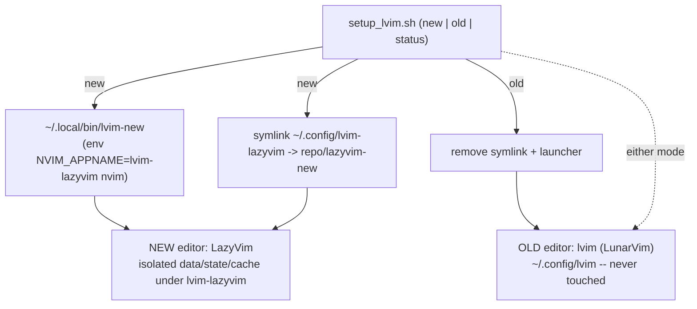

**Explanation.** After `setup_lvim.sh new`, launch the new editor with **`lvim-new`**
and the old one with **`lvim`** — they share nothing. `setup_lvim.sh old` removes the
`lvim-new` launcher and symlink (the config files and installed plugin data are
preserved for re-testing). The script prints all isolated locations and is
idempotent. Because LunarVim is never modified, the worst case at any point is "run
`lvim` like before."

```
Command                  | Effect
setup_lvim.sh new        | symlink + lvim-new launcher; prints locations + usage
setup_lvim.sh old        | remove launcher + symlink; keep repo config + plugin data
setup_lvim.sh status     | show whether new is active, launcher installed, paths
```

## II.10 Startup & the Deterministic Keymap Fix

A subtlety surfaced during testing: LazyVim auto-loads `lua/config/keymaps.lua` on
`VeryLazy` through a **cache-gated loader** (`_load` guards on
`lazy.core.cache.find`), which could skip the user file when the config-dir module
index was not yet warm (aggravated by first-run install churn). The fix loads the
user keymaps/autocmds **deterministically** in `init.lua` and re-applies keymaps on
`VeryLazy` so they also win over LazyVim's own defaults.

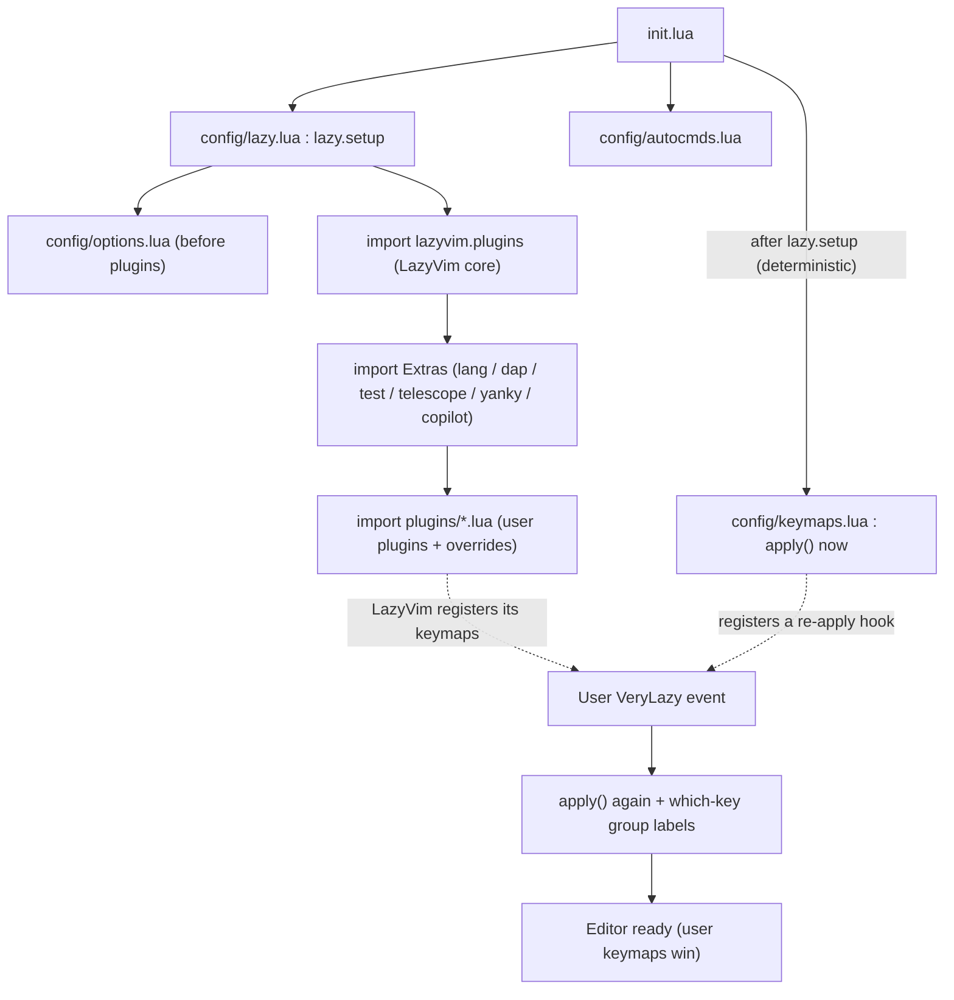

**Explanation.** `options.lua` loads before plugins (so leader/indent are right from
the start). After `lazy.setup`, `init.lua` requires `config.keymaps`, whose `apply()`
runs immediately and also registers a `VeryLazy` hook. Because LazyVim registers its
own `VeryLazy` keymap handler *earlier* (during `lazy.setup`), it fires first; our
re-apply fires after and therefore **wins** on any overlapping key. `require` caches,
so each file executes once regardless of how many loaders reference it.

## II.11 Keymap Parity Approach

Full parity required reproducing **both** layers of the LunarVim keymap surface:

1. The user's custom bindings from `keymappings.lua` (F-keys, `<leader>l*` LSP tree,
   diffview, venv, possession, wrapping, glance, etc.).
2. The **LunarVim default `<leader>` tree** (single-key `; w q / c f h e` and the
   `b`/`d`/`g`/`l`/`L`/`p`/`s`/`T` submenus), minus the entries the user disabled,
   mapped to LazyVim/native equivalents.

The reproduced default tree (abridged), with the equivalent used:

```
LunarVim default            | Reproduced with (LazyVim/native)
<leader>; Dashboard         | snacks.dashboard (fallback :Alpha)
<leader>w Save              | :w!
<leader>q Quit              | :confirm q
<leader>/ Comment           | native gcc / gc (visual)
<leader>c Close Buffer      | snacks.bufdelete (fallback :bd)
<leader>f Find File         | Telescope find_files
<leader>h No Highlight      | :nohlsearch
<leader>e Explorer          | :Neotree toggle
<leader>b* Buffers          | bufferline (Pick/Cycle/Close/Sort) + Telescope buffers
<leader>d* Debug            | nvim-dap (toggle/continue/repl/session) + dap-ui
<leader>g* Git              | gitsigns (hunks/blame/stage) + Telescope git_* + lazygit
<leader>l* LSP              | vim.lsp / vim.diagnostic + Telescope + LspInfo/Mason
<leader>L* Config/LazyVim   | edit config, Telescope keymaps, :Lazy, :LazyExtras/:LazyHealth
<leader>p* Plugins          | :Lazy install/sync/clean/update/profile/log/debug
<leader>s* Search           | Telescope (find/grep/help/oldfiles/registers/keymaps/...)
<leader>T* Treesitter       | :checkhealth vim.treesitter
```

Plugin-specific keys (flash `<leader>F`, markdown `<leader>M`, outline `<leader>o`,
undo `<leader>u`, cppman `<leader>Cc/Cs`, grug-far `<leader>S*`, vessel `gj/gL/gm`,
easy-align `ga`, lf `<M-o>`, quarto `<leader>q*`, rust `<leader>R*`, toggleterm
`<M-h/v/i>`, trevJ `<leader>j`, whitespace `<leader>tw`) live in their plugin specs'
`keys`. DAP F-key bindings (`<F6>`..`<F10>` and modifier variants delivered by the
terminal F13-F57 remaps) are set in `lua/plugins/dap.lua`.

## II.12 Design Decisions & Deviations

```
Decision                | Choice                          | Rationale
Switch mechanism        | NVIM_APPNAME=lvim-lazyvim       | Full isolation; LunarVim untouched; reversible
Keymap loading          | apply() at init + on VeryLazy   | Beat LazyVim's cache-gated loader; user maps win
Completion              | blink.cmp (LazyVim default)     | Modern default; nvim-cmp available via extras.coding.nvim-cmp
TypeScript LSP          | typescript-tools.nvim           | The user's actual server (dropped LazyVim vtsls extra)
File explorer           | nvim-tree (ported)              | Same plugin as LunarVim, settings preserved (LazyVim's snacks explorer replaced)
Dashboard               | snacks.dashboard (LazyVim)      | Functional equivalent of alpha
Telescope display       | default (custom 2-col dropped)  | Cosmetic only; reduces migration risk
Single-key leader maps  | w/q/c/'/' override LazyVim groups| Matches LunarVim muscle memory (their actions)
lazy-lock.json          | gitignored in lazyvim-new/      | Generated per machine on first :Lazy sync
```

## II.13 Functionality Coverage

```
Area              | LunarVim setup                 | New config (as built)
Theme             | catppuccin-mocha               | catppuccin-mocha (same)
LSP               | lvim.lsp.manager + mason        | native vim.lsp.config via lspconfig + LazyVim lang Extras + ccls
Completion        | nvim-cmp                        | blink.cmp (nvim-cmp available as extra)
Formatting/Lint   | none-ls                         | conform.nvim + nvim-lint (LazyVim)
Treesitter        | pinned (LunarVim snapshot)      | LazyVim-managed (master on 0.11; main on 0.12)
Fuzzy find        | telescope + 7 extensions        | telescope + 8 extensions (frecency/live-grep-args/undo/...)
Git               | gitsigns/lazygit/fugitive/diffview | same (lazygit via snacks + lazygit.nvim)
Debugging         | nvim-dap + adapters + F-keys    | dap.core extra + cpp/python/js adapters + F-keys
Testing           | neotest + neotest-python        | test.core extra + neotest-python
Python venv       | venv-selector v2 + possession   | venv-selector v2 + possession session hooks
Languages         | py/js-ts/go/rust/c++/java/dart/quarto | LazyVim lang Extras + go.nvim/rustaceanvim/typescript-tools/jdtls/flutter/quarto/ccls
AI                | avante + copilot                | avante + copilot (Copilot needs Node >= 22)
Sessions          | possession + alpha list         | possession (+ venv hooks); dashboard via snacks
Editing/motions   | surround/flash/yanky/cutlass/... | same, re-homed as lazy specs
```

## II.14 Testing & Verification Results

All verified headless with `NVIM_APPNAME=lvim-lazyvim` on Neovim 0.11.5.

```
Check                                   | Result
Lua syntax (all config files)           | PASS
Config bootstraps (lazy install)        | PASS -- no spec/config errors
Colorscheme                             | catppuccin-mocha applied
leader / localleader / scrolloff        | space / backslash / 3 (correct)
Plugin specs registered                 | 127
Core modules load                       | which-key, telescope, lspsaga, flash, typescript-tools, possession
Keymaps applied (normal mode)           | 369-370 maps; 19/19 parity spot-checks pass
User commands                           | :Redir, :RunNode present
Switcher new / old / status             | all pass; lvim-new launcher verified
Per-keymap command/module audit         | every keymap's command + function module resolves (see II.14.1)
Functional smoke test                   | <leader>/ comments; <leader>e opens nvim-tree
```

### II.14.1 Per-keymap audit + fixes

A command/module audit (load all plugins, then verify every registered keymap's
target command exists and every function-keymap's module loads) surfaced and fixed:

```
Keymap        | Problem                                          | Fix
<leader>e     | :Neotree missing (LazyVim uses snacks explorer)  | added nvim-tree.lua; map -> :NvimTreeToggle
<leader>vc    | :VenvSelectCached only exists if auto-activate=off| call venv-selector cached-retrieve directly
<leader>M     | :MarkdownPreviewToggle is buffer-local           | bind buffer-locally in markdown filetype
<leader>lR    | custom.lsp.rename module was not ported          | ported (nui.nvim, 0.11 position_encoding)
```

Remaining audit flags are false positives (key-remaps like `<leader>/`->`gcc`,
cutlass `mm`->`dd`, `<Plug>` chains) or headless-only VeryLazy timing
(`:LazyExtras`/`:LazyHealth` exist once VeryLazy fires, which it always does
interactively).

### II.14.2 LunarVim core-default behavior parity pass

A second parity pass studied the LunarVim DISTRIBUTION defaults themselves
(`lua/lvim/keymappings.lua`, `lsp/config.lua` buffer_mappings, and the core modules
nvimtree/terminal/telescope/cmp/autocmds/bufferline/autopairs) and ported everything
LazyVim does not already provide. Trigger: the explorer regression where `v` did not
open the file in a vertical split -- LunarVim's nvim-tree ships a custom `on_attach`
on top of the stock mappings.

```
Area           | LunarVim default behavior                          | Ported as
nvim-tree      | on_attach: l/o/<CR> open, v VERTICAL SPLIT,        | same on_attach in plugins/explorer.lua,
               | h close dir, C change root, gtg/gtf telescope      | plus window picker, centralized selection,
               | scoped to node dir; window-picker on split opens   | filters, git indicators, trash, confirms
Core keymaps   | i-mode Alt+arrows window nav; t-mode C-h/j/k/l;    | config/keymaps.lua additions
               | c-mode C-j/C-k wildmenu; x-mode A-j/A-k move       |
LSP on-attach  | gs signature help; gl line-diagnostic float;       | LspAttach autocmd in config/autocmds.lua
               | omnifunc + gq formatexpr via LSP                   | (gd/gD/gr/gI/K already LazyVim)
Telescope      | C-j/C-k history, C-c close, C-n/C-p move;          | defaults.mappings + pickers opts
               | buffers picker normal-mode with dd / C-d delete;   |
               | find_files hidden; colorscheme preview             |
Terminal       | exec terminals with dedicated counts + dynamic     | Terminal objects on M-h/M-v/M-i
               | fractional sizes, bound in n AND t modes           | (user's keys; LunarVim used M-1/2/3)
Completion     | cmp C-j/C-k select, C-Space open, C-e abort        | same keys on blink.cmp
Autopairs      | nvim-autopairs: treesitter checks, M-e fast wrap   | mini.pairs disabled; nvim-autopairs added
Bufferline     | right-mouse opens buffer in vertical split         | right_mouse_command = "vert sbuffer %d"
Autocmds       | dap-repl unlisted; lua gf require-path fix         | config/autocmds.lua
Theme          | catppuccin-mocha + personal Colorschemes pack      | both in plugins/colorscheme.lua
Mason          | cpptools installed (cppdbg adapter dependency)     | added to mason ensure_installed
```

Already provided by LazyVim (verified equivalent, not re-ported): window nav
`<C-hjkl>`, resize with `<C-arrows>`, `<A-j>/<A-k>` line moves (n/i/v), `]q`/`[q`,
`<`/`>` keep-selection, `<C-s>` save, `gcc`/`gc` comments, q-to-close filetypes,
yank highlight, VimResized equalize, `gd/gD/gr/gI/K` LSP maps, dashboard buttons
(snacks), smart buffer close (snacks.bufdelete vs buf_kill), Mason UI keys.

Functional verification: in the nvim-tree buffer, `v` is mapped as
"nvim-tree: Open: Vertical Split" and pressing it on a file grew the window count
from 2 to 3 with the file opened; terminal-mode nav, command-line C-j, visual-block
moves, and M-h terminal maps all registered.

### First-run notes (expected, not errors)

- First launch git-clones ~127 plugins and installs LSP servers, tree-sitter
  parsers, and formatters — network + a few minutes. Pre-install with
  `lvim-new --headless '+Lazy! sync' +qa`, then `lvim-new '+checkhealth'`.
- During that first install, transient `E5113 "Parser could not be created"` for a
  filetype can appear until parsers finish; it clears on the next launch.
- **Tree-sitter parser compilation (toolchain):** LazyVim's `nvim-treesitter`
  compiles parsers with the `tree-sitter` CLI, whose prebuilt binary requires a
  recent glibc (observed: `GLIBC_2.39 not found`). On systems with an older glibc,
  parser builds fail (highlighting falls back to none for un-precompiled languages).
  This is a toolchain/environment issue independent of the config; fixes are to
  install a `tree-sitter` CLI built for the local glibc, use a newer Neovim/glibc, or
  rely on parsers shipped with Neovim. LunarVim avoided this because its pinned older
  `nvim-treesitter` compiled parsers with `cc` directly.
- **Copilot** requires Node >= 22 (this machine has 20.11.1) — upgrade Node for
  Copilot to function; nothing else depends on it.
- Some plugins build native bits: `avante` (`make`), `vscode-js-debug` (`npm`),
  `markdown-preview` (`npm`).

### Known gaps (functional equivalents in place)

- The alpha dashboard's possession-session list is not reproduced (snacks dashboard
  is used instead; sessions remain available via `<leader>Pf`).
- The custom two-column telescope entry display is not ported (default display).
- `<leader>w`/`q`/`c`/`/` deliberately override LazyVim's same-key groups to match
  the LunarVim single-key actions; LazyVim's versions of those are reachable under
  their other keys or via which-key discovery.

---

## Appendix A — Deprecated-API remediation index

The authoritative per-call remediation list for LunarVim core is **Table A in
Section I.10** (12 items with `file:line`, status, and replacement). Under the
recommended Approach B these become moot for the *distro* (LunarVim core is retired),
but the same replacements apply to any user code you carry over:

```
vim.loop -> vim.uv ; vim.highlight -> vim.hl ; vim.tbl_flatten -> vim.iter(t):flatten():totable()
vim.tbl_islist -> vim.islist ; vim.validate(table) -> vim.validate(name,val,validator)
client.supports_method "m" -> client:supports_method(m, {bufnr=b})
lspconfig[srv].setup(cfg) -> vim.lsp.config(srv,cfg) + vim.lsp.enable(srv)
vim.lsp.with + handlers[...] -> vim.lsp.buf.hover({border=...})
range_formatting -> vim.lsp.buf.format({range=...})
```

## Appendix B — Neovim version reference (as of 2026-07)

```
Channel  | Version        | Notes
---------+----------------+-------------------------------------------------------
stable   | 0.12.3         | released 2026-06-10; recommended upgrade target
nightly  | 0.13.0-dev     | tracks master; only if you want bleeding edge
current  | 0.11.5-dev     | this machine today (migration source)
LazyVim  | requires >=0.11.2 (LuaJIT); active (v16.0.0, 2026-06)
nvim-treesitter | main requires >=0.12 ; master frozen for 0.11
nvim-lspconfig  | requires >=0.11.3 ; framework require('lspconfig') deprecated
```

## Appendix C — Primary sources

- Neovim runtime docs: `news.txt`, `deprecated.txt`, `lsp.txt` (v0.11.0, v0.12.0,
  master) at `github.com/neovim/neovim`.
- LazyVim: `lazyvim.org` (configuration, plugins, extras) and
  `github.com/LazyVim/LazyVim` (`lua/lazyvim/config`, `plugins`, `util`).
- nvim-lspconfig migration: `github.com/neovim/nvim-lspconfig` README + issue #3693,
  PR #4077.
- nvim-treesitter `main` vs `master`: `github.com/nvim-treesitter/nvim-treesitter`.
- LunarVim status: `github.com/LunarVim/LunarVim` (discussion #4518, issues #4646,
  #4656) and this repository's own source study (Part I `file:line` citations).

---

*End of document. All Mermaid diagrams herein were validated with `mmdc` v11.12.0;
all tables use plain ASCII for alignment stability.*
