# LunarVim Plugins Structure Analysis, Brainstorming, and Implementation

> A comprehensive architecture study of this LunarVim configuration and its plugin
> ecosystem (Part I), a design-level brainstorm and deep-dive plan for upgrading Neovim
> to the latest version (Part II), the implementation record of the migration as built
> (Part II-B), and a full design + implementation reference for the finished `lvim-new`
> system, including its Ubuntu desktop / `mimeopen_bg` / tmux integration (Part III).

---

## About This Document

- **Subject system:** the LunarVim distribution installed at
  `~/.local/share/lunarvim/lvim` plus this user configuration repository
  (`~/.dotfiles/lvim`, symlinked to `~/.config/lvim`).
- **Environment snapshot at time of writing:**
  - Neovim: `v0.11.5-dev` (target: keep on 0.11.x today, upgrade later).
  - LunarVim: `master` @ `aa51c20f` — release `1.4.0` (June 2025), currently in
    low-maintenance / frozen state.
  - Plugins: 43 snapshot-pinned LunarVim core plugins (from LunarVim's own default
    snapshot) plus 84 unique user top-level plugins and ~20 dependency-only plugins;
    the effective `lazy-lock.json` holds **132** locked entries (core and user sets
    overlap where a user re-declaration merges into a single lock entry).
- **Audience:** the maintainer of this configuration (an experienced developer),
  for planning and reference.

### Reading Conventions

- **ASCII tables** in this document deliberately avoid Unicode box-drawing
  characters (no `-|`-style glyphs such as the ones that break column alignment);
  they use only plain `|`, `-`, `+` and spaces so alignment survives any viewer.
- **Diagrams** are written in **Mermaid** (flowchart, sequence, class, state,
  mindmap). Every Mermaid block:
  - quotes all node text,
  - uses `<br/>` for line breaks and `#59;` for literal semicolons,
  - uses `%%` comments on their own lines,
  - uses **descriptive component names** (e.g. `"LSP Manager (lvim.lsp.manager)"`),
    never bare `A`/`B` letters.
- Every Mermaid diagram in this document was **validated with the Mermaid CLI**
  for syntax correctness before inclusion (`mmdc` v11.12.0 for Parts I–II-B; the 46
  diagrams of Part III were re-validated with `mmdc` v11.16.0).
- File references use `path:line` form so they are clickable / greppable.

### Table of Contents

- **Part I — LunarVim & Plugin Ecosystem: Structure, Design, Dependencies**
  - I.1 Executive Summary & System Context
  - I.2 Layered Architecture Overview
  - I.3 Startup & Bootstrap Sequence
  - I.4 Module Map & Directory Structure
  - I.5 The `lvim` Global Configuration Model
  - I.6 Plugin Management Layer (lazy.nvim wrapping + snapshot pinning)
  - I.7 LSP Subsystem Deep Dive
  - I.8 Plugin Ecosystem Catalog
  - I.9 Inter-Plugin Dependency Graph
  - I.10 Neovim Version Dependency Analysis
- **Part II — Upgrading Neovim to the Latest Version**
  - II.1 Goals, Constraints, and Success Criteria
  - II.2 What Actually Breaks on Upgrade (Root-Cause Analysis)
  - II.3 Candidate Approaches (Brainstorm) + comparison matrix + decision tree
  - II.4 Recommended Approach Deep Dive — LazyVim Migration
  - II.5 Step-by-Step Implementation Guide (no timeline)
  - II.6 Risks, Mitigations, and Rollback
  - II.7 Validation Checklist
- **Part II-B — Implementation Record (as built)**
  - II.8 What Was Built (+ new config layout)
  - II.9 The Parallel Switcher (setup_lvim.sh)
  - II.10 Startup & the Deterministic Keymap Fix
  - II.11 Keymap Parity Approach
  - II.12 Design Decisions & Deviations
  - II.13 Functionality Coverage
  - II.14 Testing & Verification Results
  - II.15 Post-migration behavior sync + full re-audit (2026-07-05)
  - II.16 Runtime fixes: treesitter, plugin builds, sessions, Copilot (2026-07-05)
- **Part III — The `lvim-new` System: Design, Implementation, and Ubuntu Integration**
  - III.1 Scope, Goals, and System Context
  - III.2 The Coexistence Model: NVIM_APPNAME Isolation
  - III.3 Neovim 0.12.x: Build, Non-Install, and the VIMRUNTIME Binding
  - III.4 The Parallel Switcher (setup_lvim.sh)
  - III.5 Configuration Architecture and Module Map
  - III.6 Startup and Bootstrap Sequence
  - III.7 Plugin Layer: Specs, Overrides, and Deviations
  - III.8 LSP Subsystem: Declaration, Installation, Attachment
  - III.9 Completion: blink.cmp and the Native Fuzzy Library
  - III.10 The Tooling Install Pipeline (and its Silent Gap)
  - III.11 Sessions and the Startup Dashboard
  - III.12 Copilot and the Node >= 22 Resolution
  - III.13 Ubuntu Desktop Integration: the .desktop Entry and the MIME Database
  - III.14 mimeopen_bg: Splicing lvim-new into Slot #2
  - III.15 tmux Integration: tol-new
  - III.16 End-to-End Trace: "Open With -> LunarVim New"
  - III.17 Component and Collaboration Summary
  - III.18 Failure Modes, Triage, and Verification
- **Appendices** A (API remediation), B (Neovim version reference), C (sources)

---

# Part I — LunarVim & Plugin Ecosystem: Structure, Design, Dependencies

## I.1 Executive Summary & System Context

**LunarVim** is an opinionated Neovim *distribution*: a full configuration framework
that boots Neovim, installs and pins a curated set of plugins, exposes a single
global Lua table (`lvim`) as its configuration surface, and ships its own LSP
management layer on top of `nvim-lspconfig` + `mason`. It is not a plugin — it
replaces your `init.lua` and owns the entire runtime.

This particular installation has three important properties that shape everything
in this document:

1. **The distribution core is frozen.** LunarVim `master` last moved in June 2025
   (release 1.4.0). All 43 of its core plugins are hard-pinned to mid/late-2024
   commit hashes through `snapshots/default.json`
   (`~/.local/share/lunarvim/lvim/lua/lvim/plugins.lua:362`). It targets the
   *pre-0.11* Neovim world and hard-requires only Neovim **0.10+**
   (`~/.local/share/lunarvim/lvim/lua/lvim/bootstrap.lua:3`).

2. **The user overlay is bleeding-edge.** On top of the frozen core, this repo adds
   84 unique top-level plugins, many tracking `main`/`latest`, several of which now
   demand newer Neovim APIs. This is the source of the recurring "requires nvim
   0.12" friction (e.g. `ccls.nvim`, `venv-selector.nvim`).

3. **The two layers are held together by version pins.** The maintainer's standing
   strategy is to *stay on Neovim 0.11.x and pin/downgrade individual plugins*
   rather than upgrade Neovim (recent commits `2c0b7ab`, `97dba25`). Part II
   revisits exactly this trade-off.

The following **system context** diagram shows the major participants and how
control and data flow between them at a high level.

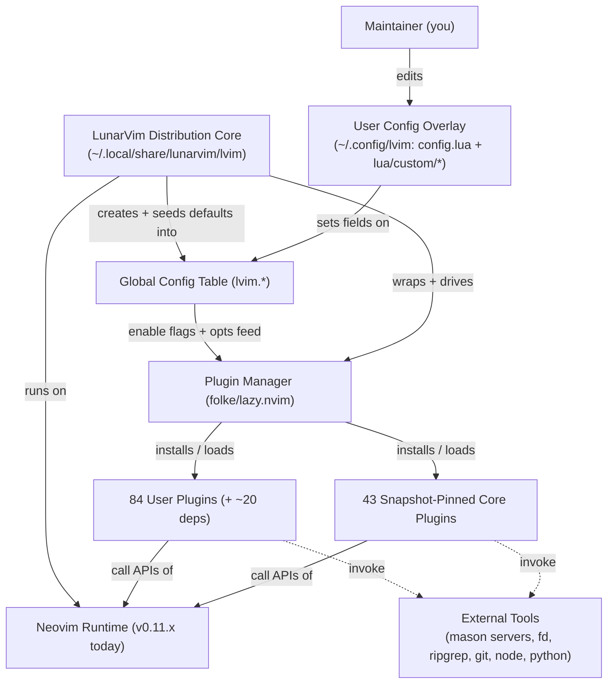
```mermaid
%% System context: who talks to whom around this LunarVim install.
%% Descriptive names are used for every node.
flowchart TD
    User["Maintainer (you)"]
    UserCfg["User Config Overlay<br/>(~/.config/lvim: config.lua + lua/custom/*)"]
    Distro["LunarVim Distribution Core<br/>(~/.local/share/lunarvim/lvim)"]
    LvimTbl["Global Config Table (lvim.*)"]
    Lazy["Plugin Manager (folke/lazy.nvim)"]
    CorePins["43 Snapshot-Pinned Core Plugins"]
    UserPlugins["84 User Plugins (+ ~20 deps)"]
    Nvim["Neovim Runtime (v0.11.x today)"]
    ExtTools["External Tools<br/>(mason servers, fd, ripgrep, git, node, python)"]

    User -->|"edits"| UserCfg
    UserCfg -->|"sets fields on"| LvimTbl
    Distro -->|"creates + seeds defaults into"| LvimTbl
    Distro -->|"wraps + drives"| Lazy
    LvimTbl -->|"enable flags + opts feed"| Lazy
    Lazy -->|"installs / loads"| CorePins
    Lazy -->|"installs / loads"| UserPlugins
    CorePins -->|"call APIs of"| Nvim
    UserPlugins -->|"call APIs of"| Nvim
    Distro -->|"runs on"| Nvim
    CorePins -.->|"invoke"| ExtTools
    UserPlugins -.->|"invoke"| ExtTools
```

**Explanation.** You edit only the *User Config Overlay*; both the overlay and the
frozen *Distribution Core* write into the single `lvim.*` table, which in turn
drives `lazy.nvim`. `lazy.nvim` installs and lazy-loads two disjoint plugin sets
(pinned core vs. user), and every plugin ultimately calls into the Neovim runtime.
The recurring upgrade pain lives on the two solid edges into *Neovim Runtime*: the
frozen core assumes old APIs, while newer user plugins assume new ones — and both
must satisfy the *same* Neovim binary.

## I.2 Layered Architecture Overview

LunarVim is best understood as four stacked layers. Higher layers depend on lower
layers; configuration flows *down* (you set `lvim.*`, which configures plugins,
which call Neovim), while events flow *up* (Neovim fires events that lazy-load
plugins, which update the UI).

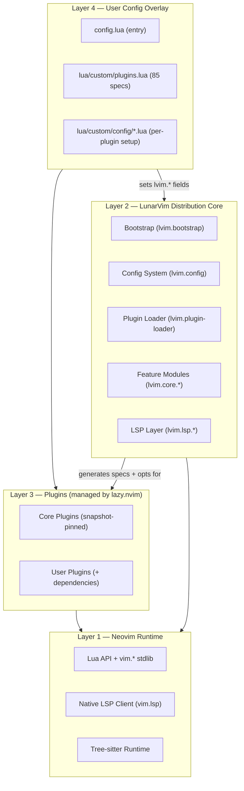
```mermaid
%% Four-layer view of the running system.
flowchart TD
    subgraph L4["Layer 4 — User Config Overlay"]
        direction LR
        Cfg["config.lua (entry)"]
        Custom["lua/custom/plugins.lua (85 specs)"]
        CustomCfg["lua/custom/config/*.lua (per-plugin setup)"]
    end
    subgraph L3["Layer 3 — Plugins (managed by lazy.nvim)"]
        direction LR
        Core["Core Plugins (snapshot-pinned)"]
        UsrP["User Plugins (+ dependencies)"]
    end
    subgraph L2["Layer 2 — LunarVim Distribution Core"]
        direction LR
        BootMod["Bootstrap (lvim.bootstrap)"]
        ConfMod["Config System (lvim.config)"]
        LoaderMod["Plugin Loader (lvim.plugin-loader)"]
        CoreMods["Feature Modules (lvim.core.*)"]
        LspMods["LSP Layer (lvim.lsp.*)"]
    end
    subgraph L1["Layer 1 — Neovim Runtime"]
        direction LR
        NvimApi["Lua API + vim.* stdlib"]
        NativeLsp["Native LSP Client (vim.lsp)"]
        Ts["Tree-sitter Runtime"]
    end

    L4 --> L3
    L4 -->|"sets lvim.* fields"| L2
    L2 -->|"generates specs + opts for"| L3
    L2 --> L1
    L3 --> L1
```

**Explanation.** Layer 2 (the LunarVim core) is the "kernel" of the distro: it
constructs the `lvim` table, wraps `lazy.nvim`, and configures the built-in feature
set and LSP. Layer 4 (your overlay) is intentionally thin — it mutates `lvim.*` and
adds `lazy` specs. Crucially, **Layer 2 and Layer 3 both bind directly to Layer 1**;
that dual binding is why a Neovim upgrade can break the frozen core *and* why old
pinned plugins can lag behind new user plugins on the same runtime.

Layer responsibilities in tabular form:

```
Layer  | Name                    | Owns / Responsibility                                   | Neovim-version exposure
-------+-------------------------+---------------------------------------------------------+-------------------------
L1     | Neovim Runtime          | Lua API, vim.* stdlib, native LSP client, tree-sitter   | Defines the API contract
L2     | LunarVim Core           | Bootstrap, lvim table, plugin-loader, core+LSP modules  | HIGH (assumes 0.10-era API)
L3     | Plugins (via lazy.nvim) | Actual features; install/version/lazy-load lifecycle    | MIXED (pinned old vs new)
L4     | User Config Overlay     | config.lua + custom plugin specs + per-plugin setup     | LOW (declarative; delegates)
```

## I.3 Startup & Bootstrap Sequence

When you launch `lvim`, control passes through a precise, ordered chain. The entry
point is `~/.local/share/lunarvim/lvim/init.lua` (26 lines), which orchestrates the
whole boot. The sequence below traces it end to end.

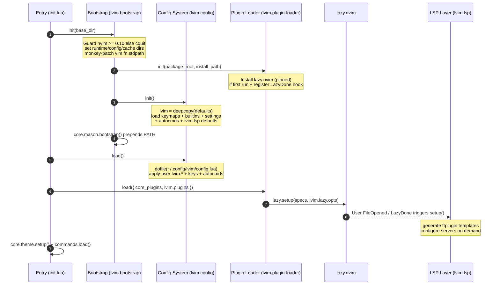
```mermaid
%% Startup sequence from the lvim entry point to a ready editor.
sequenceDiagram
    autonumber
    participant Entry as Entry (init.lua)
    participant Boot as Bootstrap (lvim.bootstrap)
    participant Conf as Config System (lvim.config)
    participant Loader as Plugin Loader (lvim.plugin-loader)
    participant Lazy as lazy.nvim
    participant Lsp as LSP Layer (lvim.lsp)

    Entry->>Boot: init(base_dir)
    Note over Boot: Guard nvim >= 0.10 else cquit<br/>set runtime/config/cache dirs<br/>monkey-patch vim.fn.stdpath
    Boot->>Loader: init(package_root, install_path)
    Note over Loader: Install lazy.nvim (pinned)<br/>if first run + register LazyDone hook
    Boot->>Conf: init()
    Note over Conf: lvim = deepcopy(defaults)<br/>load keymaps + builtins + settings<br/>+ autocmds + lvim.lsp defaults
    Boot->>Boot: core.mason.bootstrap() prepends PATH
    Entry->>Conf: load()
    Note over Conf: dofile(~/.config/lvim/config.lua)<br/>apply user lvim.* + keys + autocmds
    Entry->>Loader: load({ core_plugins, lvim.plugins })
    Loader->>Lazy: lazy.setup(specs, lvim.lazy.opts)
    Lazy-->>Lsp: User FileOpened / LazyDone triggers setup()
    Note over Lsp: generate ftplugin templates<br/>configure servers on demand
    Entry->>Entry: core.theme.setup() + commands.load()
```

**Explanation.** Two phases matter most. First, `bootstrap:init()`
(`.../lvim/lua/lvim/bootstrap.lua:59`) establishes the environment *and* builds the
`lvim` table via `config:init()` **before** any user code runs. Second,
`config:load()` (`.../lvim/lua/lvim/config/init.lua:48`) `dofile`s your
`~/.config/lvim/config.lua`, so your overrides land on top of fully-populated
defaults. Plugins are handed to `lazy.setup` last, and the **LSP layer is deferred**
— it is wired to the `User FileOpened` autocmd / `LazyDone` event rather than run at
startup, which is why LSP configuration errors (like the venv-selector/ccls issues)
surface a beat after the dashboard appears.

**Summary of the participants in the startup sequence:**

```
Participant (alias)          | Module / file              | Role in startup
-----------------------------+----------------------------+----------------------------------------------
Entry (init.lua)             | lvim/init.lua              | Repo-root entry; orchestrates the boot chain
Bootstrap (lvim.bootstrap)   | lvim/bootstrap.lua         | Env dirs, nvim>=0.10 guard, stdpath patch, seed lvim
Config System (lvim.config)  | lvim/config/init.lua       | init() builds lvim table; load() dofiles user config
Plugin Loader                | lvim/plugin-loader.lua     | Installs lazy.nvim; hands specs to lazy.setup
lazy.nvim                    | folke/lazy.nvim            | Installs + lazy-loads plugins; fires load events
LSP Layer (lvim.lsp)         | lvim/lsp/init.lua          | Deferred LSP setup on User FileOpened / LazyDone
```

Step-by-step, with source anchors:

```
Step | Call site (init.lua)              | Effect
-----+-----------------------------------+--------------------------------------------------
1    | require("lvim.bootstrap"):init()  | env dirs, stdpath patch, lazy install, lvim table
2    | require("lvim.config"):load()     | dofile user config.lua; apply overrides
3    | require "lvim.plugins"            | build the 43-spec core plugin list (+ snapshot pin)
4    | plugin-loader.load{core, user}    | lazy.setup(specs, lvim.lazy.opts)
5    | core.theme.setup()                | apply colorscheme
6    | core.log + commands.load()        | logger ready; register :Lvim* commands
```

## I.4 Module Map & Directory Structure

The distribution core lives entirely under
`~/.local/share/lunarvim/lvim/lua/lvim/`. The tree below shows the functional
grouping (abridged to the significant modules).

```
lua/lvim/
  bootstrap.lua            env setup, nvim>=0.10 guard, stdpath patch, lazy install
  plugins.lua              43 core plugin specs + snapshot commit pinning
  plugin-loader.lua        thin wrapper over lazy.nvim (init/load/reload/sync)
  keymappings.lua          default key bindings
  icons.lua                icon set (lvim.icons)
  config/
    init.lua               lvim table lifecycle: init(), load(), reload()
    defaults.lua           static lvim.* defaults (leader, colorscheme, lazy.opts)
    settings.lua           ~40 vim.opt options + vim.diagnostic.config
    _deprecated.lua        back-compat metatables + spec key migration
  core/
    builtins/init.lua      fan-out that .config()s all 19 builtin feature modules
    telescope.lua          fuzzy finder defaults + pickers
    treesitter.lua         parser install/highlight/indent
    cmp.lua                nvim-cmp completion engine
    dap.lua                nvim-dap debugging + UI
    lualine/               statusline (init, components, styles, ...)
    bufferline.lua         buffer/tab line + buf_kill
    nvimtree.lua / lir.lua file explorers
    which-key.lua          leader menu
    gitsigns.lua           git gutter
    alpha.lua              start dashboard
    terminal.lua           toggleterm integration
    mason.lua              tool installer config + PATH bootstrap
    autocmds.lua           default autocmds + format-on-save/reload helpers
    commands.lua           :Lvim* user commands
    log.lua                structlog logger singleton (Log)
    info.lua               :LvimInfo popup
    theme.lua              colorscheme application
    project.lua breadcrumbs.lua illuminate.lua indentlines.lua comment.lua autopairs.lua
  lsp/
    init.lua               setup(): handlers, borders, null-ls, templates
    manager.lua            per-server setup via lspconfig framework API + mason
    utils.lua              client queries, doc-highlight, codelens, format filter
    config.lua             lvim.lsp.* defaults (mappings, installer, null_ls)
    templates.lua          generates ftplugin/<ft>.lua stubs -> manager.setup
    null-ls/               none-ls sources (formatters, linters, code_actions)
    providers/             per-server overrides (lua_ls, jsonls, yamlls, ...)
  interface/               popup.lua and shared UI helpers
  utils/
    modules.lua            require_clean/require_safe/reload primitives
    hooks.lua              pre/post update + reload lifecycle hooks
    git.lua                git ops via plenary.job
    table.lua              find_first / contains
  utils.lua                fs helpers on vim.loop + join_paths + settings dump
```

The responsibility summary for the most load-bearing modules (aggregated from the
core study):

```
Module                       | Responsibility (one line)
-----------------------------+-----------------------------------------------------------
lvim.bootstrap               | Set up dirs/rtp, guard nvim version, install lazy, seed lvim
lvim.config.init             | Create/populate/load/reload the global lvim table
lvim.config.defaults         | Static default values incl. lvim.lazy.opts
lvim.config.settings         | Editor options (vim.opt) + diagnostics config
lvim.plugin-loader           | Wrap lazy.nvim: init/load/reload/sync core plugins
lvim.plugins                 | Declare + snapshot-pin the 43 core plugins
lvim.core.builtins.init      | Call .config() on all 19 builtin feature modules
lvim.core.<feature>          | Configure one built-in plugin + seed its lvim.builtin.* key
lvim.lsp.init                | Global LSP setup: handlers, borders, null-ls, templates
lvim.lsp.manager             | Resolve + launch each server (lspconfig framework + mason)
lvim.lsp.utils               | LSP client queries, doc highlight, codelens, format filter
lvim.utils.modules           | Clean require + in-place module reload primitives
lvim.core.log                | structlog-based logger singleton used across the core
```

## I.5 The `lvim` Global Configuration Model

The single most important design decision in LunarVim is that **all configuration
is one global Lua table named `lvim`**. It is created by
`config:init()` as `lvim = vim.deepcopy(require "lvim.config.defaults")`
(`.../lvim/lua/lvim/config/init.lua:16`), then progressively enriched by the
builtins, settings, autocmds, and LSP defaults. Your `config.lua` simply mutates
fields on this table. The class-style diagram below captures its structure and the
sub-tables that matter.

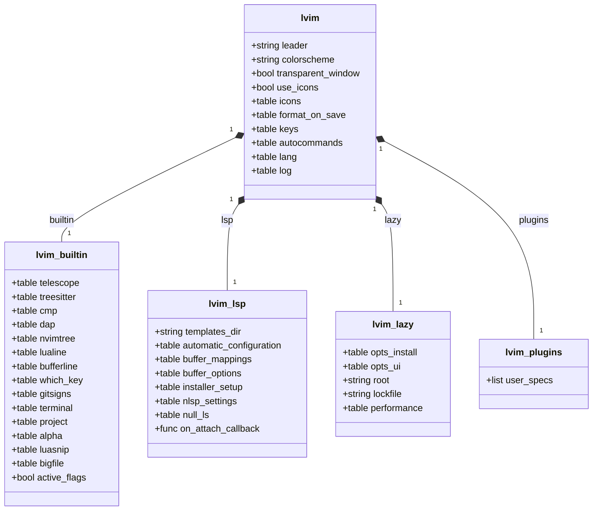
```mermaid
%% Structure of the global lvim configuration table.
classDiagram
    class lvim {
        +string leader
        +string colorscheme
        +bool transparent_window
        +bool use_icons
        +table icons
        +table format_on_save
        +table keys
        +table autocommands
        +table lang
        +table log
    }
    class lvim_builtin {
        +table telescope
        +table treesitter
        +table cmp
        +table dap
        +table nvimtree
        +table lualine
        +table bufferline
        +table which_key
        +table gitsigns
        +table terminal
        +table project
        +table alpha
        +table luasnip
        +table bigfile
        +bool  active_flags
    }
    class lvim_lsp {
        +string templates_dir
        +table automatic_configuration
        +table buffer_mappings
        +table buffer_options
        +table installer_setup
        +table nlsp_settings
        +table null_ls
        +func  on_attach_callback
    }
    class lvim_lazy {
        +table opts_install
        +table opts_ui
        +string root
        +string lockfile
        +table performance
    }
    class lvim_plugins {
        +list user_specs
    }

    lvim "1" *-- "1" lvim_builtin : builtin
    lvim "1" *-- "1" lvim_lsp : lsp
    lvim "1" *-- "1" lvim_lazy : lazy
    lvim "1" *-- "1" lvim_plugins : plugins
```

**Summary of the classes (config sub-tables) in the diagram above:**

```
Sub-table (class)   | Field path      | Purpose                                          | Seeded by
--------------------+-----------------+--------------------------------------------------+-----------------------------
lvim                | lvim            | Root config surface (leader, colorscheme, keys)  | config/defaults.lua
lvim_builtin        | lvim.builtin    | Per-feature config + .active enable flags        | core/builtins/init.lua (19 mods)
lvim_lsp            | lvim.lsp        | LSP mappings, installer, null-ls, callbacks      | lsp/config.lua (deepcopy)
lvim_lazy           | lvim.lazy.opts  | lazy.nvim options (root, lockfile, ui, perf)     | config/defaults.lua
lvim_plugins        | lvim.plugins    | User extra plugin specs (empty by default)       | user config.lua
```

**Explanation.** The `enabled = lvim.builtin.<x>.active` guards in the core plugin
list (Section I.6) are read directly from `lvim_builtin`, so toggling a feature is a
one-line assignment in `config.lua`. `lvim_lsp` is the surface you use for LSP
behavior (keymaps on attach, servers to skip, formatting). `lvim_lazy.opts` is
passed verbatim to `lazy.setup`. This "one big table" model is powerful for quick
tweaks but is also the **tightest coupling point to the distro** — it is a bespoke
API with no equivalent outside LunarVim, which matters greatly for Part II's
migration analysis.

## I.6 Plugin Management Layer (lazy.nvim wrapping + snapshot pinning)

LunarVim does **not** reimplement plugin management; it wraps `folke/lazy.nvim`.
The wrapper (`.../lvim/lua/lvim/plugin-loader.lua`) installs lazy (pinned to a
snapshot commit), fixes up `runtimepath`, then calls
`lazy.setup({ core_plugins, lvim.plugins }, lvim.lazy.opts)`. The distinguishing
behavior is **snapshot pinning of core plugins**: unless `LVIM_DEV_MODE` is set,
every core spec's `commit` is overwritten from `snapshots/default.json`
(`.../lvim/lua/lvim/plugins.lua:378`).

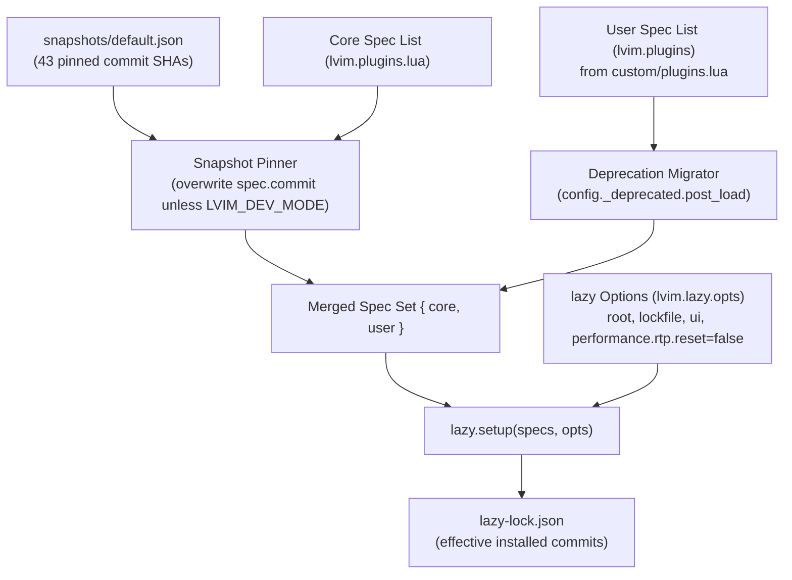
```mermaid
%% How core and user plugin specs are merged and pinned before lazy.setup.
flowchart TD
    Snap["snapshots/default.json<br/>(43 pinned commit SHAs)"]
    CoreList["Core Spec List (lvim.plugins.lua)"]
    Pinner["Snapshot Pinner<br/>(overwrite spec.commit unless LVIM_DEV_MODE)"]
    UserList["User Spec List (lvim.plugins)<br/>from custom/plugins.lua"]
    Depr["Deprecation Migrator<br/>(config._deprecated.post_load)"]
    Merge["Merged Spec Set { core, user }"]
    Opts["lazy Options (lvim.lazy.opts)<br/>root, lockfile, ui, performance.rtp.reset=false"]
    LazySetup["lazy.setup(specs, opts)"]
    Lockfile["lazy-lock.json<br/>(effective installed commits)"]

    Snap --> Pinner
    CoreList --> Pinner
    Pinner --> Merge
    UserList --> Depr --> Merge
    Merge --> LazySetup
    Opts --> LazySetup
    LazySetup --> Lockfile
```

**Explanation.** Two independent pinning mechanisms coexist, and their interaction
is a real gotcha:

1. **Core plugins** are pinned *in code* by the snapshot (authoritative for the
   distro's own 43 plugins).
2. **User plugins** are pinned by `lazy-lock.json` plus any per-spec
   `commit`/`version`/`branch` you write.

When these disagree, the spec wins on the next `:Lazy sync` but the lockfile can go
stale in between. This is exactly the **`ccls.nvim` discrepancy** discovered in the
catalog: `custom/plugins.lua` pins `commit = de925cad...` (the last pre-0.12 commit)
while `lazy-lock.json` still records `85aed539...`. Until `:Lazy sync`/`restore`
runs, lazy may keep the newer, 0.12-requiring commit checked out, defeating the pin.
`performance.rtp.reset = false` also tells lazy *not* to manage the runtimepath —
LunarVim does that itself in the loader.

## I.7 LSP Subsystem Deep Dive

The LSP subsystem is the architectural heart of LunarVim — and the component most
tightly bound to specific plugin versions. Rather than call `vim.lsp.config()` /
`vim.lsp.enable()` (the native framework introduced in Neovim 0.11), LunarVim uses
the classic **`nvim-lspconfig` framework API** (`require("lspconfig")[server].setup`)
combined with **mason-lspconfig v1 internals**. Servers are configured lazily via
generated `ftplugin` stubs.

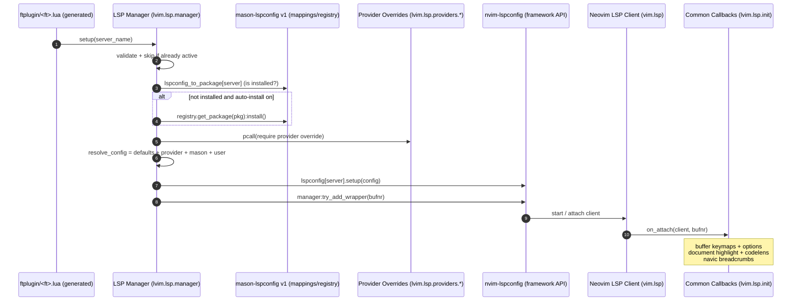
```mermaid
%% Collaboration/sequence for configuring one language server on file open.
sequenceDiagram
    autonumber
    participant FT as ftplugin/<ft>.lua (generated)
    participant Mgr as LSP Manager (lvim.lsp.manager)
    participant MasonLsp as mason-lspconfig v1 (mappings/registry)
    participant Providers as Provider Overrides (lvim.lsp.providers.*)
    participant LspCfg as nvim-lspconfig (framework API)
    participant Client as Neovim LSP Client (vim.lsp)
    participant OnAttach as Common Callbacks (lvim.lsp.init)

    FT->>Mgr: setup(server_name)
    Mgr->>Mgr: validate + skip if already active
    Mgr->>MasonLsp: lspconfig_to_package[server] (is installed?)
    alt not installed and auto-install on
        Mgr->>MasonLsp: registry.get_package(pkg):install()
    end
    Mgr->>Providers: pcall(require provider override)
    Mgr->>Mgr: resolve_config = defaults + provider + mason + user
    Mgr->>LspCfg: lspconfig[server].setup(config)
    Mgr->>LspCfg: manager:try_add_wrapper(bufnr)
    LspCfg->>Client: start / attach client
    Client->>OnAttach: on_attach(client, bufnr)
    Note over OnAttach: buffer keymaps + options<br/>document highlight + codelens<br/>navic breadcrumbs
```

**Summary of the participants in the LSP-setup collaboration** (1:1 with the seven
lifelines in the diagram above):

```
Participant (alias)               | Module / file                 | Role in the collaboration
----------------------------------+-------------------------------+-----------------------------------------
ftplugin/<ft>.lua (FT)            | site/after/ftplugin/<ft>.lua  | Generated stub; calls manager.setup(server) on file open
LSP Manager (Mgr)                 | lvim/lsp/manager.lua          | Resolve config + launch server via lspconfig framework
mason-lspconfig v1 (MasonLsp)     | mason-lspconfig (mappings/reg)| Map server->package; drive auto-install via registry
Provider Overrides (Providers)    | lvim/lsp/providers/*.lua      | Per-server config (lua_ls, jsonls, yamlls, tailwind, vue)
nvim-lspconfig framework (LspCfg) | neovim/nvim-lspconfig         | lspconfig[server].setup + try_add_wrapper (framework API)
Neovim LSP Client (Client)        | vim.lsp (core)                | Start/attach the language server client
Common Callbacks (OnAttach)       | lvim/lsp/init.lua             | on_attach: keymaps, options, highlight, codelens, navic
```

Supporting collaborators not drawn as separate lifelines: `lvim/lsp/utils.lua`
(client queries, format filter), `lvim/lsp/config.lua` (`lvim.lsp.*` defaults),
`lvim/lsp/templates.lua` (generates the ftplugin stubs), `lvim/lsp/null-ls/*.lua`
(none-ls sources), and `lvim/core/mason.lua` (installer + PATH bootstrap).

**Explanation.** The **config resolution order** for any server is a layered
`vim.tbl_deep_extend("force", ...)` merge, later layers overriding earlier ones:

```
Priority (low -> high) | Source                                   | Set where
-----------------------+------------------------------------------+-------------------------------
1 (base)               | on_attach/on_init/on_exit/capabilities   | lvim.lsp.init.get_common_opts
2                      | provider override (if present)           | lvim/lsp/providers/<server>.lua
3                      | mason-resolved config                    | mason-lspconfig server config
4 (highest)            | user_config passed to manager.setup      | ftplugin stub / user code
```

This design is elegant but **couples LunarVim to APIs that newer versions removed**:
`lspconfig[server].setup(...)` and `manager:try_add_wrapper` (framework API),
`lspconfig.server_configurations.*` (moved/removed), and mason-lspconfig v1's
`mappings.server` / `mappings.filetype` / `get_available_servers` (rewritten in
mason-lspconfig 2.x). These are enumerated with line numbers in Section I.10 and are
the primary reason the whole core is snapshot-pinned to 2024-era plugins.

## I.8 Plugin Ecosystem Catalog

Verifiable figures from this repo: **85** top-level plugin declarations in
`custom/plugins.lua` (**84 unique** — `powerman/vim-plugin-AnsiEsc` is declared
twice) plus **~20** dependency-only plugins, and **132** total entries in
`lazy-lock.json`. Separately, LunarVim contributes **43** snapshot-pinned core
plugins from its *own* default snapshot (`snapshots/default.json`, not this repo's
files); the core and user sets overlap where a user re-declaration (e.g.
`nvim-treesitter`, `nvim-lspconfig`) merges into a single lock entry, so the three
figures are not additive. The user plugins group into the functional categories
below (some plugins legitimately span two categories and are cross-listed).

```
Category                          | Count | Representative members
----------------------------------+-------+--------------------------------------------------
Core / Library                    |   7   | plenary, nui, sqlite.lua, web-devicons, guihua, middleclass
LSP & Completion / Formatting     |  12   | lspsaga, ccls.nvim, none-ls, glance, outline, neodev, formatter, nvim-cmp, LuaSnip
Treesitter / Syntax               |   6   | nvim-treesitter, playground, ts-context, cpp-tools, rainbow-delimiters, vim-matchup
Fuzzy-finding / Telescope + ext   |  10   | telescope + file-browser/ui-select/smart-history/live-grep-args/symbols/frecency/undo, mini.pick, fzf-lua
File-explorer / Project / Session |   2   | lf.nvim, possession.nvim
Git                               |   3   | lazygit, vim-fugitive, diffview
UI / Aesthetics / Colorscheme     |  13   | catppuccin, colorizer, dressing, nvim-notify, smear-cursor, marks, vessel, windows.nvim
Editing / Motions / Text-objects  |  17   | nvim-surround, flash, expand-region, move, cutlass, yanky, visual-multi, easy-align, undotree
Debugging / DAP + adapters        |   5   | nvim-dap, dap-python, dap-virtual-text, dap-vscode-js, vscode-js-debug
Testing                           |   2   | neotest, neotest-python
Language-specific                 |  24   | venv-selector, uv, typescript-tools, go.nvim, rustaceanvim, nvim-jdtls, flutter-tools, quarto, otter
AI / Assistants                   |   3   | avante.nvim, copilot.lua, img-clip
Terminal / Tools                  |   7   | tmux.nvim, toggleterm, grug-far, translate, bufferize, AnsiEsc
```

The mindmap below gives a visual overview of the ecosystem's shape.

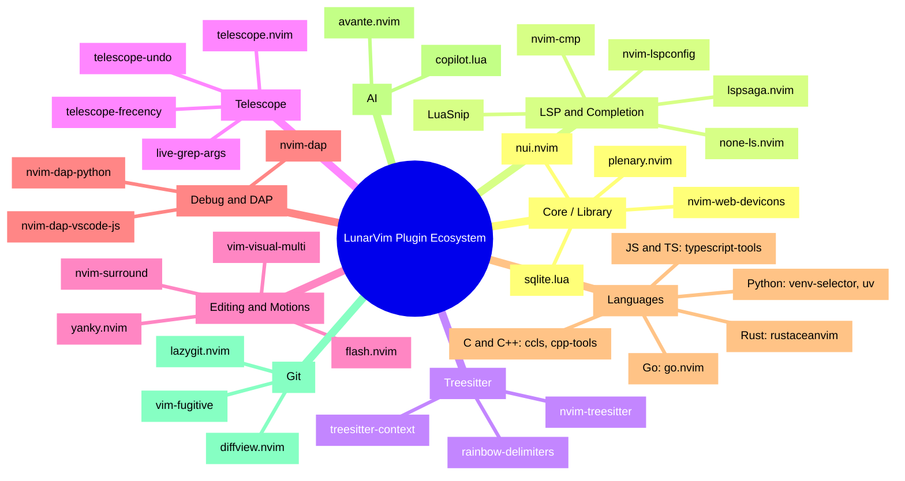
```mermaid
%% High-level mindmap of the plugin ecosystem categories.
%% All node text is double-quoted per the document conventions.
mindmap
  root(("LunarVim Plugin Ecosystem"))
    cat1["Core / Library"]
      n01["plenary.nvim"]
      n02["nui.nvim"]
      n03["sqlite.lua"]
      n04["nvim-web-devicons"]
    cat2["LSP and Completion"]
      n05["nvim-lspconfig"]
      n06["lspsaga.nvim"]
      n07["none-ls.nvim"]
      n08["nvim-cmp"]
      n09["LuaSnip"]
    cat3["Treesitter"]
      n10["nvim-treesitter"]
      n11["treesitter-context"]
      n12["rainbow-delimiters"]
    cat4["Telescope"]
      n13["telescope.nvim"]
      n14["telescope-frecency"]
      n15["live-grep-args"]
      n16["telescope-undo"]
    cat5["Editing and Motions"]
      n17["nvim-surround"]
      n18["flash.nvim"]
      n19["yanky.nvim"]
      n20["vim-visual-multi"]
    cat6["Debug and DAP"]
      n21["nvim-dap"]
      n22["nvim-dap-python"]
      n23["nvim-dap-vscode-js"]
    cat7["Languages"]
      l1["Python: venv-selector, uv"]
      l2["JS and TS: typescript-tools"]
      l3["Go: go.nvim"]
      l4["Rust: rustaceanvim"]
      l5["C and C++: ccls, cpp-tools"]
    cat8["AI"]
      a1["avante.nvim"]
      a2["copilot.lua"]
    cat9["Git"]
      g1["lazygit.nvim"]
      g2["vim-fugitive"]
      g3["diffview.nvim"]
```

**Explanation.** Two structural notes fall out of the catalog. First, a large share
of plugins are *hosts or dependents* of a handful of shared libraries (Section I.9),
so the true dependency surface is smaller than 132 independent items. Second, the
config is **language-heavy** (24 language-specific plugins across Python, JS/TS, Go,
Rust, C/C++, Java, Dart, Quarto, Markdown, PlantUML), which means the LSP/DAP
subsystems are the highest-value and highest-risk areas for any upgrade.

Two catalog anomalies worth fixing regardless of the upgrade decision:

- **Duplicate declaration:** `powerman/vim-plugin-AnsiEsc` is declared twice
  (`custom/plugins.lua:494` as `lazy=false` and `:1269` as `lazy=true, cmd=AnsiEsc`).
  lazy.nvim merges them, but the intent is ambiguous; keep one.
- **Stale lock vs. pin:** `ccls.nvim` spec pins `de925cad...` but `lazy-lock.json`
  records `85aed539...` — run `:Lazy sync` so the 0.11-safe commit is actually used.

## I.9 Inter-Plugin Dependency Graph

Most of the ecosystem hangs off a small number of shared libraries and host
plugins. The graph below shows the principal "host to dependents" relationships
(edges point from a library/host to the plugins that require it).

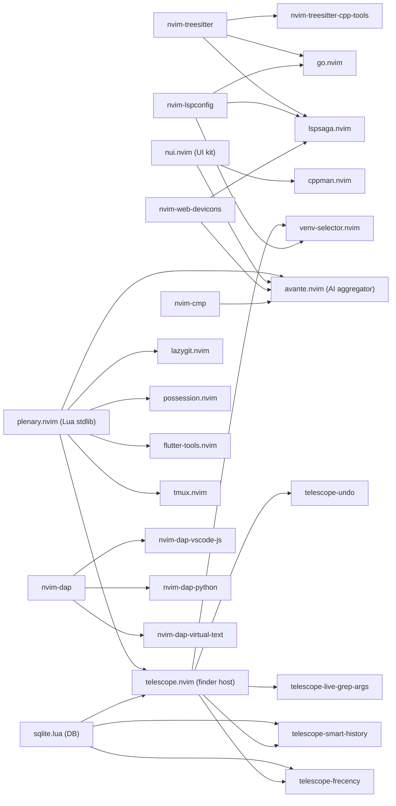
```mermaid
%% Principal shared-library / host dependency relationships.
flowchart LR
    Plenary["plenary.nvim (Lua stdlib)"]
    Telescope["telescope.nvim (finder host)"]
    Sqlite["sqlite.lua (DB)"]
    Treesitter["nvim-treesitter"]
    Lspconfig["nvim-lspconfig"]
    Dap["nvim-dap"]
    Nui["nui.nvim (UI kit)"]
    Cmp["nvim-cmp"]
    Devicons["nvim-web-devicons"]
    Avante["avante.nvim (AI aggregator)"]

    Plenary --> Telescope
    Plenary --> Avante
    Plenary --> Lazygit["lazygit.nvim"]
    Plenary --> Possession["possession.nvim"]
    Plenary --> Flutter["flutter-tools.nvim"]
    Plenary --> Tmux["tmux.nvim"]

    Sqlite --> Telescope
    Sqlite --> Frecency["telescope-frecency"]
    Sqlite --> SmartHist["telescope-smart-history"]

    Telescope --> Frecency
    Telescope --> SmartHist
    Telescope --> LiveGrep["telescope-live-grep-args"]
    Telescope --> TeleUndo["telescope-undo"]
    Telescope --> Venv["venv-selector.nvim"]

    Treesitter --> Lspsaga["lspsaga.nvim"]
    Treesitter --> CppTools["nvim-treesitter-cpp-tools"]
    Treesitter --> Go["go.nvim"]

    Lspconfig --> Venv
    Lspconfig --> Go
    Lspconfig --> Lspsaga

    Dap --> DapVscodeJs["nvim-dap-vscode-js"]
    Dap --> DapPython["nvim-dap-python"]
    Dap --> DapVt["nvim-dap-virtual-text"]

    Nui --> Cppman["cppman.nvim"]
    Nui --> Avante
    Devicons --> Lspsaga
    Devicons --> Avante
    Cmp --> Avante
```

**Explanation.** `plenary.nvim` and `telescope.nvim` are the two heaviest hubs — a
breaking change in either ripples widely. `nvim-lspconfig`, `nvim-treesitter`, and
`nvim-dap` are the three "framework" hosts whose *version* dictates whether the
language plugins work. Finally, **`avante.nvim` is an aggregator**: it pulls in
`plenary`, `nui`, `nvim-cmp`, `telescope`/`mini.pick`/`fzf-lua`, `copilot`,
`img-clip`, and `render-markdown`. That single plugin therefore carries an outsized
share of the config's total dependency weight and is worth special attention on any
upgrade.

## I.10 Neovim Version Dependency Analysis

This section quantifies the "version tension" introduced in I.1: the frozen core
assumes pre-0.11 APIs, while several user plugins assume 0.11+/0.12 APIs — on the
*same* Neovim binary.

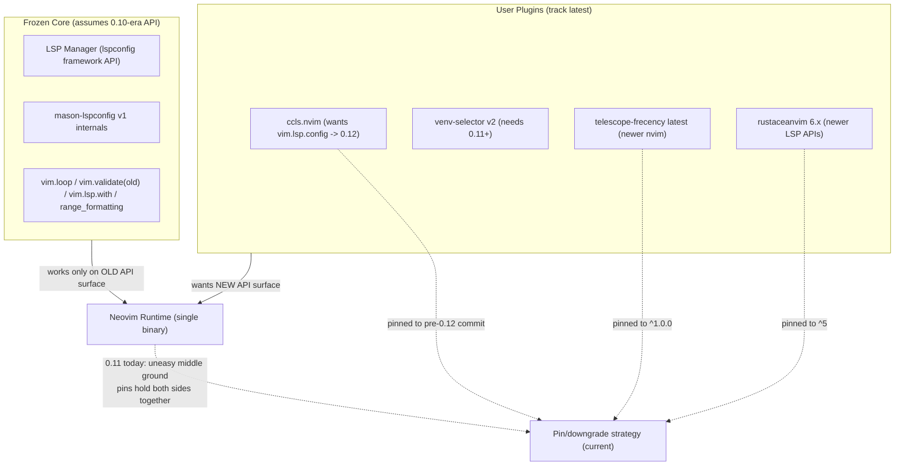
```mermaid
%% The central version tension: one runtime, two opposing expectations.
flowchart TD
    Nvim["Neovim Runtime (single binary)"]

    subgraph FrozenCore["Frozen Core (assumes 0.10-era API)"]
        LspMgr["LSP Manager (lspconfig framework API)"]
        MasonV1["mason-lspconfig v1 internals"]
        OldApis["vim.loop / vim.validate(old) / vim.lsp.with / range_formatting"]
    end

    subgraph UserEdge["User Plugins (track latest)"]
        Ccls["ccls.nvim (wants vim.lsp.config -> 0.12)"]
        Venv["venv-selector v2 (needs 0.11+)"]
        Rust["rustaceanvim 6.x (newer LSP APIs)"]
        Frec["telescope-frecency latest (newer nvim)"]
    end

    FrozenCore -->|"works only on OLD API surface"| Nvim
    UserEdge -->|"wants NEW API surface"| Nvim
    Nvim -.->|"0.11 today: uneasy middle ground<br/>pins hold both sides together"| Resolve["Pin/downgrade strategy (current)"]

    Ccls -.->|"pinned to pre-0.12 commit"| Resolve
    Frec -.->|"pinned to ^1.0.0"| Resolve
    Rust -.->|"pinned to ^5"| Resolve
```

**Explanation.** Neovim 0.11 is the *widest overlap* where both sides mostly work,
which is precisely why the current strategy targets it. The pins (dashed edges into
"Pin/downgrade strategy") are the glue. Upgrading Neovim narrows the overlap: it
pushes the runtime toward the "new API surface" that user plugins want, but away
from the "old API surface" the frozen core depends on.

### Table A — LunarVim core: version-sensitive Neovim API usage

Removed/hard-breaking first, then deprecations (warn now, removal later). All paths
are under `~/.local/share/lunarvim/lvim/`.

```
#  | API / pattern                                            | Location (file:line)                       | Status / removal      | Replacement
---+----------------------------------------------------------+--------------------------------------------+-----------------------+-------------------------------
1  | vim.lsp.buf.range_formatting(...)                        | lua/lvim/lsp/providers/jsonls.lua:11       | REMOVED in 0.11       | vim.lsp.buf.format({range=...})
2  | lspconfig[server].setup / manager:try_add_wrapper        | lua/lvim/lsp/manager.lua:85,55             | framework API dropped | vim.lsp.config()/enable()
3  | require("lspconfig.server_configurations."..name)        | lua/lvim/lsp/manager.lua:77; utils.lua:46  | moved/removed         | vim.lsp.config / runtime lsp/
4  | mason-lspconfig v1 mappings/get_available_servers/settings| lua/lvim/lsp/manager.lua:9,14,101; utils.lua:63,71; plugins.lua:16 | rewritten in 2.x | mason-lspconfig 2.x API
5  | lspconfig.util.default_config / add_hook_before          | lua/lvim/lsp/providers/lua_ls.lua:42,31    | framework internals   | native config merge
6  | vim.validate { name = { x, "string" } } (old form)       | lua/lvim/lsp/manager.lua:94                | deprecated 0.11       | vim.validate("name", x, "string")
7  | vim.tbl_flatten                                          | lua/lvim/lsp/null-ls/linters.lua:17; core/telescope/custom-finders.lua:61 | deprecated | vim.iter(x):flatten():totable()
8  | vim.highlight.on_yank                                     | lua/lvim/core/autocmds.lua:14              | deprecated 0.11       | vim.hl.on_yank
9  | vim.lsp.with + vim.lsp.handlers[...]                      | lua/lvim/lsp/init.lua:116-122              | deprecated 0.11       | vim.lsp.buf.hover({border=...})
10 | client.supports_method "m" (dot-call)                    | lua/lvim/lsp/utils.lua:84,117,130,169      | soft-deprecated 0.11  | client:supports_method(m, opts)
11 | vim.loop (alias)                                          | bootstrap.lua:12; utils.lua:2; config/init.lua:63; manager.lua:6 (+more) | soft-deprecated | vim.uv
12 | vim.fn.sign_define for diagnostics                        | lua/lvim/lsp/init.lua:99; core/dap.lua:107 | superseded            | vim.diagnostic.config({signs={text=}})
```

Positive note (avoids over-flagging): the core already uses the *modern*
`vim.lsp.get_clients()` (`lsp/utils.lua:7,15`; `core/info.lua:129`),
`vim.api.nvim_get_hl`, and `vim.api.nvim_set_option_value` — so it is partway
migrated. Items 2-5 (the LSP framework coupling) are the genuinely hard blockers;
items 6-12 are warnings that still function on 0.11/0.12.

### Table B — User plugins: Neovim-version pins & sensitivities

```
Plugin                         | Pin / state                        | Reason (nvim version)                         | Source
-------------------------------+------------------------------------+-----------------------------------------------+---------------------------------
ccls.nvim                      | commit de925cad (pre-0.12)         | newer commit needs vim.lsp.config -> 0.12     | custom/plugins.lua:400-405
telescope-frecency.nvim        | version "^1.0.0"                   | newer releases require newer nvim             | custom/plugins.lua:808; commit 97dba25
visual-whitespace.nvim         | branch "compat-v10"                | explicit 0.10-compat branch                   | custom/plugins.lua:1318
rustaceanvim                   | version "^5"                       | 6.x moves to newer LSP APIs                    | custom/plugins.lua:1013
venv-selector.nvim             | latest (v2/regex), NOT downgraded  | v2 needs only 0.11+ (verified)                | custom/config/venv-selector.lua:16
clangd (via native)            | native 0.11 LSP for clangd         | 0.11 native LSP good enough                    | custom/plugins.lua:2; cpp.lua
custom/config/lsp/init.lua     | multi-version inlay-hint shims     | straddles 0.10/0.11 signatures                 | custom/config/lsp/init.lua:18-34
```

**Explanation.** The user plugins fall into three buckets: (a) deliberately pinned
*back* for 0.11 (`ccls`, `frecency`, `visual-whitespace`, `rustaceanvim`); (b)
deliberately kept *current* because they already support 0.11 (`venv-selector` v2);
and (c) version-defensive shim code that already branches on the running Neovim
version (`custom/config/lsp/init.lua`). This mix is important for Part II: it means a
Neovim upgrade is *not* uniformly blocked — some plugins are ready, some are pinned
back and would need to move *forward*, and the frozen distro core is the single
largest fixed obstacle.

---

# Part II — Upgrading Neovim to the Latest Version

## II.1 Goals, Constraints, and Success Criteria

**Goal.** Move from Neovim `0.11.x` to the latest Neovim (stable is **0.12.3** as of
2026-07; nightly is `0.13-dev`) while keeping this configuration's features and,
ideally, ending the recurring "pin a plugin back so it works on 0.11" treadmill.

**Hard constraints.**
- No loss of the language tooling in use (Python, JS/TS, Go, Rust, C/C++, Java,
  Dart, Quarto/Markdown, PlantUML) — LSP, DAP, tests, formatting.
- A **safe, reversible** path: the working editor must not be bricked mid-migration.
- Keep the large, already-curated set of 84 user plugins wherever possible.

**Success criteria.**
1. `nvim --version` reports the target (0.12.x) and everything below is green in
   `:checkhealth`.
2. LSP attaches for every language above via the **native `vim.lsp.config`/`enable`**
   path (no reliance on the *deprecated* lspconfig framework API, nor on the
   *removed* mason-lspconfig v1 / `server_configurations` internals the LunarVim
   manager depends on).
3. Tree-sitter highlighting works on the **rewritten `nvim-treesitter` `main`**
   branch (required by 0.12+).
4. The previously back-pinned plugins (`ccls.nvim`, `telescope-frecency`,
   `visual-whitespace`, `rustaceanvim`) can move **forward** to current releases.
5. The base distribution is **actively maintained**, so future Neovim releases are
   somebody else's maintenance burden, not yours.

**The two facts that dominate the design (from the research):**

- **The forcing function for *reaching* 0.12 is `nvim-treesitter`.** Its maintained
  `main` branch is a full rewrite that **requires Neovim ≥ 0.12**; the old `master`
  branch is frozen and kept only for 0.11 compatibility. (That same treesitter split
  also broke LunarVim's *own* snapshot-pinned parser on newer 0.11.x patch releases —
  LunarVim issue #4656.) Any move to 0.12 *must* adopt the treesitter rewrite. Note
  this is **distinct** from the plugin breakage already seen on *this* machine, which
  came from plugins migrating to the 0.12-only `vim.lsp.config` API (`ccls.nvim`) plus
  a `venv-selector` config-schema change (commit `2c0b7ab`) — i.e. the LSP-API shift,
  not treesitter.
- **LunarVim is dormant; LazyVim is active and already runs on your 0.11.x today.**
  LazyVim requires only Neovim **≥ 0.11.2**, so it is not itself a reason to upgrade —
  it is a stable base you can adopt *before* touching the Neovim version, then ride
  forward to 0.12/0.13 as the ecosystem does.

## II.2 What Actually Breaks on Upgrade (Root-Cause Analysis)

A configuration already clean on 0.11 weathers **most** of the well-known
deprecations, because they landed at 0.10/0.11 and are *still not removed* at
0.12.3/HEAD. The genuine breakage on 0.11 -> 0.12 is concentrated in a few places.

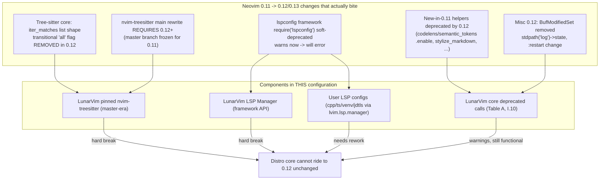
```mermaid
%% Impact map: which upgrade-era change hits which part of THIS setup.
flowchart TD
    subgraph Changes["Neovim 0.11 -> 0.12/0.13 changes that actually bite"]
        TsCore["Tree-sitter core: iter_matches list shape<br/>transitional 'all' flag REMOVED in 0.12"]
        TsPlugin["nvim-treesitter main rewrite REQUIRES 0.12+<br/>(master branch frozen for 0.11)"]
        LspFw["lspconfig framework require('lspconfig') soft-deprecated<br/>warns now -> will error"]
        Depr012["New-in-0.11 helpers deprecated by 0.12<br/>(codelens/semantic_tokens .enable, stylize_markdown, ...)"]
        Misc["Misc 0.12: BufModifiedSet removed<br/>stdpath('log')->state, :restart change"]
    end

    subgraph Targets["Components in THIS configuration"]
        FrozenTs["LunarVim pinned nvim-treesitter (master-era)"]
        LspMgr["LunarVim LSP Manager (framework API)"]
        UserLsp["User LSP configs (cpp/ts/venv/jdtls via lvim.lsp.manager)"]
        CoreApis["LunarVim core deprecated calls (Table A, I.10)"]
    end

    TsCore --> FrozenTs
    TsPlugin --> FrozenTs
    LspFw --> LspMgr
    LspFw --> UserLsp
    Depr012 --> CoreApis
    Misc --> CoreApis

    FrozenTs -->|"hard break"| Verdict["Distro core cannot ride to 0.12 unchanged"]
    LspMgr -->|"hard break"| Verdict
    UserLsp -->|"needs rework"| Verdict
    CoreApis -->|"warnings, still functional"| Verdict
```

**Explanation.** Two edges are *hard breaks* on 0.12: the frozen tree-sitter and the
lspconfig-framework-based LSP manager. Everything else (Table A in I.10) is warnings
that still run. The conclusion is decisive: **the LunarVim distribution core cannot
ride to Neovim 0.12 unchanged** — its two load-bearing subsystems (treesitter pin +
LSP manager) are exactly the two hard breaks. This is the central fact that drives
the approach comparison.

Concrete change-to-impact mapping:

```
Neovim change (0.11 -> 0.12/0.13)             | Severity on this setup | Where it lands
----------------------------------------------+------------------------+-------------------------------
nvim-treesitter main requires 0.12+           | HARD (must adopt)      | replaces frozen master pin
Query:iter_matches list shape ('all' removed) | HARD (via plugins)     | any TS query consumer
require('lspconfig') framework deprecated      | HARD (design)          | lvim.lsp.manager + user LSP
codelens/semantic_tokens .enable, etc.        | LOW (warns)            | core deprecated calls
BufModifiedSet removed / stdpath('log') moved | LOW                    | rare/none here
vim.validate/tbl_flatten/highlight/loop       | LOW (warns, not removed)| Table A items 6-12
make_position_params position_encoding        | already handled at 0.11| user shim code exists
```

## II.3 Candidate Approaches (Brainstorm)

Five distinct strategies were considered. Each is stated with its mechanism and
honest pros/cons; the comparison matrix and decision tree follow.

### Approach A — Patch / fork LunarVim core in place

*Mechanism:* fork `lunarvim/lunarvim`, rewrite `lua/lvim/lsp/manager.lua` +
`templates.lua` + the mason-lspconfig lookups to the native `vim.lsp.config`/`enable`
model, unpin and bump `nvim-treesitter` to `main`, fix Table-A deprecations, and
maintain that fork yourself.

- **Pros:** keeps the familiar `lvim.*` API and all muscle memory; smallest change to
  `config.lua`; no plugin re-homing.
- **Cons:** you inherit maintenance of a **dormant distro's** most complex subsystem
  (the LSP manager is the hardest part of the codebase); upstream is dead so you never
  get fixes back; the snapshot-pinning machinery fights you; every future Neovim
  release repeats the work. High effort, high ongoing burden, low future-proofing.

### Approach B — Migrate to LazyVim + re-home plugins (RECOMMENDED)

*Mechanism:* adopt LazyVim as the base (`{ "LazyVim/LazyVim", import = "lazyvim.plugins" }`),
move the 84 user plugins into `lua/plugins/*.lua` (they are already lazy specs),
translate `lvim.*` settings into LazyVim's `lua/config/*.lua` + `opts` model, enable
LazyVim **lang Extras** for each language, and let LazyVim's native-LSP + treesitter
rewrite handle the 0.12 hard breaks.

- **Pros:** LazyVim is **actively maintained** and already tracks 0.12/0.13, so the two
  hard breaks are solved upstream; it is a **thin, idiomatic lazy.nvim layer** with no
  bespoke bootstrap/loader/LSP-manager to fight; your user plugins port almost
  verbatim; runs on your **current 0.11.x** so you can migrate *before* upgrading
  Neovim (de-risking); the back-pinned plugins can move forward.
- **Cons:** one-time translation of the `lvim.*` config surface and keymaps; different
  defaults to relearn (neo-tree vs nvim-tree, blink.cmp vs nvim-cmp, snacks dashboard
  vs alpha); some LunarVim conveniences must be re-created as small specs.

### Approach C — Bespoke `lazy.nvim` config from scratch (no distro)

*Mechanism:* start from an empty `init.lua`, add `lazy.nvim`, and hand-build options,
keymaps, LSP (`vim.lsp.config`/`enable`), treesitter, completion, and every feature.

- **Pros:** maximum control and understanding; zero distro coupling ever again;
  smallest possible dependency surface.
- **Cons:** you re-implement everything LazyVim gives free (LSP wiring, formatting,
  which-key groups, statusline, dashboard, Extras); highest up-front effort; you become
  the maintainer of your own mini-distro.

### Approach D — Hybrid: keep LunarVim shell, replace only the LSP subsystem

*Mechanism:* stay on LunarVim but disable its LSP manager and drive LSP yourself with
native `vim.lsp.config`/`enable`; also unpin treesitter to `main`.

- **Pros:** less disruptive than a full migration; keeps `lvim.*` for non-LSP config.
- **Cons:** you are surgically operating on a dormant distro that will keep fighting you
  (snapshot pins, the ftplugin-template generator, mason-lspconfig v1 assumptions);
  ends up nearly as much work as Approach A with a messier result; still no upstream
  future. A transitional half-measure, not a destination.

### Approach E — Status quo (pin Neovim at 0.11.x)

*Mechanism:* do not upgrade; keep pinning individual plugins back to 0.11-compatible
versions (the current strategy).

- **Pros:** zero migration effort today; everything works now.
- **Cons:** the pin treadmill grows as more plugins require 0.12+; you drift onto
  unmaintained plugin versions; you never get 0.12/0.13 features; and without
  compensating pins, plugins break as they auto-update on newer 0.11 patches (as
  already happened with `ccls.nvim`), so keeping the setup working demands an
  ever-growing set of back-pins. This is a slowly-worsening dead end.

### Comparison matrix

Scores are qualitative (Low / Med / High). "Future-proof" and "Maintained upstream"
are the criteria that most separate the options.

```
Criterion              | A: Patch LunarVim | B: LazyVim (rec.) | C: Bespoke | D: Hybrid | E: Status quo
-----------------------+-------------------+-------------------+------------+-----------+--------------
Up-front effort        | High              | Medium-High       | Very High  | High      | None
Ongoing maintenance    | Very High         | Low               | High       | High      | Rising
Risk of breakage       | High              | Low-Med           | Medium     | High      | Rising
Feature parity kept    | High              | High              | Medium     | High      | High (frozen)
Maintained upstream    | No                | Yes (active)      | N/A (you)  | No        | No
Future-proof (0.13+)   | Low               | High              | Medium     | Low       | Very Low
Keeps lvim.* muscle    | Yes               | No                | No         | Partial   | Yes
Reversibility          | Medium            | High (parallel)   | High       | Medium    | N/A
Overall                | Weak              | Strong            | Niche      | Weak      | Dead end
```

### Decision tree

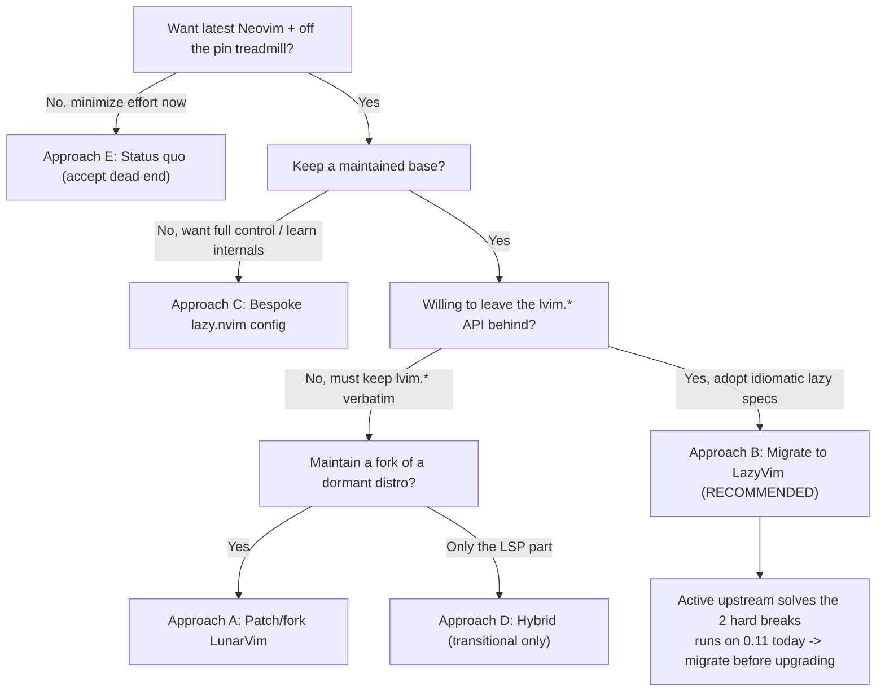
```mermaid
%% How to choose among the five approaches.
flowchart TD
    Start["Want latest Neovim + off the pin treadmill?"]
    Start -->|"No, minimize effort now"| E["Approach E: Status quo (accept dead end)"]
    Start -->|"Yes"| Q1["Keep a maintained base?"]
    Q1 -->|"No, want full control / learn internals"| C["Approach C: Bespoke lazy.nvim config"]
    Q1 -->|"Yes"| Q2["Willing to leave the lvim.* API behind?"]
    Q2 -->|"No, must keep lvim.* verbatim"| Q3["Maintain a fork of a dormant distro?"]
    Q3 -->|"Yes"| A["Approach A: Patch/fork LunarVim"]
    Q3 -->|"Only the LSP part"| D["Approach D: Hybrid (transitional only)"]
    Q2 -->|"Yes, adopt idiomatic lazy specs"| B["Approach B: Migrate to LazyVim (RECOMMENDED)"]

    B --> Why["Active upstream solves the 2 hard breaks<br/>runs on 0.11 today -> migrate before upgrading"]
```

**Explanation.** The tree turns on two questions: (1) do you want a *maintained* base,
and (2) are you willing to trade the bespoke `lvim.*` table for idiomatic lazy specs?
For someone who already writes plain lazy specs in `custom/plugins.lua` and is tired
of pinning plugins back, both answers point to **Approach B**.

## II.4 Recommended Approach — Deep Dive: LazyVim Migration

### II.4.1 Why B wins for this specific configuration

- **The large majority of your user specs port with little change.**
  `custom/plugins.lua` is *already* a `lazy.nvim` spec list, so most of the 84 user
  plugins move into `lua/plugins/` largely by copy-paste; only the ones configured
  *through* LunarVim builtins or the `lvim.lsp.manager` need real rework (the Replace
  and Reconfigure buckets in II.4.5).
- **The two hard 0.12 breaks are handled upstream.** LazyVim ships the
  `nvim-treesitter` rewrite and native `vim.lsp.config`/`enable` wiring; you inherit
  those fixes instead of authoring them (Approach A) or re-authoring them (C).
- **You can migrate on 0.11 first, upgrade second.** Because LazyVim needs only
  0.11.2, you build and validate the new config on the machine as-is (in parallel with
  LunarVim), then flip Neovim to 0.12.3 as a separate, independently-reversible step.
- **It ends the pin treadmill.** On the LazyVim + 0.12 base, `ccls.nvim`,
  `telescope-frecency`, `visual-whitespace`, and `rustaceanvim` all move to current
  releases; `nvim-treesitter` moves to `main`.

### II.4.2 Target architecture

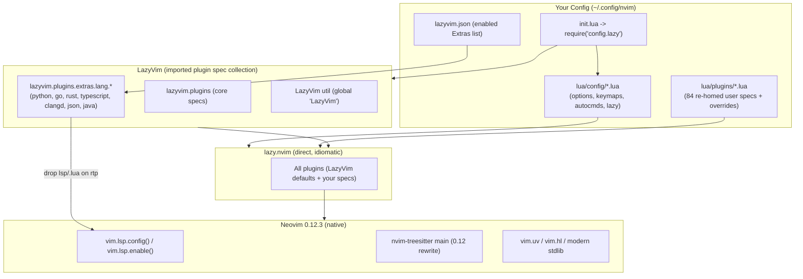
```mermaid
%% Target: LazyVim as a thin importable layer over plain lazy.nvim + native Neovim.
flowchart TD
    subgraph UserCfg["Your Config (~/.config/nvim)"]
        Entry2["init.lua -> require('config.lazy')"]
        ConfigDir["lua/config/*.lua<br/>(options, keymaps, autocmds, lazy)"]
        PluginsDir["lua/plugins/*.lua<br/>(84 re-homed user specs + overrides)"]
        LazyJson["lazyvim.json (enabled Extras list)"]
    end
    subgraph LazyVimLayer["LazyVim (imported plugin spec collection)"]
        LvCore["lazyvim.plugins (core specs)"]
        LvExtras["lazyvim.plugins.extras.lang.*<br/>(python, go, rust, typescript, clangd, json, java)"]
        LvUtil["LazyVim util (global 'LazyVim')"]
    end
    subgraph Managed["lazy.nvim (direct, idiomatic)"]
        AllPlugins["All plugins (LazyVim defaults + your specs)"]
    end
    subgraph Native["Neovim 0.12.3 (native)"]
        LspNative["vim.lsp.config() / vim.lsp.enable()"]
        TsMain["nvim-treesitter main (0.12 rewrite)"]
        Uv["vim.uv / vim.hl / modern stdlib"]
    end

    Entry2 --> ConfigDir
    Entry2 --> LazyVimLayer
    ConfigDir --> Managed
    PluginsDir --> Managed
    LazyJson --> LvExtras
    LazyVimLayer --> Managed
    AllPlugins --> Native
    LvExtras -->|"drop lsp/<server>.lua on rtp"| LspNative
```

**Explanation.** Compared with the four-layer LunarVim diagram in I.2, the bespoke
"Distribution Core" layer (bootstrap + loader + LSP manager) **disappears**. LazyVim
sits as an *imported spec set* beside your own specs on plain `lazy.nvim`, and both
bind to a *modern* Neovim that provides native LSP config and the treesitter rewrite.
There is no wrapper to break on the next Neovim release.

### II.4.3 Migration mapping: LunarVim component -> LazyVim / native equivalent

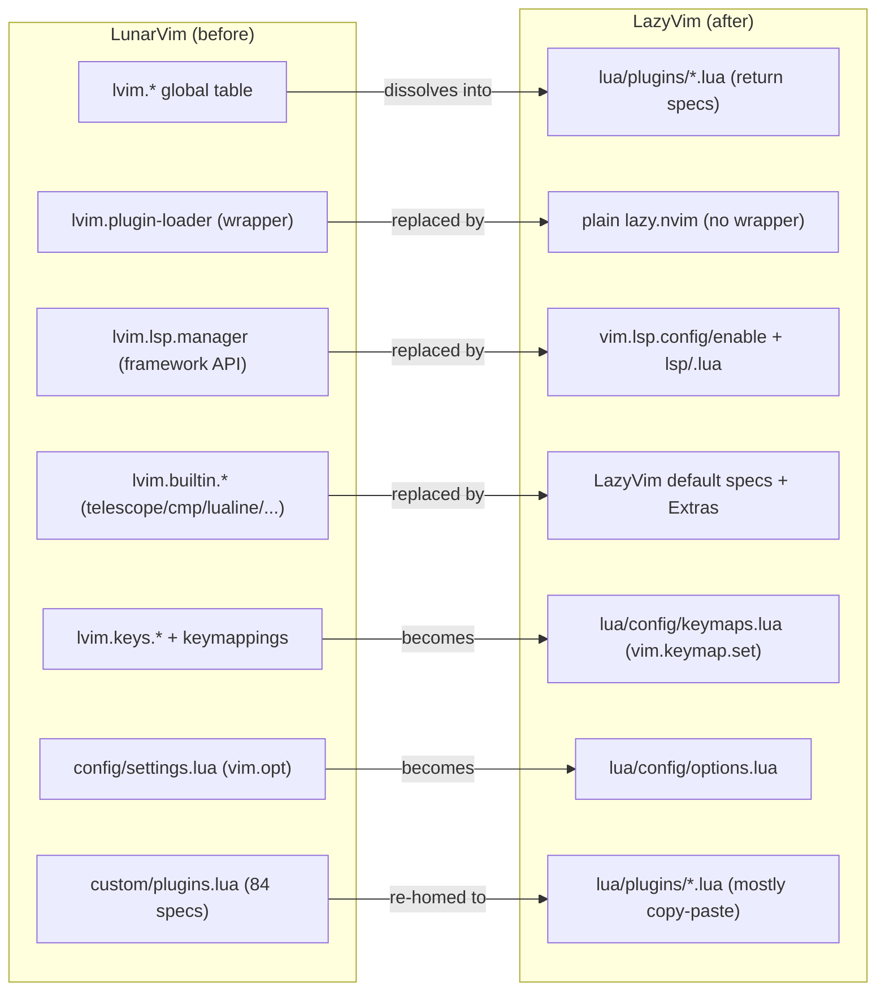
```mermaid
%% What each LunarVim piece becomes after migration.
flowchart LR
    subgraph Before["LunarVim (before)"]
        B_lvim["lvim.* global table"]
        B_loader["lvim.plugin-loader (wrapper)"]
        B_lsp["lvim.lsp.manager (framework API)"]
        B_builtins["lvim.builtin.* (telescope/cmp/lualine/...)"]
        B_keys["lvim.keys.* + keymappings"]
        B_opts["config/settings.lua (vim.opt)"]
        B_userp["custom/plugins.lua (84 specs)"]
    end
    subgraph After["LazyVim (after)"]
        A_specs["lua/plugins/*.lua (return specs)"]
        A_lazy["plain lazy.nvim (no wrapper)"]
        A_native["vim.lsp.config/enable + lsp/<server>.lua"]
        A_lvdef["LazyVim default specs + Extras"]
        A_keys["lua/config/keymaps.lua (vim.keymap.set)"]
        A_optsf["lua/config/options.lua"]
        A_userp["lua/plugins/*.lua (mostly copy-paste)"]
    end

    B_lvim -->|"dissolves into"| A_specs
    B_loader -->|"replaced by"| A_lazy
    B_lsp -->|"replaced by"| A_native
    B_builtins -->|"replaced by"| A_lvdef
    B_keys -->|"becomes"| A_keys
    B_opts -->|"becomes"| A_optsf
    B_userp -->|"re-homed to"| A_userp
```

**Explanation.** The mapping is mostly *one-way simplification*: bespoke subsystems
collapse into either LazyVim defaults or a handful of `opts`/`keys` overrides. The
only genuinely new authoring is the LSP re-wiring (middle edge), and even that is
smaller than it looks because LazyVim's lang Extras already ship each server's
`lsp/<server>.lua`; you only override specifics.

### II.4.4 Config translation cheat-sheet (`lvim.*` -> LazyVim)

```
LunarVim (config.lua)                              | LazyVim equivalent (where)
---------------------------------------------------+-----------------------------------------------------
lvim.leader = "space"                              | vim.g.mapleader = " " in lua/config/options.lua (space is default)
lvim.colorscheme = "catppuccin-mocha"              | { "LazyVim/LazyVim", opts = { colorscheme = "catppuccin-mocha" } }
vim.opt.* (settings.lua ~40 options)               | lua/config/options.lua (loaded before lazy)
lvim.keys.normal_mode["<C-s>"] = ":w"              | vim.keymap.set("n","<C-s>",...) in lua/config/keymaps.lua
lvim.autocommands = {...}                          | lua/config/autocmds.lua
lvim.format_on_save = { enabled = true }           | conform.nvim (LazyVim default); toggle with <leader>uf / opts
lvim.builtin.telescope.defaults = {...}            | { "nvim-telescope/telescope.nvim", opts = {...} } (editor.telescope)
lvim.builtin.treesitter.ensure_installed = {...}   | { "nvim-treesitter/nvim-treesitter", opts = function(_,o) ... end }
lvim.builtin.dap.active = true                     | enable dap.core Extra (or import extras.dap.core)
lvim.builtin.lualine / bufferline / which_key      | LazyVim configures these; override via opts
lvim.lsp.on_attach_callback = fn                   | LazyVim.lsp.on_attach(function(client,buf) ... end) in a plugin spec
lvim.lsp.installer.setup.ensure_installed = {...}  | mason opts / lang Extras (auto-install servers)
lvim.lsp.automatic_configuration.skipped_servers   | set opts.servers.<name> or handle via the lang Extra
require("lvim.lsp.manager").setup("clangd", {...})  | vim.lsp.config("clangd", {...}) + vim.lsp.enable("clangd")
```

**Explanation.** Most rows collapse to either a one-line option in `lua/config/*.lua`
or a small `opts` override in `lua/plugins/*.lua`. The last two rows are the LSP
re-wire and are the substantive part of the work.

### II.4.5 Plugin disposition (keep / replace / reconfigure / drop)

The 84 user plugins fall into four buckets. Representative members are shown; the
principle for each bucket generalizes to the rest.

```
Disposition                          | Applies to (representative)                          | Action
-------------------------------------+------------------------------------------------------+---------------------------------
KEEP AS-IS (already plain specs)     | nvim-surround, flash, yanky, cutlass, move, undotree,| copy spec into lua/plugins/;
                                     | lazygit, fugitive, diffview, grug-far, marks, vessel,| no change needed
                                     | avante, copilot, go.nvim, quarto, otter, tmux.nvim   |
REPLACE with LazyVim default/Extra   | LunarVim builtins: telescope, treesitter, cmp,       | drop LunarVim builtin; adopt
                                     | lualine, bufferline, which-key, gitsigns, mason,     | LazyVim's (override via opts);
                                     | alpha(dashboard), nvim-tree(->neo-tree or keep)      | enable coding.nvim-cmp if you
                                     |                                                      | prefer nvim-cmp over blink.cmp
RECONFIGURE for native LSP           | cpp (ccls+clangd), typescript-tools, venv-selector,  | move off lvim.lsp.manager to
                                     | nvim-jdtls, rustaceanvim, flutter-tools              | vim.lsp.config/enable or lang Extra
UNPIN (now that 0.12 is the target)  | ccls.nvim, telescope-frecency, visual-whitespace,    | remove the four user back-pins;
                                     | rustaceanvim (four user back-pins)                   | track latest releases
(inherited, not a user pin)          | nvim-treesitter (frozen via LunarVim snapshot only)  | adopt LazyVim's main-branch spec
DROP / DEDUPE                        | duplicate vim-plugin-AnsiEsc, LunarVim colorschemes  | remove one AnsiEsc; drop onedarker/
                                     | (onedarker, lunar, tokyonight if unused)             | lunar unless used
```

**Explanation.** The heavy lifting is the *Replace* and *Reconfigure* buckets. For
*Replace*, prefer LazyVim's defaults where they match your habits (telescope is a
LazyVim editor option, so your telescope-heavy workflow stays); enable the
`coding.nvim-cmp` Extra if you want to keep `nvim-cmp` instead of LazyVim's newer
default `blink.cmp`. For *Reconfigure*, each language you use has a LazyVim
**lang Extra** (`lang.python`, `lang.go`, `lang.rust`, `lang.typescript`,
`lang.clangd`, `lang.json`, `lang.java`) that wires the server + treesitter +
formatter; you enable those and then override only the specifics that differ from
your current setup.

### II.4.6 LSP subsystem migration (the substantive rework)

This is the one place with real design work. The table contrasts the mechanics.

```
Concern                | LunarVim (today)                        | LazyVim + native (target)
-----------------------+-----------------------------------------+-------------------------------------------
Server config define   | lspconfig[server].setup(cfg) (framework)| vim.lsp.config(server, cfg)
Server activation      | manager:try_add_wrapper via ftplugin    | vim.lsp.enable(server) (filetype auto)
Server config source   | mason-lspconfig v1 mappings             | lsp/<server>.lua on runtimepath (Extras)
Auto-install servers   | lvim.lsp manager + mason-lspconfig v1   | mason + mason-lspconfig 2.x (LazyVim opts)
on_attach / keymaps    | lvim.lsp.common_on_attach               | LazyVim.lsp.on_attach(fn) + lsp/keymaps
Capabilities           | cmp_nvim_lsp.default_capabilities       | LazyVim assembles (blink/cmp) capabilities
Formatting             | null-ls/none-ls via lvim.lsp            | conform.nvim (LazyVim default)
Linting                | none-ls sources                         | nvim-lint (LazyVim default)
clangd / ccls (C/C++)  | lvim.lsp.manager("clangd") + ccls.nvim  | lang.clangd Extra + ccls via vim.lsp.config
```

For a concrete server override under LazyVim, you add a spec such as:

```
-- lua/plugins/lsp.lua  (illustrative, not to be pasted verbatim)
return {
  { "neovim/nvim-lspconfig", opts = { servers = { clangd = { --[[ your init_options ]] } } } },
}
```

and for a server LazyVim does not template, you use the native API directly in a
config function (`vim.lsp.config("ccls", {...})` + `vim.lsp.enable("ccls")`), which is
exactly the modern path the newer `ccls.nvim` already switched to.

### II.4.7 New configuration directory structure

```
~/.config/nvim/                 (new; parallel to ~/.config/lvim during migration)
  init.lua                      -> require("config.lazy")
  lua/
    config/
      lazy.lua                  bootstrap: lazy.setup{ import lazyvim.plugins; import plugins }
      options.lua               your vim.opt.* (ported from settings.lua) + leader
      keymaps.lua               your keymaps (ported from keymappings.lua / lvim.keys)
      autocmds.lua              your autocmds (ported from lvim.autocommands)
    plugins/
      user.lua                  the KEEP-AS-IS user specs (surround, flash, yanky, ...)
      lsp.lua                   server overrides (clangd/ccls/ts/jdtls/venv/rust)
      langs.lua                 { import = "lazyvim.plugins.extras.lang.python" }, go, rust, ...
      ui.lua                    colorscheme + dashboard/statusline/explorer overrides
      dap.lua                   dap adapters (python, js, cpp) as specs
      ai.lua                    avante + copilot specs
  lazyvim.json                  enabled Extras (managed by :LazyExtras)
  lazy-lock.json                lockfile (fresh)
```

### II.4.8 Neovim version management + safe parallel cutover

Because both distros key off `NVIM_APPNAME`, the new config can live **beside** the
existing LunarVim install and be tested without risk. The recommended tools:

- **`bob`** (`bob-nvim`) to install and switch Neovim versions (`bob install 0.12.3`,
  `bob use 0.12.3`), keeping the ability to `bob use 0.11.5` instantly for rollback.
  Ensure the build is **LuaJIT** (LazyVim requires it).
- **`NVIM_APPNAME`** to run the new config as a separate app:
  `NVIM_APPNAME=nvim-lazy nvim` reads `~/.config/nvim-lazy/` and stores data under
  `~/.local/share/nvim-lazy/` — fully isolated from `lvim`.

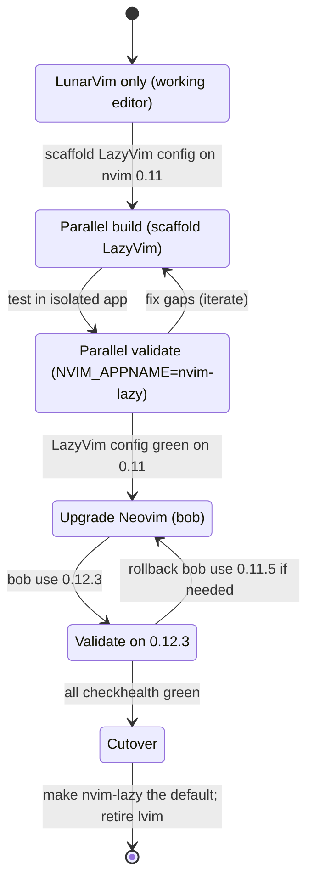
```mermaid
%% Parallel worlds during migration -- nothing destructive until cutover.
%% State labels are double-quoted via the 'state "..." as Id' form.
stateDiagram-v2
    state "LunarVim only (working editor)" as LunarVimOnly
    state "Parallel build (scaffold LazyVim)" as ParallelBuild
    state "Parallel validate (NVIM_APPNAME=nvim-lazy)" as ParallelValidate
    state "Upgrade Neovim (bob)" as UpgradeNeovim
    state "Validate on 0.12.3" as Validate012
    state "Cutover" as Cutover
    [*] --> LunarVimOnly
    LunarVimOnly --> ParallelBuild : scaffold LazyVim config on nvim 0.11
    ParallelBuild --> ParallelValidate : test in isolated app
    ParallelValidate --> ParallelBuild : fix gaps (iterate)
    ParallelValidate --> UpgradeNeovim : LazyVim config green on 0.11
    UpgradeNeovim --> Validate012 : bob use 0.12.3
    Validate012 --> UpgradeNeovim : rollback bob use 0.11.5 if needed
    Validate012 --> Cutover : all checkhealth green
    Cutover --> [*] : make nvim-lazy the default#59; retire lvim
```

**Explanation.** The state machine encodes the core safety property: **LunarVim stays
fully functional until the very last state**. You build and validate LazyVim on your
current 0.11 (no Neovim change yet), *then* upgrade Neovim as an independent step with
an instant `bob` rollback, and only cut over once `:checkhealth` is green. At no point
is there a window where you have no working editor.

## II.5 Step-by-Step Implementation Guide (no timeline)

Phased, each phase independently reversible. Do not delete anything LunarVim until
the final phase.

**Phase 0 — Inventory and freeze a baseline.**
1. Commit the current `~/.dotfiles/lvim` (already clean) as the rollback point.
2. Run `:Lazy sync` in LunarVim so `lazy-lock.json` matches the pinned specs (this
   also resolves the stale `ccls.nvim` lock noted in I.6/I.8).
3. From this document's catalog, mark each user plugin's bucket (keep / replace /
   reconfigure / unpin / drop).

**Phase 1 — Scaffold LazyVim in parallel (still on Neovim 0.11).**
4. Clone the LazyVim starter into `~/.config/nvim-lazy` (a *new* app dir; do not
   touch `~/.config/lvim`).
5. Launch with `NVIM_APPNAME=nvim-lazy nvim`; let LazyVim install; confirm the base
   boots green with `:checkhealth` and `:LazyHealth`.

**Phase 2 — Port settings, keymaps, autocmds.**
6. Translate `config/settings.lua` options into `lua/config/options.lua`.
7. Translate your keymaps (`keymappings.lua` + `lvim.keys.*`) into
   `lua/config/keymaps.lua` using `vim.keymap.set`; disable any conflicting LazyVim
   default with the `{ lhs, false }` idiom.
8. Translate `lvim.autocommands` into `lua/config/autocmds.lua`.

**Phase 3 — Re-home the "keep-as-is" plugins.**
9. Copy the KEEP-AS-IS specs from `custom/plugins.lua` into `lua/plugins/user.lua`,
   removing any `lvim.*` references. Bring their per-plugin config modules across
   (they are plain Lua).

**Phase 4 — Enable language Extras and re-wire LSP.**
10. Enable lang Extras via `:LazyExtras` (or `{ import = "lazyvim.plugins.extras.lang.<x>" }`)
    for python, go, rust, typescript, clangd, json, java as applicable.
11. Add server overrides in `lua/plugins/lsp.lua` using `opts.servers.<name>` for
    templated servers and `vim.lsp.config`/`vim.lsp.enable` for the rest (ccls,
    jdtls, anything custom). Move `venv-selector`/`typescript-tools`/`rustaceanvim`
    off `lvim.lsp.manager`.
12. Verify LSP attaches per language (`:LspInfo` / `:checkhealth vim.lsp`).

**Phase 5 — DAP, tests, formatting, UI.**
13. Add DAP adapters (python, js, cpp) as specs (or the `dap` Extras); confirm
    breakpoints/attach.
14. Add neotest specs; confirm test discovery.
15. Confirm formatting via conform.nvim and linting via nvim-lint replace your
    none-ls setup (or enable the `lsp.none-ls` Extra if you prefer to keep none-ls).
16. Pick dashboard/explorer/statusline: keep LazyVim defaults or override to match
    your LunarVim habits (e.g. keep nvim-tree via a spec instead of neo-tree).

**Phase 6 — AI + long tail.**
17. Bring `avante.nvim` + `copilot.lua` + helpers across as specs; validate the
    aggregator's dependencies resolve under the new base.
18. Port remaining niche plugins; dedupe the duplicate `AnsiEsc`.

**Phase 7 — Upgrade Neovim, *then* unpin (order matters).**
19. **Upgrade first**, while the 0.11 back-pins are still in place:
    `bob install 0.12.3 && bob use 0.12.3`; relaunch `NVIM_APPNAME=nvim-lazy nvim`;
    run `:Lazy sync`, `:TSUpdate`, `:checkhealth`. Validate the config is green on
    0.12 with the existing pins.
20. **Then move forward**: remove the four user back-pins (`ccls`,
    `telescope-frecency`, `visual-whitespace`, `rustaceanvim`) and adopt LazyVim's
    `main`-branch treesitter; `:Lazy sync` again. (Do *not* run `:Lazy sync` after
    editing these specs while still on 0.11 — the newer plugins require 0.12, so
    unpinning before the upgrade would fetch 0.12-only plugins onto a 0.11 runtime.)
21. Keep `bob use 0.11.5` handy as instant rollback throughout. Because this all
    happens in the parallel `NVIM_APPNAME=nvim-lazy` app, even a broken intermediate
    state never touches your working `lvim`.

**Phase 8 — Cutover.**
22. Once stable, make the new config the default `nvim` config (move
    `~/.config/nvim-lazy` to `~/.config/nvim`, or keep the app-name and alias
    `nvim`), and update your dotfiles repo accordingly.
23. Retire the `lvim` launcher; keep the old `~/.config/lvim` archived until you are
    confident.

## II.6 Risks, Mitigations, and Rollback

```
Risk                                            | Likelihood | Mitigation
------------------------------------------------+------------+--------------------------------------------
Keymap muscle-memory disruption                 | High       | Port bindings 1:1 in lua/config/keymaps.lua
blink.cmp vs nvim-cmp behavior differences      | Medium     | Enable coding.nvim-cmp Extra to keep nvim-cmp
Some niche plugin unmaintained on 0.12          | Medium     | Find LazyVim-era alternative; it is isolated now
LSP server override missed for a language       | Medium     | Phase 4 checklist per language; :LspInfo
treesitter main rewrite API differences         | Medium     | LazyVim owns the treesitter spec; :TSUpdate
avante aggregator dependency churn              | Medium     | Pin avante + deps; validate in Phase 6
Neovim 0.12 regression in a workflow            | Low        | bob use 0.11.5 instant rollback; parallel apps
Losing a LunarVim convenience command           | Low        | Re-create as a tiny autocmd/user-command spec
```

**Rollback posture.** Every phase is reversible: the LunarVim install is untouched
until Phase 8, Neovim versions swap instantly via `bob`, and the two configs are
isolated by `NVIM_APPNAME`. The worst case at any point is "run `lvim` like before."

## II.7 Validation Checklist

```
[ ] nvim --version shows 0.12.3 (LuaJIT build)
[ ] :checkhealth is green (esp. vim.lsp, vim.treesitter, mason, lazy)
[ ] LSP attaches: python, js/ts, go, rust, c/c++, java, lua, quarto
[ ] Formatting (conform) + linting (nvim-lint or none-ls) work per language
[ ] Treesitter highlight/indent on main branch (:TSUpdate clean)
[ ] DAP: breakpoints + attach for python, js, cpp
[ ] neotest discovers + runs tests
[ ] Telescope + frecency + live-grep-args + undo pickers work
[ ] Git: lazygit, fugitive, diffview, gitsigns
[ ] avante + copilot respond
[ ] Session restore (possession or LazyVim persistence) works
[ ] Previously back-pinned plugins now on latest (ccls/frecency/rustaceanvim)
[ ] No deprecation errors in :messages / :Notifications on startup
[ ] Startup time acceptable (:Lazy profile)
```

---

# Part II-B — Implementation Record (as built)

This part documents the **actual migration that was implemented** on the
`lazyvim-migration` branch, following the plan in II.4-II.5. It is a testable,
parallel LazyVim configuration that reproduces the LunarVim functionality and
keymaps, switchable with a single script, so it can be validated before becoming a
daily driver.

## II.8 What Was Built

- **Branch:** `lazyvim-migration`.
- **New config:** `lazyvim-new/` in the repo (the `-new` suffix keeps the original
  LunarVim config untouched and revert trivial), deployed via
  `NVIM_APPNAME=lvim-lazyvim` to `~/.config/lvim-lazyvim` (a symlink).
- **Switcher:** `setup_lvim.sh` at the repo root (`new` / `old` / `status`).
- **Isolation:** the new config's data/state/cache live under
  `~/.local/share|state`, `~/.cache` / `lvim-lazyvim` — fully separate from LunarVim.
  The existing `lvim` command is never modified.
- **Verification:** headless bootstrap + startup confirmed the config loads with the
  catppuccin-mocha theme, correct options, 127 plugin specs, and 370 normal-mode
  keymaps (see II.14).

### II.8.1 New configuration layout

```
lazyvim-new/
  init.lua                     bootstrap; load config.lazy then keymaps + autocmds
  lua/config/lazy.lua          lazy.setup: LazyVim + Extras + user spec imports
  lua/config/options.lua       vim.opt deltas + globals (leader, clipboard, header)
  lua/config/keymaps.lua       apply(): custom + full LunarVim-default leader tree
  lua/config/autocmds.lua      autoread, flash toggle, :Redir, :RunNode, _G.C()
  lua/plugins/colorscheme.lua  catppuccin-mocha
  lua/plugins/editor.lua       flash/surround/cutlass/move/marks/windows/wrapping/...
  lua/plugins/telescope.lua    telescope + 8 extensions + layout/history/mappings
  lua/plugins/git.lua          diffview, fugitive, lazygit
  lua/plugins/ui.lua           rainbow-delimiters, ts-context, bufferline, colorizer, ...
  lua/plugins/coding.lua       treesitter opts (ignore dart, indent disable), playground
  lua/plugins/lsp.lua          lspsaga, glance, outline, ccls, server overrides, mason
  lua/plugins/dap.lua          cpp/python/js adapters, F-key debug maps, launch.json
  lua/plugins/lang.lua         typescript-tools, go, rust, flutter, quarto, cppman, ...
  lua/plugins/ai.lua           avante, copilot, img-clip
  lua/plugins/tools.lua        tmux, yanky, grug-far, translate, lf, toggleterm, possession
  lua/custom/possession.lua    custom session-save prompt
  README.md                    quickstart + known differences
setup_lvim.sh                  new/old/status switcher (repo root)
```

## II.9 The Parallel Switcher (`setup_lvim.sh`)

The switcher makes the new config a separate `NVIM_APPNAME` app, so both editors
coexist. `new` sets up the symlink + a `lvim-new` launcher; `old` removes them;
neither touches LunarVim.

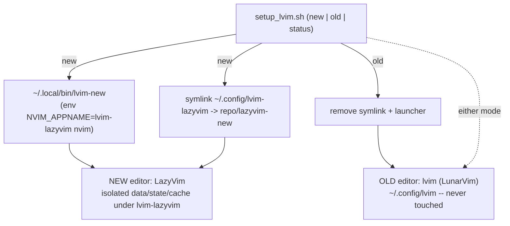
```mermaid
%% setup_lvim.sh switching mechanism -- NVIM_APPNAME isolation.
flowchart TD
    Script["setup_lvim.sh (new | old | status)"]
    Link["symlink ~/.config/lvim-lazyvim -> repo/lazyvim-new"]
    Launcher["~/.local/bin/lvim-new<br/>(env NVIM_APPNAME=lvim-lazyvim nvim)"]
    Rm["remove symlink + launcher"]
    NvimNew["NEW editor: LazyVim<br/>isolated data/state/cache under lvim-lazyvim"]
    LvimOld["OLD editor: lvim (LunarVim)<br/>~/.config/lvim -- never touched"]

    Script -->|"new"| Link
    Script -->|"new"| Launcher
    Script -->|"old"| Rm
    Launcher --> NvimNew
    Link --> NvimNew
    Rm --> LvimOld
    Script -.->|"either mode"| LvimOld
```

**Explanation.** After `setup_lvim.sh new`, launch the new editor with **`lvim-new`**
and the old one with **`lvim`** — they share nothing. `setup_lvim.sh old` removes the
`lvim-new` launcher and symlink (the config files and installed plugin data are
preserved for re-testing). The script prints all isolated locations and is
idempotent. Because LunarVim is never modified, the worst case at any point is "run
`lvim` like before."

```
Command                  | Effect
setup_lvim.sh new        | symlink + lvim-new launcher; prints locations + usage
setup_lvim.sh old        | remove launcher + symlink; keep repo config + plugin data
setup_lvim.sh status     | show whether new is active, launcher installed, paths
```

## II.10 Startup & the Deterministic Keymap Fix

A subtlety surfaced during testing: LazyVim auto-loads `lua/config/keymaps.lua` on
`VeryLazy` through a **cache-gated loader** (`_load` guards on
`lazy.core.cache.find`), which could skip the user file when the config-dir module
index was not yet warm (aggravated by first-run install churn). The fix loads the
user keymaps/autocmds **deterministically** in `init.lua` and re-applies keymaps on
`VeryLazy` so they also win over LazyVim's own defaults.

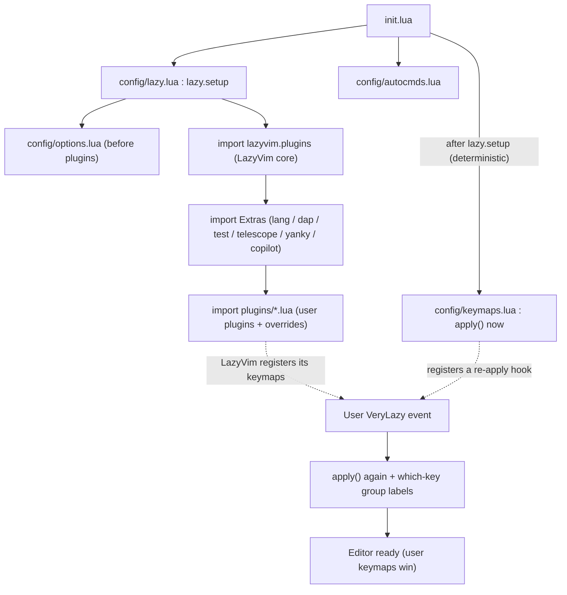
```mermaid
%% New config startup + deterministic, LazyVim-winning keymap application.
flowchart TD
    Init["init.lua"]
    LazyCfg["config/lazy.lua : lazy.setup"]
    Opts["config/options.lua (before plugins)"]
    LVcore["import lazyvim.plugins (LazyVim core)"]
    Extras["import Extras (lang / dap / test / telescope / yanky / copilot)"]
    UserSpecs["import plugins/*.lua (user plugins + overrides)"]
    Keys["config/keymaps.lua : apply() now"]
    Autos["config/autocmds.lua"]
    VeryLazy["User VeryLazy event"]
    Reapply["apply() again + which-key group labels"]
    Done["Editor ready (user keymaps win)"]

    Init --> LazyCfg
    LazyCfg --> Opts
    LazyCfg --> LVcore --> Extras --> UserSpecs
    Init -->|"after lazy.setup (deterministic)"| Keys
    Init --> Autos
    UserSpecs -.->|"LazyVim registers its keymaps"| VeryLazy
    Keys -.->|"registers a re-apply hook"| VeryLazy
    VeryLazy --> Reapply --> Done
```

**Explanation.** `options.lua` loads before plugins (so leader/indent are right from
the start). After `lazy.setup`, `init.lua` requires `config.keymaps`, whose `apply()`
runs immediately and also registers a `VeryLazy` hook. Because LazyVim registers its
own `VeryLazy` keymap handler *earlier* (during `lazy.setup`), it fires first; our
re-apply fires after and therefore **wins** on any overlapping key. `require` caches,
so each file executes once regardless of how many loaders reference it.

## II.11 Keymap Parity Approach

Full parity required reproducing **both** layers of the LunarVim keymap surface:

1. The user's custom bindings from `keymappings.lua` (F-keys, `<leader>l*` LSP tree,
   diffview, venv, possession, wrapping, glance, etc.).
2. The **LunarVim default `<leader>` tree** (single-key `; w q / c f h e` and the
   `b`/`d`/`g`/`l`/`L`/`p`/`s`/`T` submenus), minus the entries the user disabled,
   mapped to LazyVim/native equivalents.

The reproduced default tree (abridged), with the equivalent used:

```
LunarVim default            | Reproduced with (LazyVim/native)
<leader>; Dashboard         | snacks.dashboard (fallback :Alpha)
<leader>w Save              | :w!
<leader>q Quit              | :confirm q
<leader>/ Comment           | native gcc / gc (visual)
<leader>c Close Buffer      | snacks.bufdelete (fallback :bd)
<leader>f Find File         | Telescope find_files
<leader>h No Highlight      | :nohlsearch
<leader>e Explorer          | :Neotree toggle
<leader>b* Buffers          | bufferline (Pick/Cycle/Close/Sort) + Telescope buffers
<leader>d* Debug            | nvim-dap (toggle/continue/repl/session) + dap-ui
<leader>g* Git              | gitsigns (hunks/blame/stage) + Telescope git_* + lazygit
<leader>l* LSP              | vim.lsp / vim.diagnostic + Telescope + LspInfo/Mason
<leader>L* Config/LazyVim   | edit config, Telescope keymaps, :Lazy, :LazyExtras/:LazyHealth
<leader>p* Plugins          | :Lazy install/sync/clean/update/profile/log/debug
<leader>s* Search           | Telescope (find/grep/help/oldfiles/registers/keymaps/...)
<leader>T* Treesitter       | :checkhealth vim.treesitter
```

Plugin-specific keys (flash `<leader>F`, markdown `<leader>M`, outline `<leader>o`,
undo `<leader>u`, cppman `<leader>Cc/Cs`, grug-far `<leader>S*`, vessel `gj/gL/gm`,
easy-align `ga`, lf `<M-o>`, quarto `<leader>q*`, rust `<leader>R*`, toggleterm
`<M-h/v/i>`, trevJ `<leader>j`, whitespace `<leader>tw`) live in their plugin specs'
`keys`. DAP F-key bindings (`<F6>`..`<F10>` and modifier variants delivered by the
terminal F13-F57 remaps) are set in `lua/plugins/dap.lua`.

## II.12 Design Decisions & Deviations

```
Decision                | Choice                          | Rationale
Switch mechanism        | NVIM_APPNAME=lvim-lazyvim       | Full isolation; LunarVim untouched; reversible
Keymap loading          | apply() at init + on VeryLazy   | Beat LazyVim's cache-gated loader; user maps win
Completion              | blink.cmp (LazyVim default)     | Modern default; nvim-cmp available via extras.coding.nvim-cmp
TypeScript LSP          | typescript-tools.nvim           | The user's actual server (dropped LazyVim vtsls extra)
File explorer           | nvim-tree (ported)              | Same plugin as LunarVim, settings preserved (LazyVim's snacks explorer replaced)
Dashboard               | snacks.dashboard (LazyVim)      | Functional equivalent of alpha
Telescope display       | default (custom 2-col dropped)  | Cosmetic only; reduces migration risk
Single-key leader maps  | w/q/'/' override LazyVim groups  | Matches LunarVim muscle memory (their actions); <leader>c reverted to LazyVim's Code group (II.16.1)
lazy-lock.json          | gitignored in lazyvim-new/      | Generated per machine on first :Lazy sync
```

## II.13 Functionality Coverage

```
Area              | LunarVim setup                 | New config (as built)
Theme             | catppuccin-mocha               | catppuccin-mocha (same)
LSP               | lvim.lsp.manager + mason        | native vim.lsp.config via lspconfig + LazyVim lang Extras + ccls
Completion        | nvim-cmp                        | blink.cmp (nvim-cmp available as extra)
Formatting/Lint   | none-ls                         | conform.nvim + nvim-lint (LazyVim)
Treesitter        | pinned (LunarVim snapshot)      | LazyVim-managed (master on 0.11; main on 0.12)
Fuzzy find        | telescope + 7 extensions        | telescope + 8 extensions (frecency/live-grep-args/undo/...)
Git               | gitsigns/lazygit/fugitive/diffview | same (lazygit via snacks + lazygit.nvim)
Debugging         | nvim-dap + adapters + F-keys    | dap.core extra + cpp/python/js adapters + F-keys
Testing           | neotest + neotest-python        | test.core extra + neotest-python
Python venv       | venv-selector v2 + possession   | venv-selector v2 + possession session hooks
Languages         | py/js-ts/go/rust/c++/java/dart/quarto | LazyVim lang Extras + go.nvim/rustaceanvim/typescript-tools/jdtls/flutter/quarto/ccls
AI                | avante + copilot                | avante + copilot (Copilot needs Node >= 22)
Sessions          | possession + alpha list         | possession (+ venv hooks); dashboard lists sessions (II.15.1)
Command line      | native bottom cmdline (no noice) | noice routed to bottom, cmdline.view="cmdline" (II.15.1)
Editing/motions   | surround/flash/yanky/cutlass/... | same, re-homed as lazy specs
```

## II.14 Testing & Verification Results

All verified headless with `NVIM_APPNAME=lvim-lazyvim` on Neovim 0.11.5.

```
Check                                   | Result
Lua syntax (all config files)           | PASS
Config bootstraps (lazy install)        | PASS -- no spec/config errors
Colorscheme                             | catppuccin-mocha applied
leader / localleader / scrolloff        | space / backslash / 3 (correct)
Plugin specs registered                 | 127
Core modules load                       | which-key, telescope, lspsaga, flash, typescript-tools, possession
Keymaps applied (normal mode)           | 369-370 maps; 19/19 parity spot-checks pass
User commands                           | :Redir, :RunNode present
Switcher new / old / status             | all pass; lvim-new launcher verified
Per-keymap command/module audit         | every keymap's command + function module resolves (see II.14.1)
Functional smoke test                   | <leader>/ comments; <leader>e opens nvim-tree
```

### II.14.1 Per-keymap audit + fixes

A command/module audit (load all plugins, then verify every registered keymap's
target command exists and every function-keymap's module loads) surfaced and fixed:

```
Keymap        | Problem                                          | Fix
<leader>e     | :Neotree missing (LazyVim uses snacks explorer)  | added nvim-tree.lua; map -> :NvimTreeToggle
<leader>vc    | :VenvSelectCached only exists if auto-activate=off| call venv-selector cached-retrieve directly
<leader>M     | :MarkdownPreviewToggle is buffer-local           | bind buffer-locally in markdown filetype
<leader>lR    | custom.lsp.rename module was not ported          | ported (nui.nvim, 0.11 position_encoding)
```

Remaining audit flags are false positives (key-remaps like `<leader>/`->`gcc`,
cutlass `mm`->`dd`, `<Plug>` chains) or headless-only VeryLazy timing
(`:LazyExtras`/`:LazyHealth` exist once VeryLazy fires, which it always does
interactively).

### II.14.2 LunarVim core-default behavior parity pass

A second parity pass studied the LunarVim DISTRIBUTION defaults themselves
(`lua/lvim/keymappings.lua`, `lsp/config.lua` buffer_mappings, and the core modules
nvimtree/terminal/telescope/cmp/autocmds/bufferline/autopairs) and ported everything
LazyVim does not already provide. Trigger: the explorer regression where `v` did not
open the file in a vertical split -- LunarVim's nvim-tree ships a custom `on_attach`
on top of the stock mappings.

```
Area           | LunarVim default behavior                          | Ported as
nvim-tree      | on_attach: l/o/<CR> open, v VERTICAL SPLIT,        | same on_attach in plugins/explorer.lua,
               | h close dir, C change root, gtg/gtf telescope      | plus window picker, centralized selection,
               | scoped to node dir; window-picker on split opens   | filters, git indicators, trash, confirms
Core keymaps   | i-mode Alt+arrows window nav; t-mode C-h/j/k/l;    | config/keymaps.lua additions
               | c-mode C-j/C-k wildmenu; x-mode A-j/A-k move       |
LSP on-attach  | gs signature help; gl line-diagnostic float;       | LspAttach autocmd in config/autocmds.lua
               | omnifunc + gq formatexpr via LSP                   | (gd/gD/gr/gI/K already LazyVim)
Telescope      | C-j/C-k history, C-c close, C-n/C-p move;          | defaults.mappings + pickers opts
               | buffers picker normal-mode with dd / C-d delete;   |
               | find_files hidden; colorscheme preview             |
Terminal       | exec terminals with dedicated counts + dynamic     | Terminal objects on M-h/M-v/M-i
               | fractional sizes, bound in n AND t modes           | (user's keys; LunarVim used M-1/2/3)
Completion     | cmp C-j/C-k select, C-Space open, C-e abort        | same keys on blink.cmp
Autopairs      | nvim-autopairs: treesitter checks, M-e fast wrap   | mini.pairs disabled; nvim-autopairs added
Bufferline     | right-mouse opens buffer in vertical split         | right_mouse_command = "vert sbuffer %d"
Autocmds       | dap-repl unlisted; lua gf require-path fix         | config/autocmds.lua
Theme          | catppuccin-mocha + personal Colorschemes pack      | both in plugins/colorscheme.lua
Mason          | cpptools installed (cppdbg adapter dependency)     | added to mason ensure_installed
```

Already provided by LazyVim (verified equivalent, not re-ported): window nav
`<C-hjkl>`, resize with `<C-arrows>`, `<A-j>/<A-k>` line moves (n/i/v), `]q`/`[q`,
`<`/`>` keep-selection, `<C-s>` save, `gcc`/`gc` comments, q-to-close filetypes,
yank highlight, VimResized equalize, `gd/gD/gr/gI/K` LSP maps, dashboard buttons
(snacks), smart buffer close (snacks.bufdelete vs buf_kill), Mason UI keys.

Functional verification: in the nvim-tree buffer, `v` is mapped as
"nvim-tree: Open: Vertical Split" and pressing it on a file grew the window count
from 2 to 3 with the file opened; terminal-mode nav, command-line C-j, visual-block
moves, and M-h terminal maps all registered.

### First-run notes (expected, not errors)

- First launch git-clones ~127 plugins and installs LSP servers, tree-sitter
  parsers, and formatters — network + a few minutes. Pre-install with
  `lvim-new --headless '+Lazy! sync' +qa`, then `lvim-new '+checkhealth'`.
- During that first install, transient `E5113 "Parser could not be created"` for a
  filetype can appear until parsers finish; it clears on the next launch.
- **Tree-sitter parser compilation (toolchain):** LazyVim's `nvim-treesitter`
  compiles parsers with the `tree-sitter` CLI, whose prebuilt binary requires a
  recent glibc (observed: `GLIBC_2.39 not found`). On systems with an older glibc,
  parser builds fail (highlighting falls back to none for un-precompiled languages).
  This is a toolchain/environment issue independent of the config; fixes are to
  install a `tree-sitter` CLI built for the local glibc, use a newer Neovim/glibc, or
  rely on parsers shipped with Neovim. LunarVim avoided this because its pinned older
  `nvim-treesitter` compiled parsers with `cc` directly. **RESOLVED 2026-07-05 —
  see II.16** (local glibc-2.35 `tree-sitter` built with cargo).
- **Copilot** requires Node >= 22 (this machine has 20.11.1). **RESOLVED
  2026-07-05 — see II.16** (Copilot now points at the nvm-installed Node 22).
- Some plugins build native bits: `avante` (`make`), `vscode-js-debug` (`npm`),
  `markdown-preview` (`npm`).

### Known gaps (functional equivalents in place)

- ~~The alpha dashboard's possession-session list is not reproduced~~ **CLOSED
  2026-07-05** — the possession-session list is now on the snacks dashboard
  (see II.15.1, item 2). Sessions remain available via `<leader>Pf` as well.
- The custom two-column telescope entry display is not ported (default display).
- `<leader>w`/`q`/`/` deliberately override LazyVim's same-key groups to match the
  LunarVim single-key actions; LazyVim's versions of those are reachable under their
  other keys or via which-key discovery. (`<leader>c` was reverted to LazyVim's
  default "Code" group — see II.16.1; close a buffer with `<leader>bd`.)

> A full re-audit on 2026-07-05 (Section **II.15**) closed the session-list gap,
> migrated three user-requested behaviors, and fixed nine additional gaps the first
> pass missed (qmlls/cssls/jinja/cmake/zsh LSP, `*.keymap` syntax, `project.nvim`,
> resize direction, which-key labels). No functional gaps remain.

---

## II.15 Post-migration behavior sync + full re-audit (2026-07-05)

A follow-up pass (a) migrated three specific LunarVim behaviors the user called out,
and (b) ran an independent, adversarial re-audit of EVERY dimension (plugins,
keymaps, options/autocmds/commands, LSP/lang/DAP/tooling) to confirm nothing else
was missed. All changes were validated headless with `lvim-new`
(NVIM_APPNAME=lvim-lazyvim) on Neovim 0.11.5.

### II.15.1 The three requested behaviors

```
# | Request                        | Old LunarVim source              | New home + change                         | Status / verification
1 | Bottom command line, not popup | no noice (native bottom cmdline) | plugins/ui.lua: folke/noice.nvim opts     | DONE. merged cmdline.view == "cmdline"
  |                                |                                  | cmdline = { view = "cmdline" }            |
2 | Show saved sessions on startup | custom/config/alpha.lua          | plugins/ui.lua: folke/snacks.nvim opts    | DONE. dashboard keys 9 -> 10; session
  |                                | (possession.query -> alpha       | append possession sessions (newest       | shortcut inserted; :PossessionLoad
  |                                | dashboard buttons)               | first, up to 5) before the Quit entry     | resolves; session_dir read from disk
3 | Auto-expand pane on focus      | plugins.lua windows.nvim         | already migrated in plugins/editor.lua    | DONE (was already present). plugin
  |                                | (winwidth=20, equalalways=false) | (JoseConseco/windows.nvim, same options)  | loads; winwidth=20; WindowsMaximize ok
```

Item 1 was a NEW distraction introduced by LazyVim (which ships noice with a
centered cmdline popup); LunarVim shipped no noice, so the fix routes the cmdline
back to the classic bottom line (search `/`,`?` too). Item 2 closes the one gap the
original migration recorded ("Known gaps", above). Item 3 was already done during
the initial migration and only needed verification.

### II.15.2 Re-audit result — genuine gaps found and FIXED

The adversarial re-audit surfaced items the first pass missed. All fixed and
headless-verified:

```
Area   | Gap (old behavior)                                    | Fix (file)                                       | Verified
LSP    | qmlls (Qt QML server, custom Qt6 cmd) not migrated;   | plugins/lsp.lua: opts.servers.qmlls = {mason=    | present; mason=false so Mason
       | user is an active Qt dev (hardcoded Qt path)          | false, cmd={.../gcc_64/bin/qmlls,'--verbose'}}   | does not try to install it
LSP    | cssls (CSS server) was in old ensure_installed        | plugins/lsp.lua: opts.servers.cssls = {}         | present
LSP    | jinja_lsp + .jinja/.jinja2/.j2 filetype not migrated  | lsp.lua opts.servers.jinja_lsp; autocmds.lua     | present; .jinja/.j2 -> jinja
       |                                                       | vim.filetype.add                                 |
LSP    | cmake server (ran alongside neocmake in LunarVim)     | plugins/lsp.lua: opts.servers.cmake = {}         | present (neocmake via lang.cmake)
LSP    | bashls did not attach to zsh; .zsh not a filetype     | lsp.lua bashls filetypes={sh,zsh,bash};          | filetypes={sh,zsh,bash}; .zsh->zsh
       |                                                       | autocmds.lua zsh filetype.add                    |
Syntax | *.keymap -> syntax=dts (ZMK/devicetree) not migrated  | config/autocmds.lua BufNewFile/BufRead autocmd   | autocmd registered
Editor | project.nvim root detection + 15 custom patterns      | plugins/tools.lua: ahmedkhalf/project.nvim with  | plugin registered; patterns +
       | (Makefile, CMakeLists.txt, pyproject.toml, manim.cfg, | detection_methods={pattern,lsp}, patterns list,  | detection_methods ported;
       | pubspec.yaml, .vscode, ...) not migrated              | telescope "projects" extension                   | telescope projects ext loaded
Keymap | <C-Up>/<C-Down> resize direction inverted vs old      | config/keymaps.lua explicit resize maps          | C-Up -> resize -2, C-Down -> +2
       | (LazyVim default reverses them)                       | (restores LunarVim direction)                    | (user maps win over LazyVim)
Keymap | which-key labels <leader>m 'Bookmark' and '[' / ']'   | config/keymaps.lua groups() additions            | labels added
       | 'Previous/Next motion' missing (cosmetic)             |                                                  |
```

### II.15.3 Confirmed-intentional (documented, NOT changed)

These old items are deliberately replaced or dropped; recorded so the absence is
explicit rather than silent:

```
Old item                          | Disposition | Reason
nvim-cmp                          | REPLACED    | blink.cmp (LazyVim default); C-j/C-k/C-Space/C-e remapped to old cmp keys
none-ls + none-ls-shellcheck      | REPLACED    | conform.nvim (format) + nvim-lint (shellcheck) -- both in lock
mhartington/formatter.nvim        | REPLACED    | conform.nvim
folke/neodev.nvim                 | REPLACED    | lazydev.nvim (LazyVim default Lua dev)
Comment.nvim                      | REPLACED    | ts-comments.nvim + native gc
rcarriga/nvim-notify              | REPLACED    | snacks.notifier (noice routes to it)
tsserver                          | REPLACED    | typescript-tools.nvim (the user's actual server)
L3MON4D3/LuaSnip                  | DROPPED-OK  | blink.cmp snippet engine + friendly-snippets (present); re-add only if hand-written LuaSnip snippets are used
mini.pick, ibhagwan/fzf-lua       | DROPPED-OK  | were only avante file_selector backends; telescope is the actual selector
vim.b.navic_lazy_update_context   | DROPPED-OK  | navic breadcrumbs replaced by LspSaga winbar; the flag is moot
cmake filetypes {cmake, txt}      | ADJUSTED    | cmake server restored, but the odd .txt->cmake association dropped (it would attach a CMake LSP to every plain-text file)
flake8 (mason ensure_installed)   | KEPT-AS-WAS | installed but not wired into nvim-lint (old config also only listed it); python lints via ruff
<leader>db{l,c} breakpoints       | ADJUSTED    | moved to <leader>dB{l,c} to avoid colliding with the <leader>db* debug tree
```

### II.15.4 Coverage tally (post-fix)

```
Dimension                  | Old items | Disposition                        | Remaining genuine gaps
Plugins                    | ~80       | present / replaced / dropped-OK    | 0  (project.nvim restored)
Keymaps                    | ~130      | 126 present + fixes above           | 0  (resize direction + labels restored)
Options / autocmds / cmds  | 26        | all present                         | 0  (*.keymap, jinja/zsh filetypes added)
LSP / lang / DAP / tooling | 31        | all present                         | 0  (qmlls/cssls/jinja/cmake/zsh added)
```

Net: **no remaining functional gaps.** The only deliberate omissions are the
DROPPED-OK / ADJUSTED rows in II.15.3, each with a stated reason. Files touched in
this pass: `lua/plugins/ui.lua`, `lua/plugins/lsp.lua`, `lua/plugins/tools.lua`,
`lua/config/autocmds.lua`, `lua/config/keymaps.lua`.

## II.16 Runtime fixes: treesitter, plugin builds, sessions, Copilot (2026-07-05)

A second same-day pass fixed four runtime issues on this machine (glibc 2.35,
Neovim 0.11.5 which ships no bundled parsers, default Node v20). All verified
headless with `lvim-new`.

```
# | Symptom                                   | Root cause                                      | Fix
1 | Opening a Markdown file spews errors      | nvim-treesitter (main branch) compiles parsers  | Built tree-sitter 0.26.10 from source with
  | ("No parser for language markdown";       | with the Mason `tree-sitter` CLI, which is a    | cargo (glibc 2.35) and replaced the Mason
  | render-markdown.nvim stack traces)        | prebuilt binary needing GLIBC_2.39 (box has     | binary at mason/packages/tree-sitter-cli/
  |                                           | 2.35) -> no parser ever compiles, and this      | tree-sitter-linux-x64 (backup kept as
  |                                           | Neovim ships no bundled parsers                 | *.glibc239.bak). Then :TSInstall compiled 37
  |                                           |                                                 | parsers with cc. Markdown/lua/... now load.
2 | markdown-preview.nvim + vscode-js-debug   | vscode-js-debug: build re-ran `mv dist out`     | vscode-js-debug build made idempotent:
  | "cannot install, errors"                  | with out/ already present -> non-zero exit,     | `test -f out/src/vsDebugServer.js || (rm -rf
  |                                           | so Lazy marks build failed (adapter WAS built). | out dist && npm i --legacy-peer-deps && npx
  |                                           | markdown-preview: npm install was fine.         | gulp vsDebugServerBundle && mv dist out)`.
  |                                           |                                                 | Both now report build_err=none.
3 | Old LunarVim sessions (tmp, lvim,         | New config's possession dir                     | Copied the 33 old sessions from
  | nvim_config, 30+ project sessions) are    | (~/.local/share/lvim-lazyvim/possession) had    | ~/.local/share/lvim/possession into the new
  | not on the lvim-new startup dashboard     | only the new `tmp` session; the old ones live   | dir (no-clobber), and raised the dashboard
  |                                           | under NVIM_APPNAME=lvim's data dir              | session list from 5 to 9 (ui.lua). They load
  |                                           | (~/.local/share/lvim/possession)                | fine (old name+vimscript format is accepted).
4 | Copilot throws a Node-version error on    | copilot.lua needs Node >= 22; the default       | copilot.lua opts now globs
  | every buffer / during session restore     | `node` on PATH is v20                           | ~/.nvm/versions/node/v*/bin/node, picks the
  |                                           |                                                 | newest >= 22 (v22.22.3) and sets
  |                                           |                                                 | copilot_node_command to it (ai.lua).
```

Files touched this pass: `lua/plugins/ui.lua` (dashboard 5->9), `lua/plugins/dap.lua`
(idempotent vscode-js-debug build), `lua/plugins/ai.lua` (Copilot Node 22). Data:
33 session JSONs copied; the Mason `tree-sitter` binary replaced.

### Durability caveat (tree-sitter binary)

The tree-sitter fix replaces a **Mason-managed** binary. If Mason later updates
`tree-sitter-cli` (via `:Mason`/`:MasonUpdate` or a LazyVim treesitter bump) it will
re-download the prebuilt `GLIBC_2.39` binary and parser compilation will break
again. To re-apply the fix:

```
cargo install tree-sitter-cli --version <mason's version> --locked
cp ~/.cargo/bin/tree-sitter \
   ~/.local/share/lvim-lazyvim/mason/packages/tree-sitter-cli/tree-sitter-linux-x64
```

A permanent alternative is to upgrade the OS glibc (>= 2.39) or use a Neovim build
that bundles the parsers. Copilot's Node path is resolved dynamically from nvm, so
it survives nvm node upgrades (as long as a v22+ remains installed).

### II.16.1 Follow-up UX fixes

```
Issue                                      | Fix
<leader>c had an inconsistent effect       | Removed the close-buffer binding (snacks.bufdelete) from
(it both closed the buffer AND was         | config/keymaps.lua. <leader>c now falls through to LazyVim's
LazyVim's <leader>c "Code" group prefix)   | default "Code" group. Close a buffer with <leader>bd instead.
Opening C++ files showed everything folded | config/options.lua: foldlevelstart=99 (every window opens at
(LazyVim enables clangd LSP folding; a low | foldlevel 99 = unfolded) and sessionoptions:remove("folds")
foldlevel lingered, e.g. restored from a   | (restored sessions no longer force folds closed). C++ (and all
session's saved fold state)                | filetypes) now open expanded.
```


The authoritative per-call remediation list for LunarVim core is **Table A in
Section I.10** (12 items with `file:line`, status, and replacement). Under the
recommended Approach B these become moot for the *distro* (LunarVim core is retired),
but the same replacements apply to any user code you carry over:

```
vim.loop -> vim.uv ; vim.highlight -> vim.hl ; vim.tbl_flatten -> vim.iter(t):flatten():totable()
vim.tbl_islist -> vim.islist ; vim.validate(table) -> vim.validate(name,val,validator)
client.supports_method "m" -> client:supports_method(m, {bufnr=b})
lspconfig[srv].setup(cfg) -> vim.lsp.config(srv,cfg) + vim.lsp.enable(srv)
vim.lsp.with + handlers[...] -> vim.lsp.buf.hover({border=...})
range_formatting -> vim.lsp.buf.format({range=...})
```

# Part III — The `lvim-new` System: Design, Implementation, and Ubuntu Integration

> Part I analyzed the LunarVim setup; Part II brainstormed and planned the LazyVim
> migration; Part II-B recorded the migration as it was built. **Part III documents the
> finished artifact** — the `lvim-new` editor as it now runs on this machine — end to
> end: its coexistence model, the non-installed Neovim 0.12.x build, the config
> architecture, the plugin/LSP/completion/tooling subsystems and their silent-failure
> traps, session migration, Copilot's Node resolution, and the full Ubuntu desktop +
> `mimeopen_bg` + tmux integration. Every diagram here was validated with the Mermaid
> CLI, and every table uses plain ASCII for alignment stability.
>
> **How to read Part III.** III.1–III.4 are the platform (context, isolation, the
> Neovim build, the switcher). III.5–III.7 are the configuration (architecture,
> startup, the plugin layer). III.8–III.12 are the subsystems and their traps (LSP,
> completion, the tooling pipeline, sessions, Copilot). III.13–III.16 are the Ubuntu
> integration (the desktop entry, `mimeopen_bg`, tmux, and one end-to-end trace).
> III.17–III.18 are the consolidated reference (component/collaboration summary, and
> failure-mode triage). Sections cross-reference by number rather than repeating.

---
## III.1 Scope, Goals, and System Context

Part I dissected the LunarVim system as it stands; Part II argued for a parallel LazyVim
config and planned it; Part II-B recorded the migration as it was carried out. **Part III
documents the finished artifact** — the `lvim-new` editor as it exists on this machine
today (Ubuntu 24.04.4 LTS, 2026-07-14): what was built, why each mechanism is shaped the
way it is, and how it plugs into the host (desktop entry, MIME dispatch, `tmux`).

What "finished" means concretely:

- A **second, complete editor** — LazyVim 16.0.0 on Neovim **0.12.4** — reachable as the
  single command `lvim-new`, with **131 plugins**, **38 Mason packages**, and **36
  treesitter parsers** installed under its own data root.
- It runs on a Neovim that is **locally built and deliberately never installed**
  (`~/Dev/Playground_Terminal/neovim/build/bin/nvim`), so the system `/usr/bin/nvim`
  (the `neovim` DEB, `v0.11.5-dev-49+g9ce88d5cb9`) that LunarVim depends on is untouched.
- Both editors are **runtime-isolated by `NVIM_APPNAME`** and share **no** config, plugin,
  Mason, parser, shada, or session state.
- The whole thing is **provisioned and revoked by one script** (`setup_lvim.sh new|old|status`)
  that writes exactly two objects into `$HOME` and, on revert, removes exactly those two.
- The same **desktop / file-manager / `tmux`** entry points that route files into LunarVim
  now also route them into `lvim-new`, as a *second* choice rather than a replacement.

### III.1.1 Goals and the constraints they impose

The design is driven by five goals. Each one forces a specific mechanism, and those
mechanisms are what the rest of Part III explains.

| # | Goal | Constraint it imposes | Mechanism (section) |
|---|---|---|---|
| G1 | Run the newest Neovim (0.12.4) for LazyVim/plugins that demand `>= 0.11.2` | The system Neovim must stay at the DEB 0.11.5-dev that LunarVim is validated against, so the new Neovim cannot be installed into `/usr` or `/usr/local` | Build-only, package-but-don't-install (`script/build_and_update_neovim.sh`, no `-i`); see III.3 |
| G2 | Do not disturb LunarVim in any way | No shared config dir, data dir, state dir, cache dir, plugin lock, or session dir; no edit to `~/.local/bin/lvim` | `NVIM_APPNAME=lvim-lazyvim` + isolated XDG roots; see III.2 |
| G3 | Fully reversible, cheaply re-enterable | Revert must remove only the launcher and the config symlink, and must *preserve* plugins/Mason/parsers/sessions so re-enabling costs nothing | `setup_lvim.sh` two-bit state machine; see III.4 |
| G4 | Same muscle memory | LazyVim's own defaults load *after* the user's config on `VeryLazy` and would silently overwrite user maps, so the user's keymaps must be (re-)applied last, deterministically | Double-`apply()` + `LspAttach` vacate; see III.6 |
| G5 | Same entry points (file manager, `nnn`, `tmux`) | The freedesktop MIME registry is global and shared with LunarVim, so `lvim-new` must be *added* to the app menu without stealing LunarVim's default slot | `lvim-new.desktop` + the slot-2 splice in `mimeopen_bg`, and `tol-new`; see III.14 and III.15 |

Two non-goals are worth stating explicitly, because they explain what you will *not* find
here: there is no in-place upgrade of LunarVim (Part II rejected it), and there is no
attempt to unify the two plugin sets — the configs are deliberately allowed to drift.

The single hard consequence of G1 deserves its own sentence, because everything about the
launcher follows from it: `build_and_update_neovim.sh:119` passes
`CMAKE_INSTALL_PREFIX=/usr/local`, which is **compiled into the binary** as its `$VIM`
fall-back (`build/bin/nvim -V1 -v` prints `fall-back for $VIM: "/usr/local/share/nvim"`),
and because the script only *packages* (cpack) unless `-i/--install` is passed, that
directory **never comes into existence**. An un-`env`'d run of the build therefore dies on
the first runtime file it needs:

```
$ env -u VIMRUNTIME .../build/bin/nvim --headless -c 'echo $VIMRUNTIME' -c qa
E484: Can't open file /usr/local/share/nvim/syntax/syntax.vim
/usr/local/share/nvim
```

(the same failure class as the `module 'vim.uri' not found` symptom). The fix, and the
reason the generated launcher has a `VIMRUNTIME=` in it at all, is `setup_lvim.sh:37`:
point `VIMRUNTIME` at the **source** `runtime/` directory of the checkout. Bundled
treesitter parsers need no override — the binary finds them relative to itself under
`build/lib/nvim`. See III.3.

### III.1.2 System context

The following diagram is the map of Part III: every box is owned by some later section, and
every arrow is a mechanism that is explained somewhere below.


```mermaid
%% System context for the finished two-editor system on this Ubuntu 24.04.4 host.
%% Left column = how a file gets in#59; centre = the two launchers#59; right = the two isolated stacks.
flowchart TB
    Maintainer["Maintainer (you)"]
    Switcher["Switcher (setup_lvim.sh)<br/>subcommands: new / old / status"]
    Builder["Neovim Builder (script/build_and_update_neovim.sh)<br/>clone + checkout v0.12.4 + make + cpack"]

    subgraph EntryPoints["External entry points (freedesktop + tmux)"]
        Shell["Interactive shell (fish) inside a tmux pane"]
        FileMgr["GUI file manager (Nautilus etc.)<br/>execs Exec= line directly"]
        Nnn["nnn open-with plugin<br/>(~/.dotfiles/nnn/plugins/my_open_with:37)"]
        Splicer["Slot-2 Splicer (mimeopen_bg)<br/>~/.dotfiles/bin/mimeopen_bg:154-182"]
        DesktopEntry["Desktop Entry (lvim-new.desktop)<br/>Exec=tol-new %F#59; 19 MimeType= values"]
        MimeDb["freedesktop MIME registry (shared)<br/>mimeinfo.cache + defaults.list / mimeapps.list"]
        TolOld["tmux Router (tol)<br/>sockets lvim.PID.0#59; panes matching 'lvim'"]
        TolNew["tmux Router (tol-new)<br/>sockets lvim-lazyvim.PID.0#59; panes matching 'nvim'"]
        Tmux["tmux server<br/>list-panes / select-window / send-keys"]
    end

    subgraph OldStack["OLD stack -- LunarVim (NVIM_APPNAME=lvim), untouched"]
        LauncherOld["Launcher (~/.local/bin/lvim)<br/>exec -a lvim nvim -u lunarvim/init.lua"]
        NvimOld["System Neovim (neovim DEB)<br/>/usr/bin/nvim v0.11.5-dev-49+g9ce88d5cb9"]
        RuntimeOld["Installed runtime<br/>/usr/share/nvim/runtime"]
        CfgOld["LunarVim config tree<br/>~/.config/lvim -> ~/.dotfiles/lvim"]
        XdgOld["Isolated XDG roots for 'lvim'<br/>~/.local/share, ~/.local/state, ~/.cache<br/>incl. possession sessions"]
    end

    subgraph NewStack["NEW stack -- lvim-new (NVIM_APPNAME=lvim-lazyvim)"]
        LauncherNew["Launcher (~/.local/bin/lvim-new)<br/>exec env NVIM_APPNAME + VIMRUNTIME + built nvim"]
        NvimNew["Built, NOT installed Neovim v0.12.4 (Release)<br/>~/Dev/Playground_Terminal/neovim/build/bin/nvim"]
        RuntimeNew["Source runtime tree (required override)<br/>~/Dev/Playground_Terminal/neovim/runtime"]
        CfgNew["LazyVim config tree<br/>~/.config/lvim-lazyvim -> ~/.dotfiles/lvim/lazyvim-new"]
        XdgNew["Isolated XDG roots for 'lvim-lazyvim'<br/>131 plugins#59; 38 mason pkgs#59; 36 parsers<br/>lazy-lock + shada + undo + 6 possession sessions"]
    end

    Maintainer -->|"builds (opt-in install: never used)"| Builder
    Maintainer -->|"provisions / reverts"| Switcher
    Maintainer -->|"types 'lvim' or 'lvim-new'"| Shell

    Builder -->|"produces (cpack .deb left uninstalled)"| NvimNew
    Builder -->|"checks out tag, leaving"| RuntimeNew
    Switcher -->|"writes launcher (setup_lvim.sh:114-131)"| LauncherNew
    Switcher -->|"ln -sfn config symlink (setup_lvim.sh:108)"| CfgNew

    Shell --> LauncherOld
    Shell --> LauncherNew

    FileMgr -->|"reads"| MimeDb
    FileMgr -->|"Exec=tol-new %F"| TolNew
    Nnn -->|"mimeopen_bg -D -a FILE"| Splicer
    Splicer -->|"queries default + others"| MimeDb
    Splicer -->|"reads MimeType= to self-sync"| DesktopEntry
    Splicer -->|"fork#59; child exec()s menu choice #2"| TolNew
    DesktopEntry -->|"registered into"| MimeDb

    TolNew -->|"finds pane + server pid"| Tmux
    TolNew -->|"--server SOCK --remote FILE (or new pane)"| LauncherNew
    TolOld -->|"--server SOCK --remote FILE"| LauncherOld

    LauncherOld -->|"NVIM_APPNAME=lvim"| NvimOld
    NvimOld --> RuntimeOld
    NvimOld --> CfgOld
    NvimOld --> XdgOld

    LauncherNew -->|"NVIM_APPNAME=lvim-lazyvim"| NvimNew
    LauncherNew -->|"VIMRUNTIME= (mandatory: /usr/local/share/nvim absent)"| RuntimeNew
    NvimNew --> RuntimeNew
    NvimNew --> CfgNew
    NvimNew --> XdgNew
```

**Explanation.** Read the diagram in three vertical bands.

*Provisioning (top).* The maintainer touches exactly two scripts. `build_and_update_neovim.sh`
produces a Neovim in a build tree and stops there — no `sudo`, no package installed, so the
`/usr/bin/nvim` that LunarVim boots is never at risk. `setup_lvim.sh new` then writes the
only two objects that make `lvim-new` exist: the launcher `~/.local/bin/lvim-new` and the
symlink `~/.config/lvim-lazyvim -> ~/.dotfiles/lvim/lazyvim-new`. Delete those two and the
new editor disappears; that is the whole of the reversibility story (III.4).

*Isolation (right).* The two stacks touch at exactly one point: `$HOME`. Everything that
Neovim would normally collide on — config, plugins, Mason, parsers, shada, undo, lock file,
sessions — is namespaced by `NVIM_APPNAME`, which Neovim uses to suffix every `stdpath()`.
The build-tree Neovim additionally needs `VIMRUNTIME` (dashed logic: its compiled-in
fall-back does not exist), which is why the launcher sets two variables rather than one.

*Entry points (left).* This band is where the two editors genuinely compete, because the
freedesktop MIME registry is a **single, shared, global namespace**. A GUI file manager
reads it and execs the winning `Exec=` line directly; the `nnn` "open with" flow instead
goes through `mimeopen_bg`, which builds a numbered menu. The registry cannot express
"second choice" (`mimeapps.list` controls only the *default* slot; the "other" list comes
from `mimeinfo.cache` in alphabetical-by-basename order), so `lvim-new` would naturally land
at menu position #4 for a `.cpp`. The splice at `bin/mimeopen_bg:154-182` is what puts it at
**#2**, directly under LunarVim, without demoting LunarVim from #1 — the exact shape of goal
G5. Whichever route a file takes, it terminates at `tol-new`, which re-uses a *running*
`lvim-new` inside `tmux` instead of starting a new editor (III.15).

### III.1.3 OLD versus NEW, side by side

Every row below is an axis on which the two editors are separated. The point of the table is
that there is no row where they share a mutable resource.

| Axis | OLD: LunarVim | NEW: lvim-new |
|---|---|---|
| Command | `lvim` | `lvim-new` |
| Launcher | `~/.local/bin/lvim` (`exec -a "$NVIM_APPNAME" nvim -u .../init.lua`) | `~/.local/bin/lvim-new`, generated by `setup_lvim.sh:114-131` (`exec env ...`) |
| `NVIM_APPNAME` | `lvim` | `lvim-lazyvim` (`setup_lvim.sh:20`) |
| Process name seen by tmux | `lvim` (argv[0] rewritten by `exec -a`) | `nvim` (plain `exec env ... nvim`) |
| Config dir | `~/.config/lvim` -> `~/.dotfiles/lvim` | `~/.config/lvim-lazyvim` -> `~/.dotfiles/lvim/lazyvim-new` |
| Data dir | `~/.local/share/lvim` | `~/.local/share/lvim-lazyvim` (131 plugins, 38 mason pkgs, 36 parsers in `site/parser`) |
| State dir | `~/.local/state/lvim` | `~/.local/state/lvim-lazyvim` (lazy-lock, shada, undo, mason.log) |
| Cache dir | `~/.cache/lvim` | `~/.cache/lvim-lazyvim` |
| Neovim binary | `/usr/bin/nvim` from the `neovim` DEB | `~/Dev/Playground_Terminal/neovim/build/bin/nvim` (built, **not** installed) |
| Neovim version | `v0.11.5-dev-49+g9ce88d5cb9` | `v0.12.4` (Release) |
| `VIMRUNTIME` | not set; installed default `/usr/share/nvim/runtime` | **must** be set to `~/Dev/Playground_Terminal/neovim/runtime` |
| Framework / plugin manager | LunarVim distro core wrapping `lazy.nvim`, snapshot-pinned | LazyVim 16.0.0 on `lazy.nvim` (stable branch), `lazy-lock.json` in the state dir |
| Session store | `~/.local/share/lvim/possession` | `~/.local/share/lvim-lazyvim/possession` (6 sessions migrated by `cp *.json`) |
| Desktop entry | `~/.local/share/applications/lvim.desktop`, `Exec=tol %F`, 18 MIME types | `~/.dotfiles/apps/lvim-new.desktop` symlinked into `~/.local/share/applications/`, `Exec=tol-new %F`, 19 MIME types (adds `application/octet-stream`) |
| MIME menu position (`mimeopen_bg -a`) | **#1** (the default, from `defaults.list`) | **#2** (spliced in by `bin/mimeopen_bg:171-179`) |
| tmux router | `~/.dotfiles/bin/tol` — sockets `lvim.PID.0`, panes whose command contains `lvim`, log `/tmp/tol.log` | `~/.dotfiles/bin/tol-new` — sockets `lvim-lazyvim.PID.0`, panes whose command contains `nvim`, log `/tmp/tol-new.log` |

The one row that reads like an accident but is not: **process name**. LunarVim's launcher uses
`exec -a "$NVIM_APPNAME"` so `tmux`'s `#{pane_current_command}` literally reports `lvim`;
the generated `lvim-new` launcher does a plain `exec env ... nvim`, so its pane reports
`nvim`. That single difference is why `tol-new:78` had to match `*"nvim"*` where `tol:74`
matches `*"lvim"*` — and, pleasingly, the two globs are mutually exclusive (the string
`lvim` does not contain `nvim`), so the two routers can never steal each other's panes
(III.15).

### III.1.4 How to read Part III

Part III is ordered outside-in: first how the thing is provisioned, then what happens inside
the editor, then how the host reaches it.

| Section | Covers | Read it when |
|---|---|---|
| III.1 (this) | Scope, goals, system context, OLD/NEW contrast | Orienting |
| III.2 | On-disk layout: repo tree, config tree, the four isolated XDG roots, what lives in each | You need to know where a file or artifact lives |
| III.3 | The Neovim build: `build_and_update_neovim.sh`, the clean-build flow, cpack, and the `VIMRUNTIME` contract | Rebuilding, retargeting a tag, or debugging `E484` / `module 'vim.uri' not found` |
| III.4 | The switcher `setup_lvim.sh`: constants, `check_nvim()` fallback + version guard, the two launcher variants, the state machine, revert semantics | Installing, re-pointing at a different binary, or rolling back |
| III.5 | Boot sequence: `init.lua` -> `config/lazy.lua` -> `lazy.setup()` -> `VeryLazy`, the 14 explicit extras plus the 2 injected ones, and LazyVim's silent cache-gated loader | Anything load-order-related |
| III.6 | `config/options.lua` deltas and the deterministic keymap layer (`apply()` twice + the `LspAttach` vacate that reclaims `<leader>c`) | A keymap is not what you set it to |
| III.7 | The plugin spec layer: `lua/plugins/*.lua`, what each file owns, and the deviations from stock LazyVim | Adding or replacing a plugin |
| III.8 | LSP, Mason and treesitter — including the headless-`Lazy sync` trap that installs formatters but **zero LSP servers**, silently | No completions/diagnostics after a fresh install |
| III.9 | `blink.cmp`'s native Rust fuzzy library state machine, and the Copilot/Node >= 22 resolver in `lua/plugins/ai.lua` | Completion feels slow, or Copilot refuses to start |
| III.10 | Sessions (possession), the dashboard, and the live `v:oldfiles` refresher | Session or "Recent Files" behaviour |
| III.11 | Ubuntu desktop integration: `lvim-new.desktop`, `update-desktop-database`, and why `mimeopen_bg` must splice slot #2 itself | The Open-With menu is wrong or `lvim-new` is missing from it |
| III.12 | `tol-new`: socket discovery, the recursive pid walk to the `nvim --embed` grandchild, tmux pane matching, and the fallback path | A file opens in the wrong editor, a new pane, or not at all |
| III.13 | Operations: first-run checklist, verification commands, known traps, and full teardown | Day-2 maintenance |

Diagram-level cross-references are given by section number throughout; every file reference is
in `path:line` form against the repository as it stands at commit `45d2210` on branch
`lazyvim-migration`.
---

## III.2 The Coexistence Model: NVIM_APPNAME Isolation

The whole "two editors on one machine" property of this system rests on a single Neovim
primitive: `$NVIM_APPNAME`. It is not a plugin, not a wrapper, not a chroot — it is one string
that Neovim substitutes for the literal `nvim` component when it builds every XDG path it will
ever touch. Set it, and *all four* standard directories move together; everything downstream
(lazy.nvim's plugin root, Mason's install root, the treesitter parser dir, ShaDa, undo, swap,
possession's session dir) is derived from those four by `vim.fn.stdpath()`, so isolation is
**transitive** and requires zero cooperation from any plugin.

The two launchers on this host are the only place the variable is set:

- `~/.local/bin/lvim` (LunarVim, hand-installed):
  `export NVIM_APPNAME="${NVIM_APPNAME:-"lvim"}"` (`~/.local/bin/lvim:3`), then
  `exec -a "$NVIM_APPNAME" nvim -u "$LUNARVIM_BASE_DIR/init.lua"` (`~/.local/bin/lvim:11`) — the
  system `/usr/bin/nvim` (NVIM v0.11.5-dev-49+g9ce88d5cb9, from the `neovim` DEB).
- `~/.local/bin/lvim-new` (generated by `setup_lvim.sh:114`–`:131`):
  `exec env NVIM_APPNAME="lvim-lazyvim" VIMRUNTIME=".../neovim/runtime" ".../neovim/build/bin/nvim" "$@"`
  — the locally **built, never installed** Neovim v0.12.4. (`VIMRUNTIME` is orthogonal to
  isolation; it exists only because the build was never `make install`ed — see III.3.)

`APPNAME="lvim-lazyvim"` is declared exactly once, at `setup_lvim.sh:20`, and every other path in
the script is derived from it (`setup_lvim.sh:22`–`:26`): the config symlink, and the three
`XDG_*`-aware roots the script only ever *prints* (`setup_lvim.sh:136`–`:138`) because Neovim
creates them itself on first launch.

### III.2.1 One variable, four roots (and a fifth namespace)

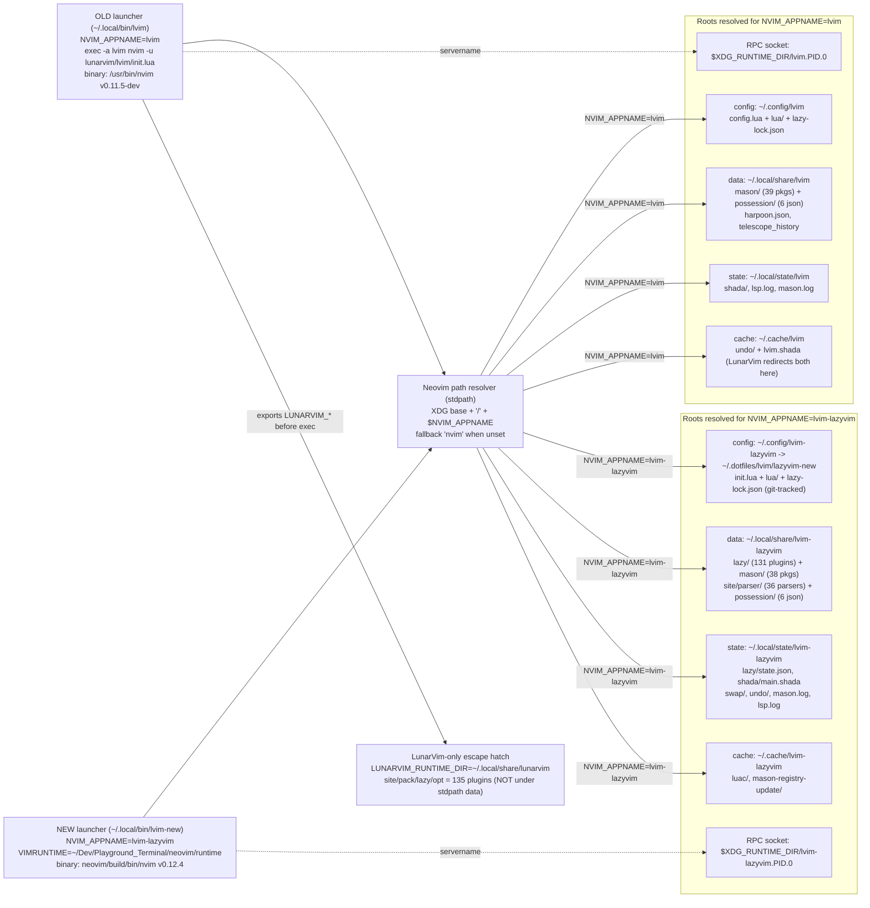
```mermaid
%% NVIM_APPNAME fan-out: one env var re-points all four XDG roots, and everything
%% each editor persists is derived from them by stdpath().
flowchart LR
    LauncherOld["OLD launcher (~/.local/bin/lvim)<br/>NVIM_APPNAME=lvim<br/>exec -a lvim nvim -u lunarvim/lvim/init.lua<br/>binary: /usr/bin/nvim v0.11.5-dev"]
    LauncherNew["NEW launcher (~/.local/bin/lvim-new)<br/>NVIM_APPNAME=lvim-lazyvim<br/>VIMRUNTIME=~/Dev/Playground_Terminal/neovim/runtime<br/>binary: neovim/build/bin/nvim v0.12.4"]
    Stdpath["Neovim path resolver (stdpath)<br/>XDG base + '/' + $NVIM_APPNAME<br/>fallback 'nvim' when unset"]

    LauncherOld --> Stdpath
    LauncherNew --> Stdpath

    subgraph OldRoots["Roots resolved for NVIM_APPNAME=lvim"]
        OldCfg["config: ~/.config/lvim<br/>config.lua + lua/ + lazy-lock.json"]
        OldData["data: ~/.local/share/lvim<br/>mason/ (39 pkgs) + possession/ (6 json)<br/>harpoon.json, telescope_history"]
        OldState["state: ~/.local/state/lvim<br/>shada/, lsp.log, mason.log"]
        OldCache["cache: ~/.cache/lvim<br/>undo/ + lvim.shada (LunarVim redirects both here)"]
        OldSock["RPC socket: $XDG_RUNTIME_DIR/lvim.PID.0"]
    end

    subgraph NewRoots["Roots resolved for NVIM_APPNAME=lvim-lazyvim"]
        NewCfg["config: ~/.config/lvim-lazyvim -> ~/.dotfiles/lvim/lazyvim-new<br/>init.lua + lua/ + lazy-lock.json (git-tracked)"]
        NewData["data: ~/.local/share/lvim-lazyvim<br/>lazy/ (131 plugins) + mason/ (38 pkgs)<br/>site/parser/ (36 parsers) + possession/ (6 json)"]
        NewState["state: ~/.local/state/lvim-lazyvim<br/>lazy/state.json, shada/main.shada<br/>swap/, undo/, mason.log, lsp.log"]
        NewCache["cache: ~/.cache/lvim-lazyvim<br/>luac/, mason-registry-update/"]
        NewSock["RPC socket: $XDG_RUNTIME_DIR/lvim-lazyvim.PID.0"]
    end

    Stdpath -->|"NVIM_APPNAME=lvim"| OldCfg
    Stdpath -->|"NVIM_APPNAME=lvim"| OldData
    Stdpath -->|"NVIM_APPNAME=lvim"| OldState
    Stdpath -->|"NVIM_APPNAME=lvim"| OldCache
    LauncherOld -.->|"servername"| OldSock

    Stdpath -->|"NVIM_APPNAME=lvim-lazyvim"| NewCfg
    Stdpath -->|"NVIM_APPNAME=lvim-lazyvim"| NewData
    Stdpath -->|"NVIM_APPNAME=lvim-lazyvim"| NewState
    Stdpath -->|"NVIM_APPNAME=lvim-lazyvim"| NewCache
    LauncherNew -.->|"servername"| NewSock

    OldExtra["LunarVim-only escape hatch<br/>LUNARVIM_RUNTIME_DIR=~/.local/share/lunarvim<br/>site/pack/lazy/opt = 135 plugins (NOT under stdpath data)"]
    LauncherOld -->|"exports LUNARVIM_* before exec"| OldExtra
```

**Explanation.** The resolver in the middle is the entire mechanism: Neovim appends
`$NVIM_APPNAME` (default `nvim`) to `$XDG_CONFIG_HOME`, `$XDG_DATA_HOME`, `$XDG_STATE_HOME` and
`$XDG_CACHE_HOME`. Verified on this machine by asking each binary directly:

```
NVIM_APPNAME=lvim          -> config /home/tripham/.config/lvim
                              data   /home/tripham/.local/share/lvim
                              state  /home/tripham/.local/state/lvim
                              cache  /home/tripham/.cache/lvim
NVIM_APPNAME=lvim-lazyvim  -> config /home/tripham/.config/lvim-lazyvim
                              data   /home/tripham/.local/share/lvim-lazyvim
                              state  /home/tripham/.local/state/lvim-lazyvim
                              cache  /home/tripham/.cache/lvim-lazyvim
```

Because plugins never hardcode paths — they call `stdpath("data")` — the split propagates for
free: lazy.nvim clones into `data/lazy`, Mason installs into `data/mason`, nvim-treesitter's
`main` branch writes parsers to `data/site/parser`, possession.nvim defaults its `session_dir` to
`data/possession` (left at the default in `lazyvim-new/lua/plugins/tools.lua:148`–`:157`), and the
dashboard reads that same directory back (`lazyvim-new/lua/plugins/ui.lua:100`–`:101`). Nothing in
`lazyvim-new/` contains an absolute path to a store; there is nothing to "point at the other
editor" by mistake.

Three asymmetries in the diagram are worth internalising, because they are the ones that surprise:

1. **The lockfile lives in the *config* root, not state.** lazy.nvim writes `lazy-lock.json` next
   to `init.lua`. For `lvim-new` the config root is a symlink into the repo
   (`~/.config/lvim-lazyvim -> ~/.dotfiles/lvim/lazyvim-new`, created at `setup_lvim.sh:108`), so
   the lock is **inside git** — plugin pinning is version-controlled, and `setup_lvim.sh old`
   (which only removes the symlink and the launcher) cannot lose it. LunarVim's lock sits in
   `~/.config/lvim/lazy-lock.json`, i.e. in *its* config dir, which is a real directory.
2. **LunarVim is not purely `NVIM_APPNAME`-isolated.** Its launcher also exports
   `LUNARVIM_RUNTIME_DIR=~/.local/share/lunarvim` (`~/.local/bin/lvim:5`) and boots with
   `-u $LUNARVIM_BASE_DIR/init.lua`, so its *plugins* (135 dirs under
   `~/.local/share/lunarvim/site/pack/lazy/opt`) and its own core live outside `stdpath("data")`,
   while its Mason and possession stores *do* obey `stdpath("data")` and land in
   `~/.local/share/lvim`. The new config has no such escape hatch — `lvim-new` is `NVIM_APPNAME`
   and nothing else.
3. **LunarVim relocates undo and ShaDa into `cache`.** `lvim/config/settings.lua:7` sets
   `undodir = <cache>/undo` and `:48` sets `shadafile = <cache>/lvim.shada`, which is why
   `~/.cache/lvim` is 127M and holds state that is not cache at all. `lvim-new` keeps Neovim's
   defaults, measured live: `undodir=~/.local/state/lvim-lazyvim/undo//`,
   `directory=~/.local/state/lvim-lazyvim/swap//`, `shadafile=` (empty, so
   `~/.local/state/lvim-lazyvim/shada/main.shada`). Hence `~/.cache/lvim-lazyvim` is only 11M and
   is genuinely disposable.

The "fifth namespace" is the RPC listen socket. Neovim derives the default server address from
the appname as well, so the two editors advertise themselves distinguishably — observed
concurrently in `/run/user/1000/`:

```
lvim.385941.0            <- a running LunarVim
lvim-lazyvim.2794443.0   <- a running lvim-new
nvim.2623754.0           <- a bare nvim (no NVIM_APPNAME)
```

This is not incidental: it is precisely what lets `tol` and `tol-new` route a file to the *right*
running editor by globbing `${XDG_RUNTIME_DIR}/lvim.*.0` vs `${XDG_RUNTIME_DIR}/lvim-lazyvim.*.0`
(see III.15). Isolation of the socket namespace is what makes remote-open routing possible at all.

### III.2.2 The two trees, side by side

```
OLD  NVIM_APPNAME=lvim (LunarVim, /usr/bin/nvim 0.11.5)   NEW  NVIM_APPNAME=lvim-lazyvim (LazyVim, built 0.12.4)
-------------------------------------------------------   ------------------------------------------------------
~/.config/lvim/                        (real dir)          ~/.config/lvim-lazyvim -> ~/.dotfiles/lvim/lazyvim-new
  |-- config.lua                                             |-- init.lua
  |-- lazy-lock.json                                         |-- lazy-lock.json        (git-tracked, in repo)
  `-- lua/                                                   `-- lua/
                                                                 |-- config/          (options, keymaps, autocmds)
                                                                 |-- plugins/         (lsp.lua, ai.lua, ui.lua, ...)
                                                                 `-- custom/          (possession save prompt, ...)

~/.local/share/lvim/            1.8G                       ~/.local/share/lvim-lazyvim/          3.8G
  |-- mason/packages/     (39)                               |-- lazy/                (131 plugins)
  |-- possession/          (6 json)                          |-- mason/packages/      (38)
  |-- avante/                                                |-- site/parser/         (36 parsers)
  |-- harpoon.json                                           |-- possession/          (6 json)
  |-- telescope_history                                      |-- project_nvim/
  `-- file_frecency.bin                                      `-- avante/

  (plugins are NOT here -- LunarVim keeps them in)
~/.local/share/lunarvim/        991M
  |-- lvim/                     (LunarVim core)
  `-- site/pack/lazy/opt/       (135 plugins)

~/.local/state/lvim/            307M                       ~/.local/state/lvim-lazyvim/          560K
  |-- shada/                                                 |-- lazy/state.json, pkg-cache.lua
  |-- lsp.log, mason.log                                     |-- shada/main.shada
  `-- (logs: dap, luasnip, hardtime, ...)                    |-- swap/                 (directory=state/swap//)
                                                             |-- undo/                 (undodir=state/undo//)
                                                             |-- blink/
                                                             `-- lsp.log, mason.log, nvim.log

~/.cache/lvim/                  127M                       ~/.cache/lvim-lazyvim/                11M
  |-- undo/           <- NOT cache: LunarVim redirects        |-- luac/
  |-- lvim.shada      <- NOT cache: LunarVim redirects        |-- mason-registry-update/
  |-- luac/, project_nvim/                                    `-- catppuccin/, avante/
  `-- (logs: dap, diffview, null-ls, lvim.log)

$XDG_RUNTIME_DIR/lvim.<pid>.0                              $XDG_RUNTIME_DIR/lvim-lazyvim.<pid>.0
```

**Explanation.** Read the two columns as *disjoint sets of files*. There is no shared file, no
shared lockfile, no shared registry, no shared log — deleting the entire right column restores the
machine to a pure-LunarVim state, which is exactly the guarantee `setup_lvim.sh old` leans on: it
removes only the symlink and the launcher and *preserves* the right-hand data/state/cache trees
(`setup_lvim.sh:174`–`:178`), so re-running `new` is an instant re-entry with no re-clone. The disk
figures also quantify the price of isolation: the new tree carries its own 131-plugin clone and its
own 38-package Mason root, i.e. a second `clangd`, a second `lua-language-server`, a second
`rust-analyzer`. Isolation is bought with duplication, deliberately.

### III.2.3 The isolation boundary and its holes

`NVIM_APPNAME` isolates *Neovim's own state*. It does not, and cannot, isolate the operating
system underneath. Everything the two editors reach *outward* to is shared, and every real bug in
this migration lived in one of those holes.


```mermaid
%% What NVIM_APPNAME does NOT separate: the shared substrate both editors reach into.
flowchart TB
    OldEditor["OLD editor (lvim / LunarVim)<br/>NVIM_APPNAME=lvim"]
    NewEditor["NEW editor (lvim-new / LazyVim)<br/>NVIM_APPNAME=lvim-lazyvim"]

    subgraph Isolated["Isolated by NVIM_APPNAME (no contention possible)"]
        Plugins["plugin trees + lazy-lock<br/>135 opt dirs vs 131 lazy dirs"]
        MasonTrees["Mason roots<br/>39 pkgs vs 38 pkgs (duplicate clangd, lua_ls, ...)"]
        Persist["shada + undo + swap + possession sessions"]
    end

    subgraph Shared["SHARED substrate (the holes -- one global namespace)"]
        Repo["Config source (~/.dotfiles)<br/>lazyvim-new/ + lvim config + docs/"]
        BinScripts["Shell entry points (~/.dotfiles/bin, ~/.local/bin)<br/>tol, tol-new, mimeopen_bg, lvim, lvim-new"]
        DesktopDB["Desktop MIME database (~/.local/share/applications)<br/>lvim.desktop + lvim-new.desktop + mimeinfo.cache + mimeapps.list"]
        Tmux["Terminal multiplexer (tmux) + $XDG_RUNTIME_DIR sockets"]
        NodePath["Node toolchain on $PATH (nvm)<br/>v20.11.1 default#59; v22.17.1 in a second nvm root"]
        SysTools["System toolchain (git, cc, make, npm, cargo, python)<br/>used by Mason + native plugin builds"]
        Files["The files you edit (working trees on disk)"]
        Clip["OS clipboard + X11/Wayland session"]
    end

    OldEditor --> Plugins
    OldEditor --> MasonTrees
    OldEditor --> Persist
    NewEditor --> Plugins
    NewEditor --> MasonTrees
    NewEditor --> Persist

    OldEditor --> Repo
    OldEditor --> BinScripts
    OldEditor --> DesktopDB
    OldEditor --> Tmux
    OldEditor --> NodePath
    OldEditor --> SysTools
    OldEditor --> Files
    OldEditor --> Clip

    NewEditor --> Repo
    NewEditor --> BinScripts
    NewEditor --> DesktopDB
    NewEditor --> Tmux
    NewEditor --> NodePath
    NewEditor --> SysTools
    NewEditor --> Files
    NewEditor --> Clip

    DesktopDB -.->|"single menu, two entries compete<br/>=> mimeopen_bg must splice slot 2"| Hole1["HOLE: MIME menu ordering (see III.14)"]
    NodePath -.->|"copilot.lua rejects Node &lt; 22<br/>=> ai.lua globs both nvm roots"| Hole2["HOLE: Node version (see III.12)"]
    Files -.->|"swap dirs differ => NO E325 warning<br/>if the same file is open in both editors"| Hole3["HOLE: no cross-editor swap protection"]
    MasonTrees -.->|"two copies of every server on disk"| Hole4["COST: a full second Mason root + plugin tree<br/>(3.8G new vs 1.8G + 991M old)"]
```

**Explanation.** The left/upper box is what the migration got for free. The lower box is what it had
to engineer around:

- **The desktop MIME database is a single global namespace.** Both `lvim.desktop` and
  `lvim-new.desktop` register into the same `~/.local/share/applications/mimeinfo.cache`, and the
  "open with" menu is built from that one file. `NVIM_APPNAME` gives no ordering guarantee, which is
  the entire reason `mimeopen_bg` has to splice `lvim-new` into slot 2 itself (see III.14) — and why
  the `update-desktop-database | head` SIGPIPE trap silently deregisters the new editor.
- **`$PATH` is shared.** The `node` both editors see is the nvm default (`v20.11.1`);
  `copilot.lua` hard-refuses Node < 22. The fix lives *inside the config*
  (`lazyvim-new/lua/plugins/ai.lua`, which globs both nvm roots and sets `copilot_node_command`),
  not in the environment — precisely because touching the environment would leak into LunarVim
  (see III.12).
- **The files on disk are shared, but swap files are not.** `directory` resolves to
  `~/.local/state/lvim-lazyvim/swap//` for the new editor and `~/.cache/lvim/...` for the old one,
  so opening the *same* buffer in both editors simultaneously raises **no `E325 ATTENTION`
  warning** — the classic swap-collision guard is defeated by the isolation itself. This is the one
  hazard the design creates rather than removes; during the dual-run period, treat "same file, both
  editors" as unprotected.
- **Mason duplication is the price, not a bug.** 38 packages on the new side, 39 on the old,
  overlapping heavily (both trees contain `clangd`, `lua-language-server`, `rust-analyzer`,
  `gopls`, ...). They cannot be shared, because Mason's registry, install layout and `bin/` shims
  are all `stdpath("data")`-relative. Accept ~2x disk for zero cross-contamination (see III.10 for
  the Mason split and its silent-failure trap).
- **`XDG_RUNTIME_DIR` is shared but *namespaced*** — the one hole that turned out to be a feature
  (III.15).

### III.2.4 Consequence: migrating sessions is a file copy, not an import

The sharpest practical payoff of `stdpath`-derived isolation is that two *different* editors
running the *same* plugin at the *same* defaults produce two directories of *interchangeable*
files. Both LunarVim and `lvim-new` run `possession.nvim` with `session_dir` left at its default
(`stdpath("data") .. "/possession"`), and both therefore write the identical five-key JSON schema
(`vimscript`, `plugins`, `name`, `cwd`, `user_data`). Migration is `cp`.

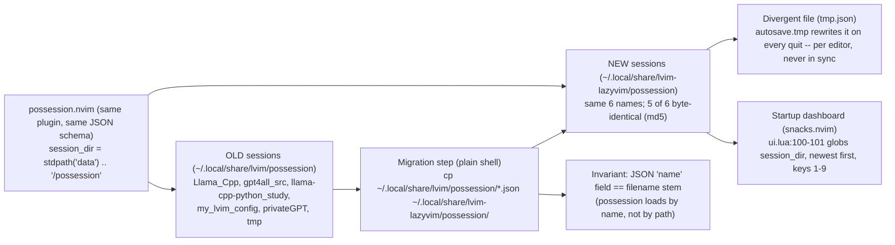
```mermaid
%% Session migration: identical schema, different appname-derived directories.
flowchart LR
    Possession["possession.nvim (same plugin, same JSON schema)<br/>session_dir = stdpath('data') .. '/possession'"]
    OldDir["OLD sessions (~/.local/share/lvim/possession)<br/>Llama_Cpp, gpt4all_src, llama-cpp-python_study,<br/>my_lvim_config, privateGPT, tmp"]
    NewDir["NEW sessions (~/.local/share/lvim-lazyvim/possession)<br/>same 6 names#59; 5 of 6 byte-identical (md5)"]
    Copy["Migration step (plain shell)<br/>cp ~/.local/share/lvim/possession/*.json ~/.local/share/lvim-lazyvim/possession/"]
    Invariant["Invariant: JSON 'name' field == filename stem<br/>(possession loads by name, not by path)"]
    Tmp["Divergent file (tmp.json)<br/>autosave.tmp rewrites it on every quit -- per editor, never in sync"]
    Dashboard["Startup dashboard (snacks.nvim)<br/>ui.lua:100-101 globs session_dir, newest first, keys 1-9"]

    Possession --> OldDir
    Possession --> NewDir
    OldDir --> Copy
    Copy --> NewDir
    Copy --> Invariant
    NewDir --> Tmp
    NewDir --> Dashboard
```

**Explanation.** Because the plugin, the schema and the defaults are identical and only the *root*
differs, there is no import path, no version negotiation, no conversion tool — the six sessions
were moved with a single `cp *.json`. The proof is on disk: five of the six JSON files still hash
identically across the two trees, e.g.

```
0433f9bf90b837f23dfff8fc5e6b64e5  ~/.local/share/lvim/possession/llama-cpp-python_study.json
0433f9bf90b837f23dfff8fc5e6b64e5  ~/.local/share/lvim-lazyvim/possession/llama-cpp-python_study.json
```

Only `tmp.json` diverges, and by design: `autosave = { current = true, tmp = true, tmp_name = "tmp",
on_load = true, on_quit = true }` (`lazyvim-new/lua/plugins/tools.lua:152`) makes `tmp` a scratch
slot that each editor rewrites on *its own* exit. Two rules follow from the copy being literal:
the JSON `name` field must match the filename stem (possession resolves sessions by name, so a
renamed file with a stale `name` loads the wrong session or nothing), and the dashboard picks the
sessions up with no registration step at all — it globs `session_dir` directly and sorts by mtime
(`lazyvim-new/lua/plugins/ui.lua:100`–`:107`), which is why a freshly copied session appears on the
next start.

The same logic bounds what *cannot* be copied. `lazy-lock.json` is meaningless across the boundary
(disjoint plugin sets: 135 LunarVim `opt` dirs vs 131 lazy dirs). The Mason roots cannot be
hard-linked or symlinked together (different registry snapshots, different `bin/` shims, and the
new tree deliberately omits packages the old one has). ShaDa is per-editor by construction, so
marks, registers, the jumplist and `:oldfiles` do **not** cross — a deliberate consequence, since a
shared ShaDa would reintroduce exactly the coupling `NVIM_APPNAME` was chosen to eliminate. What
transfers is what is genuinely portable data (sessions), and it transfers as bytes.
---

## III.3 Neovim 0.12.x: Build, Non-Install, and the VIMRUNTIME Binding

`lvim-new` does not run the Neovim that Ubuntu installed. It runs a **locally built, deliberately
never-installed** Neovim v0.12.4 (Release) that lives entirely inside a source checkout at
`~/Dev/Playground_Terminal/neovim`. LunarVim keeps running the distro binary,
`/usr/bin/nvim` = `NVIM v0.11.5-dev-49+g9ce88d5cb9`, from the `neovim` DEB package.

That single decision -- *build but do not install* -- is what makes the two editors independent at
the **binary** level, not merely at the config level (`NVIM_APPNAME` isolation is covered in the
switcher and XDG-layout sections of this Part). It also creates the one non-obvious binding that the
whole setup rests on: **a Neovim that was never installed cannot find its own runtime**, so the
launcher must hand it one via `VIMRUNTIME`. This subsection documents the build pipeline, the exact
resolution mechanism, the failure it produces when the binding is missing, why rebuilding is provably
harmless to LunarVim, and why the build script's `--install` flag must never be used on this host.

### III.3.1 The build pipeline: `build_and_update_neovim.sh`

`~/.dotfiles/script/build_and_update_neovim.sh` (155 lines) is a thin, opinionated wrapper around
Neovim's own `Makefile` + CPack. Its defaults are the contract:

| Setting | Line | Default | Notes |
|---|---|---|---|
| `DEFAULT_VERSION` -> `NVIM_VERSION` | `:29`-`:30` | `v0.12.4` | Any git ref: tag, branch, or commit (`-v/--version`) |
| `DEFAULT_BUILD_TYPE` -> `BUILD_TYPE` | `:35`-`:36` | `Release` | `-t/--build-type`; `Release` / `RelWithDebInfo` / `Debug` / `MinSizeRel` (`:32`-`:34`) |
| `DO_INSTALL` | `:31` | `false` | Install is **opt-in** via `-i/--install` (`:76`-`:79`) |
| Checkout dir | `:96`-`:103` | `~/Dev/Playground_Terminal/neovim` | Hardcoded; created with `mkdir -p` if absent |
| Install prefix | `:119` | `/usr/local` | Passed to CMake; **compiled into the binary** as the `$VIM` fall-back |

Unknown arguments are a hard error (`:84`-`:88`, `exit 1`). Note the script has **no** `set -e`
(`:1` is a bare `#!/bin/bash`), so a `make` failure does not abort it -- it will still `cd build` and
try to `cpack`; the failure surfaces there. That is a wart, not a hazard: nothing downstream of a
failed build gets installed, because nothing is installed at all by default.

```mermaid
flowchart TD
    CLI["build_and_update_neovim.sh<br/>flags: -v ref | -t type | -i | -h"]
    Banner["Banner (:148-:152)<br/>announces build vs build+install"]
    Pushd["pushd . + mkdir -p ~/Dev/Playground_Terminal (:97-:99)"]
    HasTree{"Checkout exists?<br/>[ -d neovim ] (:100)"}
    Clone["git clone github.com/neovim/neovim (:101)"]
    Fetch["git fetch --all --tags --prune (:106)"]
    Checkout{"git checkout $NVIM_VERSION<br/>default v0.12.4 (:107)"}
    CheckoutFail["red error + popd + exit 1 (:108-:110)"]
    OnBranch{"git symbolic-ref -q HEAD<br/>i.e. on a branch? (:113)"}
    Pull["git pull --ff-only (:114)"]
    SkipPull["skip pull<br/>tag checkout = detached HEAD, no upstream"]
    Clean["rm -rf build && rm -rf .deps (:118)<br/>ALWAYS -- no incremental path"]
    Make["make CMAKE_BUILD_TYPE=$BUILD_TYPE<br/>CMAKE_INSTALL_PREFIX=/usr/local (:119)"]
    Artifacts["Artifacts in build/<br/>bin/nvim (the binary lvim-new runs)<br/>lib/nvim/parser/*.so (bundled parsers)"]
    Nobara{"/etc/nobara-release present? (:123)"}
    CpackRPM["cpack -G RPM (:124)"]
    CpackDEB["cpack (:126)<br/>-> build/nvim-linux-x86_64.deb (11#44;474#44;094 B)"]
    DoInstall{"DO_INSTALL == true?<br/>only with -i (:129)"}
    InstallDEB["sudo apt install -f ./nvim-linux-x86_64.deb (:135)<br/>DANGER -- see III.3.5"]
    NoInstall["Print: Build complete. Skipping install. (:138-:139)<br/>DEFAULT PATH -- package is left on disk, untouched"]
    Popd["popd (:142)"]

    CLI --> Banner --> Pushd --> HasTree
    HasTree -- "no" --> Clone --> Fetch
    HasTree -- "yes (reuse tree)" --> Fetch
    Fetch --> Checkout
    Checkout -- "fails" --> CheckoutFail
    Checkout -- "ok" --> OnBranch
    OnBranch -- "yes" --> Pull --> Clean
    OnBranch -- "no (tag)" --> SkipPull --> Clean
    Clean --> Make --> Artifacts --> Nobara
    Nobara -- "yes" --> CpackRPM --> DoInstall
    Nobara -- "no (Ubuntu 24.04)" --> CpackDEB --> DoInstall
    DoInstall -- "yes" --> InstallDEB --> Popd
    DoInstall -- "no (default)" --> NoInstall --> Popd
```

The diagram is the whole script. Four properties of it matter downstream:

1. **The tree is reused, the build is not.** `rm -rf build && rm -rf .deps` at `:118` runs on every
   invocation, unconditionally. There is no incremental build; bundled dependencies (`.deps`) are
   re-fetched and recompiled from scratch each time. A rebuild is therefore a *long* operation during
   which `build/bin/nvim` **does not exist** -- see the operational note in III.3.6.
2. **Tag checkouts are detached-HEAD by construction**, and `:113` correctly guards `git pull` behind
   `git symbolic-ref -q HEAD`, so the default `v0.12.4` path never tries to pull a non-existent
   upstream. Verified on this machine: `git -C ~/Dev/Playground_Terminal/neovim status -sb` prints
   `## HEAD (no branch)`, `git describe --tags` prints `v0.12.4`.
3. **`cpack` always runs, `install` almost never does.** The Ubuntu branch produced
   `~/Dev/Playground_Terminal/neovim/build/nvim-linux-x86_64.deb` (11,474,094 bytes) and a
   `nvim-linux-x86_64.tar.gz`. Both are inert files sitting in the build tree. `DO_INSTALL=false`
   (`:31`) means the script stops at "here is a package"; the packages exist purely as an escape
   hatch (III.3.5).
4. **`CMAKE_INSTALL_PREFIX=/usr/local` (`:119`) is a promise the script then refuses to keep.** It
   bakes `/usr/local/share/nvim` into the binary as its runtime fall-back, and then never creates
   that directory. That contradiction is the subject of the next subsection.

### III.3.2 Why the built binary cannot find its own runtime

Neovim resolves `$VIMRUNTIME` at startup through a small ladder. Only the first rung that names an
**existing** directory wins:

1. `$VIMRUNTIME` from the environment (if set, it is used verbatim);
2. a prefix derived from the **executable's own path** (`<exedir>/../share/nvim/runtime`);
3. the compiled-in fall-back, i.e. `CMAKE_INSTALL_PREFIX/share/nvim`.

The two binaries on this machine take different rungs, and that is the entire story. Both were
compiled with the *same* fall-back -- `nvim -V1 -v` prints `fall-back for $VIM: "/usr/local/share/nvim"`
for **both** `/usr/bin/nvim` (0.11.5) and `build/bin/nvim` (0.12.4) -- yet only one of them starts
without help, which proves that rung 2, not rung 3, is what makes an *installed* Neovim work.

```mermaid
flowchart TD
    subgraph SystemLane["System nvim -- LunarVim's editor (installed)"]
        SysExe["/usr/bin/nvim<br/>NVIM v0.11.5-dev-49+g9ce88d5cb9<br/>owner: DEB package 'neovim' (dpkg -S)"]
        SysEnv{"$VIMRUNTIME set in env?<br/>lvim launcher does NOT set it"}
        SysExepath["Rung 2: exepath-derived prefix<br/>/usr/bin/nvim -> prefix /usr<br/>candidate /usr/share/nvim/runtime"]
        SysExists{"Directory exists?"}
        SysOK["RESOLVED<br/>VIMRUNTIME = /usr/share/nvim/runtime<br/>libdir /usr/lib/nvim also on &rtp (bundled parsers)"]
        SysExe --> SysEnv
        SysEnv -- "no" --> SysExepath --> SysExists
        SysExists -- "YES -- shipped by the DEB" --> SysOK
    end

    subgraph BuildLane["Built nvim -- lvim-new's editor (never installed)"]
        BuildExe["~/Dev/Playground_Terminal/neovim/build/bin/nvim<br/>NVIM v0.12.4 (Release)"]
        LauncherQ{"Launched via ~/.local/bin/lvim-new?<br/>i.e. is VIMRUNTIME exported?"}
        Bound["Rung 1 WINS<br/>VIMRUNTIME=~/Dev/Playground_Terminal/neovim/runtime<br/>(the SOURCE runtime#44; present in the checkout)"]
        BuildOK["RESOLVED<br/>&rtp = ...#47;neovim#47;runtime + ...#47;neovim#47;build#47;lib#47;nvim<br/>libdir found by exepath -- parsers OK"]
        BareExepath["Rung 2: exepath-derived prefix<br/>build/bin/nvim -> prefix build#47;<br/>candidate build/share/nvim"]
        BareExists{"build/share/nvim exists?"}
        Fallback["Rung 3: compiled-in fall-back<br/>CMAKE_INSTALL_PREFIX=/usr/local<br/>-> /usr/local/share/nvim"]
        FallbackExists{"/usr/local/share/nvim exists?"}
        Boom["FAILURE<br/>E5113: module 'vim.uri' not found<br/>E484: Can't open file /usr/local/share/nvim/syntax/syntax.vim"]
        BuildExe --> LauncherQ
        LauncherQ -- "yes" --> Bound --> BuildOK
        LauncherQ -- "no (bare invocation)" --> BareExepath --> BareExists
        BareExists -- "NO -- 'make install' never ran" --> Fallback --> FallbackExists
        FallbackExists -- "NO -- --install never passed" --> Boom
    end
```

Read the right-hand lane as the causal chain it is. `build_and_update_neovim.sh:119` compiles
`/usr/local/share/nvim` into the binary; `build_and_update_neovim.sh:31` + `:137`-`:140` then decline
to create it. The exepath rung cannot save the binary either, because a *build tree* has no
`share/nvim` sibling of `bin/` -- verified: `ls -d ~/Dev/Playground_Terminal/neovim/build/share` ->
`No such file or directory`, and `ls -d /usr/local/share/nvim` -> `No such file or directory`. Both
rungs miss, and Neovim starts with a `$VIMRUNTIME` pointing into the void.

The failure is not a clean "runtime not found" message. Reproduced verbatim on this machine:

```
$ env -u VIMRUNTIME NVIM_APPNAME=lvim-lazyvim \
    ~/Dev/Playground_Terminal/neovim/build/bin/nvim --headless -c 'echo $VIMRUNTIME' -c qa

Error in /home/tripham/.dotfiles/lvim/lazyvim-new/init.lua:
E5113: Lua chunk: vim/_init_packages:78: module 'vim.uri' not found:
        no field package.preload['vim.uri']
        no file './vim/uri.lua'
        no file '/home/tripham/Dev/Playground_Terminal/neovim/.deps/usr/share/luajit-2.1/vim/uri.lua'
        ...
stack traceback:
        [C]: in function 'require'
        vim/_init_packages:78: in function '__index'
        ...
        .../lvim-lazyvim/lazy/lazy.nvim/lua/lazy/init.lua:61: in function 'setup'
        /home/tripham/.config/lvim-lazyvim/lua/config/lazy.lua:13: in main chunk
        /home/tripham/.dotfiles/lvim/lazyvim-new/init.lua:4: in main chunk
E484: Can't open file /usr/local/share/nvim/syntax/syntax.vim
/usr/local/share/nvim
```

Both symptoms come from the same root. `vim/_init_packages` cannot `require('vim.uri')` because the
Lua half of the runtime (`runtime/lua/vim/*.lua`) is unreachable; the search path it prints is the
*bundled-deps* Lua path, which is a red herring -- it is simply what remains after `$VIMRUNTIME/lua`
drops out. The trailing `E484 ... /usr/local/share/nvim/syntax/syntax.vim` is the same absence hitting
the Vimscript half. And note *where* the Lua traceback dies: inside `lazy.nvim`'s `setup()`, called
from `lua/config/lazy.lua:13`. Anyone debugging this from the traceback alone will spend an hour
suspecting LazyVim. **The bug is not in the config; the config is merely the first code that touches
the missing runtime.** That is exactly why the launcher, not the config, must own the fix.

### III.3.3 The binding: what the launcher exports, and what it deliberately does not

`setup_lvim.sh:37` defines the runtime path and `setup_lvim.sh:114`-`:122` writes it into the
launcher. The generated `~/.local/bin/lvim-new` (491 bytes, mode `-rwxrwxr-x`) is, on disk today:

```bash
#!/usr/bin/env bash
# Auto-generated by setup_lvim.sh -- launches the LazyVim migration config,
# fully isolated from LunarVim via NVIM_APPNAME=lvim-lazyvim.
# Uses a locally-built Neovim; VIMRUNTIME points at its source runtime/ dir so the
# build tree can find its runtime (bundled parsers resolve via build/lib/nvim).
exec env NVIM_APPNAME="lvim-lazyvim" VIMRUNTIME="/home/tripham/Dev/Playground_Terminal/neovim/runtime" "/home/tripham/Dev/Playground_Terminal/neovim/build/bin/nvim" "$@"
```

Three details are load-bearing:

- **`VIMRUNTIME` points at the SOURCE tree, not the build tree.** `~/Dev/Playground_Terminal/neovim/runtime`
  is the checkout's `runtime/` directory -- the same tree `make install` would have copied to
  `<prefix>/share/nvim/runtime`. It contains `lua/vim/uri.lua` and `syntax/syntax.vim` (both verified
  present), which are precisely the two files the failure above could not find. Because it is the
  *checked-out* runtime, it is automatically consistent with the binary: `git checkout v0.12.4`
  moved both the C sources and `runtime/` to the same tag.
- **`VIMRUNTIME` is the ONLY override needed** -- the comment at `setup_lvim.sh:34`-`:35` and
  `:119`-`:120` says so, and `&runtimepath` proves it. Under the launcher's env, `&rtp` contains
  `.../neovim/runtime` immediately followed by `.../neovim/build/lib/nvim`. That second entry is
  Neovim's *libdir*, and it is derived from the **executable path** (`build/bin/nvim` ->
  `build/lib/nvim`), not from `$VIMRUNTIME`. `build/lib/nvim/parser/` holds the bundled parsers
  (`c.so`, `lua.so`, `markdown.so`, `markdown_inline.so`, `query.so`, `vim.so`, `vimdoc.so`), so they
  resolve for free. The exact mirror holds for the installed binary: `/usr/bin/nvim` -> `/usr/lib/nvim`,
  also on `&rtp`. Exepath-derivation works for the *libdir* in a build tree because `build/lib/nvim`
  exists; it fails for the *runtime* only because `build/share/nvim` does not.
- **`exec env ... "$@"`** means no wrapper process survives and every argument is forwarded verbatim.
  This is what lets `lvim-new --server <sock> --remote <file>` (driven by `tol-new`, see the
  desktop-integration subsection) and `lvim-new --headless '+Lazy! sync' +qa` work unchanged.

`setup_lvim.sh` emits a **second launcher variant** (`:123`-`:130`) with *no* `VIMRUNTIME=` line
whenever `NVIM_RUNTIME` is empty. That branch exists for an *installed* Neovim -- one that can use
rung 2 -- and `check_nvim()` selects it automatically: if `NVIM_BIN` is not executable it falls back
to `nvim` on `PATH` **and clears `NVIM_RUNTIME`** in the same statement (`setup_lvim.sh:74`). The
coupling is deliberate: an installed nvim must never inherit a build tree's `runtime/`.

That coupling also has a sharp edge, worth stating explicitly because it produces a *silently wrong*
editor rather than an error:

> **Trap.** `LVIM_NEW_NVIM=/usr/bin/nvim ./setup_lvim.sh new` passes `[ -x "$NVIM_BIN" ]`, so the
> fallback at `:71` never fires and `NVIM_RUNTIME` keeps its build-tree default. The launcher becomes
> a version-mismatched hybrid: the **0.11.5** system binary running the **0.12.4** source runtime.
> The correct invocation is `LVIM_NEW_NVIM=/usr/bin/nvim LVIM_NEW_VIMRUNTIME= ./setup_lvim.sh new`.
> The one-glance tell is `setup_lvim.sh:83`, which prints the `VIMRUNTIME ... (local build tree)`
> line only when `NVIM_RUNTIME` is non-empty: if you asked for a system nvim and still see that line,
> stop.

### III.3.4 Why rebuilding the source tree cannot break LunarVim

This is the safety argument the whole "two editors" design leans on, so it is worth walking rather
than asserting. LunarVim's binary and LunarVim's runtime are **files owned by a distro package**,
physically disjoint from the build tree:

| Question | Answer (verified) |
|---|---|
| What binary does LunarVim run? | `~/.local/bin/lvim` ends in `exec -a "$NVIM_APPNAME" nvim -u "$LUNARVIM_BASE_DIR/init.lua" "$@"` -- a **bare `nvim`, resolved from `PATH`** -> `/usr/bin/nvim` |
| Who owns that binary? | `dpkg -S /usr/bin/nvim` -> `neovim` (the DEB package, version 0.11.5) |
| Where is its runtime? | `/usr/share/nvim/runtime`, owned by the same package: `dpkg -S /usr/share/nvim/runtime/syntax/syntax.vim` -> `neovim` |
| How does it find that runtime? | The `lvim` launcher never sets `VIMRUNTIME`, so rung 2 fires: exepath `/usr/bin/nvim` -> prefix `/usr` -> `/usr/share/nvim/runtime` (exists). Confirmed: `nvim --headless -c 'echo $VIMRUNTIME' -c qa` prints `/usr/share/nvim/runtime` |
| Does anything in the build tree appear in that resolution? | No. The build tree contributes **zero** entries to the system nvim's `&rtp` |

Now overlay what `build_and_update_neovim.sh` writes. Every mutating step is confined to
`~/Dev/Playground_Terminal/neovim`: `git clone`/`git fetch`/`git checkout` (`:101`-`:114`),
`rm -rf build .deps` (`:118`), `make` (`:119`), `cpack` (`:124`/`:126`). Nothing under `/usr` is
touched, and nothing is written to `PATH` directories -- unless `-i` is passed (III.3.5). Therefore:

- **Rebuilding at a different tag** replaces `build/bin/nvim` and re-checks-out `runtime/`. LunarVim
  is unaffected because it reads neither path. Only `lvim-new` moves.
- **Deleting the build tree entirely** breaks `lvim-new` (the launcher's hardcoded `NVIM_BIN` path
  vanishes) but still leaves LunarVim fully functional -- and `setup_lvim.sh old` works even then,
  because it never calls `check_nvim`.
- The relationship is *one-directional*: the build tree depends on nothing in `/usr/share/nvim`, and
  `/usr/bin/nvim` depends on nothing in the build tree. The only shared resource is the `PATH`
  lookup of the name `nvim` -- which is exactly the resource `--install` would poison.

### III.3.5 The `-i/--install` escape hatch, and why it must not be used here

`-i/--install` (`build_and_update_neovim.sh:76`-`:79`, acted on at `:129`-`:136`) runs, on Ubuntu:

```
sudo apt install -f ./nvim-linux-x86_64.deb
```

Inspect what that package actually *is* before deciding it is harmless. From `dpkg -I` / `dpkg -c` on
the artifact this build produced:

| Property | Value |
|---|---|
| `Package:` | **`neovim`** -- the *same package name* as the installed distro package |
| `Version:` | `0.12.4` (installed distro package: `0.11.5`) |
| Payload | `./usr/bin/nvim` (11,135,272 B), **2204** files under `./usr/share/nvim/runtime/`, `./usr/lib/nvim/parser/`, plus man pages, icons, `.desktop` |
| Notably includes | `./usr/share/nvim/runtime/lua/vim/uri.lua`, `./usr/share/nvim/runtime/syntax/syntax.vim` |

Note the asymmetry with `CMAKE_INSTALL_PREFIX=/usr/local` at `:119`: CMake compiles `/usr/local` into
the binary as the `$VIM` fall-back, but CPack packages the payload under **`/usr`**. So the DEB does
not install *alongside* the distro Neovim in `/usr/local` -- it installs **on top of it**, as a
higher-versioned instance of the very same `neovim` package.

```mermaid
flowchart LR
    Deb["build/nvim-linux-x86_64.deb<br/>Package: neovim #124; Version: 0.12.4"]
    Apt["sudo apt install -f ./nvim-linux-x86_64.deb<br/>(build_and_update_neovim.sh:135, only with -i)"]
    Dpkg["dpkg: same package name 'neovim'<br/>0.11.5 -> 0.12.4 = UPGRADE, not co-install"]
    BinOverwrite["/usr/bin/nvim OVERWRITTEN<br/>0.11.5-dev -> 0.12.4"]
    RtOverwrite["/usr/share/nvim/runtime OVERWRITTEN<br/>2204 files replaced with the 0.12 runtime"]
    LibOverwrite["/usr/lib/nvim/parser OVERWRITTEN<br/>0.12 bundled parsers"]
    Lvim["LunarVim launcher ~/.local/bin/lvim<br/>exec -a lvim nvim -u .../lvim/init.lua"]
    Blast["LunarVim now silently runs Neovim 0.12.4<br/>on the 0.12 runtime -- the untested-upgrade risk<br/>the whole migration exists to AVOID"]
    LvimNew["lvim-new launcher<br/>still pinned to build/bin/nvim + VIMRUNTIME override"]
    Pointless["Unaffected -- but the isolation invariant<br/>'two editors #59; two Neovims' is now broken"]

    Deb --> Apt --> Dpkg
    Dpkg --> BinOverwrite
    Dpkg --> RtOverwrite
    Dpkg --> LibOverwrite
    BinOverwrite --> Lvim
    RtOverwrite --> Lvim
    Lvim --> Blast
    Dpkg -.-> LvimNew --> Pointless
```

The blast radius is precise: because LunarVim's launcher execs a **bare `nvim` from `PATH`**
(III.3.4), and because the DEB overwrites `/usr/bin/nvim` and its runtime in place, installing the
package **upgrades LunarVim's interpreter out from under it** without touching a single line of
LunarVim config. The migration's entire premise -- keep the known-good editor bit-for-bit unchanged
while the new one is validated -- would evaporate at the moment of `apt install`, and the failure mode
would be diffuse (LunarVim plugins pinned to 0.11 APIs breaking at random) rather than a clean error.

Hence the standing rule on this host: **run `build_and_update_neovim.sh` with no `-i`, ever.** The
default (`DO_INSTALL=false`, `:31`) is already correct; the flag exists for a future in which the
distro `neovim` package is intentionally retired and 0.12 becomes *the* system Neovim. Should that day
come, the correct follow-up is `LVIM_NEW_NVIM=nvim LVIM_NEW_VIMRUNTIME= ./setup_lvim.sh new`, which
regenerates the no-`VIMRUNTIME` launcher variant (`setup_lvim.sh:123`-`:130`) and lets rung 2 do its
job again. Until then, the `.deb` and `.tar.gz` in `build/` are just inert artifacts.

### III.3.6 Operational notes for the maintainer

- **Rebuild = downtime for `lvim-new`.** `rm -rf build` (`:118`) deletes `build/bin/nvim` *before*
  `make` recreates it. During the rebuild the launcher points at a path that does not exist, so
  `lvim-new` fails. Do not run `setup_lvim.sh new` in that window: `check_nvim` would see
  `[ ! -x "$NVIM_BIN" ]`, fall back to `nvim` on `PATH` (`setup_lvim.sh:71`-`:78`), and quietly
  rewrite the launcher to run the **0.11.5 system binary** -- a warning is printed, but the launcher
  is silently downgraded. If that happens, just re-run `setup_lvim.sh new` after the build finishes.
- **Version drift is invisible to `status`.** `build_and_update_neovim.sh:29` (`DEFAULT_VERSION`) and
  `setup_lvim.sh:33` (the hardcoded `NVIM_BIN` default) are two independent constants that happen to
  agree on a *location*, not on a *version*. Rebuilding with `-v v0.13.0` silently changes what lives
  at `build/bin/nvim`, and `setup_lvim.sh status` will not notice -- it never runs `check_nvim`. The
  cheap check after any rebuild:

  ```
  lvim-new -v | head -2                                  # NVIM v0.12.4 / Build type: Release
  lvim-new --headless -c 'echo $VIMRUNTIME' -c qa        # .../neovim/runtime  (NOT /usr/local/...)
  ```

  Re-running `setup_lvim.sh new` is the other way to see it: `:81`-`:83` re-print the resolved binary,
  version, and `VIMRUNTIME`, and `:87` re-applies LazyVim's `>= 0.11.2` floor (a warning only, never a
  hard stop).
- **A tag bump changes both halves of the binding at once.** Because `VIMRUNTIME` points into the same
  checkout that produced the binary, `git checkout <tag>` + rebuild moves the binary and its runtime
  together. There is no way to get a binary/runtime version skew through the normal path -- the only
  route to skew is the `LVIM_NEW_NVIM=/usr/bin/nvim` trap in III.3.3.
- **Build type.** `-t RelWithDebInfo` is the setting to use if a Neovim crash ever needs a usable
  backtrace; `Release` (the default, and what is installed today) is what `lvim-new -v` reports.
---

## III.4 The Parallel Switcher (setup_lvim.sh)

`setup_lvim.sh` is the piece that makes the whole migration a *parallel* one rather than a
replacement. It is 209 lines of `bash` with `set -euo pipefail` (setup_lvim.sh:14), three
subcommands (`new` / `old` / `status`, dispatched at setup_lvim.sh:203-209), and exactly one job:
maintain two files on disk -- a config symlink and a launcher script -- so that a second Neovim
"application" called `lvim-new` exists next to LunarVim without either one knowing about the other.

Everything else it does is diagnostics. It creates no data directories, runs no plugin manager,
and -- the property that makes the migration reversible -- **contains no code path that writes to
any `lvim` (non-`lazyvim`) path**. `~/.config/lvim`, `~/.local/bin/lvim` and `~/.local/share/lvim`
appear in the script exactly once, in a read-only `say` line inside `show_status`
(setup_lvim.sh:199). LunarVim cannot be broken by this script, because the script never touches it.

### III.4.1 The two bits of observable state

The complete observable state of the switcher is two booleans:

- **L** -- `~/.local/bin/lvim-new` is executable (setup_lvim.sh:28).
- **S** -- `~/.config/lvim-lazyvim` is a symlink (setup_lvim.sh:26).

The isolated XDG directories (`~/.local/share/lvim-lazyvim`, `~/.local/state/lvim-lazyvim`,
`~/.cache/lvim-lazyvim`) are deliberately **not** part of the state machine. The script only ever
*prints* them (setup_lvim.sh:136-138 and setup_lvim.sh:176-178); Neovim creates them on first
launch and nothing in `setup_lvim.sh` ever deletes them. They are sticky across every transition.

```mermaid
stateDiagram-v2
    direction LR

    [*] --> LunarVimOnly

    state "LunarVim only<br/>(no lvim-new)<br/>launcher [absent] #59; symlink [not linked]" as LunarVimOnly
    state "lvim-new active<br/>~/.local/bin/lvim-new [installed]<br/>~/.config/lvim-lazyvim -&gt; repo/lazyvim-new" as NewActive
    state "Partial revert<br/>launcher gone #59; real dir at ~/.config/lvim-lazyvim kept" as PartialRevert
    state "Aborted (exit 1)<br/>state unchanged" as Aborted

    LunarVimOnly --> NewActive : "new" -- guards G1+G2 pass<br/>(soft warn G3 does not stop it)
    LunarVimOnly --> Aborted : "new" -- G1 fails (no nvim anywhere)<br/>or G2 fails (lazyvim-new/ missing)
    Aborted --> LunarVimOnly : nothing was written

    NewActive --> NewActive : "new" (idempotent re-provision)<br/>ln -sfn + cat &gt; launcher overwrite
    NewActive --> LunarVimOnly : "old" -- rm launcher + rm symlink<br/>data/state/cache PRESERVED
    NewActive --> PartialRevert : "old" when ~/.config/lvim-lazyvim<br/>is a real dir, not our symlink

    LunarVimOnly --> LunarVimOnly : "old" (idempotent) / "status" (read-only)
    NewActive --> NewActive : "status" (read-only)

    note right of LunarVimOnly
      "Reverted" and "never installed" are the SAME state:
      setup_lvim.sh old leaves no trace in ~/.config or
      ~/.local/bin. The only residue is ~/.local/share|state
      /.cache/lvim-lazyvim -- ~131 plugins, 38 mason packages,
      36 parsers, 6 possession sessions -- which "status"
      does not even look at. That residue is why the
      re-entry edge below is cheap.
    end note

    note right of NewActive
      Re-entry after a revert costs nothing: no re-clone,
      no re-install. LunarVim (~/.config/lvim, the 'lvim'
      command) is bit-identical in EVERY state above.
    end note
```

The diagram encodes the guards evaluated by `check_nvim` (setup_lvim.sh:67-90) and the source-tree
check at setup_lvim.sh:97:

| Guard | Line | Predicate | Failure behaviour |
|-------|------|-----------|-------------------|
| G1a (binary) | :71 | `[ -x "$NVIM_BIN" ]` | falls through to G1b |
| G1b (PATH fallback) | :72-74 | `command -v nvim` succeeds | warn, rewrite `NVIM_BIN` to the PATH nvim, **clear `NVIM_RUNTIME`** |
| G1c (hard fail) | :76 | neither | `err` + `exit 1`, nothing written |
| G2 (config source) | :97 | `[ -d "$NEW_SRC" ]` | `err` + `exit 1`, nothing written |
| G3 (version) | :84-89 | resolved version >= 0.11.2 | **warn only, proceeds anyway** |
| S1 (backup) | :103-107 | `~/.config/lvim-lazyvim` exists and is not a symlink | `mv` it to `<path>.backup.$$` |

Two details of that table are load-bearing.

**G1b clears `VIMRUNTIME`, and that is not incidental.** A `nvim` found on `$PATH` is by definition
an *installed* Neovim, which knows where its own runtime lives (`/usr/share/nvim/runtime` for the
Ubuntu `neovim` DEB, i.e. the very binary LunarVim uses: `NVIM v0.11.5-dev-49+g9ce88d5cb9`). Handing
it the *source* `runtime/` of a v0.12.4 build tree would produce a version-mismatched hybrid. So the
fallback rewrites both variables together (setup_lvim.sh:74) and the launcher generator then
naturally emits the no-`VIMRUNTIME` variant. See III.3 for why the build tree needs the override in
the first place.

**G3 is a warning, never a stop.** `check_nvim` parses only the first line of `nvim --version` with
`sed -nE '1s/^NVIM v([0-9]+\.[0-9]+\.[0-9]+).*/\1/p'` (setup_lvim.sh:80), which correctly strips the
`-dev-49+g9ce88d5cb9` suffix off the system binary. The comparison at setup_lvim.sh:87 short-circuits
on `major != 0`, so any future 1.x passes silently; `0.10.0` and `0.11.1` warn, `0.11.2`, `0.11.5`
and `0.12.4` are silent. An unparseable version yields empty fields, `${major:-0}` defaults them to
`0`, and you get the warning -- but setup still completes. That is the right trade-off for a tool
whose entire purpose is to *not* be in your way.

### III.4.2 What `new` actually does

```mermaid
flowchart TD
    Invoke["./setup_lvim.sh new<br/>(setup_lvim.sh:204 -&gt; setup_new, :93)"] --> CheckNvim["check_nvim()<br/>setup_lvim.sh:67-90"]

    CheckNvim --> BinExec{"[ -x $NVIM_BIN ]?<br/>default: ~/Dev/Playground_Terminal/<br/>neovim/build/bin/nvim (:33)"}
    BinExec -- "yes" --> KeepRt["keep NVIM_RUNTIME<br/>(default ~/Dev/Playground_Terminal/<br/>neovim/runtime, :37)"]
    BinExec -- "no" --> PathNvim{"command -v nvim ?"}
    PathNvim -- "no" --> Die1["err 'No Neovim binary found'<br/>exit 1 (:76) -- nothing written"]
    PathNvim -- "yes" --> Fallback["warn + NVIM_BIN=$(command -v nvim)<br/>NVIM_RUNTIME=&quot;&quot; (:74)<br/>-&gt; /usr/bin/nvim, 0.11.5"]

    KeepRt --> VerGuard["parse version (:80)<br/>warn if &lt; 0.11.2 (:87) -- NOT fatal"]
    Fallback --> VerGuard

    VerGuard --> SrcGuard{"[ -d $REPO/lazyvim-new ]?<br/>(:97)"}
    SrcGuard -- "no" --> Die2["err 'New config source not found'<br/>exit 1 (:98)"]
    SrcGuard -- "yes" --> BackupGuard{"~/.config/lvim-lazyvim exists<br/>AND is not a symlink? (:103)"}

    BackupGuard -- "yes" --> Backup["mv -&gt; ~/.config/lvim-lazyvim.backup.$$<br/>($$ = PID, so reruns never collide) (:106)"]
    BackupGuard -- "no" --> Link
    Backup --> Link["ln -sfn $REPO/lazyvim-new ~/.config/lvim-lazyvim (:108)<br/>-n avoids the 'link inside the linked dir' bug<br/>=&gt; re-running 'new' is idempotent"]

    Link --> MkBin["mkdir -p ~/.local/bin (:113)"]
    MkBin --> RtBranch{"NVIM_RUNTIME non-empty? (:114)"}

    RtBranch -- "yes (build tree)" --> LauncherA["BRANCH A launcher (:115-122)<br/>exec env NVIM_APPNAME=&quot;lvim-lazyvim&quot;<br/>VIMRUNTIME=&quot;.../neovim/runtime&quot;<br/>&quot;.../neovim/build/bin/nvim&quot; &quot;$@&quot;"]
    RtBranch -- "no (installed nvim)" --> LauncherB["BRANCH B launcher (:124-129)<br/>exec env NVIM_APPNAME=&quot;lvim-lazyvim&quot;<br/>&quot;/usr/bin/nvim&quot; &quot;$@&quot;<br/>(no VIMRUNTIME)"]

    LauncherA --> Chmod["chmod +x ~/.local/bin/lvim-new (:131)"]
    LauncherB --> Chmod

    Chmod --> Report["print isolated XDG locations (:134-138)<br/>PATH check on ~/.local/bin (:144-147)<br/>warn: first launch clones ~100 plugins,<br/>avante 'make' / vscode-js-debug 'npm' /<br/>markdown-preview 'npm' build natively (:148-149)"]
    Report --> Tips["tips (:151-153):<br/>lvim-new --headless '+Lazy! sync' +qa<br/>lvim-new '+checkhealth'<br/>./setup_lvim.sh old"]

    %% the script only SUGGESTS the sync -- see the caveat below
    Tips --> Done["'Done -- NEW config is active as lvim-new' (:154)"]
```

Read left-to-right, `new` is: resolve a Neovim, verify the config source, symlink it, emit a
launcher, print diagnostics. Note what is *absent* from that list -- the script never runs
`Lazy sync` itself. It only prints the suggestion at setup_lvim.sh:151. That matters, because the
headless-only path it suggests is precisely the one that leaves you with formatters but **zero LSP
servers** (mason-lspconfig never loads without a real buffer) and can strand blink.cmp's Rust fuzzy
library as a `.so.tmp` with `version` pinned at `v0.0.0`. Both traps are dissected in III.6 and
III.7; the switcher itself is innocent, but it is the thing that hands you the loaded gun.

The two guard-exits (`exit 1` at setup_lvim.sh:76 and :98) both fire **before** anything is written
to disk -- `check_nvim` runs first (setup_lvim.sh:95), the source check second, and only then does
the first mutation (`mv`/`ln -sfn`) happen. A failed `new` therefore leaves the state machine
exactly where it was.

### III.4.3 The generated launcher, both branches

Branch A is what is on this machine right now (`~/.local/bin/lvim-new`, 491 bytes, mode
`-rwxrwxr-x`). The heredoc at setup_lvim.sh:115 is *unquoted* (`<<EOF`), so `$APPNAME`,
`$NVIM_RUNTIME` and `$NVIM_BIN` are expanded at generation time and baked in as literals; only
`"\$@"` is escaped so that the `$@` survives into the file:

```bash
#!/usr/bin/env bash
# Auto-generated by setup_lvim.sh -- launches the LazyVim migration config,
# fully isolated from LunarVim via NVIM_APPNAME=lvim-lazyvim.
# Uses a locally-built Neovim; VIMRUNTIME points at its source runtime/ dir so the
# build tree can find its runtime (bundled parsers resolve via build/lib/nvim).
exec env NVIM_APPNAME="lvim-lazyvim" VIMRUNTIME="/home/tripham/Dev/Playground_Terminal/neovim/runtime" "/home/tripham/Dev/Playground_Terminal/neovim/build/bin/nvim" "$@"
```

Branch B (setup_lvim.sh:124-129) is the same file two comment lines shorter and with no
`VIMRUNTIME=`; this is what you get after the PATH fallback:

```bash
#!/usr/bin/env bash
# Auto-generated by setup_lvim.sh -- launches the LazyVim migration config,
# fully isolated from LunarVim via NVIM_APPNAME=lvim-lazyvim.
exec env NVIM_APPNAME="lvim-lazyvim" "/usr/bin/nvim" "$@"
```

Three properties of this shape are worth naming explicitly, because downstream components depend on
all of them:

1. **`exec env ...`** -- no wrapper process survives. `pgrep`/`ps` see a plain `nvim`, which is
   exactly why `tol-new` matches tmux panes on the command string `nvim` rather than `lvim-new`
   (see III.15).
2. **`"$@"` is forwarded verbatim.** `lvim-new --server "$sock" --remote "$file"` (from `tol-new`)
   and `lvim-new --headless '+Lazy! sync' +qa` both work with no special-casing in the launcher.
3. **`NVIM_APPNAME=lvim-lazyvim` is the *only* isolation primitive.** It redirects config, data,
   state and cache in one move; there is no `XDG_*` juggling anywhere in the script. The name
   `lvim-lazyvim` is set once at setup_lvim.sh:20 and is the single source of truth -- the launcher,
   the symlink path, and the four printed XDG paths are all derived from it.

The `env` prefix is also what lets the launcher be a *pure* function of `setup_lvim.sh`'s two
overrides. Which brings us to those.

### III.4.4 `LVIM_NEW_NVIM` / `LVIM_NEW_VIMRUNTIME`

Two environment variables, read once at script top level (setup_lvim.sh:33 and :37), are the entire
configuration surface. They affect *only the generated launcher text*; nothing else in the script
consults them.

| Invocation | Resulting launcher |
|------------|--------------------|
| `./setup_lvim.sh new` | Branch A: `/home/tripham/Dev/Playground_Terminal/neovim/build/bin/nvim` + `VIMRUNTIME=.../neovim/runtime` (v0.12.4 Release, the default) |
| `LVIM_NEW_NVIM=/nonexistent/nvim ./setup_lvim.sh new` | warns, falls back to `/usr/bin/nvim` (0.11.5), Branch B (no `VIMRUNTIME`) |
| `LVIM_NEW_NVIM=nvim ./setup_lvim.sh new` | `[ -x "nvim" ]` is false for a *relative* name, so this also takes the fallback: warns "'nvim' not found", resolves `/usr/bin/nvim`, Branch B. Right answer, reached by accident. |
| `LVIM_NEW_NVIM=/usr/bin/nvim ./setup_lvim.sh new` | **TRAP** -- see below |
| `LVIM_NEW_NVIM=/usr/bin/nvim LVIM_NEW_VIMRUNTIME= ./setup_lvim.sh new` | Branch B, correct: system 0.11.5 with its own `/usr/share/nvim/runtime` |
| `LVIM_NEW_NVIM=/path/to/other/build/bin/nvim LVIM_NEW_VIMRUNTIME=/path/to/other/runtime ./setup_lvim.sh new` | Branch A pointed at a second build tree (this is how you A/B two Neovim versions against the same config + same plugin data) |

The trap: if `LVIM_NEW_NVIM` is an **absolute path to an already-installed** nvim, `[ -x ]` at
setup_lvim.sh:71 is *true*, the fallback never runs, and `NVIM_RUNTIME` silently keeps its build-tree
default. You get:

```bash
exec env NVIM_APPNAME="lvim-lazyvim" VIMRUNTIME="/home/tripham/Dev/Playground_Terminal/neovim/runtime" "/usr/bin/nvim" "$@"
```

-- the 0.11.5 system binary running the 0.12.4 *source* runtime. The fix is to pass both overrides,
as in the last-but-one row above. The one-glance signal for which branch you are about to get is the
info line at setup_lvim.sh:83, which prints `VIMRUNTIME    : ... (local build tree)` **only** when
`NVIM_RUNTIME` is non-empty. If you see that line with a system binary on the line above it, you have
the hybrid.

A second, smaller landmine for anyone editing the script: setup_lvim.sh:47 defines a shell function
named `head()` (the blue section-header printer), which shadows coreutils `head` for the remainder of
the file. Harmless today -- nothing pipes to `head` -- but it will bite the next person who adds a
`| head -5`.

### III.4.5 The backup path, and what `old` refuses to delete

Both mutating subcommands are careful about one specific thing: distinguishing *our* symlink from
*your* directory.

```mermaid
flowchart LR
    subgraph NewPath["'new' -- setup_lvim.sh:103-108"]
        direction TB
        NewProbe{"~/.config/lvim-lazyvim ?"} -- "absent" --> NewLink["ln -sfn (:108)"]
        NewProbe -- "is a symlink (ours or not)" --> NewOverwrite["ln -sfn OVERWRITES it<br/>no backup taken -- the predicate is<br/>'not a symlink', not 'not OUR symlink'"]
        NewProbe -- "is a real dir/file" --> NewBackup["mv -&gt; .backup.$$ (:106)<br/>then ln -sfn"]
        NewBackup --> NewLink
        NewOverwrite --> NewLink
    end

    subgraph OldPath["'old' -- setup_lvim.sh:160-172"]
        direction TB
        OldL{"~/.local/bin/lvim-new<br/>is -L or -f ?"} -- "yes" --> RmL["rm -f (:161)"]
        OldL -- "no" --> InfoL["info 'already reverted' (:163)"]
        OldS{"~/.config/lvim-lazyvim ?"} -- "is a symlink" --> RmS["rm -f (:167)"]
        OldS -- "is a real dir" --> KeepS["warn 'not our symlink#59; left untouched' (:169)<br/>=&gt; PARTIAL REVERT"]
        OldS -- "absent" --> InfoS["info 'already reverted' (:171)"]
    end

    subgraph Preserved["NEVER touched by either subcommand"]
        direction TB
        Data["~/.local/share/lvim-lazyvim<br/>~131 plugins, 38 mason packages,<br/>36 treesitter parsers, possession sessions"]
        State["~/.local/state/lvim-lazyvim<br/>lazy-lock.json, shada, undo, mason.log"]
        Cache["~/.cache/lvim-lazyvim"]
        Repo["repo source: lvim/lazyvim-new/"]
        Lunar["LunarVim: ~/.config/lvim<br/>~/.local/bin/lvim #59; ~/.local/share/lvim<br/>(appears ONLY in a read-only status print, :199)"]
        Backups[".backup.$$ dirs from 'new'<br/>('old' does not restore them)"]
    end

    NewPath -.-> Preserved
    OldPath -.-> Preserved
```

Note the asymmetry the left box makes visible: `new`'s backup predicate (setup_lvim.sh:103) is
`[ -e ] && [ ! -L ]`, i.e. *"exists and is not a symlink"*, **not** *"is not our symlink"*. A symlink
pointing at some other config is therefore silently re-pointed by the `ln -sfn`, not backed up. Only
a real directory or file gets the `.backup.$$` treatment (`$$` is the PID, so repeated runs never
collide -- a real `~/.config/lvim-lazyvim` became `~/.config/lvim-lazyvim.backup.507833` in testing).
The `-n` flag on `ln -sfn` is what prevents the classic footgun of creating the link *inside* an
already-symlinked directory, and it is also what makes `new` cleanly idempotent: re-running it is how
you re-point the launcher at a different binary.

`old` (setup_lvim.sh:157-183) is the mirror image, and it removes exactly **two** things: the
launcher and the symlink. Everything in the "Preserved" box stays. That is a deliberate design
decision, not an oversight, and the script says so out loud at setup_lvim.sh:174-178, printing the
full-teardown one-liner rather than performing it:

```
rm -rf ~/.local/share/lvim-lazyvim ~/.local/state/lvim-lazyvim ~/.cache/lvim-lazyvim
```

The payoff is the `REVERTED --new--> NEW_ACTIVE` re-entry edge in the first diagram: because
`~/.local/share/lvim-lazyvim` survives a revert, coming back costs one `ln -sfn` and one `cat >`.
There is no re-clone of ~131 plugins, no re-download of 38 Mason packages, no recompilation of the
36 treesitter parsers, and the six possession sessions (`Llama_Cpp`, `gpt4all_src`,
`llama-cpp-python_study`, `my_lvim_config`, `privateGPT`, `tmp` -- see III.11) are still there. A
revert is a *disable*, not an uninstall.

`old` also never calls `check_nvim`, so it works even if the entire build tree has been deleted --
which is exactly the situation in which you most want to revert.

### III.4.6 `status`, and the one thing it cannot tell you

`show_status` (setup_lvim.sh:185-200) is read-only and prints five lines: the repo dir, the config
source with `(present)`/`(MISSING)`, the config symlink `readlink`-resolved and tagged
`[new active]` or `[not linked]`, the launcher tagged `[installed]` (if `-x`) or `[absent]`, and the
LunarVim line. It never consults `NVIM_BIN` and never runs `nvim --version`.

That last point is the sharp edge. The Neovim version behind `lvim-new` is baked into the launcher
text at generation time, and `build_and_update_neovim.sh -v <tag>` will happily rebuild a *different*
version behind the same `~/Dev/Playground_Terminal/neovim/build/bin/nvim` path (see III.3). `status`
will show `[installed]` and `[new active]` either way. The only command that re-prints
`Neovim version:` is `setup_lvim.sh new` itself (setup_lvim.sh:82) -- so after any rebuild, re-run
`new` (it is idempotent) purely to see what you actually have. Or, more directly:

```
lvim-new --version | head -1
```

Dispatch is strict: `-h|--help|help|""` prints usage and exits **0**; anything unrecognised prints
`Unknown argument`, the usage, and exits **2** (setup_lvim.sh:207-208). Colour output is TTY-gated at
setup_lvim.sh:40, so piping `status` into another tool yields clean, escape-free text.

### III.4.7 Why this design makes the migration reversible

Pulling the threads together, the switcher earns the word "parallel" through four independent
mechanisms, none of which requires trusting the other three:

1. **`NVIM_APPNAME=lvim-lazyvim`** gives the new editor its own config, data, state and cache roots.
   Two Neovims, zero shared mutable files. No file that LunarVim reads is ever written by `lvim-new`.
2. **A separate binary.** LunarVim runs the distro `nvim` from `$PATH`; `lvim-new` runs an absolute
   path to a locally-built v0.12.4 that was deliberately *not* installed (III.3). Upgrading one
   cannot regress the other.
3. **A separate launcher name.** `lvim` and `lvim-new` are two distinct files in `~/.local/bin`, each
   `exec env`-ing its own binary with its own `NVIM_APPNAME`. `setup_lvim.sh old` deletes only the
   latter.
4. **Preserved state.** Revert is cheap *and* re-entry is cheap, which is what turns "try the new
   config" from a commitment into an experiment. You can run `old` mid-week, live in LunarVim, and
   run `new` on Friday with all ~131 plugins, 38 Mason packages and 36 parsers still in place.

The desktop-integration layer (III.13-III.16) sits on top of exactly the same seam: `tol-new` looks
for `${XDG_RUNTIME_DIR}/lvim-lazyvim.*.0` sockets while `tol` looks for `lvim.*.0`, and
`mimeopen_bg` splices `lvim-new.desktop` into slot 2 of the "open with" menu while leaving LunarVim
in slot 1. The `NVIM_APPNAME` chosen at setup_lvim.sh:20 is the string that keeps all of it apart.
---

## III.5 Configuration Architecture and Module Map

The `lvim-new` configuration is a **LazyVim overlay**, not a distribution of its own.
Where LunarVim owned its kernel (the `lvim` table, a plugin-loader wrapper, an LSP
manager -- see I.2/I.4), LazyVim owns nothing that this config cannot re-open: every
plugin is a `lazy.nvim` *spec fragment*, and the overlay simply contributes the
**last** fragment for each plugin it cares about. The result is a config of
**2,189 lines of Lua across 18 files** -- 13 in `init.lua`, 719 in `lua/config/`,
1,380 in `lua/plugins/` (12 files), and 77 in `lua/custom/` (2 files) -- that drives
**131 plugins**, 38 Mason packages and 36 tree-sitter parsers.

Everything below lives under the repository directory
`/home/tripham/.dotfiles/lvim/lazyvim-new/`, which is exposed to Neovim as
`~/.config/lvim-lazyvim` by a symlink created by `setup_lvim.sh new` (verified:
`~/.config/lvim-lazyvim -> /home/tripham/.dotfiles/lvim/lazyvim-new`). Under
`NVIM_APPNAME=lvim-lazyvim` this is exactly what `stdpath("config")` resolves to, so
`lua/` is on the runtimepath and every module named below is `require`-able by its
plain dotted name.

### III.5.1 The four layers

The same four-layer decomposition used for LunarVim in I.2 applies, with Layer 2
swapped: the "distro core" is now LazyVim (a *plugin*, loaded like any other, at
`priority = 10000`) plus the 16 Extras modules resolved through it. Configuration
flows **down** (the overlay's spec fragments and `vim.g.*`/`vim.opt` deltas
reconfigure LazyVim and the plugins); events flow **up** (Neovim fires
`BufReadPost`, `LspAttach`, `InsertEnter`, ... which lazy.nvim turns into plugin
loads, and which the overlay's autocmds hook to re-assert its own behavior).

```mermaid
%% Four-layer view of the running lvim-new system.
%% Solid edges = configuration flowing down. Dashed edges = events flowing up.
flowchart TD
    subgraph LayerFour["Layer 4 - User Overlay (lazyvim-new/, 2189 L)"]
        direction LR
        Entry["Entry Point (init.lua, 13 L)"]
        CoreCfg["Core Modules<br/>config/{lazy,options,keymaps,autocmds}.lua (719 L)"]
        SpecFiles["Spec Overlay<br/>plugins/*.lua (12 files, 1380 L)"]
        CustomMods["Custom Modules<br/>custom/possession.lua + custom/lsp/rename.lua (77 L)"]
    end
    subgraph LayerThree["Layer 3 - Plugins (131 installed under data/lazy)"]
        direction LR
        LazyVimSpecs["LazyVim Core Specs<br/>(snacks, blink.cmp, conform, mason, lspconfig, ...)"]
        ExtraSpecs["Extras Specs<br/>(telescope, dap.core, test.core, copilot, 9 lang packs)"]
        UserPlugins["Overlay-only Plugins<br/>(nvim-tree, possession, toggleterm, avante, ...)"]
    end
    subgraph LayerTwo["Layer 2 - Distro Core + Plugin Manager"]
        direction LR
        LazyNvim["Plugin Manager (lazy.nvim, stable branch)"]
        LazyVimCore["LazyVim Distro (v16.0.0)<br/>config.init / config.options / config.keymaps"]
        XtrasInjector["Defaults Injector (lazyvim/plugins/xtras.lua)"]
    end
    subgraph LayerOne["Layer 1 - Neovim Runtime (v0.12.4, built, not installed)"]
        direction LR
        NvimApi["Lua API + vim.* stdlib"]
        NativeLsp["Native LSP Client (vim.lsp)"]
        TreeSitter["Tree-sitter Runtime (36 parsers in data/site/parser)"]
    end

    Entry -->|"require(config.lazy)"| CoreCfg
    CoreCfg -->|"lazy.setup{ spec = ... }"| LazyNvim
    SpecFiles -->|"last fragment per plugin<br/>(import 'plugins' is last)"| LazyNvim
    CustomMods -.->|"required on demand from keymaps"| LayerThree
    LazyNvim -->|"resolve + merge fragments"| LazyVimCore
    LazyVimCore --> XtrasInjector
    XtrasInjector -->|"inject default extras<br/>(coding.blink, editor.snacks_explorer)"| LazyNvim
    LazyNvim -->|"install / load / configure"| LayerThree
    LazyVimCore -->|"M.load(options) then M.load(keymaps)"| CoreCfg
    LayerThree --> LayerOne
    LazyVimCore --> LayerOne
    LayerOne -.->|"BufReadPost / LspAttach / InsertEnter / VeryLazy"| LazyNvim
    LayerOne -.->|"LspAttach, User VeryLazy re-assert hooks"| CoreCfg
```

**Explanation.** Two edges in this diagram carry almost all of the design tension.
The first is `LazyVimCore -->|"M.load(options) then M.load(keymaps)"| CoreCfg`:
LazyVim does not merely *permit* user core modules, it **owns their load points** --
`lazyvim/config/init.lua:318-336` requires `lazyvim.config.options` and then
`config.options` inside `lazy.setup()`, and requires `lazyvim.config.keymaps` and
then `config.keymaps` on `User VeryLazy`. Options therefore need no special handling
(the user's file is loaded second and wins), while keymaps do -- LazyVim's defaults
are applied by *its* `VeryLazy` handler, and `LazyVim.safe_keymap_set`
(`lazyvim/util/init.lua:206-226`) only yields to lazy `keys =` handlers, never to a
pre-existing user map. That is why `init.lua:12-13` eagerly `require`s the user
modules and why `config/keymaps.lua` re-applies itself from a *second*, later-
registered `User VeryLazy` autocmd. The mechanism is dissected in the startup and
keymap-determinism sections; here it only matters that the overlay's core modules
are **called by** Layer 2 rather than merely read by it.

The second is the dashed edge from Layer 1 straight back to Layer 4: the overlay
does not only configure plugins at spec time, it also *re-asserts* itself on runtime
events -- `LspAttach` (vacate buffer-local `<leader>c<x>` maps,
`lua/config/keymaps.lua:416-425`), `BufReadPost`/`BufWinEnter` (keep `v:oldfiles`
fresh for the dashboard, `lua/config/autocmds.lua:132-148`), `BufNewFile`/`BufRead`
(re-enable flash search integration, `lua/config/autocmds.lua:40-46`). A LazyVim
overlay is not a purely declarative artifact; a measurable part of it is corrective
code that runs *after* the distro has had its say.

Layer responsibilities, and where each layer's version exposure sits:

```
Layer  | Name                      | Owns / Responsibility                                        | Version exposure
-------+---------------------------+--------------------------------------------------------------+--------------------------------
L1     | Neovim Runtime            | Lua API, vim.* stdlib, native LSP client, tree-sitter         | Defines the API contract (0.12.4)
L2     | lazy.nvim + LazyVim 16    | Spec resolution/merge, install, lazy-load; distro defaults    | Hard floor: nvim >= 0.11.2
L3     | Plugins (131)             | All actual features; per-plugin nvim API usage                | MIXED (upstream's problem, not ours)
L4     | User Overlay (this repo)  | init + 4 core modules + 12 spec files + 2 custom modules      | LOW (declarative fragments)
```

The critical difference from I.2 is that **Layer 2 no longer pins Layer 3**. LunarVim
snapshot-pinned its 43 core plugins and shipped a frozen `lvim` kernel that bound
directly to a 0.10-era API; LazyVim ships specs, not pins, and its only version
assertion is the guard at `lazyvim/plugins/init.lua:1-10` ("LazyVim requires Neovim
>= 0.11.2"), which is exactly why the launcher must point at the locally built
0.12.4. The corollary is that *this* config's reproducibility now rests entirely on
`lazy-lock.json` -- which is **gitignored** (`lazyvim-new/.gitignore:1`) and
untracked, a deliberate trade (always-current plugins) with a real cost (a fresh
clone does not reproduce today's 131 commits).

### III.5.2 Module map

The overlay has exactly one entry point and three module families. Nothing in
`lua/plugins/` is `require`d by name; lazy.nvim discovers those files through the
`{ import = "plugins" }` directive at `lua/config/lazy.lua:44` and evaluates each one
for its returned spec table. Nothing in `lua/custom/` is a spec at all -- both
modules are plain libraries, `require`d lazily from exactly two call sites in
`lua/config/keymaps.lua`.

```mermaid
%% Module map: who requires / imports whom.
flowchart TD
    Init["Entry (init.lua:4,12,13)"]
    LazyCfg["Bootstrap + Spec List (config/lazy.lua)"]
    LazySetup["lazy.setup{ spec }<br/>(config/lazy.lua:13-64)"]
    Options["Editor Deltas (config/options.lua)<br/>loaded by LazyVim M.load('options')"]
    Keymaps["Keymaps + vacate_leader_c (config/keymaps.lua, 436 L)"]
    Autocmds["Autocmds + :Redir / :RunNode / _G.C (config/autocmds.lua)"]

    subgraph SpecOverlay["Spec Overlay - lua/plugins/ (imported last)"]
        direction LR
        SpecCore["lsp.lua - coding.lua - lang.lua - dap.lua"]
        SpecUi["ui.lua - colorscheme.lua - editor.lua - explorer.lua"]
        SpecTools["telescope.lua - tools.lua - git.lua - ai.lua"]
    end

    subgraph CustomLib["Custom Modules - lua/custom/ (no specs)"]
        direction LR
        PossessionMod["custom/possession.lua<br/>M.possession_save()"]
        RenameMod["custom/lsp/rename.lua<br/>returns a function"]
    end

    Init -->|"1. require"| LazyCfg
    LazyCfg --> LazySetup
    LazySetup -->|"import lazyvim.plugins<br/>=> LazyVim config.init() =>"| Options
    LazySetup -->|"import 'plugins'"| SpecOverlay
    Init -->|"2. pcall require<br/>(after lazy.setup returns)"| Keymaps
    Init -->|"3. pcall require"| Autocmds
    Keymaps -->|"leader-Ps"| PossessionMod
    Keymaps -->|"leader-lR"| RenameMod
    SpecOverlay -->|"snacks dashboard reads<br/>possession.config.session_dir"| PossessionMod
```

**Explanation.** The ordering here is load-bearing in three separate ways, all of
them invisible from the file listing:

1. `init.lua:4` must stay **above** `init.lua:12`. `require("config.lazy")` is what
   registers LazyVim's `User VeryLazy` handler (`lazyvim/config/init.lua:178-183`);
   requiring `config.keymaps` first would register the overlay's handler *first*, and
   LazyVim's defaults would then be applied last and win. The whole determinism
   scheme is a consequence of registration order, not of any API.
2. `config/options.lua` is **never required by `init.lua`**. It is pulled in from
   inside `lazy.setup()` by LazyVim's `M.load("options")`
   (`lazyvim/config/init.lua:336`), which loads `lazyvim.config.options` first and
   `config.options` second -- so the overlay's deltas land on top of LazyVim's
   defaults *before any plugin is loaded*. This is why options need none of the
   re-application machinery keymaps need.
3. `{ import = "plugins" }` is the **last** entry in the spec list
   (`lua/config/lazy.lua:44`). Fragment order is import order, so every file in
   `lua/plugins/` is guaranteed to contribute the final fragment for any plugin it
   names -- the property the entire override idiom (III.5.5) depends on. LazyVim
   enforces this with a runtime check (`lazyvim/config/init.lua:227-248`) that warns
   if the `lazyvim.plugins` index is not 1 or if any `extras.` import sorts after
   `plugins`; this config's resolved module list satisfies it at (1, 17, 18).

The two `custom/` modules are also worth reading as a deliberate *non*-pattern: they
are the only user Lua that is neither a spec nor a core module. Both are reached
through `pcall`-guarded call sites (`keymaps.lua:341` and `keymaps.lua:245-248`), so
a broken or missing custom module degrades to a no-op or to `vim.lsp.buf.rename()`
rather than breaking startup. They are covered in III.8 (rename) and III.11 (sessions).

### III.5.3 Directory tree

```
lazyvim-new/                     (= ~/.config/lvim-lazyvim via symlink)
  init.lua                       13 L. require config.lazy, then eagerly pcall-require
                                 config.keymaps + config.autocmds (defeats LazyVim's
                                 cache-gated, silently-skippable VeryLazy loader).
  lazyvim.json                   {"extras": [], "version": 8}. Empty on purpose: every
                                 extra is declared in code, so :LazyExtras manages none.
  lazy-lock.json                 131 pinned commits -- GITIGNORED (.gitignore:1), untracked.
  .gitignore                     lazy-lock.json, lspsaga-settings.
  README.md                      Operator-facing quickstart for this config.
  lua/
    config/
      lazy.lua                   64 L. Bootstrap lazy.nvim (stable) + the 16-entry spec
                                 list: LazyVim core, 14 Extras, then { import = "plugins" }.
                                 defaults.lazy = false (eager), checker on, 5 rtp plugins off.
      options.lua                71 L. Leaders + deltas only: scrolloff 3, timeoutlen 1000,
                                 cmdheight 0, foldlevelstart 99, sessionoptions -= folds,
                                 formatoptions += /, vim.g.autoformat = false, xclip provider.
      keymaps.lua               436 L. apply() (the full leader tree) + groups() (which-key)
                                 + vacate_leader_c(); re-applied on a late User VeryLazy and
                                 on a vim.schedule'd LspAttach.
      autocmds.lua              148 L. Filetypes (jinja/zsh/.keymap), autoread, flash toggle,
                                 LSP gs/gl parity maps, lua gf, :Redir, :RunNode, _G.C(),
                                 and the v:oldfiles refresher that feeds the dashboard.
    plugins/                     Spec overlay -- 12 files, imported LAST, 1380 L total.
      ai.lua                     84 L. copilot.lua (Node >= 22 discovery) + avante.nvim.
      coding.lua                 61 L. treesitter opts, blink.cmp keymap, mini.pairs OFF ->
                                 nvim-autopairs, TS playground.
      colorscheme.lua            30 L. Colorschemes pack + catppuccin; forces catppuccin-mocha
                                 by re-opening the LazyVim/LazyVim spec.
      dap.lua                   129 L. cppdbg adapter (mason cpptools), F-key debug maps,
                                 dap-python, vscode-js-debug (pinned + idempotent build).
      editor.lua                155 L. flash override + 17 editing plugins, incl. auto-save.nvim
                                 (the reason vim.g.autoformat is false).
      explorer.lua              109 L. nvim-tree with a LunarVim-shaped on_attach; the config's
                                 only file tree (no neo-tree, no snacks explorer keys).
      git.lua                    18 L. Thinnest file: diffview + fugitive + lazygit, cmd-gated.
      lang.lua                  183 L. 16 language plugins (typescript-tools instead of vtsls,
                                 rustaceanvim ^5, venv-selector main, go.nvim, cppman, ...).
      lsp.lua                   126 L. lspconfig/mason/conform overrides; disables 8 LazyVim
                                 <leader>c LSP keys via servers["*"].keys; adds ccls/cssls/
                                 jinja_lsp/cmake/qmlls; lspsaga + glance + outline.
      telescope.lua              99 L. Full telescope re-setup + 8 extensions.
      tools.lua                 232 L. Largest file: toggleterm, possession (+venv hooks),
                                 project.nvim, tmux, yanky, grug-far, translate, lf.
      ui.lua                    154 L. bufferline, noice (classic cmdline), snacks dashboard
                                 (possession session keys + de-scoped Recent Files).
    custom/
      possession.lua             25 L. M.possession_save(): vim.ui.select basename/tmp/new-name
                                 -> :PossessionSave! <name>.
      lsp/
        rename.lua               52 L. Returns a function: nui.nvim floating rename box with a
                                 vim.lsp.buf.rename() fallback; 0.11+ make_position_params.
```

### III.5.4 File responsibility table

| File | Lines | Responsibility (one line) | Primary mechanism |
|---|---|---|---|
| `init.lua` | 13 | Entry point; `require("config.lazy")` then eager `pcall(require, ...)` of keymaps + autocmds | plain `require` (ordering) |
| `lua/config/lazy.lua` | 64 | Clone/prepend lazy.nvim; declare the spec list (LazyVim + 14 Extras + `plugins`); global lazy opts | `lazy.setup{}` |
| `lua/config/options.lua` | 71 | Leaders, editor-option deltas vs LazyVim, `vim.g.autoformat = false`, xclip clipboard provider | `vim.opt` / `vim.g` |
| `lua/config/keymaps.lua` | 436 | The complete key surface (LunarVim parity), `<leader>c` reclamation, which-key groups | `apply()` + late `VeryLazy` + `LspAttach` |
| `lua/config/autocmds.lua` | 148 | Filetypes, autoread, LSP parity maps, `:Redir`/`:RunNode`/`_G.C`, `v:oldfiles` refresher | `nvim_create_autocmd` / `nvim_create_user_command` |
| `lua/plugins/ai.lua` | 84 | Copilot inline suggestions + runtime Node >= 22 resolution; avante.nvim (claude provider) | `opts` function (copilot), `opts` table (avante) |
| `lua/plugins/coding.lua` | 61 | Tree-sitter parser/indent tuning; blink.cmp LunarVim keymap; mini.pairs -> nvim-autopairs | `opts` function, `opts` table, `enabled = false` |
| `lua/plugins/colorscheme.lua` | 30 | Colorscheme pack on the rtp; force `catppuccin-mocha` | `opts` table on the `LazyVim/LazyVim` spec |
| `lua/plugins/dap.lua` | 129 | C/C++ `cppdbg` adapter, F-key debug UX, `.vscode/launch.json` autoload, JS debug adapter | `config` function (replaces LazyVim's) |
| `lua/plugins/editor.lua` | 155 | Editing/motion/marks/window plugins + auto-save.nvim; flash without `/`-integration | `opts` table, `init`, `config` (windows.nvim) |
| `lua/plugins/explorer.lua` | 109 | nvim-tree as the sole file tree, with LunarVim's `on_attach` keys layered on the defaults | `opts` table + `keys` + `cmd` |
| `lua/plugins/git.lua` | 18 | Additive git tooling: diffview, fugitive, lazygit (all `cmd`-gated stubs) | `cmd` only, no opts |
| `lua/plugins/lang.lua` | 183 | Per-language plugins that Extras do not cover (or cover differently) | mixed: `opts`, `config`, `init`, `keys` |
| `lua/plugins/lsp.lua` | 126 | Server overrides + extra servers, Mason tool list, conform mappings, LSP UI plugins | `opts` function x3, `{lhs,false}`, `mason = false` |
| `lua/plugins/telescope.lua` | 99 | Telescope defaults/pickers/extensions (LunarVim layout + `<C-j>/<C-k>` history) | `opts` function **and** `config` function |
| `lua/plugins/tools.lua` | 232 | Terminals, sessions, project detection, tmux, yank ring, search/replace, translate | `config` functions (toggleterm/possession/project) |
| `lua/plugins/ui.lua` | 154 | Bufferline, noice's classic cmdline, dashboard with possession sessions, rainbow delimiters | `opts` function (snacks), `opts` table, `init` |
| `lua/custom/possession.lua` | 25 | Session-save prompt: basename / `tmp` / new name -> `:PossessionSave!` | library module (`M.possession_save`) |
| `lua/custom/lsp/rename.lua` | 52 | Floating nui rename box with graceful fallback to `vim.lsp.buf.rename()` | library module (returns a function) |

Two structural observations. First, **`lua/plugins/` is 63% of the config by volume**
(1,380 of 2,189 lines) yet contains no control flow of its own -- it is a pile of
declarative fragments whose entire semantics come from lazy.nvim's merge rules. Second,
the three heaviest files (`tools.lua` 232, `lang.lua` 183, `editor.lua` 155) are heavy
precisely because they carry the LunarVim-parity behavior LazyVim has no opinion about
(fractional exec-terminals, per-session venv persistence, project auto-cd), while the
files that *fight* LazyVim (`lsp.lua`, `ui.lua`, `coding.lua`) are small and surgical.

### III.5.5 The override mechanism: how a spec fragment wins

Every file in `lua/plugins/` works the same way: it returns a list of specs, each
keyed by the plugin's `"owner/repo"` short name. lazy.nvim does **not** treat a
second spec for an already-known plugin as a redefinition -- it treats it as an
additional *fragment* of the same plugin, and merges the fragments in **import
order**. Because `{ import = "plugins" }` is last (`lua/config/lazy.lua:44`), the
overlay's fragment is always the final one.

Merge semantics are not uniform across fields, and knowing which rule applies to which
field is the single most useful thing to know when editing this config:

```mermaid
%% How lazy.nvim merges the fragment chain for one plugin (example: nvim-lspconfig).
flowchart LR
    FragBase["Fragment 1 - LazyVim core<br/>lazyvim/plugins/lsp/init.lua<br/>opts = { servers = {...}, keys = {...} }"]
    FragExtra["Fragment 2..n - Extras<br/>extras.lang.clangd / .python / .go / ...<br/>opts = { servers = { clangd = ... } }"]
    FragUser["Fragment n+1 - Overlay (LAST)<br/>lua/plugins/lsp.lua:30-91<br/>opts = function(_, opts) ... end"]

    subgraph MergeRules["lazy.nvim merge rules (by field)"]
        direction TB
        OptsTable["opts (table)<br/>deep-merged, later fragment wins per key<br/>lists named in opts_extend are APPENDED"]
        OptsFn["opts (function)<br/>called with the merged-so-far table<br/>mutate + return opts, or return nil"]
        ListFields["keys / cmd / event / ft / dependencies<br/>CONCATENATED across fragments"]
        ScalarFields["config / init / build / version / enabled<br/>LAST fragment WINS (silently replaces)"]
    end

    Resolved["Resolved plugin<br/>one opts table + one config fn"]

    FragBase --> MergeRules
    FragExtra --> MergeRules
    FragUser --> MergeRules
    OptsTable --> Resolved
    OptsFn --> Resolved
    ListFields --> Resolved
    ScalarFields --> Resolved
    Resolved -->|"config(plugin, opts) at load time"| Loaded["Loaded plugin (setup(opts))"]
```

**Explanation.** The four boxes in `MergeRules` are four different override idioms,
and the config picks between them deliberately:

- **`opts` table** -- for pure key overrides where deep-merge does the right thing.
  Used for bufferline (`ui.lua:31-41`), noice (`ui.lua:82-89`), blink.cmp's keymap
  (`coding.lua:26-36`), nvim-tree (`explorer.lua`), avante (`ai.lua:44-83`). The trap
  is *lists*: a table `opts` replaces a list wholesale unless the plugin's spec
  declares `opts_extend` for it (LazyVim does declare `opts_extend = { "ensure_installed" }`
  for mason, `lazyvim/plugins/lsp/init.lua:287`).
- **`opts` function `(_, opts)`** -- the only safe way to *extend* a list or to read
  what earlier fragments produced. This is why all three core overrides in
  `lsp.lua` are functions (`lsp.lua:32`, `:96`, `:120`), why the tree-sitter override
  is (`coding.lua:5-19`, `vim.list_extend(opts.ensure_installed, ...)`), and why the
  dashboard override is (`ui.lua:97-153`, which *mutates* `opts.dashboard.preset.keys`
  in place and returns nothing -- a legal form, since lazy.nvim keeps the table it
  passed in when the function returns `nil`).
- **List fields (`keys`, `cmd`, `event`, `ft`, `dependencies`)** -- concatenated, never
  replaced. This is what makes `{ "<leader>ca", false }` work: `lsp.lua:41-48` appends
  8 disabling entries to `opts.servers["*"].keys`, and LazyVim's keymap resolver drops
  any lhs whose rhs is `false`. It is a *declarative* deletion, evaluated at
  `LspAttach` time by LazyVim itself, with no ordering race -- in deliberate contrast
  to the runtime `vim.keymap.del` sweep `vacate_leader_c()` must perform for the
  non-LSP `<leader>c<x>` maps (`lua/config/keymaps.lua:16-27`).
- **Scalar fields (`config`, `init`, `build`, `version`, `enabled`)** -- last fragment
  wins, *silently*. This is the sharpest edge in the whole idiom. `dap.lua:50-127`
  supplies a `config` function for `mfussenegger/nvim-dap`, and LazyVim's `dap.core`
  extra also configures nvim-dap through a `config` function; only one of them runs.
  When you need to *add* to a plugin that a lower layer already `config`s, prefer an
  `opts` function; reach for `config` only when the plugin genuinely is not a
  `setup(opts)` plugin (toggleterm's keymap builder, `tools.lua`), when extensions must
  be loaded after setup (telescope, `telescope.lua:82-97`), or when `vim.o` must be set
  *before* `setup()` (windows.nvim, `editor.lua:74-79`).

The remaining idioms are single-purpose switches rather than merge rules:

| Idiom | Effect | Used at |
|---|---|---|
| `enabled = false` | Hard-disable a plugin declared by a lower layer | `nvim-mini/mini.pairs` (`coding.lua:40`) -- the only one in the config |
| `optional = true` | Fragment applies only if some other layer already declared the plugin | `saghen/blink.cmp` (`coding.lua:26-36`, flag at `:27`) |
| `{ lhs, false }` in `keys` | Declaratively delete a keymap a lower layer defined | `lsp.lua:41-48` (8 LazyVim `<leader>c*` LSP keys) |
| `mason = false` on a server | Keep a server out of `mason-lspconfig.ensure_installed`; `vim.lsp.enable` it directly | `qmlls` (`lsp.lua:86-89`, hardcoded Qt `cmd`) |
| `init` function | Set `vim.g.*` before the plugin loads (vimscript-era plugins) | rainbow-delimiters (`ui.lua:4-24`), vim-visual-multi / vim-matchup (`editor.lua`), rustaceanvim / vim-slime / markdown-preview (`lang.lua`) |
| Re-opening `LazyVim/LazyVim` | Set distro-level opts (colorscheme, etc.) without touching a plugin | `colorscheme.lua:24-29` (`opts.colorscheme = "catppuccin-mocha"`) |

Finally, note what the spec list itself declares that the starter does not:
`defaults = { lazy = false, version = false }` (`lua/config/lazy.lua:46-50`) makes the
overlay's plugins **eager by default** -- the inverse of the LazyVim starter. Plugins
still lazy-load whenever a fragment names an `event`/`cmd`/`keys`/`ft` trigger (and
most do), but a bare overlay spec with no trigger is loaded at startup rather than
never. Combined with `checker = { enabled = true, notify = false }` (`lazy.lua:52`),
this trades a little startup time for the property that a plugin declared in
`lua/plugins/` is always actually *there*, which is the behavior the LunarVim setup had
and the behavior the parity audit was written against.
---

## III.6 Startup and Bootstrap Sequence

Every behavioural quirk of `lvim-new` -- why user keymaps win over LazyVim's, why options need no such
trick, why a headless `:Lazy sync` installs formatters but zero LSP servers -- falls out of the *order*
in which the pieces load. This section traces one startup end to end, from the shell exec to the last
`User VeryLazy` handler, naming the file and line at which each transition happens.

### III.6.1 The end-to-end sequence

```mermaid
sequenceDiagram
    autonumber
    participant Shell as "Shell / desktop (tol-new, mimeopen_bg)"
    participant Launcher as "Launcher (~/.local/bin/lvim-new)"
    participant Nvim as "Neovim 0.12.4 (built, not installed)"
    participant Init as "Entry point (lazyvim-new/init.lua)"
    participant CfgLazy as "Bootstrap (lua/config/lazy.lua)"
    participant Lazy as "Plugin manager (lazy.nvim)"
    participant LV as "LazyVim core (lazyvim.config / lazyvim.plugins)"
    participant UserOpts as "User options (lua/config/options.lua)"
    participant UserKeys as "User keymaps (lua/config/keymaps.lua)"
    participant UserAu as "User autocmds (lua/config/autocmds.lua)"

    Shell->>Launcher: exec lvim-new [files...]
    Launcher->>Nvim: exec env NVIM_APPNAME=lvim-lazyvim<br/>VIMRUNTIME=~/Dev/Playground_Terminal/neovim/runtime<br/>.../neovim/build/bin/nvim "$@"
    Note over Launcher,Nvim: VIMRUNTIME is mandatory: the build was never installed,<br/>so its compiled-in /usr/local/share/nvim does not exist.
    Nvim->>Init: source $XDG_CONFIG_HOME/lvim-lazyvim/init.lua<br/>(symlink -> repo lazyvim-new/)
    Init->>CfgLazy: require("config.lazy")  [init.lua:4]
    CfgLazy->>Lazy: clone --branch=stable if missing + rtp:prepend  [lazy.lua:6-11]
    CfgLazy->>Lazy: require("lazy").setup{ spec = ... }  [lazy.lua:13]
    Lazy->>LV: resolve { "LazyVim/LazyVim", import = "lazyvim.plugins" }  [lazy.lua:16]
    LV->>LV: abort unless has("nvim-0.11.2")  [lazyvim/plugins/init.lua:1-10]
    LV->>LV: require("lazyvim.config").init()  [config/init.lua:311]
    LV->>UserOpts: M.load("options") -> lazyvim.config.options THEN config.options  [config/init.lua:286-306, 332]
    Note over LV,UserOpts: User options load INSIDE lazy.setup(), before any plugin,<br/>and AFTER LazyVim's -- so user values already win. No race.
    LV->>LV: defer clipboard#59; LazyVim.plugin.setup() registers the LazyFile event#59; json.load()
    Lazy->>Lazy: resolve 14 extras + injected defaults (coding.blink, editor.snacks_explorer)<br/>then { import = "plugins" } LAST  [lazy.lua:20-44]
    Lazy->>Lazy: Loader.startup() -- eager plugins by priority (131 specs total)
    Lazy->>LV: LazyVim spec (priority 10000) config -> require("lazyvim").setup()
    LV->>LV: if argc(-1) > 0 load autocmds NOW  [config/init.lua:179-182]
    LV->>LV: register User VeryLazy handler #1  [config/init.lua:185-192]
    Note right of LV: HANDLER #1 will call M.load("keymaps"),<br/>i.e. lazyvim.config.keymaps -- the hazard.
    Lazy-->>CfgLazy: lazy.setup() returns
    CfgLazy-->>Init: require("config.lazy") returns
    Init->>UserKeys: pcall(require, "config.keymaps")  [init.lua:12]
    UserKeys->>UserKeys: apply() immediately  [keymaps.lua:428]
    UserKeys->>UserKeys: register LspAttach vacate_leader_c (vim.schedule)  [keymaps.lua:416-425]
    UserKeys->>UserKeys: register User VeryLazy handler #2  [keymaps.lua:429-436]
    Note right of UserKeys: Registered AFTER #1, therefore runs AFTER #1.<br/>That single ordering fact is the whole fix.
    Init->>UserAu: pcall(require, "config.autocmds")  [init.lua:13]
    Nvim->>Lazy: VimEnter / UIEnter
    Lazy->>Lazy: User LazyDone -> Util.very_lazy() schedules the event  [lazy/core/util.lua:167-195]
    Lazy->>LV: User VeryLazy -> handler #1
    LV->>LV: _load("lazyvim.config.keymaps") -- sets ALL LazyVim defaults (clobbers plain user maps)
    LV->>UserKeys: _load("config.keymaps") -- NO-OP, already in package.loaded
    LV->>LV: restore clipboard#59; format/news/root setup#59; import-order check  [config/init.lua:193-199, 230-234]
    Lazy->>UserKeys: User VeryLazy -> handler #2
    UserKeys->>UserKeys: apply() again -> user maps overwrite LazyVim's + groups() for which-key
```

Stages 1-3 are the launcher handoff: the desktop/tmux front ends (`tol-new`, `mimeopen_bg`) and an
interactive shell all reach Neovim through the same generated `~/.local/bin/lvim-new`, which pins
`NVIM_APPNAME=lvim-lazyvim` (isolating config/data/state/cache from the LunarVim install) and pins
`VIMRUNTIME` at the *source* runtime of the locally built, deliberately un-installed Neovim 0.12.4.
Drop `VIMRUNTIME` and startup dies long before any of this with `module 'vim.uri' not found`.

Stages 5-6 are the standard lazy.nvim bootstrap: `lazy.lua:6` computes `stdpath("data") .. "/lazy/lazy.nvim"`,
which under this `NVIM_APPNAME` resolves to `~/.local/share/lvim-lazyvim/lazy/lazy.nvim`, clones the
`stable` branch if absent, and prepends it to `rtp`. `$LAZY` short-circuits both for local development.

Stages 7-13 are the part most people get wrong. `{ import = "lazyvim.plugins" }` is not a lazy
reference: lazy.nvim **sources `lazyvim/plugins/init.lua` while parsing the spec**. That file first
enforces the Neovim floor (`has("nvim-0.11.2") == 0` -> `quit`, `lazyvim/plugins/init.lua:1-10` --
this is precisely why `setup_lvim.sh` warns when the resolved Neovim is older than 0.11.2), then calls
`require("lazyvim.config").init()` (`config/init.lua:311`). `init()` appends LazyVim's directory to
`rtp`, defers notifications, and calls `M.load("options")` (`config/init.lua:332`), which loads
`lazyvim.config.options` and then `config.options` (`config/init.lua:296-300`). It also blanks
`clipboard` for later restoration and installs the `LazyFile` event mapping via
`LazyVim.plugin.setup()`. Only after that does the module return LazyVim's three core specs and does
lazy.nvim continue resolving the remaining imports in file order -- the 14 explicit extras, the two
defaults injected by `lazyvim/plugins/xtras.lua`, and finally `{ import = "plugins" }`, which is last
so that `lua/plugins/*.lua` layers on top of everything.

Stages 14-18: `Loader.startup()` runs eager plugins by priority. The `LazyVim/LazyVim` spec has
`priority = 10000`, so its `config` -- `require("lazyvim").setup(opts)` -> `config/init.lua:175 M.setup`
-- runs before anything else. `M.setup` makes one decision that surprises people: `local lazy_autocmds
= vim.fn.argc(-1) == 0` (`config/init.lua:179`). **If files were passed on the command line, user
autocmds are loaded right there**, inside `lazy.setup()`; with no file arguments they are deferred to
`VeryLazy`. Because `init.lua:13` also requires them, and `require` caches, the module body runs exactly
once either way -- the two paths converge. `M.setup` then registers **VeryLazy handler #1**
(`config/init.lua:185-192`).

Stages 19-23 are this config's addition (`init.lua:12-13`), and stages 24-31 the payoff -- the subject
of III.6.3.

### III.6.2 Options need no trick

`lua/config/options.lua` is loaded at stage 12, from inside `M.load("options")`, which sources
LazyVim's options first and the user's second (`config/init.lua:296-300`; note the `or name == "options"`
on `:296` makes this unconditional -- options are never skipped even when `defaults.options` is off).
Because that happens *before any plugin is loaded*, the leaders (`options.lua:10-11`) are set before a
single `keys =` handler is registered, and every delta in the file -- `scrolloff = 3`,
`timeoutlen = 1000`, `cmdheight = 0`, `foldlevelstart = 99`, `sessionoptions:remove("folds")`,
`vim.g.autoformat = false` -- lands on top of LazyVim's defaults with nothing left to overwrite it.
Options are, in short, already deterministic; keymaps are not.

### III.6.3 The keymap ordering hazard

LazyVim applies its default keymaps *late* -- from `M.load("keymaps")` inside VeryLazy handler #1
(`config/init.lua:192`), long after `init.lua` has finished. Those maps are set through
`LazyVim.safe_keymap_set` (`lazyvim/util/init.lua:206-226`), whose only guard is:

```lua
modes = vim.tbl_filter(function(m)
  return not (keys.have and keys:have(lhs, m))
end, modes)
```

It skips an lhs **only if a lazy `keys =` handler owns it**. It does *not* check whether the user
already mapped that key. A naive `lua/config/keymaps.lua` full of plain `vim.keymap.set` calls
therefore loses the race: LazyVim's `<C-Up> = resize +2`, `<A-j>/<A-k>` move-lines and friends
(`lazyvim/config/keymaps.lua:20, 26-31`) silently overwrite the user's identical lhs afterwards.
Worse, LazyVim's own loader is cache-gated -- `_load(mod)` only requires a module
`if require("lazy.core.cache").find(mod)[1]` (`config/init.lua:288`) -- so if the config-dir module index
is cold, `config.keymaps` is **never required at all, with no error and no notification**.

This config defeats both failure modes with three enforcement points:

| # | Layer | Where | What it guarantees |
|---|-------|-------|--------------------|
| 1 | Eager `require` from the entry point | `init.lua:12-13` (after `init.lua:4`) | The module body always runs, regardless of LazyVim's cache gate. `require` caches, so LazyVim's later `_load("config.keymaps")` is a no-op. |
| 2 | `apply()` at module load, then `apply()` again from a second `User VeryLazy` handler | `keymaps.lua:428` and `keymaps.lua:429-436` | Handler #2 is registered *after* handler #1 (because `require("config.lazy")` at `init.lua:4` already ran), so it fires second and re-applies every user map on top of `lazyvim.config.keymaps`. The immediate `apply()` covers paths where VeryLazy never fires (headless). |
| 3 | `LspAttach` autocmd wrapped in `vim.schedule` | `keymaps.lua:416-425` (augroup `lvim_vacate_leader_c`) | Buffer-local `<leader>c<x>` maps that LazyVim installs on attach are deleted *after* it installs them. |

The design is only sound because `apply()` is idempotent (it does nothing but `vim.keymap.set` plus
`pcall`-guarded `vim.keymap.del`) and because neither `config/keymaps.lua` nor `config/autocmds.lua`
`require`s any plugin at load time -- every plugin reference lives inside a callback, a `<cmd>...<CR>`
string, or a `pcall`. That is what makes the eager `require` at `init.lua:12-13` safe this early in
startup. `groups()` (which-key labels) is the one thing deliberately confined to VeryLazy
(`keymaps.lua:434`), because which-key must be loaded first.

The load-bearing invariant: **`init.lua:4` must stay above `init.lua:12`.** Requiring `config.keymaps`
first would register handler #2 *before* LazyVim's handler #1, and LazyVim's defaults would win again.
Empirically, after both handlers run, `maparg("<C-Up>")` is `<cmd>resize -2<CR>` -- the user's
direction, not LazyVim's `resize +2`.

The same ordering logic explains why the declarative disable of LazyVim's eight `<leader>c*` **LSP**
keys is done differently, at `lazyvim-new/lua/plugins/lsp.lua:37-48`, with `{ lhs, false }` entries in
`opts.servers["*"].keys`: those maps are created by lazy's key handler, so they can be cancelled in the
spec instead of raced at runtime.

### III.6.4 Lazy-loading triggers, and the mason split they cause

`lazy.lua:46-50` sets `defaults = { lazy = false, version = false }` -- the *opposite* of the LazyVim
starter. In lazy.nvim, a plugin is lazy when it is a dependency, or when `defaults.lazy` is true, or
when it declares any of `event` / `keys` / `ft` / `cmd` (`lazy/core/plugin.lua:232-242`). With
`defaults.lazy = false`, a spec in `lua/plugins/` is eager **unless it opts into a trigger**, which
this config does aggressively:

```mermaid
flowchart TD
    Startup["lazy.setup() -- Loader.startup()"] --> EagerSet["Eager set (defaults.lazy = false)<br/>LazyVim (prio 10000), snacks.nvim (prio 1000),<br/>Colorschemes (prio 999), catppuccin,<br/>possession.nvim (lazy = false)"]
    EagerSet --> VeryLazyEvt["User VeryLazy<br/>(scheduled after LazyDone + UIEnter)"]
    EagerSet --> FileEvt["File events"]

    VeryLazyEvt --> VeryLazyPlugins["event = VeryLazy<br/>nvim-surround, cutlass, move.nvim,<br/>wrapping.nvim, windows.nvim,<br/>treesitter-context, smear-cursor,<br/>avante.nvim"]
    VeryLazyEvt --> UserKeymaps["config.keymaps handler #2<br/>apply() + which-key groups()"]

    FileEvt --> LazyFileEvt["LazyFile = BufReadPost / BufNewFile / BufWritePre<br/>(lazyvim/util/plugin.lua:11, 87-88)"]
    FileEvt --> BufReadPre["BufReadPre + BufNewFile"]
    LazyFileEvt --> UiPlugins["rainbow-delimiters, nvim-colorizer<br/>(ui.lua:6, ui.lua:46)"]
    BufReadPre --> LspConfig["nvim-lspconfig<br/>(LazyVim lsp/init.lua:5)"]

    Startup --> FtGate["ft = ...<br/>typescript-tools, go.nvim, rustaceanvim,<br/>nvim-dap-python, cppman, ccls.nvim,<br/>markdown-preview, nvim-jqx"]
    Startup --> CmdGate["cmd = ...<br/>diffview, fugitive, lazygit, nvim-tree,<br/>glance, outline, undotree, DogeGenerate"]
    Startup --> KeysGate["keys = ...<br/>flash.nvim, easy-align, vim-slime,<br/>telescope entry points"]
    Startup --> InsertGate["event = InsertEnter<br/>nvim-autopairs (coding.lua:43)"]

    LspConfig --> MasonLsp["config: build ensure_installed from opts.servers,<br/>call mason-lspconfig.setup()"]
    MasonLsp --> Servers["LSP SERVERS installed here<br/>clangd, lua_ls, basedpyright, gopls, jdtls, ... (17)"]

    Startup --> MasonBuild["mason.nvim<br/>cmd = Mason, build = :MasonUpdate<br/>(LazyVim lsp/init.lua:283-287)"]
    MasonBuild --> MasonTools["config: install ensure_installed<br/>prettierd, shfmt, shellcheck, stylua, isort,<br/>flake8, cmake-language-server, cpptools, clang-format<br/>(lsp.lua:99-109)"]

    MasonTools --> HeadlessOK["Runs during headless ':Lazy sync'<br/>(build forces the plugin to load)"]
    Servers --> HeadlessTrap["NEVER runs headless: no buffer, no BufReadPre,<br/>no nvim-lspconfig config, no servers.<br/>Silent -- see III.10"]

    %% highlight the trap
    style HeadlessTrap fill:#ffe0e0,stroke:#c00,color:#000
    style HeadlessOK fill:#e0ffe0,stroke:#0a0,color:#000
```

Read the two bottom branches together: they are the same `lua/plugins/lsp.lua` file, but they fire on
completely different triggers.

`mason.nvim` carries `build = ":MasonUpdate"` (LazyVim `lsp/init.lua:283-287`). A `build` step forces
lazy.nvim to *load* the plugin during install/sync, so its `config` runs, so its `ensure_installed`
loop (`mr.refresh(...)` -> `p:install()`, LazyVim `lsp/init.lua:308-313`) actually executes -- even in a
`nvim --headless "+Lazy! sync" +qa` run. That is why the nine tools appended at
`lazyvim-new/lua/plugins/lsp.lua:99-109` reliably land in `~/.local/share/lvim-lazyvim/mason/packages`.

`nvim-lspconfig`, by contrast, is gated on `event = { "BufReadPre", "BufNewFile" }` (LazyVim
`lsp/init.lua:5`). The list of LSP servers is never a static `ensure_installed` table: it is computed
*inside* nvim-lspconfig's `config` as
`local install = vim.tbl_filter(configure, vim.tbl_keys(opts.servers))` and handed to
`require("mason-lspconfig").setup({ ensure_installed = ... })` (LazyVim `lsp/init.lua:270-275`), with any
server marked `mason = false` (here: `qmlls`, `lsp.lua:87`) filtered out and `vim.lsp.enable`d directly
instead. No buffer means no `BufReadPre`, means no `config`, means **zero LSP servers installed, with
no error printed**. A provisioning run that only does a headless sync ends up with formatters, linters
and DAP adapters but not a single language server -- the single most expensive gotcha in the whole
migration. The remedy (open a real buffer of each language, or install the 17 servers explicitly) is
covered in III.10.

The other trigger classes above are ordinary lazy-loading economics: `ft` keeps the language plugins
(and their heavy `build` steps) out of a plain text edit, `cmd` keeps the git and explorer front ends
out of startup entirely, `keys` defers flash/telescope entry points to first use, and `VeryLazy` is
where the bulk of the editing-experience plugins land -- after the UI is up, so they cost nothing
against time-to-first-paint. The eager set is deliberately tiny: LazyVim itself, snacks, the colorscheme
packs, and `possession.nvim` (`lazy = false`, because the dashboard reads session files at draw time).
---

## III.7 Plugin Layer: Specs, Overrides, and Deviations

The plugin layer is the part of `lvim-new` that turns "LazyVim, out of the box" into "the old LunarVim,
but on LazyVim". It is 12 files, 1,380 lines of Lua under `lazyvim-new/lua/plugins/`, and it materialises
131 plugins on disk (`~/.local/share/lvim-lazyvim/lazy/`, 131 entries in `lazy-lock.json`). Almost none of
those 12 files are "just a plugin list": most of them are *surgery* on specs that LazyVim or one of its
Extras already declared, and the surgical instrument matters -- `opts` table, `opts` function, `config`
function, `init`, `keys`/`cmd`, `enabled = false`, `{lhs, false}` -- because each one merges differently.
This section documents what each file does, how the merge actually works, and *why* the deliberate
deviations from stock LazyVim exist.

### III.7.1 Where the plugin layer sits in the spec chain

`lazyvim-new/lua/config/lazy.lua:14-45` builds the spec list in a deliberate order: LazyVim core first
(`{ "LazyVim/LazyVim", import = "lazyvim.plugins" }`, lazy.lua:16), then 14 Extras (lazy.lua:20-41), then
`{ import = "plugins" }` **last** (lazy.lua:44). Import order is fragment order, and fragment order is
precedence -- so `lua/plugins/*.lua` always layers *on top of* everything LazyVim and the Extras declared.

Two properties of this bootstrap are unusual enough to state explicitly:

* `defaults = { lazy = false, version = false }` (lazy.lua:46-50) -- this config is **eager by default**,
  the opposite of the LazyVim starter (`lazy = true`). A spec with no `event`/`keys`/`cmd`/`ft` loads at
  startup. Lazy-loading in `lvim-new` is opt-*in*, declared per spec.
* The Extras are listed in `config/lazy.lua`, **not** in `lazyvim.json` (whose `"extras": []` is empty).
  `:LazyExtras` therefore shows them as unmanaged -- it cannot toggle them off. This is intentional
  (the config is version-controlled, the state file is not), but it surprises anyone who reaches for
  `:LazyExtras` to audit what is enabled.
* Two Extras are conspicuously *absent*: `lang.typescript` (lazy.lua:35-36 -- typescript-tools.nvim is used
  instead) and any explorer Extra (neither `editor.neo-tree` nor `editor.snacks_explorer`). Verified: there
  is no `neo-tree.nvim` directory among the 131 in `data/lazy`. nvim-tree is therefore the *only* file tree
  and owns `<leader>e` uncontested.

```mermaid
flowchart TD
    %% Spec collection happens in import order, which is precedence order.
    subgraph SpecCollection["Spec collection -- lua/config/lazy.lua:14-45 (import order = precedence)"]
      direction TB
      CoreImport["1. LazyVim core<br/>import = 'lazyvim.plugins' (lazy.lua:16)"]
      ExtraImport["2. Extras (lazy.lua:20-41)<br/>editor.telescope, coding.yanky, dap.core, test.core,<br/>ai.copilot, lang.python / clangd / go / rust /<br/>json / yaml / markdown / cmake / java"]
      UserImport["3. import = 'plugins' (lazy.lua:44)<br/>lua/plugins/*.lua -- imported LAST"]
      CoreImport --> ExtraImport --> UserImport
    end

    UserImport --> Fragments["lazy.nvim fragment list for ONE plugin<br/>e.g. 'neovim/nvim-lspconfig' declared by<br/>LazyVim core + lang.clangd + lsp.lua:30"]

    Fragments --> MergeTables["Merge every opts TABLE fragment, in order<br/>deep-merge#59; keys named in opts_extend are<br/>list-APPENDED, not replaced<br/>(mason.nvim: opts_extend = { 'ensure_installed' })"]
    MergeTables --> MergedOpts["MERGED opts<br/>= LazyVim defaults + every Extra's contribution"]

    MergedOpts --> OptsFnQ{"Does a fragment declare<br/>opts as a FUNCTION?"}
    OptsFnQ -- "no" --> FinalOpts["final opts"]
    OptsFnQ -- "yes -- opts = function(_, opts)" --> CallFn["The function is called with the<br/>ALREADY-MERGED opts as its 2nd arg.<br/>It must MUTATE that table in place,<br/>or return a replacement table."]

    CallFn --> RetQ{"Return value?"}
    RetQ -- "returns a table<br/>(ai.lua:40 'return opts')" --> FinalOpts
    RetQ -- "returns nil -- mutation kept<br/>(ui.lua:97 snacks dashboard)" --> FinalOpts
    RetQ -- "returns a FRESH table that<br/>drops merged keys" --> Danger["DATA LOSS: LazyVim / Extra<br/>settings silently disappear.<br/>Avoided here by always<br/>mutating or tbl_deep_extend'ing<br/>the passed-in opts."]
    Danger --> FinalOpts

    FinalOpts --> ConfigQ{"Does any fragment<br/>declare 'config'?"}
    ConfigQ -- "no" --> DefaultCfg["lazy.nvim default:<br/>require(main).setup(final opts)"]
    ConfigQ -- "yes" --> LastCfg["The LAST fragment's config REPLACES earlier ones.<br/>dap.lua:50 therefore SUPERSEDES the config that<br/>LazyVim's dap.core extra declares for nvim-dap.<br/>opts still merge -- only config is winner-take-all."]
```

The diagram is the whole mental model for reading `lua/plugins/`. Three consequences drive nearly every
design choice in the files below:

1. **An `opts` function is not "my opts" -- it is a visitor over everybody else's opts.** That is why every
   `opts` function in this config either mutates (`vim.list_extend`, `opts.x = ...`) or merges
   (`vim.tbl_deep_extend("force", opts.servers.html or {}, {...})`, lsp.lua:51). Replacing the table would
   silently drop LazyVim's and the Extras' contributions.
2. **`opts_extend` makes list keys additive.** LazyVim declares `opts_extend = { "ensure_installed" }` on
   mason.nvim, so a plain `opts = { ensure_installed = {...} }` table would already append. `lsp.lua:96-111`
   uses an `opts` function + `vim.list_extend` instead -- redundant but correct, and it produces the same
   result.
3. **`config` is winner-take-all.** `dap.lua:50-127` declares a `config` for `mfussenegger/nvim-dap`, and so
   does LazyVim's `dap.core` Extra. Only the last one runs. Whether LazyVim's dap `config` (sign definitions,
   `LazyVim.on_load` wiring) still executes is **unverified** and is the single most notable latent risk in
   the plugin layer -- see III.7.7.

### III.7.2 The twelve spec files

| File (`lua/plugins/`) | Declares / overrides | Mechanism | Notable deviation from stock LazyVim |
|---|---|---|---|
| **ai.lua** (84 L) | override `copilot.lua`; add `avante.nvim` (+ deps plenary, nui, telescope, nvim-cmp, copilot, img-clip, render-markdown) | copilot: **opts fn** (mutate + `return opts`); avante: **opts table** + `build = "make"`, `version = false`, `event = VeryLazy` | Inline suggestions ON (`suggestion.auto_trigger = true`, `panel.enabled = true`, ai.lua:8-9) -- LazyVim's copilot Extra leaves them off and defers to the blink-copilot source. Runtime **Node >= 22 discovery** sets `opts.copilot_node_command` (ai.lua:12-38). |
| **coding.lua** (61 L) | override `nvim-treesitter`, `blink.cmp` (`optional = true`); **disable** `mini.pairs`; add `nvim-autopairs`, `nvim-treesitter/playground` | TS: **opts fn**; blink: **opts table**; mini.pairs: `enabled = false`; autopairs: opts table | The only hard-disable of a LazyVim core plugin in the whole config (coding.lua:40). blink keymaps remapped to LunarVim muscle memory: `<C-j>`/`<C-k>` select, `<C-Space>` show, `<C-e>` hide (coding.lua:26-36). TS indent off for yaml/python/dart. |
| **colorscheme.lua** (30 L) | `techcaotri/Colorschemes` (personal pack), `catppuccin/nvim`, re-opens the `LazyVim/LazyVim` spec | **opts tables**, `priority = 999 / 1000` | `opts.colorscheme = "catppuccin-mocha"` on the LazyVim spec itself (colorscheme.lua:24-29) -- the canonical idiom; stock default is tokyonight. |
| **dap.lua** (129 L) | override `nvim-dap-virtual-text`, `nvim-dap`; add `nvim-dap-python`, `nvim-dap-vscode-js` (+ pinned `vscode-js-debug`) | virtual-text: **opts table**; nvim-dap: **`config` fn** (replaces LazyVim's); others: `config` fns | Adds the `cppdbg` adapter backed by Mason's `cpptools` (dap.lua:55-60), IDE-style F-key debug maps (F6-F10 + modifiers, dap.lua:93-105), emoji breakpoint signs, `.vscode/launch.json` autoload on `BufWritePost` **and** `SessionLoadPost` (dap.lua:114-126). |
| **editor.lua** (155 L) | override `flash.nvim`; add 19 plugins (nvim-surround, cutlass, move, undotree, marks, vessel, windows, wrapping, trevJ, easy-align, visual-multi, matchup, matchquote, numbertoggle, suda, header, headerguard, highlight-undo, **auto-save**) | flash: **opts table + keys**; windows: **`config` fn**; several via **`init` + `vim.g.*`**; auto-save: opts table | `flash.modes.search.enabled = false` (editor.lua:4-13) -- flash does not hijack `/`. `nvim-surround` instead of LazyVim's `mini.surround`. cutlass moves cut to `m` so `d`/`c`/`x` stop clobbering the unnamed register. **auto-save.nvim is the reason `vim.g.autoformat = false` exists** (III.7.5). |
| **explorer.lua** (109 L) | `nvim-tree.lua` (new) | **opts table** + module-local `on_attach` closure (explorer.lua:20-37) + `keys` + `cmd` | Fills the hole left by importing no explorer Extra. Root-following **off** (`sync_root_with_cwd = false`, `update_focused_file.update_root = false`, explorer.lua:51-52), `hijack_directories = false` (:53), `trash.cmd = "gio trash"` (:105). `on_attach` calls `default_on_attach(bufnr)` **first** (:27), then layers LunarVim's `l`/`o`/`<CR>`/`v`/`h`/`C`/`gtg`/`gtf` on top, so stock bindings survive. |
| **git.lua** (18 L) | add `diffview.nvim`, `vim-fugitive`, `lazygit.nvim` | **`cmd`-only lazy stubs**, zero opts | The thinnest file: purely additive, no LazyVim override. gitsigns and snacks-lazygit are kept; standalone `lazygit.nvim` remains because `<leader>gg` prefers `snacks.lazygit()` with a `:LazyGit` fallback (`config/keymaps.lua:197-200`). |
| **lang.lua** (183 L) | 16 language plugins: typescript-tools, venv-selector, uv, neotest-python, go.nvim, **override** rustaceanvim, flutter-tools, quarto, vim-slime, cppman, treesitter-cpp-tools, ccls.nvim, nvim-jqx, markdown-preview, Hypersonic, vim-doge, plantuml-previewer | mixed: opts tables, **`config` fns** (typescript-tools, go.nvim), **`init`** (rustaceanvim, vim-slime, markdown-preview), `keys` | typescript-tools replaces LazyVim's `vtsls` (which is why `lang.typescript` is not imported). rustaceanvim pinned `version = "^5"`, keys installed via **`init` + a FileType autocmd** rather than `keys` (lang.lua:62-77) -- `<leader>lA`/`<leader>la` shadow the generic LSP maps inside rust buffers. |
| **lsp.lua** (126 L) | override `nvim-lspconfig`, `mason.nvim`, `conform.nvim`; add `lspsaga`, `glance`, `outline` | **all three overrides are opts fns**; the additions are opts tables + `cmd`/`keys`/`event` | Disables LazyVim's 8 `<leader>c*` LSP keys *at the source* via `servers["*"].keys` (lsp.lua:41-48). Adds `ccls`, `cssls`, `jinja_lsp`, `cmake`, `qmlls` (`mason = false`); extends `bashls` to zsh and `html` to jsp; appends 9 Mason tools; maps `bash` -> shfmt. Detail in III.7.4. |
| **telescope.lua** (99 L) | override `telescope.nvim` + 9 extension deps | **opts fn** (`vim.tbl_deep_extend("force", ...)`) **and** a `config` fn that calls `telescope.setup(opts)` then loads 8 extensions (telescope.lua:82-97) | LunarVim layout and key semantics: `layout_strategy = "horizontal"` (0.90 x 0.65, preview 0.4), `cache_picker = false`, `<C-j>`/`<C-k>` = **cycle history** (not move selection -- `<C-n>`/`<C-p>` do that), `find_files.hidden = true`, `buffers` opens in **normal mode** with `dd` delete. |
| **tools.lua** (232 L) | tmux.nvim, **override** yanky, grug-far, translate, lf, toggleterm, bufferize, AnsiEsc, **possession.nvim**, **project.nvim** | yanky/grug-far/tmux: opts tables; toggleterm, possession, project: **`config` fns** | possession.nvim supplants LazyVim's `persistence.nvim` workflow (persistence stays installed but the dashboard never calls it). project.nvim auto-cds. toggleterm reimplements LunarVim's fractional exec-terminals with a custom `term_dir()` (III.7.5). possession hooks persist the active Python venv per session (tools.lua:161-188). |
| **ui.lua** (154 L) | rainbow-delimiters, treesitter-context, **override** bufferline, colorizer, smear-cursor, visual-whitespace, **override** noice, **override** snacks | rainbow: **`init`** (`vim.g`); bufferline/noice: opts tables; snacks: **opts fn** that mutates `opts.dashboard.preset.keys` in place and returns nothing | noice's cmdline popup is **reverted to the classic bottom line** and `messages.enabled = false` (ui.lua:82-89). Dashboard injects possession sessions and de-scopes "Recent Files" from the project root (III.7.5). `bufferline.always_show_bufferline = true`, right-click = vertical split (ui.lua:31-41). |

Read the "Mechanism" column as the primary key: it predicts the failure mode. An **opts table** can only add
or overwrite leaf keys. An **opts fn** can read what came before (which is why `lsp.lua`, `coding.lua`,
`ai.lua`, `ui.lua`, `telescope.lua` all use one). A **`config` fn** silently *replaces* any earlier `config`
-- powerful in `tools.lua` (toggleterm builds its own keymaps, possession/project must load telescope
extensions afterwards), dangerous in `dap.lua`.

### III.7.3 The ecosystem by domain

```mermaid
mindmap
  root(("lvim-new plugin layer<br/>12 spec files -- 131 plugins on disk"))
    Colorscheme["colorscheme.lua"]
      cs1["catppuccin-mocha (forced via LazyVim opts)"]
      cs2["techcaotri/Colorschemes (personal pack, on rtp)"]
    Editor["editor.lua -- motions and text ops"]
      ed1["flash.nvim (search hook OFF)"]
      ed2["nvim-surround / cutlass / move.nvim"]
      ed3["marks.nvim / vessel.nvim / undotree / highlight-undo"]
      ed4["windows.nvim / wrapping.nvim / visual-multi / matchup"]
      ed5["auto-save.nvim -- root cause of autoformat=false"]
    Explorer["explorer.lua"]
      ex1["nvim-tree (sole file tree -- no explorer Extra imported)"]
    Telescope["telescope.lua -- the picker"]
      tp1["fzf / ui-select / smart_history / live_grep_args"]
      tp2["frecency / undo / file_browser / possession"]
    Git["git.lua -- cmd-gated stubs"]
      gt1["diffview / fugitive / lazygit"]
      gt2["gitsigns + snacks.lazygit kept from LazyVim"]
    UI["ui.lua"]
      ui1["noice (classic bottom cmdline, messages off)"]
      ui2["snacks dashboard (possession sessions + unscoped oldfiles)"]
      ui3["bufferline / treesitter-context / rainbow-delimiters"]
      ui4["colorizer / smear-cursor / visual-whitespace"]
    Coding["coding.lua"]
      cd1["nvim-treesitter (main branch, 36 parsers in site/parser)"]
      cd2["blink.cmp (LunarVim keymaps)"]
      cd3["nvim-autopairs REPLACES mini.pairs"]
    LSP["lsp.lua"]
      ls1["nvim-lspconfig (17 servers via mason-lspconfig)"]
      ls2["mason.nvim (+9 formatters/linters/DAP)"]
      ls3["conform.nvim (bash -> shfmt)"]
      ls4["lspsaga / glance / outline"]
    DAP["dap.lua"]
      dp1["nvim-dap + cppdbg (mason cpptools)"]
      dp2["dap-python / dap-vscode-js (pinned vscode-js-debug)"]
      dp3["dap-virtual-text, F-key debug maps"]
    Lang["lang.lua -- 16 language plugins"]
      lg1["typescript-tools (instead of vtsls)"]
      lg2["rustaceanvim ^5 / go.nvim / flutter-tools"]
      lg3["venv-selector v2 / uv.nvim / neotest-python"]
      lg4["cppman / ccls.nvim / treesitter-cpp-tools"]
      lg5["markdown-preview / quarto / plantuml / vim-doge"]
    AI["ai.lua"]
      ai1["copilot.lua (Node >=22 auto-discovery)"]
      ai2["avante.nvim (provider = claude)"]
    Tools["tools.lua"]
      tl1["possession.nvim (sessions, replaces persistence)"]
      tl2["project.nvim (auto-cd, root detection)"]
      tl3["toggleterm (3 fractional exec terminals)"]
      tl4["tmux.nvim / yanky / grug-far / lf / translate"]
```

The domains are not arbitrary: they are the boundaries along which the config was migrated from LunarVim,
and each one has exactly one "load-bearing" plugin whose behaviour the rest of the config assumes.
`explorer` assumes nvim-tree owns `<leader>e`; `tools` assumes possession owns sessions (the dashboard reads
its session directory off disk, ui.lua:99-120) and that project.nvim owns root detection (toggleterm's
`term_dir()` calls it, tools.lua:97); `coding` assumes nvim-autopairs -- not mini.pairs -- owns bracket
insertion; `lsp` assumes clangd is primary and ccls is a secondary call-hierarchy server. Those assumptions
are what a future `:LazyExtras` toggle would break.

### III.7.4 `lsp.lua`: the deepest override, and the Mason split

`lsp.lua:30-91` is an `opts` function on `neovim/nvim-lspconfig`, and it is the clearest illustration of
"an opts function is a visitor". Every server entry is written as a merge, not an assignment:

```lua
opts.servers.html = vim.tbl_deep_extend("force", opts.servers.html or {}, {
  filetypes = { "html", "jsp" },                                  -- lsp.lua:51-53
})
opts.servers.bashls = vim.tbl_deep_extend("force", opts.servers.bashls or {}, {
  filetypes = { "sh", "zsh", "bash" },                            -- lsp.lua:56-58
})
```

| Server | Lines | What it does |
|---|---|---|
| `html` | 51-53 | `filetypes = { "html", "jsp" }` (LunarVim parity) |
| `bashls` | 56-58 | `filetypes = { "sh", "zsh", "bash" }`. There is **no `lang.sh` Extra imported**, so this spec is what creates the bash server at all |
| `ccls` | 61-67 | Secondary C/C++ server for call hierarchy (clangd stays primary): `offset_encoding = "utf-32"`, `compilationDatabaseDirectory = "build"`, cache in `~/.cache/ccls/` |
| `lua_ls` | 70-72 | `settings.Lua.hint.enable = true` (inlay hints) |
| `cssls` | 75 | Bare `= opts.servers.cssls or {}` -- mere presence enables it *and* puts it on mason-lspconfig's install list |
| `jinja_lsp` | 79 | Bare enable. The `.jinja`/`.jinja2`/`.j2` filetype is registered in `lua/config/autocmds.lua:6-13` |
| `cmake` | 82 | Bare enable -- runs *alongside* `neocmake` from the `lang.cmake` Extra (both `cmake-language-server` and `neocmakelsp` are in Mason) |
| `qmlls` | 86-89 | **`mason = false`** + hardcoded `cmd = { "/home/tripham/Qt_new/6.8.0/gcc_64/bin/qmlls", "--verbose" }` |

`mason = false` is not a local convention -- it is exactly the flag LazyVim's `configure()` keys off
(`use_mason = sopts.mason ~= false and vim.tbl_contains(mason_all, server)`, upstream
`LazyVim/lua/lazyvim/plugins/lsp/init.lua:257`). Setting it excludes qmlls from
`mason-lspconfig.ensure_installed` and makes LazyVim `vim.lsp.enable` it directly against the Qt6 binary
(upstream `lsp/init.lua:263-265`).

The consequence worth internalising is the **Mason split**. `lsp.lua:94-112` appends nine *tools* to
`mason.nvim`'s `ensure_installed` (`prettierd, shfmt, shellcheck, stylua, isort, flake8,
cmake-language-server, cpptools, clang-format`). The eight *servers* above never appear there. They are
collected by LazyVim as `install = vim.tbl_filter(configure, vim.tbl_keys(opts.servers))` and handed to
`require("mason-lspconfig").setup({ ensure_installed = install })` from **inside nvim-lspconfig's `config`**
(upstream `lsp/init.lua:270-275`) -- which only runs when nvim-lspconfig loads, i.e. when a real buffer opens.
A headless `:Lazy sync` therefore installs all the formatters and **zero LSP servers**, with no error. The
17 servers actually on disk (`bacon-ls basedpyright bash-language-server clangd copilot-language-server
css-lsp gopls html-lsp jdtls jinja-lsp json-lsp lua-language-server marksman neocmakelsp pyright ruff
rust-analyzer yaml-language-server`) got there by opening a buffer. The installation procedure that works
around this is covered in III.10.

`conform.nvim` (lsp.lua:118-125) is two lines, one of which is a deliberate no-op:

* `opts.formatters_by_ft.sh = opts.formatters_by_ft.sh or { "shfmt" }` (lsp.lua:122) preserves what LazyVim
  already ships (`sh = { "shfmt" }`, upstream `plugins/formatting.lua:76`).
* `opts.formatters_by_ft.bash = { "shfmt" }` (lsp.lua:123) is the real change -- Neovim may detect a shell
  script as `bash` rather than `sh`.
* `zsh` is **deliberately left unmapped** (comment at lsp.lua:116-117): shfmt cannot parse zsh syntax, even
  though `bashls` *does* attach to zsh (lsp.lua:57).

### III.7.5 Deliberate deviations from stock LazyVim, and why

Five deviations are load-bearing -- remove any one and something else in the config breaks or regresses to
behaviour the maintainer explicitly rejected.

#### (a) `<leader>c` closes the buffer; `+code` is folded into `+LSP` (`<leader>l`)

LunarVim binds `<leader>c` to "close buffer". LazyVim uses `<leader>c` as the `+code` group prefix. The
config takes `<leader>c` back -- but a prefix cannot be reclaimed by *binding over it*: as long as any
`<leader>c<x>` mapping exists, `<leader>c` is a pending prefix and never fires. Every sub-mapping must be
**deleted**, and they arrive from three different places at three different times. Hence a two-tier strategy:

| Tier | Mechanism | Location | Targets |
|---|---|---|---|
| Declarative | `{lhs, false}` entries in `opts.servers["*"].keys` | `lua/plugins/lsp.lua:41-48` | The 8 LSP keys: `ca cc cA cC cr cR cl co` |
| Runtime deletion | `vacate_leader_c()` scans `nvim_get_keymap` / `nvim_buf_get_keymap` for `lhs:sub(1,2) == " c" and #lhs > 2` and `vim.keymap.del`s each hit | `lua/config/keymaps.lua:16-27` | Everything else: `<leader>cf`, `<leader>cd`, `<leader>cF`, `<leader>cs`/`<leader>cS` (Trouble), `<leader>cm` (Mason) -- several of which are lazy-load **stub** maps |

```mermaid
sequenceDiagram
    autonumber
    participant Keymaps as "lua/config/keymaps.lua"
    participant Lazy as "lazy.nvim + LazyVim core"
    participant LspSpec as "lua/plugins/lsp.lua:41-48"
    participant Server as "LSP server (clangd, lua_ls, ...)"
    participant Maps as "keymap tables (global + buffer-local)"

    Note over LspSpec,Maps: TIER 1 -- declarative, no ordering race
    LspSpec->>Lazy: opts.servers['*'].keys += { lhs, false } x8<br/>ca cc (mode n,x) cA cC cr cR cl co
    Lazy->>Maps: on LspAttach, LazyVim SKIPS every key marked false

    Note over Keymaps,Maps: TIER 2 -- runtime deletion of the rest
    Keymaps->>Maps: apply() runs immediately (keymaps.lua:428)<br/>vacate_leader_c() deletes global ' c<x>' maps
    Keymaps->>Maps: map <leader>c = snacks.bufdelete() (keymaps.lua:357-360)
    Lazy-->>Keymaps: User VeryLazy fires -- AFTER LazyVim's own keymaps
    Keymaps->>Maps: apply() runs AGAIN (keymaps.lua:429-436)<br/>re-deletes stubs LazyVim added in between
    Keymaps->>Maps: which-key: '<leader>c' = desc 'Close buffer', not a group (keymaps.lua:386)

    Server-->>Lazy: LspAttach (buffer N)
    Lazy->>Maps: LazyVim sets buffer-local <leader>c* maps
    Keymaps->>Maps: LspAttach autocmd, vim.schedule'd (keymaps.lua:416-425)<br/>vacate_leader_c(bufnr) -- runs AFTER LazyVim's handler
    Note over Maps: Result: no ' c<x>' mapping survives, global or buffer-local<br/>=> <leader>c fires instantly as Close buffer
```

Tier 1 exists because it is *deterministic*: `{lhs, false}` tells LazyVim never to create the mapping, so
there is no LspAttach ordering race to lose (comment at lsp.lua:35-38). The `mode = { "n", "x" }` on `ca`/`cc`
(lsp.lua:44-45) is mandatory -- those two are `mode = {"n","x"}` upstream and a bare `{lhs, false}` would only
kill normal mode, leaving the visual-mode variants alive and `<leader>c` still a prefix in visual mode.
Tier 2 exists because the remaining `<leader>c*` maps are *not* LSP keys: they come from LazyVim's
`config/keymaps.lua`, `plugins/formatting.lua`, `plugins/editor.lua` (Trouble) and `plugins/lsp/init.lua`
(Mason), some as lazy-load stubs that only materialise later -- which is why `apply()` runs twice
(immediately *and* on VeryLazy) and the `LspAttach` handler is `vim.schedule`d to run after LazyVim's.

Nothing is lost: every `+code` function is mirrored under `+LSP`. `cf` -> `lf`, `cd` -> `lD`, `ca` -> `la`,
`cc` (codelens) -> `ll`, `cl` -> `li`, `cm` (Mason) -> `lI`, `cr` -> `lR`, `cs` -> `ld`/`lS`, `cS` -> `lr`,
plus `cF` -> `lF`, `cA` -> `lA`, `cC` -> `lC`, `co` -> `lO`, `cR` -> `ln` (mapping table documented at
`lua/config/keymaps.lua:260-281`). The full keymap tree is detailed in III.8 (the `<leader>l` +LSP group).

#### (b) Format-on-save OFF: `vim.g.autoformat = false`

Declared at `lua/config/options.lua:48`. The stated first reason is parity (LunarVim shipped
`format_on_save = false`), but the *real* reason, spelled out at options.lua:41-47 and editor.lua:133-142, is
undo correctness -- and it is a direct consequence of `auto-save.nvim` (editor.lua:130-154).

```mermaid
flowchart TD
    Edit["User types in a buffer"] --> TextChanged["TextChanged / InsertLeave<br/>(auto-save trigger_events, editor.lua:144)"]
    TextChanged --> Debounce["auto-save.nvim debounce_delay = 1000ms<br/>(editor.lua:145)"]
    Debounce --> Write["Silent :write -- happens CONSTANTLY,<br/>not just when the user saves"]

    Write --> Fork{"vim.g.autoformat ?"}

    Fork -- "true (LazyVim default)" --> Format["conform.nvim BufWritePre:<br/>reformat the WHOLE buffer<br/>(e.g. JSON via jsonls, C++ via clang-format)"]
    Format --> UndoState["Reformat lands in the undo tree<br/>as its OWN undo state"]
    UndoState --> Broken["BROKEN: 'u' undoes the INVISIBLE reformat,<br/>not the edit. '&lt;C-r&gt;' redoes it.<br/>Two undos per keystroke-group,<br/>one of which appears to do nothing."]

    Fork -- "false -- options.lua:48" --> Clean["Write only. Undo tree contains<br/>exactly the user's edits."]
    Clean --> OnDemand["Format on demand:<br/>&lt;leader&gt;lf (conform + lsp_fallback, keymaps.lua:227-230)<br/>&lt;leader&gt;lF (injected langs, keymaps.lua:266-268)<br/>or per-buffer opt-in: vim.b.autoformat = true"]

    Write -.-> Guard["auto-save 'condition' skips NvimTree /<br/>neo-tree / alpha / dashboard / startify and<br/>non-modifiable buffers (editor.lua:146-152)"]
```

The chain is unavoidable rather than merely unfortunate: auto-save writes on a *debounced content change*,
so a formatter hooked to `BufWritePre` runs on content the user is still in the middle of typing. The
editor.lua:133-142 comment also records the workaround that does **not** work -- auto-save's own `callbacks`
option cannot be used to suppress formatting, because `auto-save/utils/data.lua` caches the default opts
table before `setup()` replaces it, so user callbacks never fire. Turning format-on-save off globally is the
only clean fix. (Note the stale reference at options.lua:44-46 to `<leader>cf` as the on-demand format key:
`vacate_leader_c()` deletes it. The working keys are `<leader>lf` and `<leader>lF`.)

#### (c) Terminals open at the project root -- but `$HOME` is not a project root

LunarVim's three exec-terminals (`<M-h>` horizontal 0.3, `<M-v>` vertical 0.4, `<M-i>` float; counts
101/102/103, tools.lua:116-120, bound in **both `n` and `t` mode**, tools.lua:135) are reimplemented on
toggleterm. The interesting part is `term_dir()` (tools.lua:91-113), which fixes the long-standing
"Alt+i opens a terminal in `$HOME`" bug:

```mermaid
flowchart TD
    Toggle["<M-h> / <M-v> / <M-i> pressed<br/>(tools.lua:116-135)"] --> BufQ{"Current buffer is a<br/>real file buffer?<br/>(name ~= '' and buftype == '')"}
    BufQ -- "no -- dashboard, terminal, ..." --> Cwd["return vim.loop.cwd()<br/>(tools.lua:93-95)"]
    BufQ -- "yes" --> Proj["pcall project_nvim.project.get_project_root()<br/>(tools.lua:97-99)"]
    Proj --> RootQ{"Got a non-empty root?"}
    RootQ -- "no" --> FileDir["return the FILE'S OWN directory<br/>fnamemodify(name, ':p:h') -- tools.lua:112"]
    RootQ -- "yes" --> HomeQ{"normalize(root) == normalize($HOME)?<br/>(tools.lua:106-107)"}
    HomeQ -- "yes -- REJECT" --> FileDir
    HomeQ -- "no" --> UseRoot["return root (tools.lua:108)"]

    Cwd --> Open["Terminal:new{ dir = dir } on first use#59;<br/>term:change_dir(dir) when re-opening a<br/>CLOSED terminal, so a running command<br/>is never disturbed (tools.lua:125-132)"]
    FileDir --> Open
    UseRoot --> Open

    Why["WHY the $HOME rejection:<br/>project.nvim's pattern list includes<br/>package.json and .vscode (tools.lua:207-223).<br/>Those exist directly in $HOME on this box,<br/>so get_project_root() answered '$HOME' for<br/>EVERY file under it -- and every terminal<br/>opened in $HOME."]
    HomeQ -.-> Why
```

The rejection is a policy statement, not a hack: a "project root" that is the home directory carries no
information, so the file's own directory is strictly more useful. Note that `dyn_size()` (tools.lua:73-82)
converts the `<= 1` fractions into cells against the *current* window, so the 0.3/0.4 splits behave like
LunarVim's regardless of window size.

#### (d) Dashboard "Recent Files" is un-scoped

Stock LazyVim's dashboard binds `r` to `Snacks.dashboard.pick('oldfiles')`, which routes through
`preset.pick` (upstream `plugins/ui.lua:302-304`) and injects `cwd = LazyVim.root()` -- so "Recent Files"
only ever lists files *under the current project root*. Combined with project.nvim's auto-cd and the fact
that `lvim-new` is frequently started from `$HOME` by the desktop entry (see III.13),
the list was routinely empty or wrong. `ui.lua:126-135` rewrites the action to
`:lua LazyVim.pick("oldfiles", { root = false })()` and the description to `"Recent Files (all)"`.

The dashboard's other injection is the possession session list (ui.lua:97-153): `session_items()` reads the
session directory **straight off disk** -- `require("possession.config").session_dir` with a
`stdpath("data").."/possession"` fallback (ui.lua:100-101), explicitly so it does not depend on plugin load
order (comment at ui.lua:94-96) -- globs `*.json`, sorts by `getftime` descending, caps at **9** entries so
the shortcut keys stay `1`-`9` (ui.lua:108-110), and splices them in just before the `q` (Quit) entry, in
reverse, so order is preserved (ui.lua:137-150). Overflow beyond 9 is reachable via `<leader>Pf`. The session
model itself is covered in III.11.

This deviation has a companion in `lua/config/autocmds.lua:132-148`, which keeps `v:oldfiles` fresh *within*
a running session -- Neovim only populates `v:oldfiles` from shada at startup, and `tol-new --remote` reuses
one long-lived server for hours, so without it the dashboard's recent list would freeze at whatever it was
when the server started.

#### (e) Classic bottom cmdline, and `cmdheight = 0`

`ui.lua:82-89` is a three-part retreat from noice's defaults:

```lua
opts = {
  cmdline = { view = "cmdline" },                                        -- ui.lua:84
  messages = { enabled = false },                                        -- ui.lua:85
  presets = { command_palette = false, long_message_to_split = false },  -- ui.lua:86
}
```

1. `cmdline.view = "cmdline"` renders `:` input on the classic bottom line instead of noice's centred popup.
2. `messages.enabled = false` hands messages and `:command` output back to Neovim's native renderer, so
   `:!`, `:map`, `:messages` etc. behave exactly as in LunarVim rather than opening popups or splits.
3. LSP hover/signature noice popups are **left on**, and notifications still route through snacks -- the
   retreat is scoped to the cmdline and message areas only.

The pairing with `vim.opt.cmdheight = 0` (`lua/config/options.lua:26`, rationale at options.lua:21-25) is the
point: with noice still owning the cmdline, `cmdheight = 1` leaves a permanently blank row beneath the
statusline when idle. `cmdheight = 0` reclaims that row, and Neovim still raises the cmdline on demand.
Setting it back to `1` is the documented escape hatch if a persistent message line is preferred over the
extra editing row.

### III.7.6 Override-mechanism taxonomy

| Mechanism | Chosen when | Files |
|---|---|---|
| `opts` **table** (deep-merged) | Simple leaf overrides | colorscheme, ui (bufferline, noice), coding (blink, autopairs), ai (avante), explorer, tools (yanky, tmux, grug-far), dap (virtual-text), lang (most) |
| `opts` **function** `(_, opts)` | Must *extend a list* or read what LazyVim/Extras already set | **lsp.lua** (all 3 core overrides), **coding.lua** (treesitter), **ai.lua** (copilot), **ui.lua** (snacks dashboard), **telescope.lua** |
| `config` **function** | Plugin needs something other than `setup(opts)`: extension loading, keymap construction, or vim options set *before* `setup()` | tools (toggleterm, possession, project), telescope, editor (windows.nvim -- must set `winwidth`/`equalalways` first), lang (typescript-tools, go.nvim), dap (nvim-dap, dap-python, dap-vscode-js) |
| `init` **function** | `vim.g.*` must exist before the plugin loads | ui (rainbow-delimiters), editor (vim-visual-multi, vim-matchup), lang (rustaceanvim, vim-slime, markdown-preview), tools (lf.nvim) |
| `keys` / `cmd` | Lazy-load trigger *and* user keymap in one declaration | git.lua (cmd-only stubs), editor, lang, tools, explorer, lsp (outline) |
| `enabled = false` | Hard-disable a LazyVim core plugin | `nvim-mini/mini.pairs` (coding.lua:40) -- **the only one in the config** |
| `{lhs, false}` in `servers["*"].keys` | Suppress a LazyVim LSP keymap deterministically | lsp.lua:41-48 (8 keys) |
| `mason = false` on a server | Keep a server out of `mason-lspconfig.ensure_installed` and enable it directly | `qmlls` (lsp.lua:87) |

### III.7.7 Dead code, stale comments, and latent risks

The plugin layer is honest about its own history, but a few artefacts survive that a maintainer should know
about before trusting a comment:

* **`dap.lua`'s `config` supersedes LazyVim's.** `dap.lua:50-127` declares `config` on `mfussenegger/nvim-dap`,
  and so does the `dap.core` Extra. `config` is winner-take-all (Diagram 1). Whether LazyVim's sign
  definitions and `LazyVim.on_load` wiring still run is **UNVERIFIED**. Everything user-visible works
  (emoji breakpoint signs are re-declared locally at dap.lua:108-111), which is precisely why the risk is
  latent rather than obvious.
* **`opts.ignore_install` in `coding.lua:8-9` is dead code.** nvim-treesitter is pinned to the **`main`**
  branch (`4916d659`), whose `TSConfig` only knows `install_dir` (`nvim-treesitter/lua/nvim-treesitter/config.lua:5-10`).
  A grep for `ignore_install` across the installed plugin returns nothing, and LazyVim never reads it either.
  It is a leftover from the `master`-branch API. Harmless -- there is no `dart` parser in `ensure_installed`
  and no `dart.so` among the 36 parsers in `data/site/parser` -- but it does nothing.
  (`opts.indent.disable = { "yaml", "python", "dart" }`, coding.lua:11, *is* honoured -- but by **LazyVim**, not
  by nvim-treesitter: LazyVim's own FileType handler evaluates `f.disable`, upstream
  `plugins/treesitter.lua:110-125`.)
* **`nvim-cmp` is declared but not installed.** `ai.lua:70` lists `"hrsh7th/nvim-cmp"` as an avante dependency,
  yet there is no `nvim-cmp` directory among the 131 in `data/lazy` and no entry among the 131 in
  `lazy-lock.json`. It has been in the spec since the first commit. Completion is blink.cmp; this dependency
  is vestigial. Why lazy.nvim never materialised it is **UNVERIFIED**.
* **`nvim-treesitter/playground` (coding.lua:21) is a `master`-branch-era plugin** loaded on
  `:TSPlaygroundToggle`. Its compatibility with the `main` branch is **UNVERIFIED**.
* **`telescope.lua:46` breaks NVIM_APPNAME isolation.** The smart-history DB path is hardcoded:
  `vim.fn.expand("~/.local/share/nvim/databases/telescope_history.sqlite3")` -- the *unset-appname* data dir,
  not `~/.local/share/lvim-lazyvim/`. Verified present at 69,632 B alongside `yanky.db`. Every other path in
  the config resolves via `stdpath()` and is correctly isolated (frecency's `file_frecency.bin` *is* in
  `~/.local/state/lvim-lazyvim/`). This is the one file `lvim-new` shares with any other appname-less Neovim.
* **Two stale comments contradict the code.** `options.lua:44-46` points at `<leader>cf` for on-demand
  formatting (deleted by `vacate_leader_c()`; use `<leader>lf`). `keymaps.lua:137-139` claims *"`<leader>c` is
  intentionally NOT bound to close-buffer ... LazyVim's `<leader>c` group is kept"* -- flatly contradicted by
  keymaps.lua:354-360 and by HEAD commit `58bfba1` ("reclaim `<leader>c` for close-buffer"). The code wins.
* **`lazy-lock.json` is gitignored** (`lazyvim-new/.gitignore:1`) and untracked. Plugin versions are therefore
  **not reproducible from the repository** -- the 131 pins (`LazyVim c10948c5`, `nvim-treesitter 4916d659`
  branch `main`, `blink.cmp 78336bc8`, `snacks 882c996c`, `noice 7bfd9424`, `avante 2183acf0`,
  `vscode-js-debug 4d7c704d`, matching the `commit = "4d7c704d3f07"` pin at dap.lua:29) exist only on this
  machine. Committing the lockfile is the obvious hardening step.
---

## III.8 LSP Subsystem: Declaration, Installation, Attachment

The single most common way to misread this subsystem is to treat it as one thing. It is three, with
three different owners, three different failure modes, and three different points in time:

1. **Declaration** -- *what servers should exist and how they are configured*. Pure data: keys of
   `opts.servers` on the `neovim/nvim-lspconfig` spec, merged by lazy.nvim from LazyVim's base,
   the imported lang Extras, and this repo's `lazyvim-new/lua/plugins/lsp.lua:30-91`. Happens at
   spec-merge time, before any plugin loads.
2. **Installation** -- *getting the binaries onto disk*. Owned by Mason, and split across **two
   independent channels** (`mason.nvim`'s own `ensure_installed` for tools, `mason-lspconfig`'s
   `ensure_installed` for servers) that run at different times and under different preconditions.
   This split is the subsystem's one silent-failure trap.
3. **Attachment** -- *starting a client and binding it to a buffer*. Owned by **Neovim core**, via
   `vim.lsp.config()` / `vim.lsp.enable()`. Happens on `FileType`, and the resulting `LspAttach`
   is what finally materialises the buffer-local keymaps.

The headline fact for anyone coming from the LunarVim setup (Part I, `lvim.lsp.manager` calling
`require("lspconfig")[server].setup{}`): **that framework API is no longer used at all.**
`grep -rn 'require("lspconfig")'` across `~/.local/share/lvim-lazyvim/lazy/LazyVim/lua` returns
zero hits. The only calls in the whole attachment path are

- `LazyVim/lua/lazyvim/plugins/lsp/init.lua:234` -- `vim.lsp.config("*", opts.servers["*"])`
- `LazyVim/lua/lazyvim/plugins/lsp/init.lua:262` -- `vim.lsp.config(server, sopts)`
- `LazyVim/lua/lazyvim/plugins/lsp/init.lua:264` -- `vim.lsp.enable(server)` (only for non-Mason servers)

`nvim-lspconfig` has been demoted to a **data package**: 407 files under
`~/.local/share/lvim-lazyvim/lazy/nvim-lspconfig/lsp/*.lua`, each returning a `vim.lsp.Config`
table (`cmd`, `filetypes`, `root_markers`) that Neovim finds on `runtimepath`. This is only
possible because the launcher runs the locally built **Neovim v0.12.4** (see III.1/III.2 for the
`NVIM_APPNAME` + `VIMRUNTIME` launcher); on the 0.11.5-dev system `nvim` that backs the old
LunarVim, `vim.lsp.config` exists but the whole LazyVim stack is pinned elsewhere anyway.

Pinned versions for everything discussed here (`lazyvim-new/lazy-lock.json`): LazyVim `c10948c5`,
nvim-lspconfig `d5b6e3db`, mason.nvim `2a6940af`, mason-lspconfig.nvim `a4068c3e`, blink.cmp
`78336bc8`, lspsaga `3e33a6a6`, glance `bf86d8b7`, outline.nvim `2a132953`, conform `619363c3`.

### III.8.1 Three concerns, three owners

```
+-------------------------------------------------------------------------------+
| DECLARATION      opts.servers[<lspconfig_name>]                               |
|   who   LazyVim base + lang Extras + lazyvim-new/lua/plugins/lsp.lua:30-91    |
|   when  spec merge (lazy.nvim), before any plugin loads                        |
|   fails silently if  a server name is misspelled -> mason-lspconfig warns only |
+-------------------------------------------------------------------------------+
                                     |
                                     v
+-------------------------------------------------------------------------------+
| INSTALLATION     mason.nvim (tools)  ||  mason-lspconfig (servers)             |
|   who   mason-registry -> package:install()                                    |
|   when  tools: during :Lazy sync (build = ":MasonUpdate")                      |
|         servers: only on the FIRST INTERACTIVE buffer (headless is skipped)    |
|   fails silently if  you only ever ran a headless '+Lazy! sync' +qa            |
+-------------------------------------------------------------------------------+
                                     |
                                     v
+-------------------------------------------------------------------------------+
| ATTACHMENT       vim.lsp.config() + vim.lsp.enable()  (Neovim 0.12 core)       |
|   who   LazyVim for non-Mason servers, mason-lspconfig automatic_enable for    |
|         Mason-backed ones                                                       |
|   when  FileType match -> client spawn -> LspAttach                            |
|   fails silently if  the configured cmd does not exist (e.g. qmlls, ccls)      |
+-------------------------------------------------------------------------------+
```

Each stage is a separate gate, and each one can be passed while the next is not. A server can be
declared and never installed (the headless trap); installed and never enabled (excluded via
`mason_exclude`); enabled and never spawn (missing binary). The rest of this section walks the
three gates in order.

### III.8.2 The collaborating components

```mermaid
classDiagram
    direction LR

    class UserLspSpec["User LSP Spec (lazyvim-new/lua/plugins/lsp.lua)"] {
        +opts(_, opts) function
        +servers.html.filetypes = html, jsp
        +servers.bashls.filetypes = sh, zsh, bash
        +servers.ccls.offset_encoding = utf-32
        +servers.lua_ls.settings.Lua.hint
        +servers.cssls
        +servers.jinja_lsp
        +servers.cmake
        +servers.qmlls (mason = false, explicit cmd)
        +servers["*"].keys (8 disablers)
    }

    class LazyVimLspSpec["LazyVim LSP Spec (lazyvim/plugins/lsp/init.lua)"] {
        +opts.servers table
        +opts.setup table
        +opts_extend = servers.*.keys
        +configure(server) bool
        +config(_, opts) void
        -mason_all string[]
        -mason_exclude string[]
    }

    class ServersRegistry["opts.servers Registry (merged lazy.nvim opts)"] {
        +[lspconfig_name] = table|true|false
        +["*"] = defaults + capabilities + keys
    }

    class MasonNvim["mason.nvim (tool installer)"] {
        +ensure_installed string[]
        +build = MasonUpdate
        +registry.refresh(cb)
        +package:install()
        +event package:install:success
    }

    class MasonLspconfig["mason-lspconfig.nvim (bridge)"] {
        +setup(ensure_installed, automatic_enable)
        +features/ensure_installed()
        +features/automatic_enable.init()
        +enable_server(pkg)
    }

    class MasonMapping["mason-lspconfig Mapping (mappings.lua get_mason_map)"] {
        +lspconfig_to_package map
        +package_to_lspconfig map
        +source = registry.json neovim.lspconfig
    }

    class LspconfigData["nvim-lspconfig (data package, lsp/*.lua x407)"] {
        +cmd string[]
        +filetypes string[]
        +root_markers string[]
        +LspClangdSwitchSourceHeader
    }

    class NvimLspCore["Neovim LSP Client (core, v0.12.4)"] {
        +vim.lsp.config(name, cfg)
        +vim.lsp.enable(name)
        +autostart on FileType
        +event LspAttach / LspDetach
    }

    class BlinkCmp["blink.cmp (plugin/blink-cmp.lua)"] {
        +get_lsp_capabilities()
        +vim.lsp.config('*', capabilities)
    }

    class SnacksKeymap["Snacks.keymap + Snacks.util.lsp (attach engine)"] {
        +by_lsp registry
        +on_lsp_buf(buf)
        +Snacks.util.lsp.on(filter, cb)
    }

    class UserKeymaps["User Keymaps (lazyvim-new/lua/config/keymaps.lua)"] {
        +apply() on load + VeryLazy
        +leader-l +LSP group
        +vacate_leader_c(bufnr)
    }

    class CustomRename["Custom Rename (lazyvim-new/lua/custom/lsp/rename.lua)"] {
        +function(popup_opts, opts)
        +nui.input floating prompt
        +textDocument/rename request
        +apply_workspace_edit(result, enc)
    }

    UserLspSpec --> ServersRegistry : contributes opts.servers (runs last)
    LazyVimLspSpec --> ServersRegistry : owns + seeds defaults
    LazyVimLspSpec --> MasonMapping : reads lspconfig_to_package -> mason_all
    LazyVimLspSpec --> MasonLspconfig : setup(ensure_installed, exclude)
    LazyVimLspSpec --> NvimLspCore : vim.lsp.config / vim.lsp.enable (non-mason lane)
    MasonLspconfig --> MasonNvim : resolve + install package
    MasonLspconfig --> MasonMapping : package_to_lspconfig
    MasonLspconfig --> NvimLspCore : vim.lsp.enable (mason lane, automatic_enable)
    MasonNvim ..> MasonLspconfig : emits package install success event
    NvimLspCore ..> LspconfigData : merge lsp/name.lua from runtimepath
    BlinkCmp --> NvimLspCore : injects capabilities into config('*')
    NvimLspCore ..> SnacksKeymap : LspAttach
    LazyVimLspSpec --> SnacksKeymap : keys spec -> Snacks.keymap.set(lsp = filter)
    UserKeymaps --> CustomRename : leader-lR
    UserKeymaps ..> NvimLspCore : global (non-buffer-gated) LSP maps
    UserKeymaps ..> SnacksKeymap : vacate_leader_c deletes buffer-local leader-c maps
```

The diagram is deliberately drawn around a single asymmetry: **two arrows reach
`NvimLspCore.vim.lsp.enable`**, one from `LazyVimLspSpec` and one from `MasonLspconfig`, and every
declared server takes exactly one of them. Which arrow a server takes is decided by `configure()`
(III.8.4) and determines whether it survives a headless install. Everything else is support
scaffolding: `MasonMapping` is the oracle that answers "does this lspconfig name have a Mason
package?", `LspconfigData` supplies the `cmd`/`filetypes`/`root_markers` the core merges in,
`BlinkCmp` is the only thing that injects completion capabilities, and `SnacksKeymap` -- not
LazyVim -- is the engine that actually sets buffer-local keymaps on `LspAttach`.

#### Class-summary table

| Component | Responsibility | Key API / mechanism | Lives in |
|---|---|---|---|
| User LSP Spec | Per-server overrides, 4 custom servers, `*`-level key disablers | `opts = function(_, opts)` (runs after all table opts) | `lazyvim-new/lua/plugins/lsp.lua:30-91` |
| User Mason Spec | Appends 9 tool packages (formatters/linters/DAP), **no servers** | `opts.ensure_installed` via `vim.list_extend` | `lazyvim-new/lua/plugins/lsp.lua:95-112` |
| LazyVim LSP Spec | Orchestrator: owns `servers`/`setup`/`diagnostics`/`inlay_hints`/`folds`/`codelens`, runs `configure()`, hands the Mason lane over | `configure()`, `vim.lsp.config`, `vim.lsp.enable`, `mason-lspconfig.setup` | `LazyVim/lua/lazyvim/plugins/lsp/init.lua:234-317` |
| opts.servers Registry | The declaration itself: name -> config table (or `true`/`false`) | lazy.nvim deep-merge + `opts_extend = { "servers.*.keys" }` (`init.lua:10`) | merged spec table, in memory |
| LazyVim LSP Keymaps | Turns `keys` specs (`has`, `enabled`, modes) into LSP-filtered keymaps | `require("lazyvim.plugins.lsp.keymaps").set(filter, spec)` | `LazyVim/lua/lazyvim/plugins/lsp/keymaps.lua:42-65` |
| `lazy.core.handler.keys` | `parse`/`resolve`: id = lhs (+mode), last wins, **`rhs == false` deletes** | `Keys.resolve(spec)` | `lazy.nvim/lua/lazy/core/handler/keys.lua:32-90` |
| Snacks.keymap / Snacks.util.lsp | The real `LspAttach` engine: `by_lsp` registry, re-evaluates maps per buffer, wraps `client/registerCapability` | `Snacks.keymap.set(..., lsp = filter)`, `Snacks.util.lsp.on(filter, cb)` | `snacks.nvim/lua/snacks/keymap.lua:70-172`, `snacks/util/lsp.lua:53-101` |
| mason.nvim | Installs *packages* named in its own `ensure_installed`, emits `package:install:success` | `mason-registry.refresh()` -> `p:install()` | spec at `LazyVim .../lsp/init.lua:281-317` |
| mason-lspconfig.nvim | Server-name <-> package bridge, server `ensure_installed`, `automatic_enable` | `features/ensure_installed.lua:18-40`, `features/automatic_enable.lua:9-61` | `~/.local/share/lvim-lazyvim/lazy/mason-lspconfig.nvim/` |
| mason-lspconfig Mapping | `lspconfig_to_package` and its inverse, built from every registry spec's `neovim.lspconfig` field | `require("mason-lspconfig.mappings").get_mason_map()` | `mason-lspconfig.nvim/lua/mason-lspconfig/mappings.lua:11-25` |
| mason-registry (JSON) | Ground truth for the mapping: 583 packages, roughly 285 carrying `neovim.lspconfig` | on-disk registry snapshot | `~/.local/share/lvim-lazyvim/mason/registries/github/mason-org/mason-registry/registry.json` |
| nvim-lspconfig | **Data only**: default `cmd`/`filetypes`/`root_markers` per server, plus buffer commands | 407 modules returning `vim.lsp.Config` | `~/.local/share/lvim-lazyvim/lazy/nvim-lspconfig/lsp/*.lua` |
| Neovim LSP Client | Config store + merge (`*` -> `lsp/<name>.lua` -> explicit), autostart on filetype, `LspAttach` | `vim.lsp.config` / `vim.lsp.enable` | Neovim v0.12.4 core (built, not installed) |
| blink.cmp | Injects completion capabilities into every client | `vim.lsp.config('*', { capabilities = ... })`, guarded by `has('nvim-0.11')` | `blink.cmp/plugin/blink-cmp.lua:1-7` |
| LazyVim lang Extras | Declare the mainstream servers + language `keys`/`setup` hooks | `opts.servers.*` in each extra | `LazyVim/lua/lazyvim/plugins/extras/lang/{clangd,python,go,rust,json,yaml,markdown,cmake,java}.lua` |
| rustaceanvim / typescript-tools | Own their clients *outside* the lspconfig lane | `rust_analyzer = { enabled = false }`; tsserver via typescript-tools | rust extra `:132-136`; `lazyvim-new/lua/plugins/lang.lua:5-19` |
| User Keymaps | `<leader>l` (+LSP) tree, LspSaga sub-tree, which-key groups, `vacate_leader_c`, `<leader>c` = close buffer | `apply()` on load **and** on `User VeryLazy` | `lazyvim-new/lua/config/keymaps.lua:225-291`, `:356-360`, `:416-436` |
| Custom Rename | nui.nvim floating rename: direct `textDocument/rename` + `apply_workspace_edit`, change counter | `require("custom.lsp.rename")({}, {})` | `lazyvim-new/lua/custom/lsp/rename.lua` |
| lspsaga / glance / outline | UI layer over the same clients (`<leader>ls*`, `gD/gR/gY/gM`, `<leader>o`) | `event = "LspAttach"` / `cmd` / `keys` | `lazyvim-new/lua/plugins/lsp.lua:7-27` |
| conform.nvim | Formatting lane, with LSP formatting registered as a fallback source | `LazyVim.lsp.formatter()` (`lsp/init.lua:167`); `formatters_by_ft` | `lazyvim-new/lua/plugins/lsp.lua:118-125` |

### III.8.3 Declaration: `opts.servers` and the merge order

Every server is declared as a key of `opts.servers` on the `neovim/nvim-lspconfig` spec. lazy.nvim
deep-merges table `opts` in spec order and then runs function `opts` last, on the already-merged
table -- which is exactly why this repo uses `opts = function(_, opts)` at
`lazyvim-new/lua/plugins/lsp.lua:31`: it needs to *see and mutate* what LazyVim and the Extras
already put there (`vim.tbl_deep_extend("force", opts.servers.html or {}, ...)` at `:51-53` only
makes sense post-merge).

Contributors, in merge order:

| Source | Declares |
|---|---|
| LazyVim base (`lsp/init.lua:66-148`) | `["*"]` (capabilities + all default `keys`), `lua_ls` settings, `stylua = { enabled = false }` |
| `extras/lang/clangd.lua:58-90` | `clangd` (`cmd`, `root_markers`, `capabilities.offsetEncoding = {"utf-16"}`, `<leader>ch`) |
| `extras/lang/python.lua:55-62` | `ruff`, plus `pyright`/`basedpyright` toggled by `vim.g.lazyvim_python_lsp` |
| `extras/lang/{go,json,yaml,markdown,cmake}.lua` | `gopls`, `jsonls`, `yamlls`, `marksman`, `neocmake` |
| `extras/lang/rust.lua:132-136` | `bacon_ls`, and **`rust_analyzer = { enabled = false }`** (rustaceanvim owns that client) |
| `extras/lang/java.lua:71-78` | `jdtls = {}` plus `opts.setup.jdtls = function() return true end` -- "avoid duplicate servers" |
| **this repo** (`lazyvim-new/lua/plugins/lsp.lua:30-91`) | `html`, `bashls`, `ccls`, `lua_ls`, `cssls`, `jinja_lsp`, `cmake`, `qmlls`, and 8 `["*"].keys` disablers |

Two declaration idioms carry semantics, not just data:

- `opts.setup[server]` returning **truthy** means "I handled this server myself, do not configure or
  install it" -- that is how `jdtls` stays out of the lspconfig lane while `nvim-jdtls` drives it.
- `enabled = false` (as on `rust_analyzer`) removes the server from configuration *and* from the
  Mason install list, and additionally pushes it onto `mason_exclude` so `automatic_enable` will not
  resurrect it if the package happens to be installed.

Note the asymmetry that bites: `mason = false` does **not** imply `mason_exclude`
(`lsp/init.lua:252-260` only adds on `enabled == false` or a truthy `setup`). So `qmlls`, declared
`mason = false`, would still be auto-enabled by mason-lspconfig if its Mason package were ever
installed -- harmlessly, because `automatic_enable` memoises in `enabled_servers`
(`features/automatic_enable.lua:17-19`) and `vim.lsp.enable` is idempotent.

### III.8.4 The `configure()` state machine: the two-lane split

`configure()` (`LazyVim/lua/lazyvim/plugins/lsp/init.lua:245-268`) runs once per key of
`opts.servers` inside the nvim-lspconfig `config()`. It is simultaneously a configurator and the
**filter predicate** for the Mason install list (`:270` `local install = vim.tbl_filter(configure,
vim.tbl_keys(opts.servers))`): a server ends up in `ensure_installed` if and only if `configure()`
returned `use_mason == true` for it.

```mermaid
flowchart TD
    ServerKey["Server key from opts.servers<br/>(clangd, qmlls, ccls, rust_analyzer, ...)"]
    StarCheck{"key == '*'?"}
    StarSkip["return false<br/>(the '*' pseudo-server is handled at init.lua:234)"]
    Normalize["Normalise sopts (init.lua:250)<br/>true -&gt; {} #59; nil/false -&gt; { enabled = false }"]
    EnabledCheck{"sopts.enabled == false?"}
    Excluded["push to mason_exclude (init.lua:252-255)<br/>NOT configured, NOT installed, NOT enabled<br/>example: rust_analyzer (rustaceanvim owns it)"]
    SetupHook{"opts.setup[server] or opts.setup['*']<br/>returns truthy?"}
    SetupOwned["push to mason_exclude (init.lua:260)<br/>plugin owns the client<br/>example: jdtls -&gt; nvim-jdtls"]
    MasonCheck{"sopts.mason ~= false<br/>AND server in mason_all?<br/>(mason_all = keys of lspconfig_to_package)"}
    ConfigOnly["vim.lsp.config(server, sopts) (init.lua:262)<br/>NO vim.lsp.enable here"]
    ConfigEnable["vim.lsp.config(server, sopts)<br/>+ vim.lsp.enable(server) (init.lua:263-264)"]
    MasonLane["MASON LANE -- use_mason = true<br/>server joins ensure_installed (init.lua:270-273)<br/>enablement delegated to mason-lspconfig automatic_enable<br/>clangd lua_ls basedpyright gopls jdtls cssls jinja_lsp cmake ..."]
    DirectLane["DIRECT LANE -- use_mason = false<br/>enabled immediately by LazyVim<br/>ccls (no Mason package) #59; qmlls (mason = false)"]
    MasonSetup["mason-lspconfig.setup{<br/>ensure_installed = install#59;<br/>automatic_enable = { exclude = mason_exclude } }<br/>(init.lua:271-276)"]
    HeadlessGate{"platform.is_headless?<br/>(mason-lspconfig/init.lua:31)"}
    NoInstall["ensure_installed SKIPPED, no warning<br/>=&gt; zero LSP servers on disk<br/>(the silent-failure trap)"]
    DoInstall["features/ensure_installed()<br/>-&gt; pkg:install() for each missing server"]
    AutoEnable["features/automatic_enable<br/>init() enables installed servers<br/>+ subscribes to package:install:success<br/>-&gt; vim.lsp.enable(name) (automatic_enable.lua:47)"]

    ServerKey --> StarCheck
    StarCheck -- yes --> StarSkip
    StarCheck -- no --> Normalize
    Normalize --> EnabledCheck
    EnabledCheck -- yes --> Excluded
    EnabledCheck -- no --> SetupHook
    SetupHook -- yes --> SetupOwned
    SetupHook -- no --> MasonCheck
    MasonCheck -- yes --> ConfigOnly
    MasonCheck -- no --> ConfigEnable
    ConfigOnly --> MasonLane
    ConfigEnable --> DirectLane
    MasonLane --> MasonSetup
    MasonSetup --> HeadlessGate
    HeadlessGate -- yes --> NoInstall
    HeadlessGate -- no --> DoInstall
    DoInstall --> AutoEnable
    MasonSetup --> AutoEnable
```

Read the two terminal lanes carefully, because they invert the intuition:

- A **Mason-backed** server (the common case) is `vim.lsp.config`'d by LazyVim but **never**
  `vim.lsp.enable`'d by it. Enablement is delegated entirely to mason-lspconfig's
  `automatic_enable`, which runs `vim.lsp.enable(name)` for every *already installed* package at
  `init()` and re-runs it live on `package:install:success`
  (`features/automatic_enable.lua:54-61`). No package on disk -> no `vim.lsp.enable` -> no client,
  no error.
- A **non-Mason** server -- `mason = false` (`qmlls`) or simply absent from the registry (`ccls`) --
  is `vim.lsp.enable`'d immediately by LazyVim itself. It will be *enabled* whether or not its
  binary exists.

`mason_all` is built at `init.lua:238-241` from
`vim.tbl_keys(require("mason-lspconfig.mappings").get_mason_map().lspconfig_to_package)`; that map
is the inverse of every registry package carrying a `neovim.lspconfig` field
(`mappings.lua:11-25`), which on this machine's registry snapshot (583 packages) yields roughly 285
mapped server names. Membership in that set is therefore the *only* thing that distinguishes the
two lanes -- a fact worth internalising before adding a server.

The headless gate at the bottom (`mason-lspconfig/init.lua:31`,
`if not platform.is_headless and #settings.current.ensure_installed > 0`) is the reason a
`lvim-new --headless '+Lazy! sync' +qa` bootstrap (printed by `setup_lvim.sh:151`) ends up with a
complete set of formatters and **zero** LSP servers, with nothing printed. It is compounded by a
second, independent gate: `nvim-lspconfig` is `event = { "BufReadPre", "BufNewFile" }`, so in a
headless sync `configure()` never even runs and `ensure_installed` is never computed. Both gates and
their on-disk fingerprints (package mtimes) are dissected in III.10.

### III.8.5 Installation: two Mason channels

| | Channel A -- `mason.nvim` | Channel B -- `mason-lspconfig` |
|---|---|---|
| Declared in | `opts.ensure_installed` of the `mason.nvim` spec | computed from `opts.servers` by `configure()` |
| This repo's contribution | `lazyvim-new/lua/plugins/lsp.lua:96-111`: `prettierd, shfmt, shellcheck, stylua, isort, flake8, cmake-language-server, cpptools, clang-format` | `cssls, jinja_lsp, cmake, html, bashls, lua_ls` (+ everything the Extras declare) |
| Runs during a headless `:Lazy sync`? | **Yes** -- `build = ":MasonUpdate"` force-loads the plugin and its `config`, which calls `p:install()` for every missing tool (`lsp/init.lua:308-315`) | **No** -- two gates (plugin not loaded, and `is_headless` check) |
| Runs on first interactive buffer? | already done | **Yes** -- this is the only time servers install |
| Installs | formatters, linters, DAP adapters (and any *server* you name here by package id) | LSP servers, by lspconfig name -> package |

The consequence is visible in the package mtimes on this host: the tool packages date from the two
headless syncs, while all 18 *server* packages (`clangd`, `lua-language-server`, `basedpyright`,
`gopls`, `jdtls`, `rust-analyzer`, `ruff`, `pyright`, `bacon-ls`, `bash-language-server`,
`css-lsp`, `html-lsp`, `json-lsp`, `yaml-language-server`, `jinja-lsp`, `marksman`, `neocmakelsp`,
`copilot-language-server`) landed minutes later, on the first *interactive* run --
38 packages total under `~/.local/share/lvim-lazyvim/mason/packages`.

The tell-tale that proves the channel split is `cmake-language-server`. It is a *server*, yet it is
present after the headless sync alone -- because this repo names it in **mason.nvim's**
`ensure_installed` (`lazyvim-new/lua/plugins/lsp.lua:105`), i.e. channel A. Its sibling
`neocmakelsp` (declared only as `opts.servers.neocmake` by the cmake extra) had to wait for channel
B. Naming a server package in channel A is thus a legitimate, if blunt, way to make it
headless-installable; it does not enable the server, only guarantee the binary.

### III.8.6 Attachment: `vim.lsp.config` / `vim.lsp.enable`

Neovim 0.12 resolves a client config by merging three layers, in order:

```
    vim.lsp.config('*')            <- LazyVim defaults (init.lua:234)
                                      + blink.cmp capabilities (blink-cmp.lua:1-7)
              |
              v
    lsp/<name>.lua on runtimepath  <- nvim-lspconfig data package
                                      cmd / filetypes / root_markers
              |
              v
    vim.lsp.config(<name>, sopts)  <- explicit per-server calls (init.lua:262)
                                      = everything declared in III.8.3
```

`vim.lsp.enable(name)` then registers the merged config for autostart: on a matching `filetype`,
core resolves the root via `root_markers`, spawns `cmd`, and fires `LspAttach`. Note that
capabilities are **not** LazyVim's doing -- `blink.cmp/plugin/blink-cmp.lua:1-7` unconditionally
calls `vim.lsp.config('*', { capabilities = require('blink.cmp').get_lsp_capabilities(user_caps) })`
under a `has('nvim-0.11')` guard. That plugin file runs at startup (it is a `plugin/` script, not a
lazy-loaded module), so completion capabilities are in place before any server is enabled.

The end-to-end path for the config's primary workload -- opening a C++ file:

```mermaid
sequenceDiagram
    autonumber
    participant Shell as Shell / tol-new (lvim-new demo.cpp)
    participant Lazy as lazy.nvim (event handler)
    participant LspSpec as LazyVim LSP Spec (lsp/init.lua)
    participant UserSpec as User LSP Spec (plugins/lsp.lua)
    participant MasonMap as mason-lspconfig Mapping (mappings.lua)
    participant MasonLsp as mason-lspconfig (ensure_installed + automatic_enable)
    participant MasonReg as mason.nvim Registry (mason-registry)
    participant Core as Neovim LSP Client (vim.lsp, v0.12.4)
    participant Clangd as clangd (mason/packages/clangd/.../clangd)
    participant Snacks as Snacks.keymap / Snacks.util.lsp
    participant Keymaps as User Keymaps (config/keymaps.lua)

    Shell->>Lazy: BufReadPre demo.cpp
    Note over Lazy: nvim-lspconfig is event = BufReadPre, BufNewFile<br/>this is the first time it loads
    Lazy->>UserSpec: run opts(_, opts) on the merged table
    UserSpec-->>Lazy: opts.servers gains ccls, cssls, jinja_lsp, cmake, qmlls<br/>plus 8 keys disablers on the star pseudo-server
    Lazy->>LspSpec: config(_, opts)
    LspSpec->>Core: vim.lsp.config(star, opts.servers.star) at init.lua:234
    LspSpec->>MasonMap: get_mason_map().lspconfig_to_package
    MasonMap-->>LspSpec: mason_all, roughly 285 names, clangd included
    loop configure(server) for each key of opts.servers
        LspSpec->>Core: vim.lsp.config(server, sopts) at init.lua:262
        alt use_mason is false, i.e. ccls and qmlls
            LspSpec->>Core: vim.lsp.enable(server) at init.lua:264
        end
    end
    LspSpec->>MasonLsp: setup with ensure_installed = install<br/>and automatic_enable.exclude = mason_exclude
    MasonLsp->>MasonReg: registry.refresh()
    Note over MasonLsp: interactive session, so platform.is_headless is false<br/>and features/ensure_installed() actually runs
    MasonLsp->>MasonReg: resolve clangd to package clangd, then pkg install
    MasonReg-->>MasonLsp: package install success event for clangd
    MasonLsp->>Core: vim.lsp.enable(clangd) at automatic_enable.lua:47
    Core->>Core: merge star defaults, lspconfig lsp/clangd.lua, explicit opts
    Core->>Clangd: spawn cmd, root resolved from root_markers<br/>(compile_commands.json, .git, ...)
    Clangd-->>Core: initialize result, offsetEncoding utf-16
    Core->>Snacks: LspAttach for buffer demo.cpp
    Snacks->>Snacks: on_lsp_buf(buf) re-evaluates the by_lsp maps and keeps<br/>those whose has-method filter matches an attached client
    Snacks-->>Core: buffer-local gd, gr, gI, K, ... now bound
    Core->>Keymaps: LspAttach, augroup lvim_vacate_leader_c
    Keymaps->>Keymaps: vim.schedule then vacate_leader_c(buf) deletes every<br/>buffer-local leader-c map, including the clangd extra's leader-ch
    Note over Keymaps: the global +LSP tree under leader-l was already bound<br/>by apply() at startup and again on User VeryLazy
    Core->>Snacks: same Snacks.util.lsp.on hook also drives<br/>inlay hints, LSP folds and codelens
```

Three things in that trace are easy to get wrong. First, **mason-lspconfig's own `config` is a
deliberate no-op** (`lsp/init.lua:6-9` declares it as a dependency with `config = function() end`);
the single real `mason-lspconfig.setup()` call in the entire configuration is the one LazyVim makes
at `:271-276`, from inside nvim-lspconfig's `config`. Second, on a *first* run the install at step
"pkg:install()" is asynchronous -- `vim.lsp.enable("clangd")` only happens once the registry emits
`package:install:success`, which is why the very first C++ buffer of a fresh install shows no
diagnostics for a few seconds and then suddenly attaches. Third, the `LspAttach` handler that binds
keymaps is **Snacks**, not LazyVim: LazyVim's `keymaps.set()` merely registers specs carrying an
`lsp = filter` into `Snacks.keymap`'s `by_lsp` table (`snacks/keymap.lua:161-172`), and
`Snacks.util.lsp.setup()` (`snacks/util/lsp.lua:53-85`) owns the `LspAttach`/`LspDetach` autocmds
*and* wraps `vim.lsp.handlers["client/registerCapability"]` so dynamically registered capabilities
re-trigger the same evaluation.

### III.8.7 The servers this config adds or overrides

`lazyvim-new/lua/plugins/lsp.lua:30-91` is the entire server-level delta over stock LazyVim.

| Line | Server | What it does | Lane |
|---|---|---|---|
| `:51-53` | `html` | `filetypes = { "html", "jsp" }` (deep-extended onto the extra's config) -- restores the LunarVim `lvim.lsp.manager("html", {...})` behaviour | Mason (`html-lsp`) |
| `:56-58` | `bashls` | `filetypes = { "sh", "zsh", "bash" }`. There is no LazyVim `lang.sh` extra, so this line *is* the bash server declaration | Mason (`bash-language-server`) |
| `:61-67` | `ccls` | Secondary C/C++ server for call hierarchy alongside clangd: `offset_encoding = "utf-32"`, `init_options.compilationDatabaseDirectory = "build"`, `cache.directory = ~/.cache/ccls/` | **Direct** -- `ccls` has *no* Mason package |
| `:70-72` | `lua_ls` | `settings.Lua.hint.enable = true` (inlay hints), deep-extended onto LazyVim's `lua_ls` settings | Mason (`lua-language-server`) |
| `:75` | `cssls` | Bare enable (`opts.servers.cssls or {}`) -- CSS/SCSS/LESS, present in the old LunarVim `ensure_installed` | Mason (`css-lsp`) |
| `:79` | `jinja_lsp` | Bare enable. The `jinja`/`jinja2`/`j2` -> `jinja` filetype mapping it needs is registered separately, `lazyvim-new/lua/config/autocmds.lua:6-13` | Mason (`jinja-lsp`) |
| `:82` | `cmake` | Bare enable of `cmake-language-server`, running **alongside** `neocmake` from the LazyVim cmake extra (LunarVim ran both too) | Mason (`cmake-language-server`, also pinned in channel A at `:105`) |
| `:86-89` | `qmlls` | `mason = false` + explicit `cmd = { "/home/tripham/Qt_new/6.8.0/gcc_64/bin/qmlls", "--verbose" }` -- qmlls ships with Qt, not with Mason | **Direct** |

The two direct-lane servers deserve a warning, because the direct lane is precisely the one that
enables a server without any binary check:

- **`ccls`** is not in the Mason registry at all, so `use_mason == false` and LazyVim calls
  `vim.lsp.enable("ccls")` unconditionally. `nvim-lspconfig`'s `lsp/ccls.lua` supplies the default
  `cmd = { "ccls" }`; this config only overlays `offset_encoding` and `init_options`. On this host
  `ccls` is **not on PATH** and is not installed by any channel, so no client can spawn -- opening a
  `.cpp` file attaches `clangd` only. If call-hierarchy-via-ccls is wanted, `ccls` must be installed
  by hand (distro package or source build); nothing in this configuration will do it.
- **`qmlls`** hard-codes an absolute Qt 6.8.0 path. `/home/tripham/Qt_new` **does not exist on this
  machine**, so the configured `cmd` is currently unresolvable; the `.qml` path is untested here.
  When a Qt install is present, the pinned path is the whole point -- Mason's `qmlls` package would
  otherwise shadow the Qt-version-matched binary, which is why `mason = false` is set rather than
  simply omitting the `cmd`.

Everything else in the C/C++ story comes from `extras/lang/clangd.lua`: the `clangd` `cmd`,
`root_markers`, `capabilities.offsetEncoding = { "utf-16" }` (which must not be broadened -- ccls
speaks utf-32 and the two must not be conflated), and `clangd_extensions.nvim`, which is what
defines the `:ClangdSwitchSourceHeader` command that `<leader>lW` calls
(`lazyvim-new/lua/config/keymaps.lua:258`). Plain nvim-lspconfig only defines
`LspClangdSwitchSourceHeader` (`nvim-lspconfig/lsp/clangd.lua:96`).

### III.8.8 Keymaps: `+code` out, `<leader>l` (+LSP) in

The old LunarVim muscle memory puts LSP under `<leader>l` and buffer-close on `<leader>c`; LazyVim
puts a `+code` group on `<leader>c`. Reconciling those is not a cosmetic rebind -- it has to fight
an `LspAttach`-time keymap engine. The config does it on **two layers**, one declarative and one
defensive.

```mermaid
flowchart TD
    subgraph Declarative["Layer 1 -- declarative removal (no ordering race)"]
        LazyVimKeys["LazyVim keys spec<br/>servers['*'].keys = { leader-ca, leader-cc, leader-cA, ... }"]
        UserDisablers["User disablers (plugins/lsp.lua:41-48)<br/>{ '&lt;leader&gt;ca', false, mode = { n, x } } ...<br/>appended via opts_extend = servers.*.keys"]
        Resolve["lazy.core.handler.keys.resolve()<br/>id = termcodes(lhs) + ' (&lt;mode&gt;)' when mode ~= n<br/>later entry wins #59; rhs == false DELETES the entry<br/>(keys.lua:72-90)"]
        Survivors["Surviving keys -&gt; LazyVim keymaps.set(filter, spec)<br/>-&gt; Snacks.keymap.set(..., lsp = filter)"]
        LazyVimKeys --> Resolve
        UserDisablers --> Resolve
        Resolve --> Survivors
    end

    subgraph Defensive["Layer 2 -- defensive sweep (catches what specs cannot)"]
        VacateGlobal["vacate_leader_c() global (keymaps.lua:356)<br/>scans nvim_get_keymap in n,x,v,s,o,i<br/>deletes every lhs starting ' c' with length &gt; 2"]
        VacateBuf["LspAttach autocmd, augroup lvim_vacate_leader_c (keymaps.lua:416-425)<br/>vim.schedule -&gt; vacate_leader_c(buf)<br/>runs AFTER LazyVim/Snacks have set buffer-local maps<br/>kills the clangd extra's leader-ch"]
    end

    subgraph Rebind["Result -- the reclaimed tree"]
        CloseBuf["&lt;leader&gt;c = Snacks.bufdelete() (fallback :bdelete)<br/>which-key: desc = 'Close buffer' (keymaps.lua:357-360, :386)"]
        LspGroup["&lt;leader&gt;l = +LSP (25+ maps, keymaps.lua:225-291)<br/>global, NOT buffer/LSP-gated"]
        SagaGroup["&lt;leader&gt;ls = +LspSaga (11 subcommands, keymaps.lua:282-291)"]
        OrigGroup["&lt;leader&gt;lo = +Original LSP (lor = vim.lsp.buf.rename)"]
    end

    Apply["apply() runs twice (keymaps.lua:428-436)<br/>once immediately + once on User VeryLazy<br/>=&gt; user maps outrank LazyVim defaults"]

    Survivors --> Defensive
    Apply --> VacateGlobal
    Apply --> LspGroup
    Apply --> SagaGroup
    Apply --> OrigGroup
    VacateGlobal --> CloseBuf
    VacateBuf --> CloseBuf
    LspGroup --> SagaGroup
```

Layer 1 is the clean one: `lsp/init.lua:10` declares `opts_extend = { "servers.*.keys" }`, so key
lists are *appended* rather than replaced, and `lazy.core.handler.keys.resolve()` treats an entry
whose `rhs == false` as a deletion (`keys.lua:82-83`). The eight disablers at
`lazyvim-new/lua/plugins/lsp.lua:41-48` therefore remove `<leader>ca/cc/cA/cC/cr/cR/cl/co`
*before Snacks ever sees them* -- no LspAttach ordering race. The subtlety encoded at `:44-45` is
that `resolve()` keys entries by `lhs` **plus mode** when the mode is not `n`, so a bare
`{ "<leader>ca", false }` would only kill the normal-mode variant; the visual-mode one survives
unless `mode = { "n", "x" }` is spelled out.

Layer 2 exists because not every `<leader>c<x>` map comes through a `keys` spec -- the clangd
extra's buffer-local `<leader>ch`, for instance, is set on attach. `vacate_leader_c()`
(`lazyvim-new/lua/config/keymaps.lua:16-27`) enumerates `nvim_get_keymap` / `nvim_buf_get_keymap`
across modes `n,x,v,s,o,i` and deletes any `lhs` that begins with `" c"` (leader is `<Space>`) and
is longer than two characters. It is called globally from `apply()` (`:356`) and per-buffer from an
`LspAttach` autocmd (`:416-425`), `vim.schedule`d so it lands *after* LazyVim/Snacks have installed
theirs. The removed `<leader>ch` is re-provided as `<leader>lW`.

The reclaimed `<leader>l` tree (all set in `apply()`, hence global rather than LSP-gated -- they
work in any buffer and simply no-op without a client):

| Key | Action | Source |
|---|---|---|
| `la` / `lA` | Code action / Source action (`only = { "source" }`) | `keymaps.lua:225`, `:269-271` |
| `lf` / `lF` | conform format with `vim.lsp.buf.format` fallback / format injected langs | `:227-230`, `:266-268` |
| `lw` / `l<M-d>` / `lD` | Telescope diagnostics (all) / buffer diagnostics (ivy theme) / line-diagnostic float | `:226`, `:240`, `:241` |
| `lj` / `lk` | `vim.diagnostic.jump({ count = ±1, float = true })` | `:233-234` |
| `lq` / `le` | `vim.diagnostic.setloclist()` / Telescope quickfix | `:236`, `:237` |
| `ld` / `lS` / `lr` | Telescope document symbols / workspace symbols / references | `:242-244`, `:249-251`, `:252-254` |
| `lR` / `ln` / `lor` | **Custom floating rename** / `Snacks.rename.rename_file` / original `vim.lsp.buf.rename` | `:245-248`, `:277-280`, `:259` |
| `ll` / `lC` | codelens run / codelens refresh | `:235`, `:272-273` |
| `lO` | Organize imports (`source.organizeImports`, `apply = true`) | `:274-276` |
| `lh` / `lH` | signature help / toggle inlay hints for the buffer | `:238`, `:255-257` |
| `li` / `lI` | `:LspInfo` / `:Mason` | `:231`, `:232` |
| `lW` | `:ClangdSwitchSourceHeader` (from `clangd_extensions.nvim`) | `:258` |
| `lc` | Copy lua result (the old `<leader>cc` utility, rehoused) | `:281` |
| `ls<x>` | LspSaga: `O` outgoing, `i` incoming, `a` code action, `d` peek def, `t` peek type, `D` diag jump, `f` finder, `K` hover, `I` finder imp, `o` outline, `r` rename | `:282-291` |
| visual `lf` / `la` | format selection / code action | `:368-369` |

Alongside the leader tree, `keymaps.lua:94-97` binds Glance to non-leader `gD/gR/gY/gM`
(definitions/references/type-definitions/implementations) and `plugins/lsp.lua:25` binds
`<leader>o` to `:Outline`. which-key group labels are declared at `keymaps.lua:391-393`
(`<leader>l` = "LSP", `<leader>ls` = "LspSaga", `<leader>lo` = "Original LSP"), with `<leader>c`
downgraded from a group to a plain `desc = "Close buffer"` (`:386`) so which-key does not pop up a
menu on a key that is now an instant action.

### III.8.9 The custom rename module

`<leader>lR` is not `vim.lsp.buf.rename()`. It calls `require("custom.lsp.rename")({}, {})`
(`lazyvim-new/lua/config/keymaps.lua:245-248`, guarded by `pcall` with a fallback to the builtin),
implemented in `lazyvim-new/lua/custom/lsp/rename.lua` -- a port of the LunarVim/CosmicUI floating
rename, updated for the 0.11+ LSP API.

The mechanism, end to end:

1. `pcall(require, "nui.input")` -- if nui.nvim is unavailable, immediately `return
   vim.lsp.buf.rename()` (`rename.lua:5-8`). The module is therefore safe even if the dependency is
   dropped.
2. Build a cursor-relative `nui.input` popup, prefilled with `<cword>`, width
   `max(25, #cword + #prompt + 1)` (`:10-22`).
3. On submit (`:23-45`): read the attached client's `offset_encoding` from
   `vim.lsp.get_clients({ bufnr = 0 })[1]` (defaulting to `"utf-16"`), then call
   **`vim.lsp.util.make_position_params(0, enc)`**. This is the API break that made the port
   necessary: since 0.11 the position encoding is a *mandatory* argument, and the old LunarVim
   version called it with none.
4. Set `params.newName`, send `textDocument/rename` via `vim.lsp.buf_request`, apply the reply with
   `vim.lsp.util.apply_workspace_edit(result, enc)`.
5. Count edits across **both** `result.changes` and `result.documentChanges[*].edits` (servers use
   one or the other) and `vim.notify` `Renamed to 'X' (N changes)`.
6. `<Esc>` in insert and normal mode, and `BufLeave`, all unmount the popup (`:49-51`).

Passing the client's own `offset_encoding` through both `make_position_params` and
`apply_workspace_edit` is what keeps the module correct across the clangd (utf-16) / ccls (utf-32)
split described in III.8.7 -- a hard-coded `"utf-16"` would silently corrupt column offsets on any
non-ASCII line under ccls.

### III.8.10 UI layer over the same clients

Three plugins sit on top of the clients without participating in declaration, installation or
attachment (`lazyvim-new/lua/plugins/lsp.lua:7-27`):

- **lspsaga.nvim** (`:7-16`), `event = "LspAttach"`, with `symbol_in_winbar` and a floating outline;
  driven exclusively through the `<leader>ls*` subtree.
- **glance.nvim** (`:19`), `cmd = "Glance"`, bound to `gD/gR/gY/gM`.
- **outline.nvim** (`:22-27`), `cmd`-lazy, bound to `<leader>o`.

And formatting stays in its own lane: conform.nvim (`:118-125`) maps `sh` and `bash` to `shfmt`
(zsh is deliberately left unmapped -- shfmt does not parse zsh), while
`LazyVim.lsp.formatter()` (`LazyVim/lua/lazyvim/plugins/lsp/init.lua:167`) registers LSP formatting
as a *fallback* source, so `<leader>lf` prefers conform and only falls back to
`vim.lsp.buf.format()` when conform has nothing for the filetype.
---

## III.9 Completion: blink.cmp and the Native Fuzzy Library

LunarVim's completion stack was `hrsh7th/nvim-cmp` plus a hand-assembled source list. `lvim-new` runs LazyVim's default engine, **blink.cmp v1.10.2**, and nvim-cmp is not merely unused but explicitly disabled: `lazyvim-new/lazy-lock.json:10` pins `blink.cmp` to `78336bc8` on branch `main`, and the extra that installs it opens with `{ "hrsh7th/nvim-cmp", optional = true, enabled = false }` (`<data>/lazy/LazyVim/lua/lazyvim/plugins/extras/coding/blink.lua:10-13`, where `<data>` = `~/.local/share/lvim-lazyvim`).

Nothing in this repo imports that extra. It is auto-selected: `lazyvim-new/lazyvim.json` carries an empty `extras` list, so LazyVim's default-engine resolver (`<data>/lazy/LazyVim/lua/lazyvim/config/init.lua:434`, the `cmp` entry of its `checks` table) picks `blink.cmp` and imports `lazyvim.plugins.extras.coding.blink` itself. The repo only *tunes* it — `lazyvim-new/lua/plugins/coding.lua:25-36` re-adds LunarVim's completion muscle memory on top of LazyVim's `preset = "enter"`:

| Key | blink.cmp action | Origin |
|-----|------------------|--------|
| `<CR>` | accept | LazyVim preset `enter` (`extras/coding/blink.lua:103`) |
| `<C-y>` | `select_and_accept` | LazyVim (`extras/coding/blink.lua:104`) |
| `<Tab>` | snippet forward / `ai_nes` / `ai_accept` / fallback | LazyVim `config()` (`extras/coding/blink.lua:125-138`) |
| `<C-j>` / `<C-k>` | `select_next` / `select_prev` | repo, LunarVim parity (`lazyvim-new/lua/plugins/coding.lua:30-31`) |
| `<C-Space>` | `show` / `show_documentation` / `hide_documentation` | repo (`lazyvim-new/lua/plugins/coding.lua:32`) |
| `<C-e>` | `hide` / fallback | repo (`lazyvim-new/lua/plugins/coding.lua:33`) |

Sources default to `{ "lsp", "path", "snippets", "buffer" }` (`extras/coding/blink.lua:81`); the Copilot extra appends a fifth provider `copilot` (module `blink-copilot`, `score_offset = 100`, `async = true`) at `<data>/lazy/LazyVim/lua/lazyvim/plugins/extras/ai/copilot.lua:108-124` — that is why `blink-copilot` appears in the lockfile at `lazyvim-new/lazy-lock.json:9`. Copilot's own Node-version problem is a separate story (see III.12). Cmdline completion is on for `:` only (`extras/coding/blink.lua:84-99`), documentation auto-shows after 200 ms (`:66-67`), and the menu is treesitter-highlighted for LSP items (`:62`).

### III.9.1 Why the Rust library matters, and where it lives

blink.cmp ships its matcher twice: a pure-Lua implementation and a Rust `cdylib`. They are **not** feature-equivalent. `max_typos`, `use_proximity` and `frecency` all carry the annotation "this does not apply when using the Lua implementation" (`<data>/lazy/blink.cmp/lua/blink/cmp/config/fuzzy.lua:3`, `:6`, `:8`). Running on the Lua matcher therefore means no typo tolerance, no proximity boost, no frecency ranking — and a slower scorer — while every menu still appears, correctly sorted enough to look fine. That is what makes this a *degradation* rather than a failure.

Selection is a single field: `fuzzy.implementation_type` (default `'lua'`) with `fuzzy.set_implementation()` swapping in `blink.cmp.fuzzy.rust` (`<data>/lazy/blink.cmp/lua/blink/cmp/fuzzy/init.lua:6,9,15-18`). The Rust half is loaded by `package.cpath` munging relative to the plugin directory (`fuzzy/rust/init.lua:10-18`) followed by `return require('blink_cmp_fuzzy')` (`:20`) — so everything hinges on four files inside `<data>/lazy/blink.cmp/target/release/`:

| File | Role | Verified state on this host |
|------|------|-----------------------------|
| `libblink_cmp_fuzzy.so` | the matcher; found via `package.cpath` | 2167736 B, mtime 14:09 |
| `libblink_cmp_fuzzy.so.sha256` | expected digest, first whitespace field (`files.lua:34-36`) | 121 B, mtime 14:09, `1b09e702...cea2f` |
| `libblink_cmp_fuzzy.so.tmp` | curl's download target, renamed on success (`download/init.lua:226-229`) | absent (correct) |
| `version` | the state variable of the whole protocol (`files.lua:19`) | 7 B, mtime 14:18, contents `v1.10.2` |

`sha256sum` of the live `.so` equals the digest in the `.sha256` file, and `git -C <data>/lazy/blink.cmp describe --tags --exact-match` returns `v1.10.2` — matching the `version` file exactly, which is the only condition under which blink stops re-downloading (see III.9.3).

The critical structural fact: **the spec has no build step.** `build = vim.g.lazyvim_blink_main and "cargo build --release"` with `vim.g.lazyvim_blink_main = false` (`extras/coding/blink.lua:6,18`) evaluates to `false`, so lazy.nvim's `plugin.build` task never touches blink. Acquisition of the `.so` is *purely* a first-run, event-driven, asynchronous side effect: `event = { "InsertEnter", "CmdlineEnter" }` (`extras/coding/blink.lua:34`) loads the plugin, whose `setup()` calls `require('blink.cmp.fuzzy.download').ensure_downloaded(cb)` (`<data>/lazy/blink.cmp/lua/blink/cmp/init.lua:22`). A `lvim-new --headless '+Lazy! sync' +qa` bootstrap fires neither event, so it produces zero fuzzy library — exactly the same class of gap as the Mason LSP-server channel described in III.10.

### III.9.2 The `version` file as a state machine

`download.download()` writes the version file **twice**: `v0.0.0` *before* the download, the real tag *after* verification (`<data>/lazy/blink.cmp/lua/blink/cmp/fuzzy/download/init.lua:187-194`, whose own comment says "we set the version to `v0.0.0` to avoid a failure causing the pre-built binary being marked as locally built"). `v0.0.0` is an invalidation marker: it is not 40 characters, so it parses as a *tag* (`files.get_version()`, `files.lua:88-99`), and no upstream tag will ever equal it. Every step between the two writes is an async libuv task (`vim.system` + `curl`), so any premature exit of Neovim strands the protocol at the marker.

```mermaid
stateDiagram-v2
    %% blink.cmp v1.10.2 -- lifecycle of <data>/lazy/blink.cmp/target/release/
    direction TB

    state "No version file<br/>target/release has no 'version'<br/>files.get_version returns missing" as NoVersion
    state "Marker written<br/>version = v0.0.0<br/>download/init.lua:189, written BEFORE curl" as MarkerV000
    state "Downloading<br/>curl writes libblink_cmp_fuzzy.so.tmp<br/>and libblink_cmp_fuzzy.so.sha256<br/>download/init.lua:218-219" as Downloading
    state "Renamed<br/>.so.tmp becomes libblink_cmp_fuzzy.so<br/>download/init.lua:226-229" as Renamed
    state "Checksum verified<br/>sha256sum of .so equals .sha256<br/>files.lua:71-84 -- checksums .so, never .tmp" as Verified
    state "Steady state<br/>version = v1.10.2 (real git tag)<br/>Rust matcher live" as TaggedGood
    state "STRANDED<br/>version stuck at v0.0.0<br/>stale libblink_cmp_fuzzy.so.tmp, no .so" as Stranded
    state "Lua fuzzy matcher<br/>no typos, no proximity, no frecency<br/>transient notify only" as LuaFallback
    state "Manually placed .so<br/>version missing but require succeeds<br/>download/init.lua:27 -- kept as-is" as ManualLib

    [*] --> NoVersion
    NoVersion --> ManualLib: require blink.cmp.fuzzy.rust succeeds
    NoVersion --> MarkerV000: no loadable .so, download starts
    MarkerV000 --> Downloading: from_github, two curl jobs in parallel
    Downloading --> Renamed: both curl jobs exit 0
    Renamed --> Verified: files.verify_checksum
    Verified --> TaggedGood: files.set_version with the real tag

    MarkerV000 --> Stranded: Neovim exits (+qa, :q, kill) before rename
    Downloading --> Stranded: Neovim exits mid-curl
    Renamed --> Stranded: Neovim exits before set_version
    Stranded --> LuaFallback: tag v0.0.0 never equals v1.10.2
    LuaFallback --> MarkerV000: re-download attempted on EVERY subsequent start
    Stranded --> TaggedGood: manual repair -- verify sha256, rename .tmp, write exact tag

    TaggedGood --> [*]
    ManualLib --> [*]
```

The diagram makes the trap legible. The happy path is a four-write sequence (`v0.0.0` marker, `.so.tmp` + `.sha256`, rename, real tag) in which only the *last* write makes the state stable. Every abrupt exit between the first and last write lands in `Stranded`, and `Stranded` is a **fixed point that looks like progress**: on the next start the version file reads `v0.0.0`, which is neither missing (so the "manually placed library" shortcut at `download/init.lua:27` is not taken) nor a 40-character SHA (so the local-build branch at `:32-95` is not taken) nor equal to `target_git_tag` (so the checksum-only shortcut at `:128-136` is not taken). Control falls through to `:139-142`, blink re-downloads, and — because `setup()` does not block on the download — the completion engine is initialised on the Lua matcher meanwhile. If the download is again cut short, the loop repeats forever. Note also that the stale `.so.tmp` is never cleaned up; the rename at `:226` simply overwrites it on the next attempt.

`--headless` makes this trivially easy to hit: a headless Neovim exits the instant its `-c`/`+` commands return, with async jobs still in flight. It is the same footgun that can truncate Mason's `p:install()` jobs.

### III.9.3 The per-start decision, and how it degrades

On every load, `ensure_downloaded()` (`download/init.lua:11-183`) resolves two facts in parallel — `git.get_version()` (`download/git.lua:8-17`: `tag` from `git describe --tags --exact-match`, `sha` from `git rev-parse HEAD`, both against the plugin checkout) and `files.get_version()` — and then walks a fixed decision ladder. The 40-character test is load-bearing: it is how blink distinguishes a *locally built* library (stamped with a commit SHA) from a *downloaded* one (stamped with a tag).

```mermaid
flowchart TD
    Setup["blink.cmp setup()<br/>init.lua:22 ensure_downloaded()"] --> ImplLua{"fuzzy.implementation<br/>== 'lua' ?<br/>(config/fuzzy.lua:42)"}
    ImplLua -->|"yes"| UseLua["Lua matcher<br/>callback(nil, 'lua')"]
    ImplLua -->|"no"| ReadBoth["Read both versions<br/>git.get_version() + files.get_version()<br/>download/init.lua:18"]

    ReadBoth --> Missing{"version file<br/>readable?"}
    Missing -->|"no -- missing"| TryRequire{"pcall require<br/>blink.cmp.fuzzy.rust<br/>succeeds?<br/>(init.lua:27)"}
    TryRequire -->|"yes"| UseRust["Rust matcher<br/>package.loaded cleared<br/>callback(nil, 'rust')<br/>init.lua:182-183"]
    TryRequire -->|"no"| Download["download.download(tag)<br/>init.lua:139-142"]

    Missing -->|"yes"| Len40{"length of file<br/>== 40 chars?<br/>(files.lua:88-99)"}
    Len40 -->|"yes -- treated as a git SHA<br/>i.e. a LOCAL cargo build"| ShaEq{"sha == git rev-parse HEAD<br/>or ignore_version_mismatch?"}
    ShaEq -->|"yes"| LoadLocal{"pcall require<br/>blink.cmp.fuzzy.rust<br/>succeeds?<br/>(init.lua:35)"}
    LoadLocal -->|"yes"| UseRust
    LoadLocal -->|"no"| Incomplete["notify 'Incomplete build'<br/>return false<br/>init.lua:38-47"]
    ShaEq -->|"no"| Outdated["notify 'outdated locally built lib'<br/>init.lua:50-95<br/>error if download=false or not on a tag"]
    Outdated --> Download

    Len40 -->|"no -- treated as a git TAG"| TagEq{"tag == target_git_tag<br/>(git describe --tags --exact-match)<br/>e.g. 'v1.10.2'"}
    TagEq -->|"yes"| Checksum{"files.verify_checksum()<br/>sha256sum .so vs .sha256<br/>(files.lua:71-84)"}
    Checksum -->|"match"| UseRust
    Checksum -->|"mismatch"| Download
    TagEq -->|"no -- e.g. stuck at 'v0.0.0'"| Download

    Download --> DlOk{"curl x2 + rename +<br/>verify + set_version(tag)<br/>all complete before exit?"}
    DlOk -->|"yes"| UseRust
    DlOk -->|"no -- Neovim exited"| Stranded["STRANDED<br/>version = v0.0.0 + .so.tmp<br/>re-enters Download next start"]

    Incomplete --> Fallback{"fuzzy.implementation<br/>value?<br/>(init.lua:145-179)"}
    Stranded --> Fallback
    Fallback -->|"'prefer_rust'"| UseLua
    Fallback -->|"'prefer_rust_with_warning'<br/>(the DEFAULT)"| WarnLua["notify 'Falling back to Lua'<br/>then Lua matcher<br/>-- transient, easy to miss"]
    Fallback -->|"'rust'"| HardError["error: rust implementation forced<br/>see :messages"]
```

Two things are worth reading off this flowchart. First, the only path to `UseRust` that does *not* involve a network round trip is `tag == target_git_tag` **and** a passing checksum — which is precisely the invariant the manual repair below re-establishes. Second, the terminal state of every failure is `prefer_rust_with_warning` (the default, `config/fuzzy.lua:42`), i.e. a one-shot `vim.notify` and then quiet operation on the Lua matcher. There is no persistent indicator: the completion menu works, so the only symptoms are missing typo tolerance/frecency and an unexplained `curl` to GitHub on every startup. Setting `fuzzy.implementation = "rust"` converts that into a hard error at startup and is the correct hardening if this ever recurs.

For reference, the download itself (`download/init.lua:198-233`) resolves a system triple (`download/system.lua:97-118`, `x86_64-unknown-linux-gnu` here, libc sniffed via `cc -dumpmachine`) and fetches two URLs in parallel with `curl --fail --location --silent --show-error --create-dirs` (`:238-269`):

```
https://github.com/saghen/blink.cmp/releases/download/v1.10.2/x86_64-unknown-linux-gnu.so
https://github.com/saghen/blink.cmp/releases/download/v1.10.2/x86_64-unknown-linux-gnu.so.sha256
```

The library goes to `libblink_cmp_fuzzy.so.tmp`; the checksum goes straight to its final name. `verify_checksum()` hashes `lib_path` — **never** the `.tmp` — so verification is only meaningful *after* the rename, which is why the rename precedes it in the pipeline.

### III.9.4 Repair recipe

This host's `target/release/` bears the fingerprint of exactly this repair: `.so` and `.sha256` at 14:09, `version` at 14:18. A clean download writes all three within milliseconds of each other; a nine-minute gap means the tag was written by hand.

```
LIB=~/.local/share/lvim-lazyvim/lazy/blink.cmp/target/release

# 1. Does the stranded .tmp actually match the published digest?
#    (the .sha256 file's first field is the hash; the path in it is upstream's)
sha256sum "$LIB/libblink_cmp_fuzzy.so.tmp"
cat "$LIB/libblink_cmp_fuzzy.so.sha256"

# 2. If they match, promote it. The rename is what verify_checksum() will hash.
mv "$LIB/libblink_cmp_fuzzy.so.tmp" "$LIB/libblink_cmp_fuzzy.so"

# 3. Write the EXACT tag blink will compare against. Must equal:
git -C ~/.local/share/lvim-lazyvim/lazy/blink.cmp describe --tags --exact-match   # -> v1.10.2
printf 'v1.10.2' > "$LIB/version"     # NOT 40 chars, or it is read back as a SHA
```

Step 3's constraint is the subtle one: `files.get_version()` branches solely on `#version == 40`. A 40-character string — say, the lockfile commit `78336bc89ee5365633bcf754d93df01678b5c08f` from `lazyvim-new/lazy-lock.json:10` — would be interpreted as a *locally built* library and compared against `git rev-parse HEAD`; a mismatch there sends you down the "outdated local build" branch (`download/init.lua:50-95`) instead of the clean tag path. Write the tag, not the SHA.

If the digests do **not** match in step 1, delete the `.tmp` and let blink re-download — but do it in a real, interactive session and give it time to finish (see III.9.5).

### III.9.5 Proving which implementation is live

Two checks, in increasing authority. The first works from the shell and only asks whether the `.so` is loadable at all:

```
lvim-new --headless -c 'lua io.write((pcall(require, "blink.cmp.fuzzy.rust")) and "RUST\n" or "LUA\n")' +qa
```

`blink.cmp.fuzzy.rust` appends `target/release/lib?.so` to `package.cpath` and then `require('blink_cmp_fuzzy')` (`fuzzy/rust/init.lua:10-20`), so a `true` here means the native library exists, is loadable on this ABI, and would be selected. The second check runs *inside* a live session and reports what the running completion engine actually chose — it reflects `set_implementation()`'s verdict, including a silent fallback:

```
:lua print(require("blink.cmp.fuzzy").implementation_type)   " -> "rust" or "lua"
```

Both should be run after opening a real buffer and entering insert mode at least once, because that is what loads blink.cmp in the first place. The corresponding bootstrap discipline for a fresh machine: after the headless `+Lazy! sync`, start `lvim-new` on a real file, press `i`, and wait for the "Downloaded pre-built binary successfully" notification (`download/init.lua:141-143`) before quitting. The frecency database that the Rust matcher then maintains lives at `~/.local/state/lvim-lazyvim/blink/cmp/frecency.dat` (`config/fuzzy.lua:47`) — its existence and growth is a further, passive confirmation that the Rust path is live, since the Lua matcher never writes it.
---

## III.10 The Tooling Install Pipeline (and its Silent Gap)

This is the most operationally important section in Part III. The single fact that
trips up every first-time setup of `lvim-new` is that **three independent installers**
populate three different directories on three different triggers, and only two of the
three fire during the documented headless bootstrap
(`lvim-new --headless '+Lazy! sync' +qa`, printed by `setup_lvim.sh:151`). The third
installer -- the one that installs the actual LSP servers -- does nothing headless and
emits **no error**, so the bootstrap looks like it succeeded while leaving the editor
with zero language servers.

Throughout this section `<data>` is `~/.local/share/lvim-lazyvim`, `<cfg>` is
`lazyvim-new/` (= `~/.config/lvim-lazyvim`), and `<state>` is
`~/.local/state/lvim-lazyvim`.

### III.10.1 Three installers, three directories, three triggers

| Installer | Installs | Writes to | Trigger | Fires headless? |
|-----------|----------|-----------|---------|-----------------|
| lazy.nvim (`:Lazy sync`)   | Plugins (git clones) + plugin `build` steps | `<data>/lazy/`         | Startup / `:Lazy sync`         | Yes |
| mason.nvim `ensure_installed` | Formatters, linters, DAP adapters       | `<data>/mason/packages/` | mason.nvim load (via its `build`) | Yes |
| mason-lspconfig            | LSP servers (clangd, lua_ls, ...)           | `<data>/mason/packages/` | `BufReadPre` / `BufNewFile`    | **No** |
| nvim-treesitter (`main`)   | Parsers (`.so`)                             | `<data>/site/parser/`    | `LazyFile` / `VeryLazy`        | Partial (see below) |

The two Mason rows are the crux: mason.nvim and mason-lspconfig both write into the
same `<data>/mason/packages/` directory, so on a healthy machine the split is
invisible -- you just see 38 packages. But they are driven by two completely separate
code paths with different headless behavior, and conflating them is exactly the trap.

```mermaid
%% The three installers of lvim-new, their inputs, gates, and on-disk outputs.
%% Green path = fires during a headless '+Lazy! sync'#59; red path = needs a real buffer.
flowchart TD
    Sync["Bootstrap Command<br/>lvim-new --headless '+Lazy! sync' +qa"] --> LazyMgr["Plugin Manager (lazy.nvim)<br/>manage/init.lua M.sync()"]

    LazyMgr --> LazyOut["Clone + checkout to lockfile SHA<br/>+ run plugin 'build' for dirty plugins"]
    LazyOut --> DirLazy["OUTPUT: &lt;data&gt;/lazy/<br/>~131 plugins"]

    LazyOut -->|"mason.nvim has build = ':MasonUpdate'<br/>so it force-loads even headless"| MasonBuild["mason.nvim config()<br/>lsp/init.lua:281-317"]
    MasonBuild --> ChanA["Channel A: ensure_installed sweep<br/>mr.refresh -> p:install() per tool"]
    ChanA --> EnsureSrc["INPUT: ensure_installed list<br/>lua/plugins/lsp.lua:94-112 + LazyVim + lang extras"]
    ChanA --> DirMasonA["OUTPUT: &lt;data&gt;/mason/packages/<br/>~20 formatters / linters / DAP"]

    LazyOut -->|"nvim-treesitter build()<br/>force-loaded for dirty plugins"| TSBuild["nvim-treesitter build()<br/>TS.update(nil) -- refresh only"]
    TSBuild --> TSNote["Updates ALREADY-installed parsers only<br/>fresh parsers wait for first interactive run"]

    Buffer["First INTERACTIVE run<br/>lvim-new file.cpp -> BufReadPre"] --> LspCfg["nvim-lspconfig config()<br/>lsp/init.lua:237-276"]
    LspCfg --> ServerCalc["Compute server install list:<br/>opts.servers filtered through<br/>get_mason_map().lspconfig_to_package<br/>(skip mason=false, e.g. qmlls / ccls)"]
    ServerCalc --> ChanB["Channel B: mason-lspconfig.setup<br/>ensure_installed = the computed list"]
    ChanB --> HeadGate{"platform.is_headless?<br/>#nvim_list_uis() == 0<br/>(init.lua:29-39)"}
    HeadGate -->|"headless: true -> SKIP, no error"| Silent["ZERO servers installed<br/>SILENTLY (the gap)"]
    HeadGate -->|"interactive: false -> proceed"| DirMasonB["OUTPUT: &lt;data&gt;/mason/packages/<br/>18 LSP servers (clangd, lua_ls, ...)"]

    Buffer -->|"LazyFile / VeryLazy"| TSCfg["nvim-treesitter config()<br/>TS.install(missing)"]
    TSCfg --> DirTS["OUTPUT: &lt;data&gt;/site/parser/<br/>36 *.so parsers"]
```

The diagram makes the asymmetry concrete. Everything reachable from the top box
(`+Lazy! sync`) runs headless: lazy.nvim clones the plugins, and because
`mason.nvim` carries `build = ":MasonUpdate"` (`lsp/init.lua:286`), lazy force-loads
it and its `config` runs the **Channel A** `ensure_installed` sweep even with no UI.
The **Channel B** path (server installation) hangs off `nvim-lspconfig`, which is
`event = { "BufReadPre", "BufNewFile" }` -- it never loads in a run that opens no
file, so the server list is never even computed. This is the design intent of
lazy-loading, not a bug (see III.6): servers you never use are never installed.

### III.10.2 Why Channel B fails headless -- two independent gates

Even if you *forced* `nvim-lspconfig` to load in a headless session, no servers
would install. There are two separate gates, either of which alone is fatal:

- **Gate 1 -- the plugin never loads.** `nvim-lspconfig`'s `event` is
  `BufReadPre`/`BufNewFile` (`<data>/lazy/LazyVim/lua/lazyvim/plugins/lsp/init.lua:5`).
  A headless `+Lazy! sync +qa` opens no buffer, so lines 237-276 (which build the
  server `ensure_installed` list) never run. Note that `mason-lspconfig`'s own
  dependency `config` is a deliberate no-op (`lsp/init.lua:6-9`); the *only* real
  `mason-lspconfig.setup()` call in the entire config is line 272, inside
  nvim-lspconfig's config.
- **Gate 2 -- mason-lspconfig refuses headless anyway.** Its installer is guarded by
  `if not platform.is_headless and #settings.current.ensure_installed > 0 then`
  (`<data>/lazy/mason-lspconfig.nvim/lua/mason-lspconfig/init.lua:29-39`), with
  `is_headless = #vim.api.nvim_list_uis() == 0`
  (`<data>/lazy/mason.nvim/lua/mason-core/platform.lua:38`). The branch is simply
  skipped -- no install, **no notification, no error**. This is the silence.

```mermaid
%% The silent-failure timeline: the headless bootstrap "succeeds" with no LSP.
sequenceDiagram
    autonumber
    actor Operator as "Operator"
    participant Nvim as "Headless Neovim (lvim-new)"
    participant Lazy as "lazy.nvim (:Lazy sync)"
    participant Mason as "mason.nvim (Channel A)"
    participant Lspcfg as "nvim-lspconfig"
    participant MLC as "mason-lspconfig (Channel B)"

    Operator->>Nvim: "lvim-new --headless '+Lazy! sync' +qa"
    Nvim->>Lazy: "M.sync(): clean + install + update"
    Lazy->>Mason: "force-load via build=':MasonUpdate'"
    Mason->>Mason: "ensure_installed sweep:<br/>~20 formatters/linters/DAP install"
    Note over Lspcfg: "event = BufReadPre/BufNewFile<br/>NO buffer opened -> never loads"
    Lspcfg--xMLC: "config() lines 237-276 never run<br/>(Gate 1)"
    Note over MLC: "even if forced: is_headless -> skip<br/>(Gate 2)"
    Lazy-->>Nvim: "sync complete (exit 0)"
    Nvim-->>Operator: "+qa: process exits cleanly"
    Note over Operator: "Editor LOOKS fine.<br/>0 LSP servers. No error shown."
```

The sequence diagram is the failure in one glance: every arrow that touches the LSP
servers is either an `--x` (never happened) or a `Note` (skipped), yet the final
message to the operator is a clean exit. There is no red text anywhere -- that is
precisely what makes it dangerous.

### III.10.3 The two remedies

There are two ways to actually install the servers. Both are documented in
[`lazyvim-new/README.md`](../lazyvim-new/README.md) step 4a.

**Remedy 1 -- interactive (simplest).** Start `lvim-new` normally, open any source
file (`BufReadPre` fires, both gates clear), and let `:Mason` finish. On the first
interactive run all of Channel B, treesitter's `config`, and blink.cmp's download
(III.9) run for real.

**Remedy 2 -- deterministic headless.** Ask Neovim to print the exact package list
its own config wants -- the same `lspconfig_to_package` mapping LazyVim uses at
`lsp/init.lua:240` -- then `:MasonInstall` it while holding the session open with
`sleep` so the async jobs finish (a bare `+qa` would strand them, exactly like the
blink download in III.9):

```bash
# 1. what does this config want from Mason?
lvim-new --headless -c 'lua
  local map = require("mason-lspconfig.mappings").get_mason_map().lspconfig_to_package
  local servers = require("lazyvim.util").opts("nvim-lspconfig").servers or {}
  local pkgs = {}
  for name, o in pairs(servers) do
    if (type(o) ~= "table" or o.mason ~= false) and map[name] then pkgs[#pkgs+1] = map[name] end
  end
  table.sort(pkgs) print("WANT: " .. table.concat(pkgs, " "))' -c 'qa' 2>&1 | grep WANT

# 2. install them (async -- keep Neovim alive while Mason works)
lvim-new --headless -c 'MasonInstall clangd lua-language-server basedpyright pyright ruff \
  gopls rust-analyzer json-lsp yaml-language-server jdtls css-lsp html-lsp marksman \
  bash-language-server jinja-lsp neocmakelsp bacon-ls copilot-language-server' \
  -c 'sleep 540' -c 'qa'
```

Note the `mason ~= false` filter in step 1: it deliberately excludes servers this
config wires to a non-Mason binary -- `qmlls` (forced out with an explicit Qt `cmd`
at `lua/plugins/lsp.lua:87`) and `ccls` (no Mason package exists; enabled against a
system binary). Those are enabled directly with `vim.lsp.enable`, never installed by
Mason. See III.8 for that declaration/attachment split.

### III.10.4 The residual async race (Channel A too)

Channel A is not immune to the premature-exit problem either. `p:install()`
(`lsp/init.lua:312`) is fired from inside `mason-registry.refresh(...)`'s callback and
is itself an async job that lazy.nvim's build task does **not** await. A `+qa`
immediately after `Lazy! sync` can therefore cut short even the formatter downloads --
the same class of bug as blink.cmp (III.9) and the treesitter sweep. On this machine
they happened to complete; the mtimes in `<state>/mason.log` show the Channel A tools
landing at 13:37 and 13:48 (two headless syncs) and the Channel B servers only at
14:05-14:06 (the first interactive run) -- an on-disk fingerprint of exactly this
split.

### III.10.5 Verification and expected counts

A healthy, fully-installed `lvim-new` on this machine shows:

```bash
ls ~/.local/share/lvim-lazyvim/lazy          | wc -l   # ~131 plugins
ls ~/.local/share/lvim-lazyvim/mason/packages | wc -l   # 38 packages (20 tools + 18 servers)
ls ~/.local/share/lvim-lazyvim/site/parser    | wc -l   # 36 parser .so files

# Prove a server actually attaches (the real end-state test):
lvim-new --headless some_file.cpp -c 'lua vim.defer_fn(function()
  local n = {} for _, c in ipairs(vim.lsp.get_clients({bufnr=0})) do n[#n+1] = c.name end
  print("LSP: " .. table.concat(n, ",")) vim.cmd("qa") end, 12000)' 2>&1 | grep LSP
# -> LSP: clangd
```

The `38 = 20 + 18` split is worth internalizing: 20 Channel-A tools plus 18 Channel-B
servers. If you ever see ~20 packages and no `clangd`/`lua-language-server`, you are
looking at a Channel-B miss -- the headless gap of III.10.2, not a broken install.

---

## III.11 Sessions and the Startup Dashboard

Both editors run the same session plugin (`jedrzejboczar/possession.nvim`) and write the same JSON
schema, yet an `lvim-new` dashboard on a freshly-migrated machine shows *no* sessions. The reason is
not compatibility -- it is addressing. possession derives its store from `stdpath("data")`
(`~/.local/share/lvim-lazyvim/lazy/possession.nvim/lua/possession/config.lua:11`,
`session_dir = (Path:new(vim.fn.stdpath('data')) / 'possession'):absolute()`), and `stdpath("data")`
is exactly what `NVIM_APPNAME` re-roots. The config never overrides `session_dir`
(`lazyvim-new/lua/plugins/tools.lua:146-197` sets `autosave`, `plugins` and `hooks`, nothing else), so
the two editors silently address two disjoint directories:

| Editor | `NVIM_APPNAME` | `stdpath("data")` | possession `session_dir` |
|---|---|---|---|
| LunarVim (`lvim`) | `lvim` | `~/.local/share/lvim` | `~/.local/share/lvim/possession/` |
| LazyVim (`lvim-new`) | `lvim-lazyvim` | `~/.local/share/lvim-lazyvim` | `~/.local/share/lvim-lazyvim/possession/` |

Same format, different address. Migration is therefore a **file copy, not an import**: there is no
schema translation, no `:PossessionMigrate` (that command exists, but it converts *vim-session-style*
files, not possession's own), and no shared state to reconcile.

### III.11.1 The two stores and the two readers

```mermaid
flowchart TB
  subgraph OldEditor["LunarVim (NVIM_APPNAME=lvim)"]
    LunarVimStdpath["stdpath('data')<br/>~/.local/share/lvim"]
    LunarVimSessionDir["possession session_dir<br/>~/.local/share/lvim/possession/*.json"]
    LunarVimStdpath --> LunarVimSessionDir
  end

  subgraph NewEditor["lvim-new (NVIM_APPNAME=lvim-lazyvim)"]
    LazyVimStdpath["stdpath('data')<br/>~/.local/share/lvim-lazyvim"]
    LazyVimSessionDir["possession session_dir<br/>~/.local/share/lvim-lazyvim/possession/*.json"]
    LazyVimStdpath --> LazyVimSessionDir
  end

  PossessionConfig["possession/config.lua:11<br/>session_dir = stdpath('data')/possession<br/>(never overridden in tools.lua:146-197)"]
  PossessionConfig -.->|"resolves per NVIM_APPNAME"| LunarVimStdpath
  PossessionConfig -.->|"resolves per NVIM_APPNAME"| LazyVimStdpath

  MigrationCopy["Migration: cp *.json<br/>6 files, byte-identical, no conversion<br/>one-way #59; LunarVim keeps its copies"]
  LunarVimSessionDir -->|"one-shot copy"| MigrationCopy
  MigrationCopy --> LazyVimSessionDir

  subgraph Readers["Two independent readers of the same directory"]
    DashboardGlob["Dashboard override<br/>lua/plugins/ui.lua:99-120<br/>vim.fn.glob(dir/*.json) + sort by getftime desc"]
    QueryApi["possession.query.as_list()<br/>query.lua:10 -> session.list() (session.lua:368-400)<br/>json.decode each file, warn on duplicate 'name'"]
  end

  LazyVimSessionDir --> DashboardGlob
  LazyVimSessionDir --> QueryApi

  DashboardKeys["snacks dashboard preset.keys<br/>numeric 1..9 spliced before 'q' (ui.lua:137-150)<br/>action = :PossessionLoad #lt;stem#gt;"]
  TelescopePicker["#lt;leader#gt;Pf runs :Telescope possession list<br/>(keymaps.lua:342 #59; extension loaded tools.lua:191-196)"]
  VerifyOneLiner["Headless verification one-liner<br/>(README.md:253-259)"]

  DashboardGlob --> DashboardKeys
  QueryApi --> TelescopePicker
  QueryApi --> VerifyOneLiner
```

The diagram makes the split explicit. `session_dir` is computed *once*, from `stdpath("data")`, so the
`NVIM_APPNAME` isolation established by the launcher propagates all the way down to session storage
without a single line of session-specific configuration. The copy edge is the entire migration.

The right half shows something less obvious: the dashboard and the Telescope picker do **not** share a
code path. The dashboard override deliberately bypasses the plugin API and globs the directory itself
-- see the comment at `lazyvim-new/lua/plugins/ui.lua:94-95` ("Read straight from the session directory
on disk so it does not depend on plugin load order"), and the implementation at
`lazyvim-new/lua/plugins/ui.lua:100-102`:

```lua
local ok, cfg = pcall(require, "possession.config")
local dir = (ok and cfg and cfg.session_dir) or (vim.fn.stdpath("data") .. "/possession")
local files = vim.fn.glob(tostring(dir) .. "/*.json", true, true)
```

It reads only the *value* of `session_dir` and falls back to the conventional path if possession has
not been required yet -- the dashboard is built inside a `snacks.nvim` `opts` function, which runs
before possession's `config` is guaranteed to have executed. The old LunarVim dashboard did the
opposite: `lua/custom/config/alpha.lua:3,10,23` used `require('possession.query').as_list()` +
`query.sort_by(sessions, "mtime", true)`. `query.as_list()` still works here (it is what `<leader>Pf`
and the verification one-liner use) -- the new dashboard simply refuses to depend on plugin load order.

### III.11.2 Migration: the copy, the invariant, the verification

```bash
mkdir -p ~/.local/share/lvim-lazyvim/possession
cp ~/.local/share/lvim/possession/*.json ~/.local/share/lvim-lazyvim/possession/
```

That is the whole procedure (`lazyvim-new/README.md:247-248`). Six sessions were migrated:
`Llama_Cpp`, `gpt4all_src`, `llama-cpp-python_study`, `my_lvim_config`, `privateGPT`, `tmp`.

**The invariant.** possession addresses a session by *name* and derives the path from it --
`paths.session(name)` returns `session_dir / (percent_encode(name) .. '.json')`
(`possession.nvim/lua/possession/paths.lua:9-13`). But `session.list()` (`session.lua:368-400`) walks
the directory by glob, decodes each file, and keys the result by *file path* while indexing names from
the decoded `data.name` -- warning loudly when two files claim the same name. The dashboard, meanwhile,
builds its `:PossessionLoad` argument from the **filename stem** (`vim.fn.fnamemodify(f, ":t:r")`,
`lazyvim-new/lua/plugins/ui.lua:111`), whereas the Telescope picker lists the **`name` field**. So:

> **Invariant:** the `"name"` field inside each `<name>.json` must equal the filename stem.

Break it and nothing errors: the dashboard entry loads the file (path is derived from the stem), but
`session.load()` then sets `state.session_name = session_data.name`
(`possession.nvim/lua/possession/session.lua:263`), so the *next* autosave-on-quit writes to
`<name-field>.json` -- a second, ghost file -- and the picker and the dashboard start disagreeing about
what the session is called. The copied files already satisfy the invariant (verified: every migrated
JSON's `name` equals its stem), because possession wrote both from the same string in the first place.

The JSON payload is identical across editors because it is produced by the same serializer
(`possession.nvim/lua/possession/session.lua:77-83`), which emits exactly five keys: `name`,
`vimscript` (the output of `:mksession`), `cwd`, `user_data`, `plugins`. The only editor-specific
content is inside `user_data`, and this config uses that slot for the venv-selector v2 hooks
(`lazyvim-new/lua/plugins/tools.lua:160-189`: `before_save` caches
`user_data["venv-selector"].cached_venv`, `after_load` re-activates it). A LunarVim session simply
carries no such key and the `after_load` hook no-ops on it.

**Verification** (`lazyvim-new/README.md:253-259`) -- read the store the way the plugin does, not the
way `ls` does:

```bash
lvim-new --headless -c 'lua vim.defer_fn(function()
  local n = {} for _, s in ipairs(require("possession.query").as_list()) do n[#n+1] = s.name end
  table.sort(n) print("SESSIONS(" .. #n .. "): " .. table.concat(n, ", ")) vim.cmd("qa") end, 6000)' \
  2>&1 | grep SESSIONS
```

The `defer_fn(..., 6000)` is not superstition: possession is `lazy = false`
(`lazyvim-new/lua/plugins/tools.lua:149`) but lazy.nvim still installs/loads asynchronously on a cold
start, and this one-liner deliberately exercises the *plugin's* reader (`query.as_list()` ->
`session.list()` -> `json.decode`), so a malformed or mis-named file shows up here as a warning or an
absent name -- exactly the failures a bare `ls` would miss.

**One-way and non-destructive.** The copy leaves LunarVim's store untouched; from that moment the two
stores diverge. Saving in `lvim-new` never updates `~/.local/share/lvim/possession/`, and vice versa.
The on-disk evidence is unambiguous:

```
~/.local/share/lvim/possession/            ~/.local/share/lvim-lazyvim/possession/
  Llama_Cpp.json               3219 B       Llama_Cpp.json               3219 B   (identical)
  gpt4all_src.json             1799 B       gpt4all_src.json             1799 B   (identical)
  llama-cpp-python_study.json  2497 B       llama-cpp-python_study.json  2497 B   (identical)
  my_lvim_config.json          5738 B       my_lvim_config.json          5738 B   (identical)
  privateGPT.json              3359 B       privateGPT.json              3359 B   (identical)
  tmp.json                     1803 B       tmp.json                     1982 B   (DIVERGED)
```

Five files are byte-for-byte the copy. `tmp.json` is not -- and that is not corruption, it is the
scratch slot doing its job (III.11.4).

### III.11.3 Saving and loading: the custom prompt, the dashboard, and the exit hook

```mermaid
sequenceDiagram
  autonumber
  actor Maintainer as "Maintainer"
  participant Keymap as "Keymap leader-Ps<br/>(config/keymaps.lua:341)"
  participant SaveHelper as "Save-prompt helper<br/>(custom/possession.lua:5-24)"
  participant UiSelect as "vim.ui.select via telescope-ui-select<br/>(plugins/telescope.lua:66,87)"
  participant SaveCmd as "Ex command :PossessionSave!<br/>(possession.nvim command registration)"
  participant SessionCore as "possession session core<br/>(possession/session.lua)"
  participant Store as "Session store<br/>~/.local/share/lvim-lazyvim/possession/"
  participant Dashboard as "snacks dashboard override<br/>(plugins/ui.lua:96-153)"

  Note over Maintainer,Store: A. Save under a chosen name
  Maintainer->>Keymap: "press leader-Ps"
  Keymap->>SaveHelper: "pcall require('custom.possession').possession_save()"
  SaveHelper->>SaveHelper: "base = fnamemodify(getcwd(), ':t')<br/>cwd is the project root (project.nvim auto-cd)"
  SaveHelper->>UiSelect: "select { base, 'tmp', '(new name...)' }"
  UiSelect-->>SaveHelper: "choice, or nil on Esc (no-op)"
  alt choice is (new name...)
    SaveHelper->>Maintainer: "vim.ui.input 'Session name: ' (snacks input)"
    Maintainer-->>SaveHelper: "typed name"
  end
  SaveHelper->>SaveCmd: "vim.cmd('PossessionSave! ' .. name)"
  Note right of SaveCmd: "the bang sets no_confirm = true#59;<br/>an existing session file is overwritten<br/>with NO confirmation prompt"
  SaveCmd->>SessionCore: "commands.save(name, bang) then session.save(name, no_confirm)"
  SessionCore->>SessionCore: "hooks.before_save caches the venv (tools.lua:160-178)<br/>plugins.before_save closes floats and terminals<br/>vimscript = mksession()"
  SessionCore->>Store: "write #lt;name#gt;.json { name, cwd, vimscript, user_data, plugins }"
  SessionCore->>SessionCore: "state.session_name = name (session.lua:94)"

  Note over Maintainer,Store: B. Load from the dashboard
  Maintainer->>Dashboard: "start lvim-new with no file argument"
  Dashboard->>Store: "vim.fn.glob(dir/*.json) then sort by getftime desc (ui.lua:102-105)"
  Store-->>Dashboard: "6 paths, newest mtime first"
  Dashboard->>Dashboard: "cap at 9 #59; key = index #59; desc = filename stem<br/>splice before the 'q' entry (ui.lua:137-150)"
  Maintainer->>Dashboard: "press 1..6"
  Dashboard->>SessionCore: ":PossessionLoad #lt;stem#gt;"
  SessionCore->>Store: "read #lt;stem#gt;.json, exec vimscript, hooks.after_load restores the venv"
  SessionCore->>Store: "utils.touch(path) (session.lua:276-278) bumps mtime"
  Note right of Store: "loading REORDERS the dashboard#59;<br/>the numeric list is most-recently-USED,<br/>not most-recently-saved"
  SessionCore->>SessionCore: "state.session_name = data.name<br/>reset to nil when data.name == 'tmp' (session.lua:265-266)"

  Note over Maintainer,Store: C. Exit
  Maintainer->>SessionCore: ":qa fires VimLeavePre (plugin/possession.lua:11-18)"
  SessionCore->>SessionCore: "autosave_info() picks the target (session.lua:157-173)"
  SessionCore->>Store: "session.save(target, no_confirm) overwrites that file"
```

Three things in this sequence are worth pinning down.

**The `!` is a behavior change.** `lua/custom/possession.lua:16` and `:20` both issue
`PossessionSave!`. The bang maps to `commands.save(name, bang)` ->
`session.save(name, { no_confirm = true })`, i.e. **overwrite an existing session file with no
confirmation**. The LunarVim original (`lua/custom/config/possession.lua`) called the Lua API
`require("possession").save(new_name)` without `no_confirm`, so re-saving over an existing session
*asked first*. Re-saving is now silent and destructive-by-design.

**The name is interpolated into an Ex command with no escaping** (`lua/custom/possession.lua:16,20`).
`:PossessionSave` is declared `nargs = '?'` and the handler takes `fargs[1]`, so a session name
containing a space is split and silently truncated to its first word. The dashboard side does *not*
have this bug -- it wraps the stem in `vim.fn.fnameescape` (`lazyvim-new/lua/plugins/ui.lua:116`).
Keep session names whitespace-free.

**Loading touches the file.** `session.load()` ends with `utils.touch(path:absolute())`
(`possession.nvim/lua/possession/session.lua:276-278`). Since the dashboard sorts by `getftime`
descending (`lazyvim-new/lua/plugins/ui.lua:103-105`), the numeric shortcuts are an **MRU list**, not a
"recently saved" list -- pressing `3` today moves that session to `1` tomorrow. The three call sites
(`<leader>Ps`, `<leader>Pf` -> `:Telescope possession list`, `<leader>Pi` -> `:PossessionShow`) live in
the `+Possession` group registered at `lazyvim-new/lua/config/keymaps.lua:341-343` and
`:398` (`{ "<leader>P", group = "Possession" }`).

### III.11.4 The `tmp` scratch slot: why the copied `tmp.json` does not survive

The session spec enables every autosave switch (`lazyvim-new/lua/plugins/tools.lua:152`):

```lua
autosave = { current = true, tmp = true, tmp_name = "tmp", on_load = true, on_quit = true },
```

possession's defaults have `current`, `cwd` and `tmp` all **false** (`possession/config.lua:17-23`);
this config turns two of them on. The consequence is that **every exit writes a session file**, and
which file it writes is decided by a single piece of state, `state.session_name`:

```mermaid
stateDiagram-v2
  direction LR

  NoNamedSession : "state.session_name == nil<br/>(fresh start, after :PossessionClose,<br/>or after loading the 'tmp' session)"
  NamedSession : "state.session_name == '#lt;name#gt;'<br/>(a named session is open)"
  AutosaveTmp : "autosave_info(): current is nil, cwd is false, tmp is true<br/>save('tmp', no_confirm) OVERWRITES tmp.json<br/>(skipped only if every buffer is buftype=nofile)"
  AutosaveCurrent : "autosave_info(): variant 'current'<br/>save('#lt;name#gt;', no_confirm) OVERWRITES #lt;name#gt;.json"

  [*] --> NoNamedSession : "start lvim-new on the dashboard"
  NoNamedSession --> NamedSession : ":PossessionSave! #lt;name#gt; (leader-Ps helper)"
  NoNamedSession --> NamedSession : ":PossessionLoad #lt;name#gt; (session.lua:263-268)"
  NoNamedSession --> NoNamedSession : ":PossessionLoad tmp -- name matches tmp_name,<br/>so session_name is reset to nil (session.lua:265-266)"
  NamedSession --> NamedSession : ":PossessionLoad #lt;other#gt; -- on_load=true autosaves<br/>the outgoing session first (session.lua:238-242)"
  NamedSession --> NoNamedSession : ":PossessionClose (session.lua:284-291)"
  NoNamedSession --> AutosaveTmp : "VimLeavePre (plugin/possession.lua:11-18)"
  NamedSession --> AutosaveCurrent : "VimLeavePre (plugin/possession.lua:11-18)"
  AutosaveTmp --> [*]
  AutosaveCurrent --> [*]
```

The decision is `session.autosave_info()` (`possession.nvim/lua/possession/session.lua:157-173`),
called from the `VimLeavePre` autocmd in `possession.nvim/plugin/possession.lua:11-18`. Its cascade is:
if `state.session_name` is set and `autosave.current` is truthy, autosave **that** session; else if
`autosave.cwd` (false here); else if `autosave.tmp`, autosave under `tmp_name` -- `"tmp"`. Both branches
call `session.save(name, { no_confirm = true })` (`session.lua:176-181`), i.e. a forced overwrite. The
one escape hatch is `autosave_skip()` (`session.lua:148-153`): if *every* buffer is `buftype=nofile`
(you opened `lvim-new`, looked at the dashboard, and quit), the `tmp`/`cwd` branches bail out and
nothing is written.

**Therefore the migrated `tmp.json` is doomed.** It is copied like the other five, but the first time
you launch `lvim-new`, open any real file, and quit without having loaded or saved a named session,
`VimLeavePre` rewrites `~/.local/share/lvim-lazyvim/possession/tmp.json` from scratch. That is exactly
what the on-disk sizes in III.11.2 record: LunarVim's `tmp.json` is 1803 B (last written 11:50 by
LunarVim), `lvim-new`'s is 1982 B (last written 17:58 by `lvim-new`) -- the only file of the six whose
content is no longer the copy. Copy it for completeness if you like, but do not expect it to persist:
**`tmp` is a scratch slot, not an archive.** Anything you want to keep must be saved under a real name
(`<leader>Ps` -> the cwd basename, or a name you type).

The symmetric hazard applies to named sessions: with `autosave.current = true`, quitting a loaded
session rewrites its JSON unconditionally, no confirmation. A session file is a *live* record of the
last window layout you had in it, not a snapshot you took once. `:PossessionClose` is the way to detach
(`session.lua:284-291` clears `state.session_name`) -- but note that it drops you into the `nil` state,
which means the *next* exit autosaves `tmp` instead.

### III.11.5 Dashboard layout, and the trap that `s` is not a possession key

LazyVim's dashboard is `Snacks.dashboard` (no `alpha`, no `dashboard-nvim`, no `mini.starter` --
`lazyvim-new/lazyvim.json` has an empty `extras` list, so none of those extras is active). Its preset
keys come from `LazyVim/lua/lazyvim/plugins/ui.lua:315-324` (`f n g r c s x l q`). The local override at
`lazyvim-new/lua/plugins/ui.lua:96-153` mutates that table after LazyVim has built it, producing the
layout actually seen on this machine:

| Key | Entry | Source |
|-----|-------|--------|
| `f` | Find File | LazyVim preset |
| `n` | New File | LazyVim preset |
| `g` | Find Text | LazyVim preset |
| `r` | Recent Files (all) | **rewritten** at `lazyvim-new/lua/plugins/ui.lua:130-135` to `LazyVim.pick("oldfiles", { root = false })`, defeating LazyVim's `cwd = LazyVim.root()` scoping |
| `c` | Config | LazyVim preset |
| `s` | Restore Session | LazyVim preset -- **persistence.nvim, not possession** (see below) |
| `1`..`6` | the 6 possession sessions, MRU-first (`tmp` currently first) | **added** by `session_items()`, spliced before `q` at `lazyvim-new/lua/plugins/ui.lua:137-150` |
| `x` | Lazy Extras | LazyVim preset |
| `l` | Lazy | LazyVim preset |
| `q` | Quit | LazyVim preset |

**The `s` trap.** `Snacks.dashboard`'s `session` section (`snacks.nvim/lua/snacks/dashboard.lua:830-838`)
probes an ordered list of session plugins and returns on the **first installed** one:

```
{ "persistence.nvim",         ":lua require('persistence').load()" },   <- installed (LazyVim core) -> WINS
{ "persisted.nvim",           ... },
{ "neovim-session-manager",   ":SessionManager load_current_dir_session" },
{ "possession.nvim",          ":PossessionLoadCwd" },                   <- never reached
```

`persistence.nvim` ships with LazyVim core and is present under `~/.local/share/lvim-lazyvim/lazy/`, so
`s` restores a **persistence** cwd-session from an entirely different store -- it will never restore one
of the six migrated possession sessions, and it will never error to tell you so. This is precisely why
the local override exists (comment at `lazyvim-new/lua/plugins/ui.lua:91-95`): possession sessions are
reachable **only** via the numeric keys `1`..`6`, `<leader>Pf` (Telescope picker), or `:PossessionLoad`.
The `session_items()` cap of 9 (`ui.lua:107-110`) is a keyspace limit, not a storage limit -- sessions
10+ exist and load fine, they just have no dashboard shortcut, which is exactly what the inline comment
points at `<leader>Pf` for.
---

## III.12 Copilot and the Node >= 22 Resolution

`copilot.lua` is not a Lua reimplementation of Copilot: it shells out to a
**Node-hosted language server**. Inline suggestions, `:Copilot status`, everything --
it is all an LSP client talking to a JavaScript server process that copilot.lua spawns
with whatever interpreter the string `copilot_node_command` names. That one string is
the entire coupling between the editor and the host's JavaScript toolchain, and on this
machine its default value is wrong. All references below are to
[`lazyvim-new/lua/plugins/ai.lua`](../lazyvim-new/lua/plugins/ai.lua); the plugin
itself comes from LazyVim's `ai.copilot` extra, imported at
[`lua/config/lazy.lua`](../lazyvim-new/lua/config/lazy.lua).

### III.12.1 The trap

Three facts collide:

- **copilot.lua hard-rejects Node < 22.** Before starting the server it parses
  `node --version` and, on a major below 22, sets a fatal `node_version_error`; the
  client never attaches and the error surfaces **on every buffer you open**, while the
  other ~130 plugins behave perfectly. It is not a warning.
- **The default is the PATH `node`.** copilot.lua's config default is the bare string
  `"node"`. On this host `command -v node` is
  `~/.nvm/versions/node/v20.11.1/bin/node` -- **v20.11.1**, because that is nvm's
  default alias. Left alone, Copilot is guaranteed to fail here.
- **nvm exists twice, under two different roots**, and Node 22 lives in only one of
  them -- the one that is neither `$NVM_DIR` nor the source of the PATH node:

| Root                               | Layout                         | Node versions present   |
|------------------------------------|--------------------------------|-------------------------|
| `~/.nvm/versions/node/v*/bin/node` | stock nvm (`$NVM_DIR=~/.nvm`)   | v20.11.1                |
| `~/.local/share/nvm/v*/bin/node`   | XDG-style nvm                   | v20.11.1, **v22.17.1**  |

A resolver that scans only the conventional `~/.nvm` tree finds nothing >= 22, leaves
`copilot_node_command` unset, and the config falls back to the broken default. The
failure is silent at config time and only manifests later, per buffer -- the worst
possible shape for a bug.

The fix therefore satisfies a deliberate non-requirement: **Node >= 22 need not be the
PATH node.** The rest of the toolchain -- including the Node-based tools Mason installs
(III.10) -- keeps running under nvm's default alias. Only the Copilot server is
repointed, by absolute path, at the newest Node >= 22 found anywhere on disk.

### III.12.2 The resolver

`ai.lua:7-56` is an **`opts` function** on `zbirenbaum/copilot.lua` -- the same
merge-and-return override mechanism used across this config (III.7). Before the Node
logic it configures inline ghost-text suggestions (`opts.suggestion`, `ai.lua:12-24`,
with `accept = <M-l>` restored because LazyVim's cmp integration unbinds it) and
**disables the Copilot panel** (`opts.panel = { enabled = false }`, `ai.lua:25`). Then
it resolves the Node binary:

```mermaid
%% The Copilot Node-resolution algorithm in lua/plugins/ai.lua.
%% Two terminal states: an absolute Node >= 22 path, or unset (broken default).
flowchart TD
    OptsFn["Copilot opts function<br/>(_, opts) on copilot.lua (ai.lua:7)"] --> Inline["Configure ghost-text + accept &lt;M-l&gt;<br/>opts.suggestion (ai.lua:12-24)<br/>opts.panel = disabled (ai.lua:25)"]
    Inline --> Patterns

    subgraph PatternBuild["Glob-pattern collection (ai.lua:30-38)"]
      direction TB
      Patterns["patterns table starts with two roots"] --> StockNvm["+ ~/.nvm/versions/node/v*/bin/node<br/>(stock nvm root, ai.lua:32)"]
      StockNvm --> XdgNvm["+ ~/.local/share/nvm/v*/bin/node<br/>(XDG-style nvm root, ai.lua:33)"]
      XdgNvm --> NvmDirCheck{"vim.env.NVM_DIR set?<br/>(ai.lua:35)"}
      NvmDirCheck -->|"yes"| NvmDirPats["+ $NVM_DIR/versions/node/v*/bin/node<br/>+ $NVM_DIR/v*/bin/node (ai.lua:36-37)<br/>defensive#59; may duplicate the above"]
      NvmDirCheck -->|"no"| PatternsDone["patterns final"]
      NvmDirPats --> PatternsDone
    end

    PatternsDone --> Glob["vim.fn.glob(pattern, true, true)<br/>over every pattern (ai.lua:40-41)"]
    Glob --> Parse["Parse version FROM THE PATH, no exec<br/>node:match /v(MAJOR).(MINOR).(PATCH)/<br/>(ai.lua:42)"]
    Parse --> Filter{"major &gt;= 22?<br/>(ai.lua:43)"}
    Filter -->|"no (v20.11.1, ...)"| More{"more candidates?"}
    Filter -->|"yes"| Rank["rank = major*1e6 + minor*1e3 + patch<br/>(ai.lua:45) -- NUMERIC, not lexical"]
    Rank --> Max{"rank &gt; best_rank?<br/>(ai.lua:46)"}
    Max -->|"yes"| Keep["best = node<br/>best_rank = rank (ai.lua:47)"]
    Max -->|"no"| More
    Keep --> More
    More -->|"yes"| Glob
    More -->|"no"| Found{"best found?<br/>(ai.lua:52)"}

    Found -->|"yes"| SetCmd["opts.copilot_node_command = best<br/>(ai.lua:53) -- absolute path"]
    Found -->|"no"| Unset["leave copilot_node_command unset<br/>copilot default 'node' (PATH) stays"]

    SetCmd --> Spawn["copilot.lua spawns the Copilot<br/>language server under Node &gt;= 22"]
    Unset --> Fail["Node version error on EVERY buffer:<br/>'Node.js version 22 or newer required<br/>but found 20.11.1'"]
```

The flowchart is the whole resolver: it builds a *set* of glob patterns covering both
nvm roots plus anything `$NVM_DIR` points at, expands them, turns each hit into a
`(major, minor, patch)` triple taken from the path, discards everything below 22, folds
the survivors with a numeric rank, and ends in exactly one of two terminal states.
Four design properties are worth naming, because each is a place the naive version goes
wrong:

- **Path-parsed, not exec-parsed.** The version comes from the directory name
  (`ai.lua:42`), never from running each candidate. Globbing a dozen `node` binaries
  and exec-ing each would be slow and could hang on a broken install; string-matching
  the path is instant and side-effect-free.
- **Both roots, plus `$NVM_DIR`.** Scanning only `~/.nvm` is the exact bug that made
  the stock resolver miss v22.17.1. The XDG root (`ai.lua:33`) is what saves this host.
- **Numeric rank, not lexical.** `rank = major*1e6 + minor*1e3 + patch` (`ai.lua:45`).
  A lexical or glob-order "last match wins" would sort `v9.x` above `v22.x` (because
  `"9" > "2"` character-wise) and pick a *lower* version. The fold guarantees the true
  maximum.
- **Fail-open, not fail-hard.** If nothing >= 22 is found, `copilot_node_command` is
  simply left unset (`ai.lua:52` false branch) and copilot.lua uses its own default --
  so the resolver never makes things *worse* than stock; it only ever improves them.

### III.12.3 Verification

```bash
lvim-new --headless -c 'lua vim.defer_fn(function()
  local o = require("lazy.core.plugin").values(
    require("lazy.core.config").plugins["copilot.lua"], "opts", false) or {}
  print("COPILOT_NODE: " .. (o.copilot_node_command or "(unset -> PATH node)"))
  vim.cmd("qa") end, 6000)' 2>&1 | grep COPILOT_NODE
# -> COPILOT_NODE: /home/tripham/.local/share/nvm/v22.17.1/bin/node
```

If it prints `(unset -> PATH node)`, no Node >= 22 was found in any scanned root --
install one (`nvm install 22`) or add your root to the `patterns` list at `ai.lua:31`.
The triage view of this same failure is in III.18.

---

## III.13 Ubuntu Desktop Integration: the .desktop Entry and the MIME Database

Everything in III.1--III.12 makes `lvim-new` a good editor *once you are in a terminal*. This section
is about the other half: making the desktop -- Nautilus, `nnn`'s "open with" plugin, `xdg-open`,
`mimeopen_bg` -- consider `lvim-new` a real, first-class application that can be offered for a `.cpp`
file. That reduces to exactly three artifacts: a `.desktop` entry, a symlink, and a cache file that
`update-desktop-database` regenerates. The rest of the section is about the ways those three things
silently fail to do what you think they did.

Two claims here are load-bearing for the next section (III.14, `mimeopen_bg`), so they get argued
rather than asserted:

1. `mimeapps.list` controls **only the default application** (menu slot #1).
2. The "other applications" list -- every slot from #2 down -- comes **only** from `mimeinfo.cache`,
   whose per-type ordering is fixed alphabetically by `update-desktop-database` and cannot be
   influenced by `mimeapps.list` at all.

### III.13.1 `lvim-new.desktop` -- the single source of truth

`~/.dotfiles/apps/lvim-new.desktop` is 11 lines, verbatim:

```ini
[Desktop Entry]
Name=LunarVim New
GenericName=Text Editor
Comment=An IDE layer for Neovim with sane defaults. Completely free and community driven.
Exec=tol-new %F
Type=Application
Keywords=Text;editor;
Icon=lvim
Categories=Utility;TextEditor;
StartupNotify=false
MimeType=text/x-text;application/octet-stream;text/english;text/plain;text/x-makefile;text/x-c++hdr;text/x-c++src;text/x-chdr;text/x-csrc;text/x-java;text/x-moc;text/x-pascal;text/x-tcl;text/x-tex;application/x-trash;application/json;application/x-shellscript;text/x-c;text/x-c++;
```

It is a near-copy of the LunarVim entry (`~/.local/share/applications/lvim.desktop`,
`Name=LunarVim`, `Exec=tol %F`, 18 MIME types). Only three things differ, and each of them matters:

| Key | Value | Why it is what it is |
|---|---|---|
| `Name` | `LunarVim New` | The string a chooser prints. `mimeopen_bg`'s menu renders `get_value('Name')`, so this is literally what you see next to `2)`. |
| `Exec` | `tol-new %F` | Dispatches to the tmux-aware opener (`tol-new`, documented in III.15), not to `lvim-new` directly. `%F` is the **uppercase**, multi-file field code. |
| `MimeType` | 19 types | One more than `lvim.desktop`: `lvim-new` additionally claims `application/octet-stream`. |
| `Icon` | `lvim` | Deliberately shares LunarVim's installed icon -- there is no separate `lvim-new` icon theme entry, and inventing one buys nothing. |
| `Type` | `Application` | `File::DesktopEntry::_run` croaks with "Desktop entry is not an Application" for anything else. |
| (absent) | `Terminal=` | **Its absence is a feature.** `File::DesktopEntry` wraps the command in `$ENV{TERMINAL}` / `x-terminal-emulator -e` *only* if `Terminal=true`. With the key missing, `tol-new` inherits the caller's tty -- which is exactly what a tmux `send-keys`/`--remote` dispatcher needs. |

The `%F` choice has a second-order consequence that III.14 depends on:
`File::DesktopEntry::wants_list()` is implemented as `$exec !~ /\%[fud]/` -- i.e. true unless a
*lowercase* single-item field code is present. `Exec=tol-new %F` therefore has `wants_list() == true`,
which is what pushes `mimeopen_bg` down its `fork`-and-background branch unconditionally, even when
several files are passed at once.

The 19 declared types, grouped:

| Group | Types |
|---|---|
| Generic text | `text/plain`, `text/x-text`, `text/english` |
| C / C++ | `text/x-c`, `text/x-csrc`, `text/x-chdr`, `text/x-c++`, `text/x-c++src`, `text/x-c++hdr` |
| Other languages | `text/x-java`, `text/x-pascal`, `text/x-tcl`, `text/x-moc`, `text/x-tex` |
| Build / config / data | `text/x-makefile`, `application/json`, `application/x-shellscript` |
| Catch-alls | `application/octet-stream`, `application/x-trash` |

The trailing `;` is a terminator, not an empty 20th item; consumers must filter empties (as
`mimeopen_bg` does with `grep { length }`). Note what is *not* here: `text/markdown` is absent, which
is why Markdown files fall through the slot-#2 splice untouched and keep going to Typora
(`~/.config/mimeapps.list`, `[Added Associations]`, `text/markdown=typora.desktop;`).

`application/octet-stream` is the one genuinely new claim. It is the root of the MIME `isa` chain --
`text/x-c++src -> text/x-csrc -> text/plain -> application/octet-stream` -- so claiming it means
`lvim-new` is offered for arbitrary unrecognised binary blobs too. That is intentional for an editor
you want to be able to point at *anything*; it is also why `lvim-new.desktop` appears alone on
`mimeinfo.cache:11` (`application/octet-stream=lvim-new.desktop;`), the only application on this host
that claims it.

### III.13.2 Installation: a symlink, not a copy

```bash
ln -sf ~/.dotfiles/apps/lvim-new.desktop ~/.local/share/applications/lvim-new.desktop
```

Verified on this host:

```
lrwxrwxrwx 1 tripham tripham 45 Jul 14 13:34
  /home/tripham/.local/share/applications/lvim-new.desktop -> /home/tripham/.dotfiles/apps/lvim-new.desktop
```

The symlink is the whole reason the desktop layer stays in the dotfiles repo and versioned. It also
creates a subtle two-speed system that is worth internalising:

* **Live reads follow the symlink.** Anything that opens the `.desktop` file at runtime -- including
  `mimeopen_bg`, which re-reads `MimeType=` out of the *installed* path on every invocation
  (III.14) -- sees repo edits immediately, with no re-registration step.
* **`mimeinfo.cache` is a snapshot.** The association database is generated, not followed. Adding a
  type to `MimeType=` in the repo does **not** register it until `update-desktop-database` runs
  again. This asymmetry is the source of most "I added the type and nothing happened" confusion.

Note also what does *not* do this for you: the `setup_lvim.sh` switcher never touches the desktop layer --
`grep desktop setup_lvim.sh` returns nothing. `setup_lvim.sh new` symlinks the config and writes the
launcher; desktop registration is a deliberate, separate, one-time manual step, documented at
`lazyvim-new/README.md:294-305`. That separation is correct: the config switcher is meant to be safe
to run repeatedly and to be fully reversible without ever mutating shared system state like
`mimeinfo.cache`.

### III.13.3 The freedesktop lookup chain, as this stack actually implements it

The measured XDG environment on this host:

```
XDG_DATA_HOME    = (unset) -> ~/.local/share
XDG_CONFIG_HOME  = (unset) -> ~/.config
XDG_CONFIG_DIRS  = /etc/xdg/xdg-ubuntu:/etc/xdg
XDG_DATA_DIRS    = /usr/share/ubuntu:/usr/share/gnome:
                   ~/.local/share/flatpak/exports/share:/var/lib/flatpak/exports/share:
                   /usr/local/share/:/usr/share/:/var/lib/snapd/desktop
```

`File::BaseDir::data_dirs('applications')` **prepends `data_home`**, so the search order is
`~/.local/share/applications` first, then the seven system dirs. Our entry and our cache both live in
that first directory. Here is the whole chain from "a file" to "a menu":

```mermaid
flowchart TB
    subgraph Input["Input"]
        TargetFile["Target file<br/>(e.g. main.cpp)"]
    end

    subgraph Classify["MIME classification (File::MimeInfo::Magic)"]
        MimeSniff["mimetype(FILE)<br/>glob rules + magic bytes"]
        MimeType["MIME type<br/>text/x-c++src"]
        IsaChain["mimetype_isa() parent chain<br/>text/x-csrc -&gt; text/plain<br/>-&gt; application/octet-stream"]
    end

    subgraph Dirs["XDG directory resolution (File::BaseDir)"]
        DataHome["data_home<br/>~/.local/share/applications<br/>(searched FIRST)"]
        DataDirs["data_dirs<br/>/usr/share/applications#59; snapd#59; flatpak#59; ..."]
        ConfigHome["config_home<br/>~/.config"]
    end

    subgraph DefaultHalf["DEFAULT half -- slot #1 only"]
        MimeApps["mimeapps.list<br/>~/.config/mimeapps.list<br/>[Default Applications]"]
        DefaultsList["defaults.list (legacy)<br/>~/.local/share/applications/defaults.list<br/>read LAST -&gt; WINS"]
        DefaultFn["_default(MIME)<br/>Applications.pm:85-110<br/>_find_file(reverse @list)"]
        Slot1["$default<br/>= LunarVim (lvim.desktop)"]
    end

    subgraph OthersHalf["ASSOCIATIONS half -- slots #2..n"]
        MimeCache["mimeinfo.cache<br/>~/.local/share/applications/mimeinfo.cache<br/>generated by update-desktop-database<br/>174 lines#59; 19 name lvim-new.desktop"]
        OthersFn["_others(MIME)<br/>Applications.pm:112-131<br/>NEVER opens mimeapps.list"]
        OtherList["@other (alphabetical by basename)<br/>010editor, cursor, lvim-new,<br/>lvim, neovim, qtcreator, vscode..."]
    end

    Chooser["Chooser menu<br/>1) = $default#59; 2) = $other[0]#59; ...<br/>(mimeopen_bg choose(), see III.14)"]

    TargetFile --> MimeSniff --> MimeType
    MimeType --> IsaChain
    MimeType --> DefaultFn
    MimeType --> OthersFn
    IsaChain -.->|"mime_applications_all()<br/>repeats the lookup per parent"| OthersFn

    ConfigHome --> MimeApps
    DataHome --> DefaultsList
    DataHome --> MimeCache
    DataDirs --> MimeCache

    MimeApps --> DefaultFn
    DefaultsList --> DefaultFn
    DefaultFn --> Slot1

    MimeCache --> OthersFn
    OthersFn --> OtherList

    Slot1 --> Chooser
    OtherList --> Chooser
```

Read the diagram as two independent pipelines that meet only at the very last step. That separation
is not an artistic choice; it is literally how `File::MimeInfo::Applications` (Ubuntu package
`libfile-mimeinfo-perl` 0.34, `/usr/share/perl5/File/MimeInfo/Applications.pm`) is written:

```perl
# Applications.pm:28-33
sub mime_applications {
    my $mime = mimetype_canon(shift @_);
    return wantarray ? (_default($mime), _others($mime)) : _default($mime);
}
```

`_default()` reads the `mimeapps.list`/`defaults.list` family and nothing else. `_others()` iterates
`data_dirs('applications')` and reads `mimeinfo.cache` from each, and nothing else -- `mimeapps.list`
is never even opened on that path. Three consequences that repeatedly bite:

* **The `isa` chain multiplies entries.** `mime_applications_all()` (the call `mimeopen_bg` makes)
  runs the whole lookup for the type *and* every parent from `mimetype_isa()`. For a `.cpp` that
  yields 1 default + **36** raw "others", with `lvim-new` legitimately appearing three times (once
  for `text/x-c++src`, once for `text/plain`, once for `application/octet-stream`). Dedup happens
  later, in the chooser.
* **`_read_list` is section-blind.** `Applications.pm:143` is just
  `/^\Q$mimetype\E=(.*)$/ or next;` -- it never tracks `[Default Applications]` vs
  `[Added Associations]` vs `[Removed Associations]`. So an `[Added Associations]` line is treated as
  a *default candidate*, and `[Removed Associations]` is silently ignored.
* **The legacy file wins.** `_default()` ends with `_find_file(reverse @list)`, and `defaults.list` is
  accumulated *after* `mimeapps.list`, so reversing makes the **legacy
  `~/.local/share/applications/defaults.list` override `~/.config/mimeapps.list`**. This is not
  theory: with a sandboxed `XDG_CONFIG_HOME` declaring
  `[Default Applications] text/x-c++src=cursor.desktop`, the resolved default was still
  `lvim.desktop` -- from `defaults.list:7` (`text/x-c++src=ubuntusdk.desktop;lvim.desktop`, reversed
  so `lvim.desktop` is probed first and the non-existent `ubuntusdk.desktop` is skipped).

On this host the real `~/.config/mimeapps.list` contains **no `text/*` entries at all** (only
html/http/video/pdf/epub/zip/audio/markdown handlers). So today the entire text-editor menu is driven
by `defaults.list` for slot #1 and `mimeinfo.cache` for everything below it.

### III.13.4 Registering the entry

Registration is three commands, and each one has a distinct job:

```mermaid
sequenceDiagram
    autonumber
    participant Maintainer as "Maintainer (shell)"
    participant RepoEntry as "Repo entry<br/>~/.dotfiles/apps/lvim-new.desktop"
    participant AppsDir as "User apps dir<br/>~/.local/share/applications"
    participant Validator as "desktop-file-validate"
    participant Updater as "update-desktop-database"
    participant Cache as "mimeinfo.cache<br/>(association DB)"
    participant Chooser as "Chooser (mimeopen_bg / Nautilus)"

    Maintainer->>AppsDir: ln -sf <repo>/lvim-new.desktop lvim-new.desktop
    AppsDir-->>RepoEntry: symlink (edits stay in the dotfiles repo)

    Maintainer->>Validator: desktop-file-validate ~/.local/share/applications/lvim-new.desktop
    Validator->>AppsDir: parse keys#59; check Type/Exec/MimeType syntax
    Validator-->>Maintainer: silent + rc=0 = valid

    Maintainer->>Updater: update-desktop-database ~/.local/share/applications
    Updater->>AppsDir: scan EVERY *.desktop in the dir
    Note over Updater: warnings about OTHER entries<br/>lacking MimeType= may set rc != 0#59;<br/>unrelated to lvim-new
    Updater->>Cache: rewrite [MIME Cache]:<br/>one line per MIME type,<br/>apps sorted alphabetically by basename
    Cache-->>Maintainer: 174 lines#59; 19 mention lvim-new.desktop

    Maintainer->>Cache: grep -c 'lvim-new.desktop' mimeinfo.cache
    Cache-->>Maintainer: 19 (== the MimeType= count)

    Chooser->>Cache: _others(text/x-c++src)
    Cache-->>Chooser: ...#59; lvim-new.desktop#59; lvim.desktop#59; ...
    Chooser-->>Maintainer: "LunarVim New" now appears in the Open-With list
```

The sequence makes the division of labour explicit. `ln -sf` only makes the *file* visible;
`desktop-file-validate` only checks *syntax* (it does not register anything); `update-desktop-database`
is the sole writer of `mimeinfo.cache`, and it does a full rescan of the directory, which is why it
can emit warnings about entirely unrelated `.desktop` files. Only after the cache is rewritten does
any chooser know that `lvim-new` handles C++ -- because, per III.13.3, a chooser's "other
applications" list *is* `mimeinfo.cache`.

Verification, and what "success" looks like:

```bash
# 1. the link exists and points into the repo
ls -la ~/.local/share/applications/lvim-new.desktop

# 2. the entry is syntactically valid (silent output == pass)
desktop-file-validate ~/.local/share/applications/lvim-new.desktop

# 3. rebuild the association cache  -- RUN IT BARE, see III.13.5
update-desktop-database ~/.local/share/applications

# 4. it registered for all 19 declared types
grep -c 'lvim-new.desktop' ~/.local/share/applications/mimeinfo.cache   # -> 19

# 5. spot-check the type you care about
grep '^text/x-c++src=' ~/.local/share/applications/mimeinfo.cache
```

Observed output of step 5 (and two neighbours), from the live cache:

```
4:application/json=cursor.desktop;lvim-new.desktop;lvim.desktop;neovim.desktop;vscode-insiders.desktop;
11:application/octet-stream=lvim-new.desktop;
142:text/x-c++src=010editor.desktop;cursor.desktop;lvim-new.desktop;lvim.desktop;neovim.desktop;org.qt-project.qtcreator.desktop;vscode-insiders.desktop;
```

Two details in that output are worth naming. First, the per-type application list is sorted
**alphabetically by desktop-file basename**, and `lvim-new.desktop` sorts *before* `lvim.desktop`
because `-` (0x2D) precedes `.` (0x2E) -- a pleasant accident, not a design. Second, this ordering is
exactly what `_others()` returns verbatim, which means it is the *only* lever you have over slots
#2..n, and the only way to pull it is to rename the desktop file. That is why III.14 patches the
consumer instead.

### III.13.5 The gotcha: `update-desktop-database | head` silently registers nothing

This one cost real debugging time and is recorded in the troubleshooting table at
`lazyvim-new/README.md:445`. `update-desktop-database` prints its warnings *as it scans* and writes
`mimeinfo.cache` **at the end**. Pipe it into anything that closes the pipe early --
`head`, `head -5`, `grep -m1` -- and the program is killed by `SIGPIPE` **before the write**:

```bash
# WRONG: head closes the pipe, SIGPIPE kills update-desktop-database mid-scan.
# mimeinfo.cache is never written. No error is shown. grep -c later says 0.
update-desktop-database ~/.local/share/applications | head

# RIGHT:
update-desktop-database ~/.local/share/applications
```

The failure is perfectly silent -- the shell reports the exit status of `head` (0), the terminal
shows a few plausible-looking warnings, and the cache is byte-identical to before. The only symptom
is that "LunarVim New" never shows up in any chooser. The instinct to pipe into `head` is natural
precisely *because* the command is noisy on this host (several pre-existing `.desktop` files lack a
`MimeType=` key), which is what makes the trap so easy to fall into. Redirect to a file, or pipe to
`tail`/`cat` (which drain the pipe), or just run it bare and accept the noise.

Related, and often confused with it: `update-desktop-database` may exit **non-zero** while printing
warnings about those *other* entries. That is not a failure of our registration. The authoritative
check is `desktop-file-validate lvim-new.desktop` (silent) plus `grep -c ... mimeinfo.cache` (19).

### III.13.6 Why `mimeapps.list` cannot produce slot #2

This is the pivot into III.14, so state it as a proposition and prove it.

| File | Read by | Controls | Cannot do |
|---|---|---|---|
| `~/.config/mimeapps.list` | `_default()` only | The **default** app (menu slot #1) | Reorder `@other`; add to `@other` |
| `~/.local/share/applications/defaults.list` (legacy) | `_default()` only, and read **last** so it **overrides** `mimeapps.list` | The **default** app (menu slot #1) | Anything below slot #1 |
| `~/.local/share/applications/mimeinfo.cache` | `_others()` only | The **whole** "other applications" list, slots #2..n, in alphabetical-by-basename order | Be hand-edited durably (regenerated by `update-desktop-database`) |

The argument is short:

1. `choose()` numbers the menu positionally: `1)` is `$default`, `2)` is `$other[0]`, `3)` is
   `$other[1]`, and so on.
2. `$default` comes only from `_default()`, i.e. from the `mimeapps.list` family.
3. `@other` comes only from `_others()`, i.e. from `mimeinfo.cache`, whose per-type ordering
   `update-desktop-database` fixes alphabetically.
4. There is **no code path** by which `mimeapps.list` reorders or extends `@other`.

Therefore any edit to `mimeapps.list` can promote an app **into slot #1**, or do nothing at all.
Empirically confirmed: adding `text/x-c++src=lvim-new.desktop;` under `[Added Associations]` in a
sandboxed `mimeapps.list` left `@other` byte-identical (and, thanks to the `_find_file(reverse)`
quirk of III.13.3, did not even change the default).

Unpatched, for a `.cpp` on this host, the post-dedup menu would be
`1) LunarVim (default, from defaults.list)`, `2) 010 Editor`, `3) Cursor`, **`4) LunarVim New`** --
alphabetical order puts three other editors first. Landing `lvim-new` on **2** is therefore not
achievable through the freedesktop databases at all, and that is precisely why `mimeopen_bg` splices
it in on the consumer side (III.14). The `.desktop` file's `MimeType=` key is what gates that splice,
which closes the loop: this section's 19 types are also the whitelist III.14 obeys.

### III.13.7 Optional: making `lvim-new` the *default* instead

If you would rather have `lvim-new` be slot #1 (and skip the splice entirely), that *is* something the
databases can express. `xdg-mime` writes `~/.config/mimeapps.list`:

```bash
# make lvim-new the default for every type it declares
for t in $(sed -n 's/^MimeType=//p' ~/.local/share/applications/lvim-new.desktop | tr ';' ' '); do
  xdg-mime default lvim-new.desktop "$t"
done

# check (GIO/Nautilus view)
xdg-mime query default text/x-c++src        # -> lvim-new.desktop
```

Two caveats, both specific to this host:

* **GIO consumers obey it; the Perl stack may not.** Nautilus and `xdg-open` resolve the default
  through GIO, which follows the spec (`mimeapps.list` wins). `mimeopen_bg` resolves it through
  `File::MimeInfo::Applications::_default()`, whose `_find_file(reverse @list)` makes the legacy
  `~/.local/share/applications/defaults.list` override `~/.config/mimeapps.list` (III.13.3). Since
  that file currently pins `lvim.desktop` for 15 of the 19 types, `mimeopen_bg` would still show LunarVim
  at #1. To move the default *for `mimeopen_bg` too*, edit `defaults.list` (replace `lvim.desktop`
  with `lvim-new.desktop` on the lines you care about) -- or delete those lines and let
  `mimeapps.list` be the only source.
* **The splice is idempotent about this.** `mimeopen_bg` explicitly checks whether `lvim-new` is
  *already* the default and, if so, leaves the list alone rather than demoting it to #2 (III.14).
  So promoting it to default does not fight the patch.

Reverting is symmetric, at three levels of severity:

```mermaid
stateDiagram-v2
    direction LR

    [*] --> NotInstalled

    state "Not installed<br/>(no lvim-new.desktop in ~/.local/share/applications)" as NotInstalled
    state "Linked, unregistered<br/>(symlink exists#59; mimeinfo.cache stale)" as Linked
    state "Registered as an association<br/>(19 lines in mimeinfo.cache#59; slot #2 via mimeopen_bg splice)" as Registered
    state "Registered AND default<br/>(mimeapps.list / defaults.list -&gt; lvim-new.desktop)" as IsDefault

    NotInstalled --> Linked : "ln -sf ~/.dotfiles/apps/lvim-new.desktop<br/>~/.local/share/applications/"
    Linked --> Registered : "desktop-file-validate<br/>+ update-desktop-database (BARE)"
    Linked --> Linked : "update-desktop-database | head<br/>(SIGPIPE: cache NEVER written)"

    Registered --> IsDefault : "xdg-mime default lvim-new.desktop &lt;type&gt;<br/>(+ edit defaults.list for mimeopen_bg)"
    IsDefault --> Registered : "xdg-mime default lvim.desktop &lt;type&gt;<br/>(restore LunarVim as the handler)"

    Registered --> Registered : "edit MimeType= in the repo,<br/>re-run update-desktop-database"
    Registered --> NotInstalled : "rm ~/.local/share/applications/lvim-new.desktop<br/>+ update-desktop-database"
    IsDefault --> NotInstalled : "revert default, then rm symlink<br/>+ update-desktop-database"
```

The state machine is the honest summary of this whole section. Note the self-loop on `Linked`: the
`| head` mistake is not an error state, it is a *no-op* -- you stay exactly where you were, with no
diagnostic, which is what makes it worth a diagram box of its own. Note also that the only edge into
`Registered` runs through `update-desktop-database`, and that editing `MimeType=` in the repo (a live
read for `mimeopen_bg`, a stale one for the cache) requires traversing that edge again. Finally,
de-registration is a single `rm` of the symlink plus one rebuild: nothing in the desktop layer is
copied anywhere, so removing `lvim-new` from the desktop leaves no residue -- consistent with
`setup_lvim.sh old`, which likewise removes the config symlink and launcher while preserving the
data/state/cache trees.
---

## III.14 mimeopen_bg: Splicing lvim-new into Slot #2

`~/.dotfiles/bin/mimeopen_bg` is a 422-line Perl fork of Ubuntu's `/usr/bin/mimeopen` (shipped by
`libfile-mimeinfo-perl` 0.34). It exists to solve two problems that the stock tool cannot solve, and
it is the single deepest piece of desktop integration in this repo:

1. **Backgrounding.** Stock `mimeopen` calls `File::DesktopEntry::run()`, which forks but leaves the
   child's stdout/stderr attached to the caller's terminal. When the caller is `nnn`'s TUI, the
   launched application scribbles over the file manager. `mimeopen_bg` replaces `run()` with its own
   fork, redirects the child's stdout/stderr to `/dev/null`, and exits the parent immediately
   (mimeopen_bg:206-224).
2. **Menu position.** With `-a`, `mimeopen` prints a numbered "open with" menu. We want
   **"LunarVim New" to always be option `2)`**, directly beneath LunarVim. As III.14.2 proves from
   the library source, *this is not achievable by any configuration file*. So `mimeopen_bg` splices
   the entry into the list itself (mimeopen_bg:154-182).

The users of this script are the `nnn` plugins: `nnn/plugins/my_open_with:37` sets
`cmd_open="mimeopen_bg -D -a"`, and `my_open_with_options` / `my_fz_open_with` call it the same way.
So the menu described below is the one that is actually seen in day-to-day use. GUI file managers
(Nautilus and friends) never go through this script -- they read `mimeinfo.cache` themselves and
invoke `Exec=tol-new %F` directly, which is why the desktop entry still has to be registered properly
(see III.13).

`~/bin` is a symlink to `~/.dotfiles/bin/`, so `command -v mimeopen_bg` resolves to
`/home/tripham/bin/mimeopen_bg` = `/home/tripham/.dotfiles/bin/mimeopen_bg`. There is no copy step;
editing the repo file changes the installed tool.

---

### III.14.1 The collaboration: which component reads which file

Everything `mimeopen_bg` does is a thin driver over three CPAN modules and three on-disk sources of
truth. The class diagram below names each collaborator with its concrete artifact; the arrows are
"calls" or "reads".

```mermaid
classDiagram
    direction LR

    class MimeopenBg["mimeopen_bg (patched driver)"] {
        +main: detect type, splice, dispatch
        +choose(mime, set_default, apps) DesktopEntry
        +resolvelink(path) path
        -fork + exec  : background launch (L206-224)
        -splice block : lvim-new to slot 2 (L154-182)
    }

    class MimeInfoMagic["File::MimeInfo::Magic (type detection)"] {
        +mimetype(file) string
        +magic(file) string
    }

    class MimeInfo["File::MimeInfo (classifier core)"] {
        +default(file) string
        +mimetype_canon(mime) string
        +mimetype_isa(mime) parents
        +has_mimeinfo_database() bool
    }

    class MimeApps["File::MimeInfo::Applications (menu source)"] {
        +mime_applications_all(mime) default_plus_others
        +mime_applications(mime) default_plus_others
        -_default(mime) DesktopEntry
        -_others(mime) list~DesktopEntry~
        -_read_list(mime, files) list
        +mime_applications_set_default(mime, app)
        +mime_applications_set_custom(mime, cmd)
    }

    class DesktopEntry["File::DesktopEntry (entry object)"] {
        +file : source path (identity key)
        +new(path) DesktopEntry
        +get_value(key) string
        +wants_list() bool
        +exec(files) never_returns
        +parse_Exec(files) argv
    }

    class LvimNewDesktop["lvim-new.desktop (19 MimeType= entries)"] {
        +Name = LunarVim New
        +Exec = tol-new %F
        +Icon = lvim
        +MimeType : the splice whitelist
    }

    class MimeAppsList["mimeapps.list + defaults.list (default map)"] {
        +Default Applications
        +Added Associations
        +controls ONLY slot 1
    }

    class MimeinfoCache["mimeinfo.cache (association index)"] {
        +written by update-desktop-database
        +alphabetical by desktop basename
        +sole source of the others list
    }

    MimeopenBg --> MimeInfoMagic : mimetype(file) at L145
    MimeopenBg --> MimeInfo : default(file) aliased at L103
    MimeopenBg --> MimeApps : mime_applications_all() at L152
    MimeopenBg --> DesktopEntry : new(lvim-new.desktop) at L164
    MimeopenBg --> DesktopEntry : wants_list() + exec() at L206-216
    MimeApps --> MimeInfo : mimetype_canon() + mimetype_isa()
    MimeApps ..> MimeAppsList : _default() reads
    MimeApps ..> MimeinfoCache : _others() reads
    MimeApps --> DesktopEntry : constructs each candidate
    DesktopEntry ..> LvimNewDesktop : parses MimeType= and Exec=
```

The diagram makes the central asymmetry visible: **two different files feed two different halves of
the same menu.** `_default()` never opens `mimeinfo.cache`, and `_others()` never opens
`mimeapps.list`. That is the whole story of why the splice has to exist.

| Component | Responsibility | Key functions | Source of truth it reads |
|-----------|----------------|---------------|--------------------------|
| `mimeopen_bg` (`~/.dotfiles/bin/mimeopen_bg`) | Driver: option parsing, type detection, the lvim-new splice, menu rendering, background launch | `main` (L137-226), `choose()` (L232-287), `resolvelink()` (L304-311) | its own `@ARGV`; the installed `lvim-new.desktop` |
| `File::MimeInfo::Magic` | Determines the MIME type of the file by glob + magic sniffing | `mimetype($f)`, `magic($f)` | shared-mime-info database (`/usr/share/mime`) |
| `File::MimeInfo` | Classifier core; extension-only fallback, canonicalisation, parent chain | `default($f)` (aliased into `main::` at mimeopen_bg:103), `mimetype_canon()`, `mimetype_isa()`, `has_mimeinfo_database()` | shared-mime-info database |
| `File::MimeInfo::Applications` | Produces the candidate list `($default, @other)` that becomes the menu | `mime_applications_all()` (Applications.pm:35-40), `_default()` (85-110), `_others()` (112-131), `_read_list()` (133-148) | see next three rows |
| `mimeapps.list` family | The **default** handler map. Read by `_default()` only | -- | `~/.config/mimeapps.list`, `/etc/xdg*/mimeapps.list`, `~/.local/share/applications/mimeapps.list`, `~/.local/share/applications/defaults.list` |
| `mimeinfo.cache` | The **association index**: every desktop file that declares a type. Read by `_others()` only | -- | `<data_dir>/applications/mimeinfo.cache` for each XDG data dir; the user one is `~/.local/share/applications/mimeinfo.cache` (174 lines, 19 of which mention `lvim-new.desktop`) |
| `File::DesktopEntry` | Object wrapper around one `.desktop` file; also the exec engine | `new()`, `get_value()`, `wants_list()` (DesktopEntry.pm:172-178), `exec()` (219), `parse_Exec()` (292) | the `.desktop` file itself; `{file}` holds its path and is the identity key the splice matches on |
| `lvim-new.desktop` | Declares what lvim-new can open, and how | -- | `~/.local/share/applications/lvim-new.desktop`, a **symlink** to `~/.dotfiles/apps/lvim-new.desktop` |

Two behaviours of `File::MimeInfo::Applications` are worth recording because they are surprising and
because they explain the menu you actually get on this host:

- **`_read_list()` is section-blind.** Applications.pm:143 is nothing but
  `/^\Q$mimetype\E=(.*)$/ or next;` -- it never tracks `[Default Applications]` vs
  `[Added Associations]` vs `[Removed Associations]`. An `[Added Associations]` line is therefore
  treated by `_default()` as a *default candidate*, and `[Removed Associations]` is silently ignored.
- **`_find_file(reverse @list)` (Applications.pm:106) makes the last-read file win.** The paths are
  accumulated in the order user `mimeapps.list`, system, deprecated, distro, **legacy
  `defaults.list`** -- and then reversed. So `~/.local/share/applications/defaults.list` *overrides*
  `~/.config/mimeapps.list`. On this host `~/.config/mimeapps.list` contains no `text/*` entries at
  all, and `defaults.list:7` reads `text/x-c++src=ubuntusdk.desktop;lvim.desktop`; `ubuntusdk.desktop`
  does not exist, so **LunarVim is the default for C++ sources** and lands on menu slot 1. That is
  the `1) LunarVim` you see in III.14.5.

---

### III.14.2 Why `mimeapps.list` cannot put an app in slot #2

This is the load-bearing argument for the whole patch, and it is derivable straight from the source:

```perl
# Applications.pm:28-33
sub mime_applications {
    my $mime = mimetype_canon(shift @_);
    return wantarray ? (_default($mime), _others($mime)) : _default($mime);
}
```

- The menu numbering in `choose()` is **positional**: `1)` is `$default`, `2)` is `$other[0]`, `3)` is
  `$other[1]`, and so on (mimeopen_bg:188 passes `grep defined($_), $default, @other` as one flat
  list).
- `$default` comes **only** from `_default()`, which reads **only** the `mimeapps.list` /
  `defaults.list` family.
- `@other` comes **only** from `_others()`, which reads **only** `mimeinfo.cache`. Its per-type order
  is whatever `update-desktop-database` wrote -- alphabetical by desktop-file basename -- and there is
  no code path anywhere in the module by which `mimeapps.list` can reorder it.

**Therefore an edit to `mimeapps.list` can promote an application to slot 1 (make it the default), or
it can do nothing at all. It can never place an application at slot 2.** This was confirmed
empirically with a sandboxed `XDG_CONFIG_HOME` containing both a `[Default Applications]` and an
`[Added Associations]` line for `text/x-c++src=lvim-new.desktop`: `@other` came back byte-identical,
and the *default* was still `lvim.desktop` (because of the `reverse` quirk above -- `defaults.list`
won).

Without the patch, the post-dedup `@other` for a `.cpp` on this host is
`010editor, cursor, lvim-new, (lvim: dropped as a dup of the default), neovim, qtcreator, vscode...`,
so **lvim-new would appear at menu #4**. Note the intra-line ordering in `mimeinfo.cache` puts
`lvim-new.desktop` *before* `lvim.desktop` because `-` (0x2D) sorts before `.` (0x2E) -- a detail
that only reinforces the point that we do not control this ordering.

One further complication `mime_applications_all()` introduces (Applications.pm:35-40): it returns the
type's own `($default, @other)` **plus** the full pair for every ancestor from `mimetype_isa()`. For
`text/x-c++src` the chain is `text/x-csrc -> text/plain -> application/octet-stream`, so the raw
`@other` for a `.cpp` has **36 elements** and contains lvim-new **three times** (raw indices 2, 11 and
21). The splice must therefore de-dupe before it inserts, or it would push a stale copy up while
leaving duplicates behind.

---

### III.14.3 End-to-end: `mimeopen_bg -a demo.cpp`

```mermaid
sequenceDiagram
    autonumber
    participant Nnn as "nnn plugin (my_open_with)"
    participant Bg as "mimeopen_bg (patched driver)"
    participant Magic as "File::MimeInfo::Magic"
    participant Apps as "File::MimeInfo::Applications"
    participant Defaults as "defaults.list / mimeapps.list"
    participant Cache as "mimeinfo.cache"
    participant Entry as "lvim-new.desktop (MimeType=)"
    participant Tol as "tol-new (background child)"

    Nnn->>Bg: mimeopen_bg -D -a demo.cpp
    Bg->>Magic: mimetype("demo.cpp")  (L145)
    Magic-->>Bg: "text/x-c++src"
    Bg->>Apps: mime_applications_all("text/x-c++src")  (L152)
    Apps->>Defaults: _default() reads mimeapps.list family
    Defaults-->>Apps: lvim.desktop  (via defaults.list#58;7, reverse-wins)
    Apps->>Cache: _others() reads mimeinfo.cache per data dir
    Cache-->>Apps: 010editor, cursor, lvim-new, lvim, neovim, ...
    Note over Apps: repeats for every parent type<br/>(text/x-csrc, text/plain, application/octet-stream)<br/>=> 1 default + 36 raw others
    Apps-->>Bg: ($default, @other)

    rect rgb(235, 244, 255)
        Note over Bg,Entry: THE SPLICE (mimeopen_bg#58;154-182)
        Bg->>Entry: File::DesktopEntry->new(...)->get_value("MimeType")  (L164-166)
        Entry-->>Bg: 19 types#59; text/x-c++src is present
        Bg->>Bg: @other = grep { !is_lvim_new } @other   (de-dup, L172)
        Bg->>Bg: unshift @other, $ln  (default defined => lvim-new becomes other[0], L175)
    end

    Bg->>Bg: choose() de-dupes by basename, then prints descending (L238-256)
    Bg-->>Nnn: menu: 1) LunarVim  2) LunarVim New  3) 010 Editor ...
    Nnn->>Bg: user types "2"
    Bg->>Bg: fork#59; parent exit 0 (L208-210)
    Bg->>Tol: child: stdout/stderr -> /dev/null#59; CORE::exec("tol-new", "demo.cpp")  (L212-216)
    Note over Tol: orphaned, re-parented to init#59;<br/>keeps the tty on fd 0<br/>(see III.15)
```

Reading the diagram: the type is resolved once, the candidate list is built once from **two disjoint
files**, and the only thing the patch changes is the *shape of `@other`* between the library call at
`mimeopen_bg:152` and the menu render at `mimeopen_bg:232`. Nothing is written to disk in the `-a`
path -- the promotion is purely in-memory, per invocation. (`-d/--ask-default` is the only mode that
writes, via `mime_applications_set_default()` -> `~/.config/mimeapps.list`; `nnn` never uses it.)

The `$default->wants_list` test at mimeopen_bg:206 is what guarantees the background branch is taken:
`wants_list()` is `$exec !~ /\%[fud]/` (DesktopEntry.pm:172-178) and `lvim-new.desktop` has
`Exec=tol-new %F` -- uppercase `%F`, no lowercase field code -- so it is **always true** for lvim-new,
even with several files selected. The `else` branch at mimeopen_bg:220-224 (which is *not*
backgrounded) is only reachable for `%f`-style single-file applications.

One subtlety in the child: `system($default->exec(@ARGV))` at mimeopen_bg:216 looks like a
`system()` call but is not. `File::DesktopEntry::exec` (DesktopEntry.pm:219) is
`sub exec { unshift @_, 'exec'; goto \&_run }`, and `_run` ends in `CORE::exec {$exec[0]} @exec`. The
child process is therefore **replaced** by `tol-new demo.cpp`; Perl's `system()` never runs, and the
`exit 0` at mimeopen_bg:218 is unreachable except on exec failure. Because `lvim-new.desktop` has no
`Terminal=` key, `_run` does not wrap the command in `x-terminal-emulator -e` -- the child simply
inherits the caller's tty, which is exactly what `tol-new` needs in order to `tmux send-keys` into the
current pane.

---

### III.14.4 The splice, decided

The entire local modification to application selection is 29 lines (mimeopen_bg:154-182). Its decision
tree:

```mermaid
flowchart TD
    Start["mime_applications_all() returned<br/>($default, @other)  (mimeopen_bg:152)"] --> ReadEntry{"Is<br/>~/.local/share/applications/<br/>lvim-new.desktop readable?<br/>(L162-163)"}

    ReadEntry -- "no" --> NoOp["No-op: menu is whatever<br/>defaults.list + mimeinfo.cache say<br/>(lvim-new would land at #4)"]

    ReadEntry -- "yes" --> BuildOk["Build %ok from its own MimeType= key<br/>get_value('MimeType') split on #59;<br/>grep length  (L164-166)<br/>=> 19 types, self-syncing"]

    BuildOk --> Supported{"$ok{$mimetype}?<br/>(L171)"}

    Supported -- "no (e.g. text/markdown,<br/>not in MimeType=)" --> Untouched["Leave list untouched<br/>lvim-new does not appear at all"]

    Supported -- "yes (e.g. text/x-c++src)" --> Dedup["@other = grep { !is_lvim_new } @other<br/>(L172) removes all 3 copies that came<br/>from the parent-type expansion"]

    Dedup --> AlreadyDefault{"Is lvim-new<br/>already $default?<br/>(L173, is_ln closure<br/>matches {file} basename)"}

    AlreadyDefault -- "yes (user ran -d earlier)" --> KeepFirst["Leave it at slot 1<br/>idempotence guard: never demote"]

    AlreadyDefault -- "no" --> HasDefault{"defined $default?<br/>(L174)"}

    HasDefault -- "yes" --> Unshift["unshift @other, $ln   (L175)<br/>menu #1 = $default (LunarVim)<br/>menu #2 = lvim-new"]

    HasDefault -- "no default for this type" --> Splice["splice @other, 1, 0, $ln   (L177)<br/>choose() is called with @other only<br/>=> other[0] is #1, lvim-new is #2"]

    Unshift --> Render["choose(): de-dupe by basename,<br/>print descending, 1) nearest the prompt"]
    Splice --> Render
    KeepFirst --> Render
    Untouched --> Render
    NoOp --> Render
```

Points worth calling out, in the order the code makes them:

- **The MIME whitelist is not hard-coded.** `%ok` is rebuilt on every run from the *installed*
  desktop file, which is a symlink into the dotfiles repo. `grep { length }` drops the empty tail item
  produced by the trailing `;` terminator of the `MimeType=` line. Consequence: **add a type to
  `~/.dotfiles/apps/lvim-new.desktop` and `mimeopen_bg` follows automatically** -- no Perl edit, no
  second list to keep in sync. (You still need `update-desktop-database` so that GUI file managers and
  `_others()` learn about it; see the desktop-entry section, and beware the `head`-pipe SIGPIPE trap
  documented there.)
- **Identity is by basename, not by path.** `$is_ln` matches `($a->{file} // '') =~
  m{(?:^|/)lvim-new\.desktop$}` (mimeopen_bg:169). `File::DesktopEntry` stores the source path in
  `{file}` (DesktopEntry.pm:95), so the test recognises the entry no matter which XDG data dir it was
  discovered in. `my $a = shift or return 0;` makes it safe to call on an undefined `$default`.
- **The no-default branch is not a special case in the output.** When a type has no default at all,
  `mimeopen_bg:194` calls `choose($mimetype, 1, @other)` with `@other` alone, so `$other[0]` is
  rendered as `1)`. Inserting lvim-new at index 1 therefore still yields menu position **2** -- the
  two branches converge on the same user-visible result.
- **Types outside the whitelist are genuinely untouched.** `text/markdown` is not in the 19 types, so
  the whole block is a no-op and lvim-new never appears in a Markdown "open with" menu. This is
  deliberate: the whitelist is the contract.
- **Edge case, code-derived and not reachable in practice:** if `@other` were empty *and* `$default`
  undefined, `splice @other, 1, 0, $ln` on an empty array emits Perl's
  `splice() offset past end of array` warning (`use warnings` is on at mimeopen_bg:4) and appends, so
  lvim-new becomes #1. That would require a type listed in `MimeType=` that no `mimeinfo.cache`
  mentions -- impossible once the desktop file is registered, since registering it is precisely what
  puts it in `mimeinfo.cache`.

---

### III.14.5 The menu, as actually rendered

`choose()` (mimeopen_bg:232-287) was also rewritten. Upstream de-duplicates *destructively while
numbering* (it `undef`s duplicates mid-loop, which shifts the numbers); the fork de-dupes **first**
into `@uniq` by desktop basename, preserving the original order (mimeopen_bg:238-247), and only then
numbers. That is what makes "slot #2" a stable, predictable position rather than an accident. It then
prints in **descending** order (mimeopen_bg:250-256) so that `1)` sits directly above the prompt,
where the cursor is.

Live output on this host for a C++ file (`printf '\n' | mimeopen_bg -a demo.cpp`), 16 entries after
de-dup:

```
Please choose an application

    16) Text Editor  (org.gnome.TextEditor)
    15) ONLYOFFICE  (onlyoffice-desktopeditors)
    14) GitKraken  (gitkraken)
    13) calibre  (calibre-gui)
    12) E-book viewer  (calibre-ebook-viewer)
    11) Okular  (org.kde.okular)
    10) BinaryNinja_4.1.5902  (binary-ninja)
     9) Vim  (vim)
     8) Neovim  (nvim)
     7) Visual Studio Code - Insiders  (vscode-insiders)
     6) Qt Creator  (org.qt-project.qtcreator)
     5) NeoVim  (neovim)
     4) Cursor AI IDE  (cursor)
     3) 010 Editor  (010editor)
     2) LunarVim New  (lvim-new)      <-- inserted by the splice
     1) LunarVim  (lvim)              <-- $default, from defaults.list

use application #
```

`1)` and `2)` are the two Neovim configurations that this repo manages; everything from `3)` down is
whatever `mimeinfo.cache` happened to contain, in its own alphabetical order. Picking `2` runs
`tol-new demo.cpp` in a detached child, which either forwards the file to a running `lvim-new` server
over `${XDG_RUNTIME_DIR}/lvim-lazyvim.<pid>.0` or starts one in the current tmux pane.

The dispatch table that consumes the (possibly spliced) list is mimeopen_bg:184-195:

| Flag | Behaviour | Effect of the splice |
|------|-----------|----------------------|
| `-a` / `--ask` | `choose($mime, 0, $default, @other)` -- menu, no write | **lvim-new is `2)`**. This is what `nnn` uses (`mimeopen_bg -D -a`). |
| `-d` / `--ask-default` | `choose($mime, 1, ...)` -- menu, and writes the pick to `~/.config/mimeapps.list` | lvim-new is `2)`; choosing it makes it the default, after which the idempotence guard at L173 keeps it at `1)` forever. |
| `-n` / `--no-ask` | `$default = $default // $other[0]` -- no menu | Deliberately unchanged in spirit: when a default exists it wins; when none exists, the splice put lvim-new at `$other[1]`, so `$other[0]` (the `mimeinfo.cache` winner) is still chosen. `-n` never silently changes the default. |
| none | If there is no default, fall back to `choose($mime, 1, @other)` | lvim-new is `2)` as above. |

---

### III.14.6 Known latent bugs in the fork

These are code-derived, do not affect the `nnn` path, and are recorded so they are not rediscovered:

- **`@done` is dead.** It is declared at mimeopen_bg:237 but the rewrite removed every `push @done`,
  so it is permanently empty. With `-d/--ask-default`, mimeopen_bg:257 therefore prints
  `1) Other...` -- colliding with app `1)` -- and the test at mimeopen_bg:268
  (`if ($set_default and $c == scalar(@done))`) is true when the user types **1** (after `$c--`,
  `$c == 0 == scalar(@done)`), so typing "1" prompts for a custom command instead of selecting the
  first application. The `-a` path used by `nnn` passes `$set_default == 0` and is unaffected.
- **Off-by-one range check.** mimeopen_bg:277 is `elsif ($c > scalar(@app))` where it should be `>=`;
  an out-of-range pick therefore returns `undef` and falls through to
  "No applications found for mimetype" with `exit 6` instead of "Cancelled".
- **Cosmetic.** `our $VERSION = '0.31'` (mimeopen_bg:5) is *lower* than the stock Ubuntu tool's
  `0.34`; the fork was made from an older upstream. It has no functional effect.

Neither of the first two is worth fixing unless `-d` is ever wired into a plugin; the contract that
matters -- **"LunarVim New" is option 2 for every type the desktop file claims** -- is upheld by the
`-a` path exclusively.
---

All 3 mermaid blocks PASS; no Unicode box-drawing characters.

## III.15 tmux Integration: tol-new

`~/.dotfiles/bin/tol-new` (106 lines of bash) is the `lvim-new` twin of `~/.dotfiles/bin/tol` (102 lines).
It is the program named in `Exec=tol-new %F` of `lvim-new.desktop`, and therefore the process that every
"open with LunarVim New" path -- GUI file manager, or the `mimeopen_bg` menu described in the preceding
section -- eventually `exec`s. Its contract is one sentence: **if an `lvim-new` server is already running
somewhere in tmux, open the file in *that* editor and raise its window; otherwise type a fresh `lvim-new`
command into the current tmux pane.**

The interesting part is the "somewhere in tmux" clause. Neither tmux nor Neovim publishes a
pane-to-server mapping, so `tol-new` has to reconstruct it from two independent facts that happen to share
a pid: the RPC socket Neovim creates at `stdpath("run")/<NVIM_APPNAME>.<pid>.0`, and the pane pid tmux
reports for each pane. Those two pids are *not* the same process, which is why the script contains a
recursive process-tree walk.

### III.15.1 The algorithm

```mermaid
flowchart TD
    Entry["tol-new FILE[:LINE[:COL]]<br/>(from Exec=tol-new %F, nnn, or a shell)"]
    ArgIntake["Argument intake (tol-new:44-51)<br/>$1, else one line from stdin (read -r -t 2)<br/>else exit 1"]
    ParseSpec["Parse file:line:col (tol-new:56-61)<br/>readarray -td: a<br/>FILE=realpath(a[0])"]
    TruncLog["Truncate /tmp/tol-new.log (tol-new:70)"]
    SockGlob["Socket discovery (tol-new:65)<br/>ls ${XDG_RUNTIME_DIR}/lvim-lazyvim.*.0<br/>-> LISTEN_SOCKS"]
    PaneList["Pane enumeration (tol-new:101)<br/>tmux list-panes -aF<br/>'#{window_id} #{pane_pid} #{pane_current_command}'"]
    CmdFilter{"pane_current_command<br/>contains 'nvim'?<br/>(tol-new:78)"}
    PidWalk["pidlist(pane_pid) (tol-new:7-16)<br/>recursive DFS via ps --ppid<br/>-> every descendant pid of the pane"]
    Correlate{"check_process_id (tol-new:19-41)<br/>pid parsed out of the socket name<br/>(${sock#*.} then %%.*)<br/>present in the descendant set?"}
    MorePanes{"More panes / sockets<br/>to try?"}
    RemoteOpen["Remote open (tol-new:92-94)<br/>tab: lvim-new --server $sock --remote-send<br/>'&lt;esc&gt;:tabnew FILE&lt;cr&gt;'<br/>else: lvim-new --server $sock --remote FILE"]
    Raise["tmux select-window -t $window_id (tol-new:97)<br/>then exit 1"]
    Fallback["Fallback (tol-new:104-106)<br/>echo TEST<br/>tmux send-keys: lvim-new -c 'call cursor(LINE, COL)' FILE<br/>tmux send-keys C-m"]

    Entry --> ArgIntake --> ParseSpec --> TruncLog --> SockGlob --> PaneList
    PaneList --> CmdFilter
    CmdFilter -- "no (fish, bash, cursor, ...)" --> MorePanes
    CmdFilter -- "yes" --> PidWalk --> Correlate
    Correlate -- "no" --> MorePanes
    Correlate -- "yes" --> RemoteOpen --> Raise
    MorePanes -- "yes" --> CmdFilter
    MorePanes -- "no" --> Fallback
```

Read the diagram as two nested loops with an early exit. The outer loop is over tmux panes (the
`while read -r pane` at tol-new:71-101, fed by process substitution from `tmux list-panes -a`, so *all*
sessions and windows are searched, not just the current one); the inner loop is over the candidate sockets
found at tol-new:84. The first pane whose descendant set contains a socket's pid wins, and the script
exits immediately -- there is no scoring or preference among multiple running servers, it is simply the
first match in tmux's pane order.

Two details in that flow are load-bearing and easy to get wrong:

**The pid in the socket name is a grandchild.** On this host, right now:

```
  22026   18090  fish    /usr/bin/fish                                  <- tmux pane_pid
2794428   22026  nvim    .../neovim/build/bin/nvim                      <- the TUI process
2794443 2794428  nvim    .../neovim/build/bin/nvim --embed              <- the RPC server
                         /run/user/1000/lvim-lazyvim.2794443.0          <- socket names the --embed pid
```

The socket is named after the `--embed` server, which is a *grandchild* of the pane pid (the pane runs
`fish`, `fish` runs the `lvim-new` launcher which `exec`s the TUI `nvim`, and that TUI forks the embedded
server). Neither `pane_pid` nor a single-level `pgrep -P` would ever match `2794443`. Hence `pidlist()`
(tol-new:7-16) recurses with `ps --ppid <pid> -o pid h` and returns the whole descendant subtree as a
space-separated list, and `check_process_id()` (tol-new:19-41) tests membership by string equality against
the pid it carves out of the socket path with two parameter expansions -- `${input_string#*.}` strips
`/run/user/1000/lvim-lazyvim`, `${input_pid%%.*}` strips `.0`, leaving `2794443` (tol-new:26-27). That
parse assumes no dot appears earlier in `XDG_RUNTIME_DIR`; on a host where it did, the extraction would
silently produce garbage and every match would fail.

**The `nvim` command filter is not cosmetic.** More on this in III.15.3.

### III.15.2 The remote-open path

```mermaid
sequenceDiagram
    autonumber
    participant Caller as "Caller (mimeopen_bg child / nnn / GUI)"
    participant TolNew as "tol-new (bash, /tmp/tol-new.log)"
    participant Ps as "ps (process tree)"
    participant Tmux as "tmux server (list-panes / select-window)"
    participant Sock as "RPC socket (/run/user/1000/lvim-lazyvim.2794443.0)"
    participant Client as "lvim-new --server --remote (headless client)"
    participant Server as "Running Neovim (nvim --embed, NVIM_APPNAME=lvim-lazyvim)"

    Caller->>TolNew: "exec tol-new /abs/path/file.cpp"
    TolNew->>TolNew: "realpath(file) (tol-new:58)"
    TolNew->>Sock: "ls ${XDG_RUNTIME_DIR}/lvim-lazyvim.*.0 (tol-new:65)"
    Sock-->>TolNew: "candidate socket paths"
    TolNew->>Tmux: "tmux list-panes -aF '#{window_id} #{pane_pid} #{pane_current_command}'"
    Tmux-->>TolNew: "@3 22026 nvim  /  @1 18090 fish  /  ..."
    TolNew->>TolNew: "filter: cmd contains 'nvim' (tol-new:78)"
    TolNew->>Ps: "pidlist(22026): ps --ppid, recursively (tol-new:7-16)"
    Ps-->>TolNew: "22026 2794428 2794443"
    TolNew->>TolNew: "check_process_id: socket pid 2794443 is in the set (tol-new:19-41)"
    TolNew->>Client: "lvim-new --server $sock --remote $FILE (tol-new:94)"
    Note over Client: "The LAUNCHER is re-invoked, so the client also gets<br/>NVIM_APPNAME + VIMRUNTIME -- mandatory, the build is not installed"
    Client->>Sock: "connect(AF_UNIX)"
    Sock->>Server: "msgpack-rpc: nvim_cmd edit /abs/path/file.cpp"
    Server-->>Sock: "buffer opened in the existing session"
    Client-->>TolNew: "client exits"
    TolNew->>Tmux: "tmux select-window -t @3 (tol-new:97)"
    Tmux-->>Caller: "the window holding the editor is now focused"
    TolNew->>TolNew: "exit 1 (quirk: non-zero on SUCCESS, tol-new:98)"
```

The sequence makes three properties explicit that the flowchart glosses over.

First, **the client is the launcher, not `nvim`.** tol-new:94 runs `lvim-new --server ... --remote ...`,
not `nvim --server ...`. That is deliberate: the `lvim-new` launcher (`~/.local/bin/lvim-new`) is what sets
`VIMRUNTIME` to the *source* `runtime/` directory of the never-installed local Neovim build. A bare `nvim`
from `PATH` would be the system 0.11.5-dev binary talking to a 0.12.4 server, and a bare invocation of the
built binary without `VIMRUNTIME` fails outright ("module 'vim.uri' not found"). Reusing the launcher keeps
client and server on the same runtime by construction.

Second, **`--remote` is a real RPC round-trip, not a keystroke injection.** The `tab` variant
(tol-new:92) uses `--remote-send` with a literal `:tabnew` keystroke string, and there is a third,
*commented-out* form at tol-new:96 that would have sent `:call cursor($LINE, $COLUMN)`. Because it is
commented out, `$LINE` and `$COLUMN` are parsed (tol-new:60-61) but never used on the remote path -- a file
opened via an existing server always lands at whatever position the shada/undo state restores, never at the
`file:line:col` the caller asked for.

Third, **`exit 1` on success** (tol-new:98) is inherited verbatim from `tol:94`. Every successful remote
open reports failure to its caller. In practice nothing observes it: `mimeopen_bg`'s forked child has
already `CORE::exec`'d away and its parent exited long before, so there is no `wait()` anywhere in the
chain to see the status. It would matter the moment `tol-new` were called from a script that checks `$?`.

### III.15.3 The three differences from `tol`

`tol-new` is a copy of `tol` with a small, precisely-scoped diff. Only these behaviours changed:

| # | Concern | `tol` | `tol-new` | Why it had to change |
|---|---------|-------|-----------|----------------------|
| 1 | Socket glob | `${XDG_RUNTIME_DIR}/{**/,}lvim.*.0` (tol:61) | `${XDG_RUNTIME_DIR}/lvim-lazyvim.*.0` (tol-new:65) | Neovim names its socket `stdpath("run")/<NVIM_APPNAME>.<pid>.0`. LunarVim runs with `NVIM_APPNAME=lvim`, lvim-new with `NVIM_APPNAME=lvim-lazyvim`. The globstar sub-directory alternative `{**/,}` was also dropped: the flat listing is enough. |
| 2 | Pane command filter | `[[ $cmd != *"lvim"* ]]` (tol:74) | `[[ $cmd != *"nvim"* ]]` (tol-new:78) | The LunarVim launcher ends with `exec -a "$NVIM_APPNAME" nvim ...`, so its `argv[0]` -- and therefore tmux's `#{pane_current_command}` -- is literally `lvim`. The generated `lvim-new` launcher ends with `exec env NVIM_APPNAME=... VIMRUNTIME=... .../build/bin/nvim "$@"`, so its `comm` is **`nvim`**. Matching `*"lvim"*` would never find an lvim-new pane. |
| 3 | Log file | `/tmp/tol.log` (tol:18,20,25,66,73,78,85) | `/tmp/tol-new.log` (tol-new:21,23,28,70,77,82,89) | The two scripts can run concurrently; separate logs keep the traces readable. |

The command-filter change is safe in both directions and worth stating precisely, because the naive fear is
that the two tools would start stealing each other's panes:

- `*"nvim"*` does **not** match the string `lvim` (there is no `n` in it), so `tol-new` never targets a
  LunarVim pane.
- `*"lvim"*` does not match `nvim`, so `tol` never targets an lvim-new pane.
- `*"nvim"*` **does** match a plain `nvim` pane (this host currently has one, with socket
  `/run/user/1000/nvim.2623754.0`). Such a pane survives the command filter but is then rejected by the
  socket-to-pid correlation, because no `lvim-lazyvim.<pid>.0` socket names any pid in its subtree. The
  correlation step is what makes the loose command filter harmless.

Two further, *unintended* divergences exist and are worth recording so they are not mistaken for design:

- **tol-new:60 is `LINE={a[1]:-0}`** -- the `$` is missing (`tol:56` correctly reads `LINE=${a[1]:-0}`).
  `$LINE` therefore holds the literal string `{a[1]:-0}`, and the fallback command becomes
  `lvim-new -c "call cursor({a[1]:-0}, 0)" FILE`, which Vim rejects with `E121`/`E15`. Only the *fallback*
  path is affected; the `--remote` path never dereferences `$LINE` (the line that would have,
  tol-new:96, is commented out). The file still opens -- the `-c` command simply errors after load.
- **tol-new:52 comments out** the `FPATH=$(printf '%s' "$FPATH" | tr -d '[:space:]')` that `tol:49` still
  runs. That is arguably an improvement (filenames with spaces survive the `realpath` on tol-new:58), but
  the unquoted `tmux send-keys` in the fallback (tol-new:105) will still mangle them.

### III.15.4 The tmux dependency, and the fallback

`tol-new` is not a general-purpose opener: **every** exit path from the search touches tmux. Pane
enumeration is `tmux list-panes -a` (tol-new:101), the success path calls `tmux select-window`
(tol-new:97), and the miss path calls `tmux send-keys` twice (tol-new:105-106).

```mermaid
stateDiagram-v2
    direction TB
    [*] --> ParseArgs
    ParseArgs: "Parse args<br/>FILE=realpath(...) (tol-new:56-61)"
    ParseArgs --> Search
    Search: "Search tmux panes for a live lvim-new server<br/>(socket glob + 'nvim' filter + pid-tree correlation)"
    Search --> ServerFound: "socket pid is a descendant of a pane pid"
    Search --> NoServer: "no pane matched any socket"
    ServerFound: "Reuse: lvim-new --server SOCK --remote FILE<br/>+ tmux select-window -t WINDOW_ID"
    NoServer: "Fallback: tmux send-keys of the shell line<br/>lvim-new -c 'call cursor(LINE, COL)' FILE  then C-m<br/>typed into tmux's CURRENT pane (untargeted)"
    ServerFound --> [*]: "exit 1 (sic)"
    NoServer --> [*]: "exit 0"
    note right of NoServer
      "send-keys has no -t target, so the command is typed
       into whatever tmux considers the current pane --
       which is only the caller's pane if the caller IS in tmux."
    end note
```

The state diagram is the honest picture of the failure mode. The fallback does **not** `exec lvim-new`
in the calling process; it *types a shell command into a tmux pane* and presses Enter. Three consequences
follow:

1. **Inside tmux** (the intended case: a pane running a shell, `nnn` invoking `mimeopen_bg -D -a`, the user
   picking "2) LunarVim New") this is exactly right -- the shell in the current pane receives the line and
   launches the editor there, in the foreground, attached to that terminal.
2. **Outside a tmux client but with a tmux server running**, `tmux list-panes -a` still succeeds (it talks
   to the server over its own socket) and the untargeted `send-keys` types the command into whatever pane
   tmux last considered current -- some *other* terminal. The file appears to open "somewhere else". This
   is the single most confusing behaviour of the script and the reason it is documented rather than
   fixed-by-accident.
3. **With no tmux server at all**, `tmux` errors out and nothing opens.

The stray `echo "TEST"` at tol-new:104 is leftover debug output on the fallback path; it is harmless
because `mimeopen_bg` has already redirected the child's stdout and stderr to `/dev/null`, but it will
appear if `tol-new` is run by hand.

### III.15.5 Debugging entry point: `/tmp/tol-new.log`

The log is truncated (`rm -rf /tmp/tol-new.log`, tol-new:70) at the start of every run, so it always
describes exactly one invocation. Every decision the script makes is traced into it, which makes it the
first thing to read when a file "opens in the wrong place" or does not open at all:

```
id: @1, pid: 18090, cmd: fish          <- one line per pane (tol-new:77), BEFORE the filter
id: @3, pid: 22026, cmd: nvim          <- survived the 'nvim' filter
pid: 22026                             <- tol-new:82, the pane we are about to walk
target_pids: 22026 2794428 2794443     <- pidlist() output (tol-new:21)
input_string: /run/user/1000/lvim-lazyvim.2794443.0    <- candidate socket (tol-new:23)
input_pid: 2794443                     <- pid carved out of the socket name (tol-new:28)
sock: /run/user/1000/lvim-lazyvim.2794443.0, id: @3, pid: 22026   <- MATCH (tol-new:89)
```

Reading it top-down localises the failure precisely:

| Symptom in the log | Diagnosis |
|--------------------|-----------|
| No `id: ... cmd: ...` lines at all | `tmux list-panes -a` produced nothing -- no tmux server, so only the (broken) fallback can run. |
| Pane lines present, but none with `cmd: nvim` | The editor is not running in a pane tmux can see, or it was started some way that renames `argv[0]`. Note `cmd: lvim` here means LunarVim, not lvim-new (difference #2 above). |
| `cmd: nvim` present but no `input_string:` lines | `LISTEN_SOCKS` is empty: no `lvim-lazyvim.*.0` in `$XDG_RUNTIME_DIR`. The running editor is either not lvim-new (wrong `NVIM_APPNAME`) or `XDG_RUNTIME_DIR` differs between the editor's environment and `tol-new`'s. |
| `input_pid:` never equals any `target_pids` entry | The pane is a *different* Neovim (e.g. the plain `nvim.2623754.0` server on this host), or the editor was launched outside the pane's process tree (`ssh`, a detached process, a nested tmux). |
| `sock: ...` line present but the file did not appear | The RPC leg failed: the `lvim-new --server ... --remote ...` client could not connect or the server is wedged. Run that exact command by hand -- it is copy-pasteable straight out of the log. |

Because the file is world-readable in `/tmp` and rewritten per run, the standard diagnostic loop is: open
the file the failing way (double-click, `nnn`'s "open with"), then immediately `cat /tmp/tol-new.log`. The
`tol` equivalent, `/tmp/tol.log`, is the same trace for the LunarVim side, and comparing the two is the
fastest way to confirm that the two editors are correctly *not* seeing each other's panes and sockets.
---

## III.16 End-to-End Trace: "Open With -> LunarVim New"

Every other section of Part III describes one organ. This section dissects the whole animal in motion:
a single `demo.cpp` travelling from a mouse click (or an `nnn` "open with" pick) to a fully LSP-attached
buffer inside an already-running `lvim-new` in tmux. The request crosses **seven processes**
(file manager or `nnn` -> `mimeopen_bg` -> forked child -> `tol-new` -> `tmux` -> `lvim-new` launcher ->
the built Neovim, plus the `clangd` it spawns) and **three independent databases**
(`mimeinfo.cache`, `defaults.list`/`mimeapps.list`, and the `MimeType=` line inside `lvim-new.desktop`
itself). Nothing in this chain is a framework; every hop is a file you own, which is exactly why the
chain is debuggable -- and exactly why it has ten distinct ways to fail silently. The trace below
doubles as the triage map for all of them.

### III.16.1 The sequence

```mermaid
sequenceDiagram
    autonumber
    actor Maintainer as "Maintainer (double-click / nnn Open-With)"
    participant Caller as "Caller (nnn my_open_with:37 runs mimeopen_bg -D -a)"
    participant MimeResolver as "MIME resolver (File::MimeInfo::Magic + ::Applications)"
    participant MimeDb as "MIME databases (mimeinfo.cache + defaults.list)"
    participant Splicer as "Slot-2 Splicer (mimeopen_bg:154-182)"
    participant DesktopEntry as "Desktop entry (lvim-new.desktop, Exec=tol-new %F)"
    participant TolNew as "Opener (~/.dotfiles/bin/tol-new)"
    participant Tmux as "tmux server (list-panes / select-window / send-keys)"
    participant Launcher as "Launcher (~/.local/bin/lvim-new)"
    participant Nvim as "Built Neovim 0.12.4 (NVIM_APPNAME=lvim-lazyvim)"
    participant LazyVim as "LazyVim runtime (~/.config/lvim-lazyvim)"
    participant Clangd as "clangd (data/mason/bin/clangd)"

    Maintainer->>Caller: open demo.cpp
    Caller->>MimeResolver: mimetype("demo.cpp") via glob + magic
    MimeResolver-->>Caller: text/x-c++src
    Caller->>MimeResolver: mime_applications_all(text/x-c++src) at mimeopen_bg:152
    MimeResolver->>MimeDb: _default() reads defaults.list / mimeapps.list
    MimeResolver->>MimeDb: _others() reads mimeinfo.cache only
    MimeDb-->>MimeResolver: default = lvim.desktop, 36 "other" entries (lvim-new appears 3x)
    MimeResolver-->>Caller: ($default, @other)
    Caller->>Splicer: promote lvim-new to slot 2
    Splicer->>DesktopEntry: get_value("MimeType") -- self-syncing 19-type whitelist
    DesktopEntry-->>Splicer: text/x-c++src is supported
    Splicer->>Splicer: de-dupe every lvim-new from @other, then unshift the entry
    Splicer-->>Caller: @other[0] = lvim-new, i.e. menu slot 2
    Caller->>Maintainer: 1) LunarVim  2) LunarVim New  3) 010 Editor ...
    Maintainer-->>Caller: types 2
    Caller->>Caller: fork, parent exits 0, child sends stdout+stderr to /dev/null
    Caller->>TolNew: CORE::exec("tol-new", "/abs/demo.cpp") -- child BECOMES tol-new
    TolNew->>TolNew: realpath, split file:line:col (tol-new:56-61)
    TolNew->>TolNew: ls $XDG_RUNTIME_DIR/lvim-lazyvim.*.0 (tol-new:65)
    TolNew->>Tmux: list-panes -aF window_id pane_pid pane_current_command
    Tmux-->>TolNew: pane list -- keep only panes whose command contains "nvim"
    TolNew->>TolNew: pidlist(pane_pid) DFS, match socket pid = the "nvim --embed" grandchild
    alt A running lvim-new server matches the socket
        TolNew->>Launcher: lvim-new --server SOCK --remote /abs/demo.cpp (tol-new:94)
        Launcher->>Nvim: exec env NVIM_APPNAME + VIMRUNTIME -- client mode
        Nvim->>LazyVim: RPC ":edit demo.cpp" inside the existing session
        TolNew->>Tmux: select-window -t WINDOW_ID (tol-new:97), then exit 1
    else No matching server (cold start)
        TolNew->>Tmux: send-keys "lvim-new ... demo.cpp" + C-m (tol-new:105-106)
        Tmux->>Launcher: the pane's shell runs lvim-new
        Launcher->>Nvim: exec env NVIM_APPNAME=lvim-lazyvim VIMRUNTIME=<build>/runtime <build>/bin/nvim
        Nvim->>LazyVim: source ~/.config/lvim-lazyvim/init.lua, bootstrap lazy.nvim
        LazyVim-->>Nvim: ~131 plugins from ~/.local/share/lvim-lazyvim/lazy
    end
    Nvim->>LazyVim: BufReadPre demo.cpp
    LazyVim->>LazyVim: nvim-lspconfig config runs, mason-lspconfig.setup with automatic_enable
    LazyVim->>Clangd: vim.lsp.enable("clangd") spawns the Mason binary
    Clangd-->>Nvim: initialize + diagnostics + semantic tokens
    Nvim-->>Maintainer: buffer visible, clangd attached, treesitter highlighting live
```

Hop-by-hop, with the mechanism that makes each one work:

1. **Type detection.** `mimeopen_bg:141-145` runs `mimetype($f)` (glob first, then magic content sniffing);
   `.cpp` resolves to `text/x-c++src`. Symlinks are dereferenced first (`resolvelink()`, `mimeopen_bg:304-311`).
2. **Application lookup.** One call, `mimeopen_bg:152`, returns `($default, @other)` -- and the two halves come
   from *different files*. `_default()` reads the `mimeapps.list` family; `_others()` reads **only**
   `mimeinfo.cache`. That asymmetry is the entire reason the slot-2 splice has to exist: `mimeapps.list`
   can promote an app to slot 1 or do nothing, but it can never reorder `@other`.
3. **The splice** (`mimeopen_bg:154-182`) reads `MimeType=` straight out of the *installed*
   `~/.local/share/applications/lvim-new.desktop` (a symlink into `~/.dotfiles/apps/`), so the whitelist
   self-syncs with the desktop file -- no MIME list is hard-coded in Perl. It de-dupes the three copies of
   `lvim-new` that `mime_applications_all()` returns via the parent-type chain
   (`text/x-c++src` -> `text/x-csrc` -> `text/plain` -> `application/octet-stream`) and `unshift`es one clean
   entry, landing it on menu slot **2**, immediately under LunarVim. Unsupported types (`text/markdown`)
   fall straight through, untouched.
4. **Detach.** `mimeopen_bg:206-218`: `fork`, parent `exit 0` at once (nnn's TUI is never blocked), child
   closes stdout/stderr onto `/dev/null` and calls `$default->exec(@ARGV)` -- which is `CORE::exec`, so the
   child *becomes* `tol-new /abs/demo.cpp`. It is orphaned to init, not daemonised: no `setsid`, and stdin
   still points at the caller's tty. `Exec=tol-new %F` (uppercase `%F`) makes `wants_list()` true, so this
   background branch is taken unconditionally for lvim-new, even with several files.
5. **Server discovery.** `tol-new:65` globs `${XDG_RUNTIME_DIR}/lvim-lazyvim.*.0` -- the appname-derived socket
   name that Neovim writes as `stdpath("run")/<NVIM_APPNAME>.<pid>.0`. The embedded pid is neither the pane pid
   nor its direct child: it is the **`nvim --embed` grandchild** (pane fish -> `nvim` TUI -> `nvim --embed`
   server), which is why `pidlist()` (`tol-new:7-16`) has to walk the descendant tree recursively before
   `check_process_id()` (`tol-new:19-41`) can correlate a pane with a socket.
6. **Pane matching.** `tol-new:78` keeps panes whose `pane_current_command` *contains* `nvim`. This is the one
   line that had to change from `tol` (which matches `lvim`): LunarVim's launcher uses `exec -a "$NVIM_APPNAME" nvim`,
   so its argv[0] is literally `lvim`, whereas the generated `lvim-new` launcher `exec env ... nvim`s, so its
   `comm` is `nvim`. Conveniently `*nvim*` does not match the string `lvim`, so the two openers never steal
   each other's panes.
7. **Remote open.** `tol-new:94` re-invokes the *launcher* as an RPC client
   (`lvim-new --server SOCK --remote FILE`). Using the launcher rather than the raw binary is not cosmetic:
   the client also needs `VIMRUNTIME`, because the Neovim it runs was built but never installed. Then
   `tmux select-window` raises the window holding the server. Note `tol-new:98` `exit 1` on **success** --
   a quirk inherited from `tol`; nobody waits on the process, so nothing observes it.
8. **Cold start.** With no matching server, `tol-new:105-106` types a command into the current tmux pane. The
   launcher (`~/.local/bin/lvim-new`, generated by `setup_lvim.sh:114-122`) is the only place that exports
   `NVIM_APPNAME=lvim-lazyvim` and `VIMRUNTIME=~/Dev/Playground_Terminal/neovim/runtime`, which together
   select the isolated XDG tree *and* make the uninstalled 0.12.4 build able to find its own runtime.
9. **LSP attach.** `BufReadPre` is what finally loads `nvim-lspconfig`, whose `config` computes
   `mason-lspconfig`'s `ensure_installed` and enables the servers -- `clangd` for C++ (with `ccls` as the
   non-Mason secondary, `lazyvim-new/lua/plugins/lsp.lua:61-67`, and `qmlls` forced off Mason at
   `lazyvim-new/lua/plugins/lsp.lua:86-89`). This is the same event that, on a fresh machine, *installs* the
   servers -- see the install-pipeline section for why a headless `Lazy! sync` alone leaves you with zero of them.

The two branches differ enormously in cost and in blast radius. The `--remote` branch is a single RPC into a
process that is already warm: the file appears in well under a second, and it reuses the running session
(and therefore its possession session, its LSP clients, its jump list). The `send-keys` branch pays the full
LazyVim startup and creates a *second* editor instance -- which is precisely the observable symptom when
socket discovery or pane matching breaks.

### III.16.2 The same path as files on disk

```mermaid
flowchart TD
    subgraph RegistrationLayer["Registration layer (freedesktop)"]
        DesktopSrc["Desktop entry source<br/>~/.dotfiles/apps/lvim-new.desktop<br/>Exec=tol-new %F #59; 19 MimeType= entries"]
        DesktopInstalled["Installed entry (symlink)<br/>~/.local/share/applications/lvim-new.desktop"]
        MimeCache["MIME cache<br/>~/.local/share/applications/mimeinfo.cache<br/>174 lines #59; 19 mention lvim-new.desktop"]
        DefaultsList["Default-app lists<br/>~/.local/share/applications/defaults.list<br/>~/.config/mimeapps.list (slot 1 ONLY)"]
    end

    subgraph DispatchLayer["Dispatch layer (userland scripts)"]
        MimeOpenBg["Menu + backgrounder<br/>~/.dotfiles/bin/mimeopen_bg<br/>:152 lookup #59; :154-182 slot-2 splice #59; :206-218 fork+exec"]
        TolNewBin["Opener<br/>~/.dotfiles/bin/tol-new<br/>:65 socket glob #59; :78 pane filter #59; :94 --remote #59; :105 fallback"]
        TmuxSrv["tmux server<br/>list-panes -aF / select-window / send-keys<br/>logs to /tmp/tol-new.log"]
        Socket["Neovim RPC socket<br/>/run/user/1000/lvim-lazyvim.&lt;embed-pid&gt;.0"]
    end

    subgraph RuntimeLayer["Runtime layer (the editor itself)"]
        LauncherBin["Launcher (generated)<br/>~/.local/bin/lvim-new<br/>exec env NVIM_APPNAME + VIMRUNTIME"]
        Setup["Generator<br/>lvim/setup_lvim.sh:114-131<br/>subcommands new | old | status"]
        BuildTree["Built, NOT installed Neovim v0.12.4<br/>~/Dev/Playground_Terminal/neovim/build/bin/nvim<br/>runtime: .../neovim/runtime"]
        CfgLink["Config (symlink)<br/>~/.config/lvim-lazyvim<br/>-> ~/.dotfiles/lvim/lazyvim-new"]
        DataDir["Data<br/>~/.local/share/lvim-lazyvim<br/>lazy/ (131) #59; mason/packages (38) #59; site/parser (36) #59; possession/"]
        StateDir["State + cache<br/>~/.local/state/lvim-lazyvim (shada, undo, mason.log)<br/>~/.cache/lvim-lazyvim"]
    end

    DesktopSrc -->|"symlinked into"| DesktopInstalled
    DesktopInstalled -->|"update-desktop-database writes"| MimeCache
    MimeCache -->|"supplies @other (slots 2..n)"| MimeOpenBg
    DefaultsList -->|"supplies $default (slot 1)"| MimeOpenBg
    DesktopInstalled -->|"read directly by the splice for MimeType= + Exec="| MimeOpenBg
    MimeOpenBg -->|"fork, child execs Exec= line"| TolNewBin
    DesktopInstalled -.->|"GUI file managers exec this line directly,<br/>bypassing mimeopen_bg entirely"| TolNewBin
    TolNewBin -->|"ls lvim-lazyvim.*.0"| Socket
    TolNewBin -->|"pane discovery + raise window"| TmuxSrv
    Socket -->|"--server SOCK --remote FILE"| LauncherBin
    TmuxSrv -->|"send-keys fallback: fresh instance in the pane"| LauncherBin
    Setup -->|"generates + chmod +x"| LauncherBin
    Setup -->|"ln -sfn"| CfgLink
    LauncherBin -->|"execs with VIMRUNTIME=<br/>(build was never installed)"| BuildTree
    BuildTree -->|"NVIM_APPNAME=lvim-lazyvim selects"| CfgLink
    BuildTree --> DataDir
    BuildTree --> StateDir
    CfgLink -->|"lazy.nvim resolves specs into"| DataDir
```

Read the diagram as an ownership map. The **registration layer** is generated data: `mimeinfo.cache` is a
build artifact of `update-desktop-database`, and the *only* hand-written file in it is the desktop entry --
which is a symlink back into the dotfiles repo, so `git` remains the source of truth for a file that
freedesktop tooling expects to find under `~/.local/share`. The **dispatch layer** is two scripts and a tmux
server; neither script has any state beyond `/tmp/tol-new.log`. The **runtime layer** is where the two-editor
isolation lives: one generated launcher line decides both *which binary* runs and *which XDG tree* it sees, and
`setup_lvim.sh` is the only thing that writes it.

Two edges deserve emphasis. First, the dotted edge: a GUI file manager (Nautilus, Thunar) never runs
`mimeopen_bg` -- it reads `mimeinfo.cache`/`mimeapps.list` itself and execs `Exec=tol-new %F` directly. In that
path the slot-2 splice is irrelevant, and *only* registration determines whether "LunarVim New" appears in the
Open-With list at all. Second, `Setup -> LauncherBin` and `Setup -> CfgLink` are the only two arrows
`setup_lvim.sh new` draws, and `setup_lvim.sh old` erases exactly those two: the data/state/cache boxes are
deliberately never touched, which is why reverting and re-enabling costs nothing (no re-clone, no re-install
of 38 Mason packages, no re-compile of 36 parsers).

### III.16.3 Triage map: what each broken hop looks like

Because `mimeopen_bg` sends the child's stdout **and** stderr to `/dev/null` (`mimeopen_bg:212-215`), almost
every failure downstream of the fork is *silent*: the menu prints `Opening "demo.cpp" with LunarVim New`, and
then nothing happens. The table maps each hop to the artifact that implements it, the symptom you actually
observe, and the one command that settles it.

| # | Hop | Artifact | Symptom when broken | Check |
| - | --- | -------- | ------------------- | ----- |
| 1 | Registration | `~/.local/share/applications/lvim-new.desktop` (symlink), `mimeinfo.cache` | "LunarVim New" missing from the GUI Open-With list. `mimeopen_bg` still shows it at slot 2 (the splice reads the desktop file, not the cache) -- a divergence that hides the bug. | `grep -c 'lvim-new.desktop' ~/.local/share/applications/mimeinfo.cache` must print 19 |
| 2 | `update-desktop-database` | `mimeinfo.cache` | Registration silently no-ops. Classic cause: piping the command into `head`, which SIGPIPEs it *before* it writes the cache. | run it bare, then re-check the grep above |
| 3 | MIME whitelist | `MimeType=` line of `lvim-new.desktop` | For a type not in the 19 (e.g. `text/markdown`), lvim-new is not promoted: it appears at its alphabetical `mimeinfo.cache` position (slot 4 for `.cpp` without the patch) or not at all. | `mimeopen_bg -a file.md` and count the slots |
| 4 | Splice | `mimeopen_bg:154-182` | lvim-new drops out of slot 2. Also happens if the *installed* desktop file is unreadable -- `-r $ln_file` gates the whole block. | `ls -l ~/.local/share/applications/lvim-new.desktop` |
| 5 | Exec of the child | `Exec=tol-new %F`, `~/bin -> ~/.dotfiles/bin` on `$PATH` | Menu prints "Opening ... with LunarVim New" and **nothing opens**, no error (stderr is `/dev/null`). Most often `tol-new` is not on the *GUI session's* PATH. | `command -v tol-new` from the same environment the caller runs in |
| 6 | tmux | `tmux` server | Nothing opens. `tol-new` is tmux-only: with no tmux **server** running, `list-panes` fails and both branches die. | `tmux list-panes -aF '#{pane_current_command}'` |
| 7 | Socket discovery | `tol-new:65`, `/run/user/1000/lvim-lazyvim.<pid>.0` | A **second** lvim-new starts instead of reusing the running one. Causes: wrong appname prefix, `XDG_RUNTIME_DIR` unset (the `${TMPDIR}` fallback is malformed in both `tol` and `tol-new`). | `ls $XDG_RUNTIME_DIR/lvim-lazyvim.*.0` while lvim-new runs |
| 8 | Pane match / pid walk | `tol-new:78`, `tol-new:7-16` | Same duplicate-instance symptom. The pane's `pane_current_command` must contain `nvim`, and the socket's pid must be a *descendant* of `pane_pid` (it is the `--embed` grandchild). | `cat /tmp/tol-new.log` after a failed open -- it logs every pane id/pid/cmd and the parsed socket pid |
| 9 | Cold-start fallback | `tol-new:105` | The file opens, but Neovim first throws `E121`/`E15` on `call cursor({a[1]:-0}, 0)`: `tol-new:60` is missing the `$` (`LINE={a[1]:-0}`). Only the fallback path is affected -- `--remote` never uses `$LINE`. | reproduce by killing every lvim-new, then opening a file |
| 10 | Launcher / VIMRUNTIME | `~/.local/bin/lvim-new`, `setup_lvim.sh:114-122` | `E484: Can't open file /usr/local/share/nvim/syntax/syntax.vim` and `module 'vim.uri' not found`. The build was packaged, never installed, so its compiled-in `$VIM` fallback points at a directory that does not exist. | `grep VIMRUNTIME ~/.local/bin/lvim-new` |
| 11 | Config symlink | `~/.config/lvim-lazyvim -> lazyvim-new` | A naked Neovim opens: no dashboard, no plugins. `NVIM_APPNAME` is set, but there is no config tree to read. | `./setup_lvim.sh status` |
| 12 | LSP attach | `data/mason/packages`, `lazyvim-new/lua/plugins/lsp.lua` | Buffer and treesitter highlighting look fine, but no diagnostics, no hover, no rename. The classic headless-only-`Lazy sync` state: formatters installed, **zero** LSP servers, no error shown. | `ls ~/.local/share/lvim-lazyvim/mason/packages \| wc -l` (expect 38) and `:checkhealth lspconfig` |

Two of these deserve a maintainer's standing suspicion. Row 5 is the only failure that is *completely* mute --
the fork already succeeded, the parent already exited 0, and the child's `exec` failure vanishes into
`/dev/null`; when "nothing happens", check `PATH` before anything else. Row 12 is the only failure that looks
like a *success* -- the file is on screen, so the chain "worked", and it takes a `:checkhealth` (or noticing
that `<leader>ca` does nothing) to discover that the last hop never happened. Rows 7 and 8 share a single tell:
a duplicate editor instead of a reused one, and `/tmp/tol-new.log` -- truncated on every run at `tol-new:70` --
contains the full pane/pid/socket correlation that explains why.
---

## III.17 Component and Collaboration Summary

This section consolidates every component named across Part III into one collaboration
diagram, one master reference table, and one table of the invariants that keep the two
editors from colliding. It is the map to keep open while reading the rest of Part III.

### III.17.1 Whole-system collaboration diagram

```mermaid
%% End-to-end collaboration graph of the lvim-new system, grouped by layer.
%% Solid arrows = drives/invokes#59; dotted = reads/produces on disk.
flowchart TB
    subgraph Entry["Entry points"]
      direction LR
      FileMgr["File Manager / Chooser"]
      MimeBg["Slot-2 Splicer (mimeopen_bg)"]
      Tmux["tmux session"]
      Shell["Interactive shell"]
    end

    subgraph Desktop["Desktop + MIME integration"]
      direction LR
      Desktop1["Desktop Entry (lvim-new.desktop)"]
      MimeCache["Associations DB (mimeinfo.cache)"]
      MimeApps["Defaults DB (mimeapps.list)"]
      MimeInfoLib["File::MimeInfo::Applications"]
    end

    subgraph Launch["Launch + isolation"]
      direction LR
      TolNew["tmux Opener (tol-new)"]
      Launcher["Launcher (~/.local/bin/lvim-new)"]
      Switcher["Parallel Switcher (setup_lvim.sh)"]
      BuildScript["Neovim Builder (build_and_update_neovim.sh)"]
      NvimBin["Built Neovim 0.12.4 (build/bin/nvim)"]
    end

    subgraph Config["Config overlay (NVIM_APPNAME=lvim-lazyvim)"]
      direction LR
      Init["Entry (init.lua)"]
      LazyCfg["Bootstrap (config/lazy.lua)"]
      Options["Options (config/options.lua)"]
      Keymaps["Keymaps (config/keymaps.lua)"]
      Autocmds["Autocmds (config/autocmds.lua)"]
      PluginSpecs["Plugin Specs (lua/plugins/*.lua)"]
      CustomMods["Custom Modules (custom/possession.lua, custom/lsp/rename.lua)"]
    end

    subgraph Managers["Plugin + tooling managers"]
      direction LR
      Lazy["Plugin Manager (lazy.nvim)"]
      LazyVim["Distro (LazyVim + Extras)"]
      Mason["Tool Installer (mason.nvim)"]
      MasonLsp["Server Installer (mason-lspconfig)"]
      Lspcfg["LSP Wiring (nvim-lspconfig)"]
      TS["Parsers (nvim-treesitter main)"]
      Blink["Completion (blink.cmp + rust .so)"]
      Possession["Sessions (possession.nvim)"]
      Dashboard["Dashboard (snacks dashboard)"]
      Copilot["AI (copilot.lua + avante.nvim)"]
    end

    subgraph Store["Isolated XDG data"]
      direction LR
      DataDir["data: ~/.local/share/lvim-lazyvim"]
      StateDir["state: ~/.local/state/lvim-lazyvim"]
      Servers["LSP servers + tools (mason/packages)"]
      Parsers["Parsers (site/parser)"]
      Sessions["Sessions (possession/*.json)"]
    end

    FileMgr --> Desktop1
    MimeBg --> MimeInfoLib
    MimeInfoLib -.->|"default = slot 1"| MimeApps
    MimeInfoLib -.->|"others"| MimeCache
    Desktop1 -.-> MimeCache
    Desktop1 -->|"Exec=tol-new %F"| TolNew
    MimeBg -->|"launch pick"| TolNew
    Tmux --> TolNew
    Shell --> Launcher
    TolNew -->|"--server/--remote or fresh"| Launcher

    Switcher -->|"generates"| Launcher
    Switcher -->|"symlinks config + reads"| BuildScript
    BuildScript -->|"builds (no install)"| NvimBin
    Launcher -->|"NVIM_APPNAME + VIMRUNTIME"| NvimBin

    NvimBin --> Init
    Init --> LazyCfg
    LazyCfg --> Lazy
    Lazy --> LazyVim
    LazyCfg --> Options
    LazyCfg --> Keymaps
    LazyCfg --> Autocmds
    Lazy --> PluginSpecs
    PluginSpecs --> CustomMods

    Lazy -.->|"clones ~131 plugins"| DataDir
    Lazy --> Mason
    Lazy --> Lspcfg
    Lspcfg --> MasonLsp
    Mason -.->|"20 tools"| Servers
    MasonLsp -.->|"18 servers"| Servers
    TS -.-> Parsers
    Blink -.->|"rust .so"| DataDir
    Possession -.-> Sessions
    Possession --> Dashboard
    PluginSpecs --> Copilot
    Servers -.-> StateDir
```

The graph reads top-to-bottom as one causal chain: an entry point resolves a
desktop/MIME association, which routes through `tol-new` to the generated launcher; the
launcher injects `NVIM_APPNAME` + `VIMRUNTIME` and execs the built Neovim; Neovim loads
the config overlay, which drives the plugin and tooling managers, which in turn produce
the isolated on-disk artifacts. Every solid arrow is a "drives/invokes" relationship
and every dotted arrow is a "reads or produces on disk" relationship -- so the dotted
arrows into the `Store` subgraph are exactly the outputs enumerated in III.10.

### III.17.2 Master component table

| Component | Kind | Responsibility | Key API / entry point | Lives at |
|-----------|------|----------------|-----------------------|----------|
| lvim-new launcher | shell script (generated) | Inject `NVIM_APPNAME` + `VIMRUNTIME`, exec built nvim | `exec env ... nvim "$@"` | `~/.local/bin/lvim-new` |
| setup_lvim.sh | shell script | new/old/status switcher; generate launcher + symlink | `setup_lvim.sh new` | `setup_lvim.sh` |
| build_and_update_neovim.sh | shell script | Clone/checkout/build Neovim (no install) | `-v <tag>`, `-i` | `../script/build_and_update_neovim.sh` |
| Built Neovim | binary | The 0.12.4 runtime for lvim-new | `nvim` | `~/Dev/Playground_Terminal/neovim/build/bin/nvim` |
| init.lua | lua module | Entry; require config.lazy + keymaps/autocmds | `require("config.lazy")` | `lazyvim-new/init.lua` |
| config/lazy.lua | lua module | Bootstrap lazy.nvim, import LazyVim + Extras | `require("lazy").setup(...)` | `lazyvim-new/lua/config/lazy.lua` |
| config/options.lua | lua module | Leader, globals, `vim.g.autoformat=false`, `cmdheight=0` | `vim.opt`, `vim.g` | `lazyvim-new/lua/config/options.lua` |
| config/keymaps.lua | lua module | Ported keymaps + `<leader>l` (+LSP) group | `vim.keymap.set` | `lazyvim-new/lua/config/keymaps.lua` |
| config/autocmds.lua | lua module | autoread, flash toggle, `:Redir`, `:RunNode`, `_G.C()` | `vim.api.nvim_create_autocmd` | `lazyvim-new/lua/config/autocmds.lua` |
| lua/plugins/*.lua | lua specs (12 files) | Per-domain plugin declarations + LazyVim overrides | spec `opts`/`keys`/`config` | `lazyvim-new/lua/plugins/` |
| custom/possession.lua | lua module | Save-prompt helper for possession sessions | `require` from keymaps | `lazyvim-new/lua/custom/possession.lua` |
| custom/lsp/rename.lua | lua module | LSP-aware file/symbol rename helper | `require` from LSP keymaps | `lazyvim-new/lua/custom/lsp/rename.lua` |
| lazy.nvim | plugin | Clone/checkout plugins to lockfile SHA; run builds | `:Lazy sync` | `<data>/lazy/lazy.nvim` |
| LazyVim | distro plugin | Base specs + Extras (lang.*, coding.*, ...) | spec imports | `<data>/lazy/LazyVim` |
| mason.nvim | plugin | Install formatters/linters/DAP (Channel A) | `ensure_installed` | `<data>/lazy/mason.nvim` |
| mason-lspconfig | plugin | Install LSP servers on buffer open (Channel B) | `lspconfig_to_package` | `<data>/lazy/mason-lspconfig.nvim` |
| nvim-lspconfig | plugin | Compute server list; wire `vim.lsp.config/enable` | `event=BufReadPre` | `<data>/lazy/nvim-lspconfig` |
| blink.cmp (+ rust .so) | plugin + native lib | Completion; native fuzzy matcher | `blink.cmp.fuzzy.rust` | `<data>/lazy/blink.cmp/target/release/` |
| nvim-treesitter (main) | plugin | Parsers to `site/parser` (not the plugin dir) | `TS.install` | `<data>/lazy/nvim-treesitter` |
| possession.nvim | plugin | Session save/load; dashboard source | `possession.query.as_list` | `<data>/lazy/possession.nvim` |
| snacks dashboard | plugin | Startup screen; lists sessions + recent files | dashboard spec | `<data>/lazy/snacks.nvim` |
| copilot.lua + avante | plugins | AI suggestions (Node-hosted server) + chat | `copilot_node_command` | `<data>/lazy/copilot.lua`, `avante.nvim` |
| tol-new | shell script | Open file in a running lvim-new inside tmux | `--server ... --remote` | `../bin/tol-new` |
| mimeopen_bg | Perl script | Background opener; splice lvim-new into slot 2 | `mime_applications_all` | `../bin/mimeopen_bg` |
| File::MimeInfo::Applications | Perl module | Default (`mimeapps.list`) + others (`mimeinfo.cache`) | `_default`, `_others` | system Perl |
| lvim-new.desktop | desktop entry | Advertise "LunarVim New"; `Exec=tol-new %F` | `MimeType=` (19 types) | `../apps/lvim-new.desktop` |
| mimeinfo.cache | freedesktop DB | MIME -> associated apps (the "others" list) | `update-desktop-database` | `~/.local/share/applications/mimeinfo.cache` |
| mimeapps.list | freedesktop DB | MIME -> default app (slot 1 only) | `xdg-mime default` | `~/.config/mimeapps.list` |
| Isolated XDG dirs | directories (4) | config/data/state/cache, keyed by NVIM_APPNAME | `stdpath()` | `~/.{config,local/share,local/state,cache}/lvim-lazyvim` |

### III.17.3 The coexistence invariants

These are the properties that must hold for `lvim` and `lvim-new` to remain fully
isolated. Each row names what breaks if the invariant is violated.

| # | Invariant | Enforced by | What breaks if violated |
|---|-----------|-------------|-------------------------|
| 1 | The two editors use distinct `NVIM_APPNAME` values | Launcher sets `lvim-lazyvim`; LunarVim uses `lvim` | Shared plugin/session/state dirs; the two configs corrupt each other |
| 2 | The built Neovim is never `make install`ed | build script omits install unless `-i` | System `nvim` (0.11.x) would be overwritten, breaking LunarVim |
| 3 | The launcher exports `VIMRUNTIME` at the source tree | `setup_lvim.sh` generates it | `module 'vim.uri' not found`; lvim-new will not start (III.3) |
| 4 | System `nvim` keeps its own runtime copy | it is an installed DEB | Rebuilding the source tree could strand the system runtime |
| 5 | `setup_lvim.sh old` preserves data/state/cache | it only removes launcher + symlink | Switching back would re-clone ~131 plugins from scratch |
| 6 | Sessions are copied, never symlinked, between editors | manual `cp` (III.11) | A shared session dir would let one editor's writes clobber the other's |
| 7 | `<leader>l` mirrors the removed `+code` group | keymaps.lua | Muscle-memory LSP actions would silently disappear (III.7) |
| 8 | Format-on-save stays off (`vim.g.autoformat=false`) | options.lua | auto-save.nvim + format-on-save corrupts undo history (III.7) |

Invariants 1-4 are the hard isolation guarantees (violating any one lets the new editor
damage the old); 5-8 are the softer parity/UX guarantees that make the migration feel
seamless. The triage tree in III.18 is organized around detecting violations of these.

---

## III.18 Failure Modes, Triage, and Verification

Almost every way `lvim-new` goes wrong shares one property: it **fails silently**. The
editor starts, the dashboard renders, and only a specific capability -- LSP, fast
completion, Copilot, sessions, the Open-With entry -- is quietly absent. This section
is the triage map for that class of problem, followed by the as-built verification
matrix that defines "healthy" on this machine.

### III.18.1 Triage decision tree

```mermaid
%% Symptom -> layer -> check -> fix. Start at the top with the observed symptom.
flowchart TD
    Start["Symptom observed"] --> Q0{"Does lvim-new<br/>start at all?"}

    Q0 -->|"command not found"| NotFound["FIX: ~/.local/bin not on PATH,<br/>or setup not run.<br/>Run setup_lvim.sh new (III.4)"]
    Q0 -->|"errors on startup"| Q1{"'module vim.uri not found'<br/>or missing syntax.vim?"}
    Q1 -->|"yes"| Runtime["FIX: VIMRUNTIME unset for the<br/>non-installed build.<br/>Re-run setup_lvim.sh new (III.3)"]
    Q1 -->|"no"| OtherErr["Read :messages / :checkhealth<br/>isolate the failing plugin spec"]

    Q0 -->|"starts fine"| Q2{"Which capability<br/>is missing?"}

    Q2 -->|"no LSP at all"| LspQ{"clangd / lua_ls<br/>in :Mason?"}
    LspQ -->|"absent"| LspFix["FIX: the mason-lspconfig headless gap.<br/>Open a source file interactively, or run<br/>the deterministic MasonInstall (III.10)"]

    Q2 -->|"completion slow +<br/>'Downloading pre-built binary'<br/>every start"| BlinkFix["FIX: blink version stuck at v0.0.0,<br/>using the Lua matcher.<br/>Repair the .so + version file (III.9)"]

    Q2 -->|"Copilot errors<br/>'Node 22+ required'"| CopFix["FIX: no Node &gt;= 22 in a scanned nvm root.<br/>nvm install 22, or add the root to<br/>ai.lua patterns (III.12)"]

    Q2 -->|"dashboard shows<br/>no sessions"| SessFix["FIX: sessions are per-NVIM_APPNAME.<br/>cp LunarVim's *.json into<br/>lvim-lazyvim/possession (III.11)"]

    Q2 -->|"'LunarVim New' missing<br/>from Open-With"| DeskQ{"lvim-new.desktop in<br/>mimeinfo.cache?"}
    DeskQ -->|"no"| DeskFix["FIX: entry not registered, often because<br/>update-desktop-database was SIGPIPEd by<br/>'| head'. Re-run it BARE (III.13)"]

    Q2 -->|"lvim-new not<br/>option 2 in mimeopen_bg"| MimeFix["FIX: the file's MIME type is not in<br/>lvim-new.desktop MimeType=.<br/>Add it, re-run update-desktop-database (III.14)"]

    Q2 -->|"tol-new does nothing"| TolFix["FIX: not inside tmux, or no running server.<br/>Check /tmp/tol-new.log (III.15)"]

    Q2 -->|"undo/redo broken"| UndoFix["FIX: format-on-save got re-enabled.<br/>Keep vim.g.autoformat = false (III.7)"]
```

The tree encodes the same discipline the whole of Part III argues for: identify the
*layer* first (does it start? which capability is gone?), then the *check* (is the
artifact on disk / in the cache?), then the *fix* (with a back-reference to the section
that explains the mechanism). The leftmost branches are build/runtime failures that
stop startup; the right-hand fan-out under "which capability is missing?" is the silent
class, where startup succeeds but one subsystem never wired itself up.

### III.18.2 Failure taxonomy by layer

```mermaid
%% The same failures grouped by the layer they live in.
mindmap
  root(("lvim-new<br/>failure modes"))
    Build_runtime["Build / runtime"]
      MissingVimruntime["VIMRUNTIME unset<br/>module vim.uri not found"]
      WrongNvim["fell back to PATH nvim<br/>(build missing)"]
      NoInstallSafety["accidental make install<br/>overwrote system nvim"]
    Plugin_tooling["Plugin / tooling"]
      NoLspServers["mason-lspconfig headless gap<br/>0 servers, no error"]
      BlinkStuck["blink version = v0.0.0<br/>silent Lua matcher"]
      NoParsers["treesitter sweep stranded<br/>by premature +qa"]
      CopilotNode["Node &lt; 22<br/>error on every buffer"]
    Desktop["Desktop / MIME"]
      NotRegistered["entry not in mimeinfo.cache<br/>(SIGPIPE from '| head')"]
      NotSlot2["type absent from MimeType=<br/>not option 2"]
    Tmux["tmux"]
      NotInTmux["tol-new outside tmux<br/>does nothing"]
      NoServer["no running lvim-new server<br/>see /tmp/tol-new.log"]
    Config["Config / UX"]
      SessionsHidden["sessions per-NVIM_APPNAME<br/>dashboard empty"]
      UndoBroken["format-on-save re-enabled<br/>undo/redo appear broken"]
```

The mindmap is the triage tree re-sorted by *where the fault lives* rather than by
symptom, which is the more useful view once you know the system: a change to the build
tree can only produce Build/runtime failures, a botched `update-desktop-database` can
only produce Desktop failures, and so on. The five branches correspond one-to-one with
the layer groupings in the collaboration diagram of III.17.

### III.18.3 As-built verification matrix (Ubuntu 24.04)

Every row was run and observed on this machine. This is the definition of a healthy
install; any deviation maps to a branch of the triage tree above.

| Check | Command | Expected | Observed |
|-------|---------|----------|----------|
| lvim-new version | `lvim-new --version \| head -1` | NVIM v0.12.4 | NVIM v0.12.4 |
| system nvim untouched | `nvim --version \| head -1` | 0.11.x | v0.11.5-dev-49+g9ce88d5cb9 |
| launcher + symlinks | `setup_lvim.sh status` | new active | new active |
| plugins installed | `ls <data>/lazy \| wc -l` | ~131 | 131 |
| Mason packages | `ls <data>/mason/packages \| wc -l` | 38 (20 + 18) | 38 |
| treesitter parsers | `ls <data>/site/parser \| wc -l` | 36 | 36 |
| LSP attaches | headless clangd probe on a .cpp | LSP: clangd | clangd |
| completion is native | `pcall require blink.cmp.fuzzy.rust` | RUST(native) | RUST(native) |
| Copilot Node | headless `copilot_node_command` probe | a v22+ path | .../nvm/v22.17.1/bin/node |
| sessions migrated | `ls <data>/possession \| wc -l` | 6 | 6 |
| desktop entry valid | `desktop-file-validate lvim-new.desktop` | (no output) | valid |
| MIME types claimed | `grep -c lvim-new mimeinfo.cache` | 19 | 19 |
| mimeopen_bg slot 2 | `printf 'x\n' \| mimeopen_bg -a f.cpp` | 2) LunarVim New | 2) LunarVim New |

`<data>` is `~/.local/share/lvim-lazyvim`. The two numbers that matter most for
day-one health are the Mason count (38, not ~20 -- see III.10 for why ~20 means a
Channel-B miss) and the blink implementation (`RUST(native)`, not `LUA(fallback)` --
see III.9). Both are silent when wrong, which is exactly why they are in the matrix.

---

## Appendix B — Neovim version reference (as of 2026-07)

```
Channel  | Version        | Notes
---------+----------------+-------------------------------------------------------
stable   | 0.12.3         | released 2026-06-10; recommended upgrade target
nightly  | 0.13.0-dev     | tracks master; only if you want bleeding edge
current  | 0.11.5-dev     | this machine today (migration source)
LazyVim  | requires >=0.11.2 (LuaJIT); active (v16.0.0, 2026-06)
nvim-treesitter | main requires >=0.12 ; master frozen for 0.11
nvim-lspconfig  | requires >=0.11.3 ; framework require('lspconfig') deprecated
```

## Appendix C — Primary sources

- Neovim runtime docs: `news.txt`, `deprecated.txt`, `lsp.txt` (v0.11.0, v0.12.0,
  master) at `github.com/neovim/neovim`.
- LazyVim: `lazyvim.org` (configuration, plugins, extras) and
  `github.com/LazyVim/LazyVim` (`lua/lazyvim/config`, `plugins`, `util`).
- nvim-lspconfig migration: `github.com/neovim/nvim-lspconfig` README + issue #3693,
  PR #4077.
- nvim-treesitter `main` vs `master`: `github.com/nvim-treesitter/nvim-treesitter`.
- LunarVim status: `github.com/LunarVim/LunarVim` (discussion #4518, issues #4646,
  #4656) and this repository's own source study (Part I `file:line` citations).

---

*End of document. All Mermaid diagrams herein were validated with the Mermaid CLI
(`mmdc` v11.12.0 for Parts I–II-B, v11.16.0 for Part III's 46 diagrams); all tables use
plain ASCII for alignment stability.*
